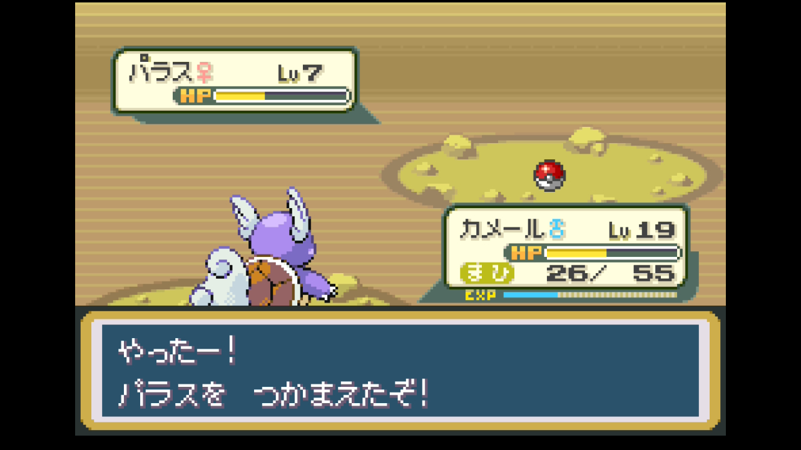
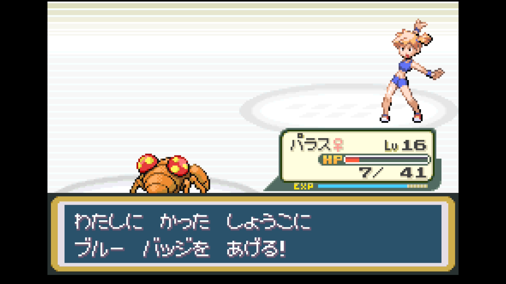
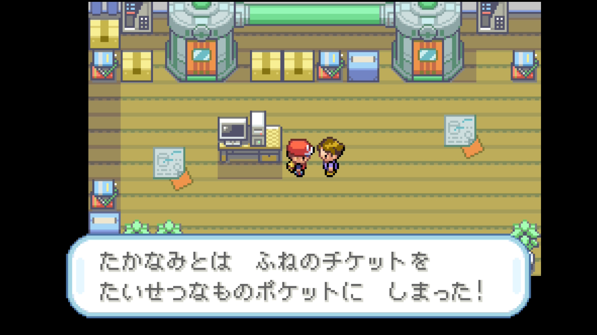
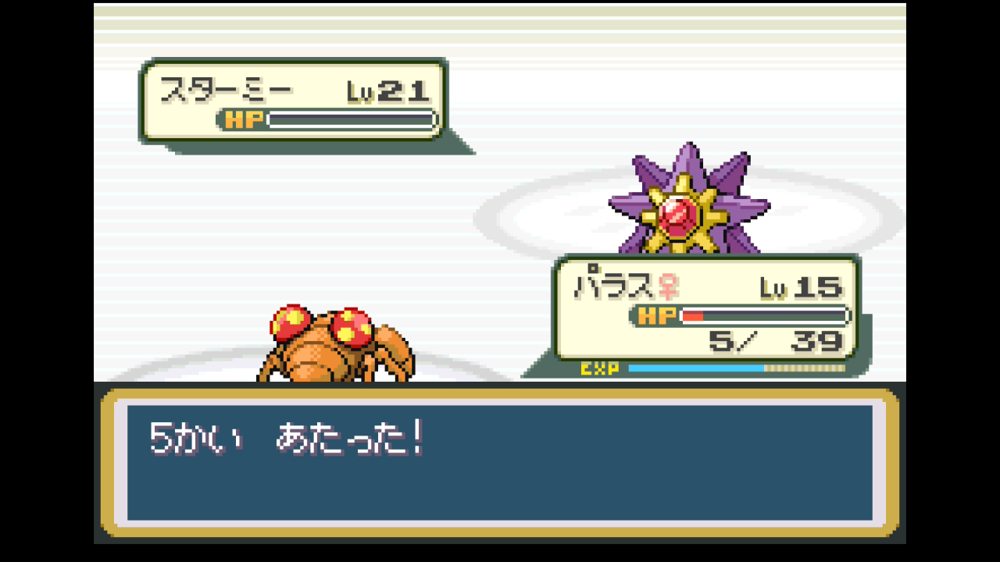

# 第2章 カスミ（ハナダシティ・みずタイプ）

> ブルーバッジ獲得まで。オツキミヤマ突破 → パラス・マンキー加入 → カスミ戦 → ライバル戦 → マサキ救出（ふねのチケット入手）。
>
> 元レポート: [004 オツキミヤマ](../reports/004_mt_moon.md) / [005 ハナダ攻略](../reports/005_hanada_city.md) / [006 ライバル戦〜ゴールデンブリッジ](../reports/006_nugget_bridge.md)

## 準備しておくこと（前章までに）

- **グレーバッジ**取得済み
- 主力ポケモン Lv13以上（御三家がタイプ一致特殊技を覚えるレベル）
- **どくけし・キズぐすり**を多めに購入（オツキミヤマで毒・麻痺事故が多い）
- 推奨ポケモン: 御三家（ゼニガメ／フシギダネ／ヒトカゲ）、ピカチュウ（前章トキワの森で確保していれば）

## 攻略概要

- **対象ジム**: ハナダシティジム（ブルーバッジ）
- **ジムリーダー**: カスミ（みずタイプ）
- **エリア範囲**: 4番道路 〜 ハナダジム制覇 〜 24・25番道路 → マサキの家
- **推奨レベル目安**: 主力 Lv16〜25
- **対応レポート**: レポート 005（カスミ戦）/ 006（マサキ訪問）

## 攻略のコツ

- **オツキミヤマ進入前に「まひなおし」を必ず購入**。ロケット団のコラッタ・ベトベター戦で麻痺事故が起きやすい
- **カスミ戦はくさタイプ技で完封できる**。オツキミヤマで捕獲したパラスにわざマシン09「タネマシンガン」を覚えさせれば、ヒトデマン → スターミーを安定撃破
- **マンキー（5番道路、出現率低）は最重要捕獲ポケモン**。かくとうタイプとして、後のサカキ戦・四天王カンナ戦（こおりにかくとう2倍）まで使える
- **ライバル戦（24番道路）の御三家2匹目（プレイヤーが選んだ御三家の弱点持ち）が凶悪**: 状態異常技（ねむりごな・やどりぎのたね・ひのこ等）持ち。先頭ポケモン選びを慎重に、主力 Lv25前後で挑む
- **マサキ救出で入手する「ふねのチケット」は次章クチバ攻略の必須アイテム**。25番道路最深部まで足を伸ばす

## 攻略ルート

1. **オツキミヤマ** — 1F / B1F / B2F の3層構造、ロケット団初遭遇
   - わざマシン09 タネマシンガン（パラス用）、つきのいし、ふしぎなアメ、わざマシン46 どろぼう
   - 化石分岐: **かいのカセキ**（オムナイト）or **こうらのカセキ**（カブト）→ どちらか1つ
   - パラス（くさ/むし）推奨捕獲

   

2. **4番道路 → ハナダシティ** — わざマシン05 ほえる、ハナダ到着
3. **ハナダシティ** — フレンドリィショップで補充
   - 推奨購入: いいキズぐすり×5、**まひなおし**×3、どくけし、モンスターボール
   - 街の散策: ヤドンが木を切れない伏線、泥棒に入られた家（マサキ関連）
4. **5番道路（南下）でマンキー捕獲** — 出現率低。みずタイプ多めの草むらで根気よく
5. **ハナダジム → カスミ撃破** → わざマシン03 みずのはどう & **ブルーバッジ**

   

6. **24番道路（ゴールデンブリッジ）**
   - **ライバル・シゲキ戦**: ピジョン Lv17 → フシギダネ Lv18 → ケーシィ → コラッタ
   - 5人連続撃破 → きんのたま入手 → ロケット団勧誘を拒否 → ロケット団員2人連戦
   - わざマシン45 メロメロ
7. **25番道路 → マサキの家** — マサキ（ピッピと融合中）を分離プログラムで救出 → **ふねのチケット**入手

   

## 主要トレーナー戦

| トレーナー | 場所 | 手持ち | 元レポート |
|-----------|------|-------|-----------|
| ミニスカートのルリ | オツキミヤマ | ナゾノクサ等 | [004](../reports/004_mt_moon.md) |
| りかけいのおとこ ミツハル | オツキミヤマ B2F | コイル / ビリリダマ / ベトベター / ビリリダマ / ドガース | [004](../reports/004_mt_moon.md) |
| ロケット団員（複数） | オツキミヤマ B1F-B2F | コラッタ・ベトベター系 | [004](../reports/004_mt_moon.md) |
| **ジムリーダー カスミ** | ハナダジム | ヒトデマン Lv18 / スターミー Lv21 | [005](../reports/005_hanada_city.md) |
| 短パンこぞう カツユキ | 24番道路 | アーボ / サンド | [007](../reports/007_route5_route6.md) |
| **ライバル・シゲキ** | 24番道路（ゴールデンブリッジ） | ピジョン Lv17 → フシギダネ Lv18 → ケーシィ → コラッタ ※プレイヤー御三家別に変動 | [006](../reports/006_nugget_bridge.md) |
| ロケット団勧誘員 | ゴールデンブリッジ終点 | アーボ / ズバット | [006](../reports/006_nugget_bridge.md) |
| ピクニックガール ミサ | 25番道路 | ヤドン他 | [006](../reports/006_nugget_bridge.md) |
| キャンプボーイ テルオ | 25番道路 | コラッタ / アーボ | [006](../reports/006_nugget_bridge.md) |
| ミニスカート マキ | 25番道路 | ナゾノクサ×2 / ポッポ | [006](../reports/006_nugget_bridge.md) |
| やまおとこ ゴロウ | 25番道路 | イシツブテ×3 | [006](../reports/006_nugget_bridge.md) |
| やまおとこ イワーク | 25番道路 | イワーク Lv17 | [006](../reports/006_nugget_bridge.md) |

## このエリアで仲間になるポケモン

| ポケモン | 出現場所 | 推奨度 |
|---------|---------|---------------|
| ズバット | オツキミヤマ | 見送り（後のイワヤマで再考） |
| イシツブテ | オツキミヤマ | 見送り |
| ピッピ | オツキミヤマ（レア） | 見送り（殿堂入り優先） |
| **パラス** | オツキミヤマ | **採用**。カスミ戦MVP、後にパラセクトへ |
| コイキング（500円売り） | オツキミヤマ前PC | 見送り（Lv20まで戦力にならない） |
| **マンキー** | 5番道路（レア） | **採用**。後にオコリザルへ進化 |
| メノクラゲ・コイキング | ハナダ周辺 | 見送り |

## 入手アイテム

### オツキミヤマ

- **わざマシン09 タネマシンガン** — パラスに習得させる
- **わざマシン46 どろぼう**
- **かいのカセキ** or **こうらのカセキ** — 後のグレンじま研究所で復元（オムナイト/カブト）
- ふしぎなアメ、つきのいし、ピーピーエイド、げんきのかけら、どくけし、あなぬけのヒモ、ほしのかけら（売却用）

### 4番道路

- **わざマシン05 ほえる**（誰にも覚えさせず温存推奨）

### ハナダシティ

- フレンドリィショップでアイテム補充推奨
- 「ヤドンが道をふさぐ」「泥棒に入られた家」は伏線（後の章で回収）

### ハナダジム撃破報酬

- **ブルーバッジ** — みず・くさ・ひこう技の威力強化、なみのり使用可能
- **わざマシン03 みずのはどう** — みずタイプ主力に習得推奨

### 24番道路（ゴールデンブリッジ）

- **きんのたま** — 5にんぬき達成報酬。5000円で売却可
- **わざマシン45 メロメロ**

### 25番道路 / マサキの家

- **ボイスチェッカー** — マサキ救出に必要
- **ふねのチケット** — 次章クチバのサントアンヌ号乗船に必要

## ジム攻略 — カスミ戦

### リーダーの手持ち

| ポケモン | Lv | 主要技 | 弱点 |
|---------|----|--------|------|
| ヒトデマン | 18 | みずでっぽう / はりつけ | くさ・でんき |
| スターミー | 21 | みずでっぽう / スピードスター / まるくなる / はやおき | くさ・でんき・ゴースト・あく |

### 推奨戦術

**最有効タイプ**: くさ・でんき。次点でゴースト・あく（スターミー対策）

| 御三家選択 | 推奨戦術 |
|-----------|---------|
| **ゼニガメ系** | みず被りで不利、控え。**パラス（タネマシンガン）**を主軸にし、ゼニガメ系列はバックアップに |
| **フシギダネ系** | くさタイプ一致で安定。「はっぱカッター」「タネマシンガン」（わざマシン09）で完封 |
| **ヒトカゲ系** | くさ技なし。**パラス（タネマシンガン）**または**ピカチュウ（でんきショック、Lv13以上）**を主軸に |

**共通の戦術**:

- **パラス（オツキミヤマ捕獲）にわざマシン09 タネマシンガン**を覚えさせるのが最有力。御三家を問わず使える
- ピカチュウ（トキワの森）は捕獲できていれば Lv13以上で運用
- スターミーの「スピードスター」は必中・連続で痛い。HP回復アイテム3個以上は持参

### 本プレイのバトル記録（ゼニガメ選択）

- **採用パーティ**: パラス Lv16 / カメール Lv22
- **先頭**: パラス
- **結果**: 一発クリア（ただし薄氷）。スターミー戦でいいキズぐすり×2を消費後、**タネマシンガン5連ヒット＋急所**でHP5まで残し撃破
- **印象的な瞬間**: 「タネマシンガン5かいあたった！」のメッセージ → そのまま勝利確定

→ 詳細: [レポート 005](../reports/005_hanada_city.md)

## 本プレイのパーティ推移（ゼニガメ選択時の参考例）

| ポケモン | Lv | 技構成 | 加入時期 |
|---------|----|--------|----------|
| カメール♂ | 22 | かみつく / たいあたり / からにこもる / みずのはどう | 御三家 |
| パラス♀ | 16 | ひっかく / しびれごな / タネマシンガン / どくのこな | オツキミヤマ Lv7 |
| マンキー♀ | 10 | ひっかく / にらみつける / けたぐり | 5番道路 Lv10 |
| ピカチュウ♀ | 5 | でんきショック / なきごえ | トキワの森（前章） |

## 次の章へ

### 達成チェックリスト

- [ ] **ブルーバッジ**獲得（バッジ2個目）
- [ ] 主力ポケモン Lv22〜25
- [ ] **わざマシン03 みずのはどう**入手
- [ ] **ふねのチケット**入手（次章クチバ攻略の必須）
- [ ] **ボイスチェッカー**入手
- [ ] **かいのカセキ** or **こうらのカセキ**を1つ入手
- [ ] 推奨: パラス（タネマシンガン習得済み）、マンキー（5番道路）入手

### 次の目的地

ハナダ南下（5・6番道路 → 地下道）→ クチバシティ → サントアンヌ号

---

[← 前のチャート 第1章 タケシ](01_takeshi_nibi.md) | [📘 チャート一覧](README.md) | [次のチャート → 第3章 マチス（クチバ・でんき）](03_machis_kuchiba.md)
