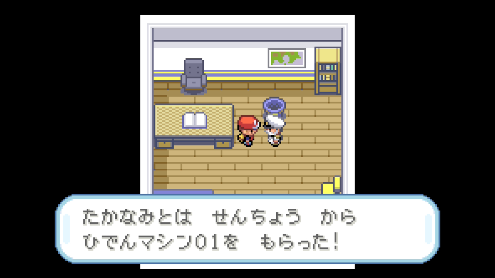
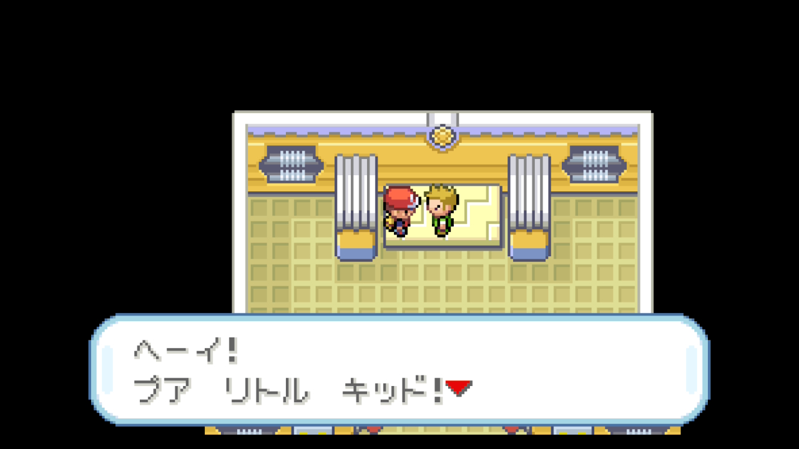
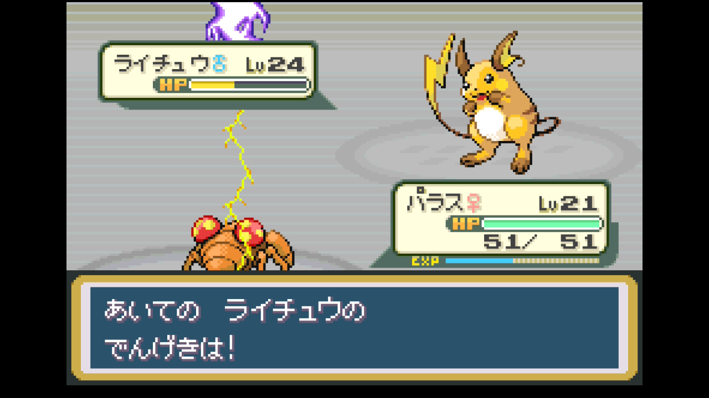
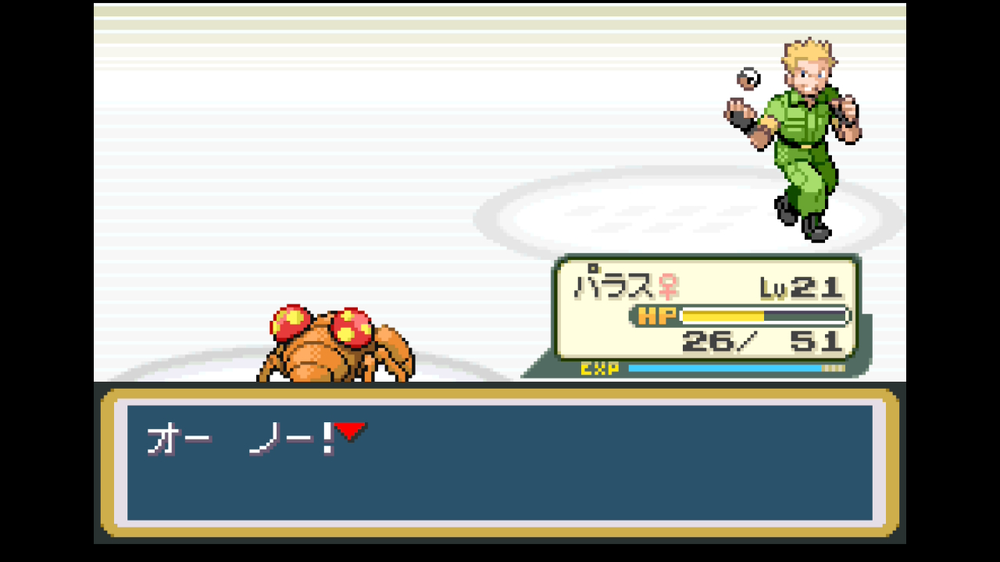

# 第3章 マチス（クチバシティ・でんきタイプ）

> でんげきバッジ獲得まで。ハナダ南下 → ちかつうろ → 6番道路 → クチバシティ → サントアンヌ号 → クチバジム制覇。
>
> 元レポート: [007 ハナダ南下〜サントアンヌ前半](../reports/007_route5_route6.md) / [008 サントアンヌ〜マチス](../reports/008_ss_anne.md)

## 準備しておくこと（前章までに）

- **グレーバッジ + ブルーバッジ**取得済み
- 主力ポケモン Lv18以上
- **ふねのチケット**入手済み（第2章マサキの家で受領）
- 推奨ポケモン: パラス（タネマシンガン習得済み、いあいぎりも覚えられる）、マンキー（5番道路で捕獲、あなをほる習得予定）
- 推奨アイテム: まひなおし複数（マチス戦のでんじは対策）

## 攻略概要

- **対象ジム**: クチバシティジム（でんげきバッジ）
- **ジムリーダー**: マチス（でんきタイプ）
- **エリア範囲**: ハナダ南口 〜 5/6番道路 〜 クチバシティ 〜 サントアンヌ号 〜 クチバジム
- **推奨レベル目安**: 主力 Lv20〜29
- **対応レポート**: レポート 008

## 攻略のコツ

- **マンキー（前章で捕獲推奨）に「あなをほる」を覚えさせる**。6番道路のロケット団員を撃破するとわざマシン28が手に入り、そのままマチス戦の切り札になる（じめん→でんき4倍）
- **マチスのライチュウ Lv24 が最大の壁**。あなをほるが命中率100でも、ピカチュウのかげぶんしんで命中が下がる点に注意。タネマシンガン持ちのパラスを控えに置いておく
- **ジム入場には「いあいぎり」が必要**。サントアンヌ号船長からひでんマシン01をもらい、習得可能なポケモン（パラスやライバル交換のニドラン系等）に覚えさせる（ゼニガメ系列・ピカチュウは習得不可）
- **ジム前にまひなおしを必ず複数買う**。ジムトレーナー・マチス共に「でんじは」「スパーク」で麻痺事故が連発する
- **クチバ・ポケモンだいすきクラブの会長から「ひきかえけん」を受け取る**。ハナダの自転車屋で100万円の自転車と無料交換できる

## 攻略ルート

1. **ハナダ → 5番道路（地下道）→ 6番道路** — 自転車屋（100万円なのでスルー）、そだてやを横目に南下
2. **6番道路のロケット団員イベント** — 民家の裏の穴に潜入、ワンリキー・スリープ撃破 → **わざマシン28 あなをほる** 入手
3. **6番道路でマンキー育成** — トレーナー戦多数。バタフリーは超音波＋粉技で凶悪、回復薬を温存
4. **クチバシティ到着** — ポケセンで全回復、バトルサーチャー入手
5. **ポケモンだいすきクラブ訪問** — 会長のガーディ自慢を聞き **ひきかえけん**入手
6. **サントアンヌ号** — ふねのチケットで乗船。1F → 2F → 船長室 → B1F の順に攻略
   - **ライバル・シゲキ戦**（船長室前）: ピジョン → フシギソウ → ラッタ → ユンゲラー
   - **ひでんマシン01 いあいぎり** を船長から入手（船酔い解消イベント）

   

   - B1Fで **わざマシン31 かわらわり**入手（マンキーの主力技）
   - 出港カウントダウンに注意、攻略後に下船 → 船は出港
7. **パラスにいあいぎり習得** — クチバジム入場の準備
8. **クチバジム** — トレーナー戦＋**ゴミ箱パズル**（隣り合う2つのスイッチ探し）→ マチス

## 主要トレーナー戦

| トレーナー | 場所 | 手持ち | 元レポート |
|-----------|------|-------|-----------|
| ロケット団員（民家裏） | 6番道路 | ワンリキー Lv17 / スリープ Lv17 | [007](../reports/007_route5_route6.md) |
| むしとりしょうねん テツジ | 6番道路 | ビードル等 | [007](../reports/007_route5_route6.md) |
| キャンプボーイ ユウタ | 6番道路 | ゼニガメ Lv20 | [007](../reports/007_route5_route6.md) |
| ピクニックガール サツキ | 6番道路 | コラッタ / ピカチュウ Lv16 | [007](../reports/007_route5_route6.md) |
| むしとりしょうねん ノブユキ | 6番道路 | バタフリー Lv20（超音波＋粉技注意） | [007](../reports/007_route5_route6.md) |
| ピクニックガール ナズナ | 6番道路 | ポッポ / オニスズメ / ラッタ等 | [007](../reports/007_route5_route6.md) |
| つりびと タカフミ | サントアンヌ号 2F | トサキント×2 / メノクラゲ | [008](../reports/008_ss_anne.md) |
| ジェントルマン スミス | サントアンヌ号 2F | ピカチュウ Lv23 | [008](../reports/008_ss_anne.md) |
| ミニスカート ユカ | サントアンヌ号 2F | コラッタ Lv18 / ピカチュウ Lv18 | [008](../reports/008_ss_anne.md) |
| ジェントルマン パーカー | サントアンヌ号 2F | ガーディ Lv17 / ポニータ Lv17 | [008](../reports/008_ss_anne.md) |
| ミニスカート カヤ | サントアンヌ号 1F | ポッポ Lv18 / ニドラン♀ Lv18 | [008](../reports/008_ss_anne.md) |
| たんぱんこぞう マサノブ | サントアンヌ号 1F | ニドラン♂ Lv21 | [008](../reports/008_ss_anne.md) |
| **ライバル・シゲキ** | サントアンヌ号 船長室前 | ピジョン → フシギソウ Lv20（御三家別変動）→ ラッタ → ユンゲラー Lv20 | [008](../reports/008_ss_anne.md) |
| ふなのり ヒデフミ | サントアンヌ号 B1F | タッツー / シェルダー / メノクラゲ | [008](../reports/008_ss_anne.md) |
| ふなのり サンジ | サントアンヌ号 B1F | ワンリキー他 | [008](../reports/008_ss_anne.md) |
| ジムトレーナー フミオ | クチバジム | ビリリダマ / ピカチュウ等（でんじはまひ注意） | [008](../reports/008_ss_anne.md) |
| ジムトレーナー オルソン | クチバジム | コイル / でんき系 | [008](../reports/008_ss_anne.md) |
| **ジムリーダー マチス** | クチバジム | ビリリダマ Lv21 / ピカチュウ Lv18 / ライチュウ Lv24 | [008](../reports/008_ss_anne.md) |

## このエリアで仲間になるポケモン

| ポケモン | 出現場所 | 推奨度 |
|---------|---------|---------------|
| ニャース | 6番道路 | 見送り |
| ニドラン♂・ニドラン♀ | サントアンヌ前 / 5番道路 | 通信交換イベントの素材になる種。野生捕獲しておくと選択肢が広がる |
| メノクラゲ | サントアンヌ周辺 | 見送り |
| コイキング・タッツー | クチバ港の釣り | 見送り |

## 入手アイテム

### 6番道路（ロケット団員撃破報酬）

- **わざマシン28 あなをほる** — マンキー必須技。マチス戦の切り札

### クチバシティ

- **バトルサーチャー** — ポケセンで入手
- **ひきかえけん** — ポケモンだいすきクラブ会長から。ハナダで自転車に交換可
- ゴージャスボール、ピーピーリカバー（駅周辺、岸壁の家）

### サントアンヌ号

- **ひでんマシン01 いあいぎり** — 船長室、船酔い解消イベント
- **わざマシン31 かわらわり** — B1F、マンキー用
- プラスパワー、モモンのみ・クラボのみ・カゴのみ（ゴミ箱）、いいキズぐすり、スーパーボール
- 2F の女性 NPC が無料回復してくれる（攻略中に活用）

### クチバジム撃破報酬

- **でんげきバッジ** — でんき技強化、なみのり（ひでんマシン03）後で使用可、Lv50までの交換ポケモンが言うことを聞く
- **わざマシン34 でんげきは** — ピカチュウに保留

## ジム攻略 — マチス戦

### リーダーの手持ち

| ポケモン | Lv | 主要技 | 弱点 |
|---------|----|--------|------|
| ビリリダマ | 21 | スパーク / でんじは / じばく | じめん |
| ピカチュウ | 18 | でんきショック / でんじは / かげぶんしん | じめん |
| ライチュウ | 24 | でんげきは / メガトンパンチ / でんじは | じめん |

### 推奨戦術

**最有効タイプ**: じめん（マチスの全員に2倍）

| 御三家選択 | 推奨戦術 |
|-----------|---------|
| **ゼニガメ系** | みずタイプはでんき4倍弱点で危険。控えに回し、**マンキー（あなをほる）**を主軸に |
| **フシギダネ系** | フシギソウのつるのムチ・タネマシンガンで削れるが、でんき技が痛い。**マンキー（あなをほる）**主体推奨 |
| **ヒトカゲ系** | リザードはでんきを4倍弱点で受けるリスクあり。**マンキー（あなをほる）**主体、リザードはバックアップ |

**共通の戦術**:

- **マンキーのあなをほる**（6番道路ロケット団員撃破でわざマシン28入手）が全員に2倍で最有力
- **ライチュウは要警戒**: マンキーが先制取れず、メガトンパンチで一撃のリスク。倒されたらパラス（タネマシンガン、でんき半減で受けられる）でフィニッシュ
- **ピカチュウのかげぶんしん**で「あなをほる」が外れる事故あり。早めに削る
- **でんじはのまひ**頻発。まひなおし複数持参必須

### 本プレイのバトル記録（ゼニガメ選択）

- **採用パーティ**: マンキー Lv20 / パラス Lv19 / カメール Lv29 控え
- **ビリリダマ戦**: マンキー あなをほる×2、間にマチスのいいキズぐすり挟まれ Lv21 へレベルアップ
- **ピカチュウ戦**: かげぶんしんで「あなをほる外れまくり」発生、でんじはでまひ。最終的に命中して撃破
- **ライチュウ戦**: マンキー HP1まで削られ力尽きる → **パラス Lv21（タネマシンガン）が突入** → でんげきはを耐えて連射 → 撃破

→ 詳細: [レポート 008](../reports/008_ss_anne.md)

## 本プレイのパーティ推移（ゼニガメ選択時の参考例）

| ポケモン | Lv | 技構成 | 加入時期 |
|---------|----|--------|----------|
| カメール♂ | 29 | かみつく / たいあたり / からにこもる / みずのはどう | 御三家 |
| パラス♀ | 21 | いあいぎり / しびれごな / タネマシンガン / どくのこな | オツキミヤマ |
| マンキー♀ | 21 | みだれひっかき / けたぐり / かわらわり / あなをほる | 5番道路 |
| ピカチュウ♀ | 9 | でんきショック / でんじは / しっぽをふる | トキワの森 |

## 次の章へ

### 達成チェックリスト

- [ ] **でんげきバッジ**獲得（バッジ3個目）
- [ ] 主力ポケモン Lv25〜29
- [ ] **ひでんマシン01 いあいぎり**入手 → 習得可能なポケモンに装備
- [ ] **わざマシン28 あなをほる**入手 → マンキー等に装備推奨
- [ ] **わざマシン31 かわらわり**入手
- [ ] **わざマシン34 でんげきは**入手
- [ ] **ひきかえけん**入手 → ハナダで自転車と交換
- [ ] **バトルサーチャー**入手

### 次の目的地

ディグダのあな → 2番道路（フラッシュ受け取り）→ イワヤマトンネル → シオンタウン

---

[← 前のチャート 第2章 カスミ](02_kasumi_hanada.md) | [📘 チャート一覧](README.md) | [次のチャート → 第4章 エリカ＋ロケット団アジト](04_erika_tamamushi.md)
