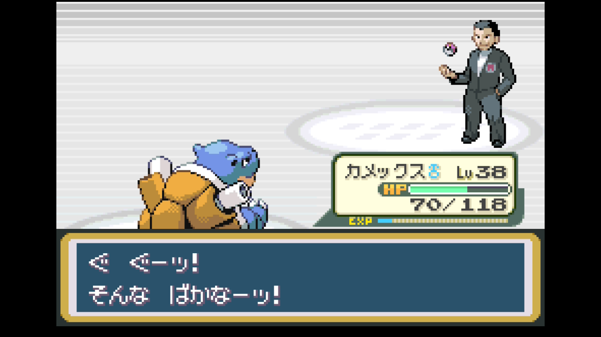
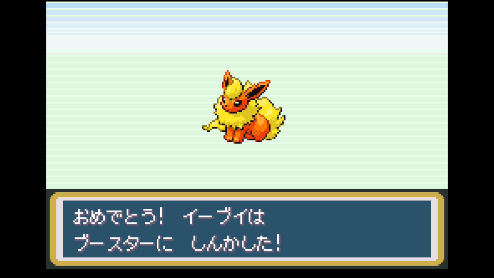

# 第4章 エリカ（タマムシシティ・くさタイプ）＋ロケット団アジト

> レインボーバッジ獲得まで。ディグダの穴 → イワヤマトンネル → ポケモンタワー → タマムシ → ロケット団アジト → ポケモンタワー再攻略 → タマムシジム制覇。長丁場の章で、シルフスコープ・ポケモンのふえなど主要キーアイテム多数。
>
> 元レポート: [009 ディグダ〜通信交換](../reports/009_digda_cave.md) / [010 9番道路〜イワヤマ](../reports/010_route9_rock_tunnel.md) / [011 イワヤマ後半〜シオン](../reports/011_rock_tunnel_2.md) / [012 ポケモンタワー〜タマムシ到着](../reports/012_pokemon_tower_tamamushi.md) / [013 ロケット団アジト](../reports/013_tamamushi_rocket.md) / [014 タワー再攻略〜エリカ](../reports/014_pokemon_tower_tamamushi_gym.md)

## このページの内容

- 準備しておくこと
- 攻略概要 / 攻略のコツ
- 攻略ルート（13ステップ）
- サブイベント: ロケット団タマムシアジト（サカキ初遭遇＋シルフスコープ入手）
- 主要トレーナー戦（イワヤマ〜ポケモンタワー〜エリカジム）
- このエリアで仲間になるポケモン（イーブイ→ブースター、ゴース等）
- 入手アイテム
- ジム攻略 — エリカ戦
- 本プレイのパーティ推移
- 次の章へ

## 準備しておくこと（前章までに）

- **バッジ3個**取得済み（グレー / ブルー / でんげき）
- 主力ポケモン Lv25以上
- **ひでんマシン01 いあいぎり**入手済み（パラス等に装備しジム入場準備）
- **わざマシン28 あなをほる**入手済み（マンキー等に装備）
- 推奨ポケモン: 御三家2段目以降、マンキー、パラス、ピカチュウ
- 推奨アイテム: いいキズぐすり多め、どくけし、ハイパーボール準備（カビゴン捕獲ではないが伝説枠で必要に）

## 攻略概要

- **対象ジム**: タマムシシティジム（レインボーバッジ）
- **ジムリーダー**: エリカ（くさタイプ）
- **エリア範囲**: ハナダ南口 → クチバ南西 → ディグダのあな → 2番道路 → 9番道路 → 10番道路 → イワヤマトンネル → シオンタウン → ポケモンタワー → 7・8番道路 → タマムシシティ → ロケット団アジト → ポケモンタワー再攻略 → タマムシジム
- **推奨レベル目安**: 主力 Lv30〜40
- **対応レポート**: レポート 014（エリカ戦）

## 攻略のコツ

- **オーキド助手の図鑑10種条件を忘れない**。ディグダのあなを抜けた先の2番道路でフラッシュ（ひでんマシン05）を受け取るには、図鑑10種類が必要。捕獲を惜しまず進めると無駄足を防げる
- **ポケモンタワーのライバル戦は地獄**。ギャラドスの「あばれる」が低レベル組を一撃でなぎ倒す。主力 Lv25以上＋かくとう/あく技持ちで挑む
- **ゴース系には特性「ふゆう」**。じめん技は通らない。**あくタイプ（かみつく）**で攻めるのが正解（御三家ゼニガメ系列はLv13でかみつく系を覚える、他御三家は要TM配備）
- **ロケット団アジトでシルフスコープを入手するまでポケモンタワー上層は突破できない**。タマムシ→アジト→タワーの順で動く
- **エリカ戦はあくタイプでレベル差ゴリ押しが安定**。みずタイプ・くさタイプ技は半減or等倍で効率悪い。ほのお技（後述のブースター）も4倍弱点で有効
- **タマムシマンションでイーブイを取り、デパートでほのおのいし → ブースター**。ほのおタイプ枠が埋まり後の章で活きる

## 攻略ルート

1. **クチバ → ディグダのあな** — ボロのつりざお入手、ディグダ捕獲
2. **2番道路 → オーキド助手 → ひでんマシン05 フラッシュ**
   - **図鑑10種条件**を満たす必要あり。ポッポ・コラッタ・キャタピー・コイキング（ボロつり）等で埋める
   - **オプション**: 友人と通信交換できる環境があれば、ここでニドラン♂入手やゴースの進化補助が可能
3. **5番道路の育て屋にレベル上げ枠ポケモンを預ける**（自転車で歩数稼ぎ）
4. **ハナダ → 自転車入手**（ひきかえけんを店主に）
5. **9番道路 → 10番道路 → イワヤマトンネル**
   - パラスにフラッシュを覚えさせて入洞
   - 捕獲推奨: ズバット、イシツブテ、ワンリキー、イワーク（図鑑埋め）
6. **シオンタウン到着** — ポケモンタワー外周のNPCで情報収集
7. **ポケモンタワー（1回目）**
   - **ライバル戦（2F）**: ピジョン → フシギソウ → ユンゲラー → ギャラドス（あばれる注意）→ ガーディ
   - きとうしのゴース系は**あくタイプ「かみつく」**で連撃（特性ふゆうでじめん技は無効）
   - 中層で「せいなるいのり」結界全回復、**きよめのおふだ**入手
   - 上層手前で「タチサレ」 → 一旦撤退（あなぬけのヒモ or ディグダのあなをほる）
8. **8番道路 → 地下道 → タマムシシティ**
   - 8番道路あたりで御三家2段目進化（ゼニガメ系列 Lv36 でカメックス、フシギソウ Lv32 でフシギバナ、ヒトカゲ系列 Lv36 でリザードン）

   

9. **タマムシシティ探索**
   - デパート: スーパーボール補充、屋上自販機ジュースで女の子から **わざマシン33 リフレクター** ほか3種
   - マンション最上階: **イーブイ**入手 → デパートでほのおのいし購入 → **ブースター**進化
   - マンション1F: **おちゃ**入手（後でヤマブキへの通行に使用）
   - 食堂のおっさんから **コインケース** → ゲームコーナー解禁
10. **サブイベント: ロケット団タマムシアジト**（後述）
11. **おちゃでサイクリングロードゲート解禁 → ヤマブキ経由**でシオンへ（シルフカンパニーは通せんぼ、後の章まで保留）
12. **ポケモンタワー再攻略**（シルフスコープ装備後）
    - 野生**ゴース・ゴースト**捕獲推奨（ゲンガー化候補）
    - **野生ガラガラ（カラカラの母）**戦 — シルフスコープで正体を見抜き撃破

    

    - 最上階で **フジ老人救出** → 自宅へ → **ポケモンのふえ**入手（カビゴン起こし用）
13. **タマムシジム → エリカ撃破**

    

### サブイベント: ロケット団タマムシアジト

ゲームコーナー奥のポスター裏スイッチから潜入。矢印床パズル、エレベーターのカギ探し、サカキとのボス戦。

- **入手アイテム**: わざマシン12 ちょうはつ、わざマシン49 よこどり、わざマシン21 やつあたり、**くろいメガネ**（あく技1.1倍、あく技持ちに装備）、つきのいし、ふしぎなアメ、すごいキズぐすり、リゾチウム、エレベーターのカギ
- **サカキ戦**: イワーク → サイホーン → ガルーラ → サンドパン
  - **みずタイプ技**で4倍弱点（イワーク・サイホーン）を一掃。くさタイプ技も4倍で有効
  - ガルーラ・サンドパンはタイプ一致のみず or くさで押し切る
- **報酬**: **シルフスコープ**（ポケモンタワー上層攻略用）

## 主要トレーナー戦

| トレーナー | 場所 | 手持ち | 元レポート |
|-----------|------|-------|-----------|
| ピクニックガール エミカ | 9番道路 | ナゾノクサ系（ねむりごな多用） | [010](../reports/010_route9_rock_tunnel.md) |
| 山男 鳴男 | 9番道路 | ワンリキー Lv20 | [010](../reports/010_route9_rock_tunnel.md) |
| キャンプボーイ マサシ | 9番道路 | ガーディ Lv21 / ヒトカゲ | [010](../reports/010_route9_rock_tunnel.md) |
| 虫取り少年 陽一 | 9番道路 | スピアー×2 | [010](../reports/010_route9_rock_tunnel.md) |
| 虫取り少年 ひろみち | 9番道路 | キャタピー Lv20 / ビードル / コンパン | [010](../reports/010_route9_rock_tunnel.md) |
| キャンプボーイ ノリヒロ | 9番道路 | コラッタ×2 / サンド / アーボ | [010](../reports/010_route9_rock_tunnel.md) |
| 山男 ハルノブ | 9番道路 | イシツブテ×2 / ワンリキー | [010](../reports/010_route9_rock_tunnel.md) |
| ピクニックガール さちえ | 9番道路 | ニャース Lv23 | [010](../reports/010_route9_rock_tunnel.md) |
| かいじゅうマニア みつぐ | イワヤマトンネル | ヤドン Lv25 | [011](../reports/011_rock_tunnel_2.md) |
| ピクニックガール トモコ | イワヤマトンネル | ナゾノクサ Lv22 / フシギダネ | [011](../reports/011_rock_tunnel_2.md) |
| かいじゅうマニア としお | イワヤマトンネル | ヒトカゲ Lv22 / カラカラ Lv22 | [011](../reports/011_rock_tunnel_2.md) |
| やまおとこ だいち / かつひと / イサム / こだま | イワヤマトンネル | イシツブテ・イワーク・ワンリキー系（Lv20〜25） | [011](../reports/011_rock_tunnel_2.md) |
| かいじゅうマニア きよはる | イワヤマトンネル | ヤドン×3 | [011](../reports/011_rock_tunnel_2.md) |
| ピクニックガール えみ / カナミ / みゆき | イワヤマトンネル | マダツボミ・ポッポ・コラッタ・ナゾノクサ・プリン系 | [011](../reports/011_rock_tunnel_2.md) |
| きとうし複数 | ポケモンタワー | ゴース系（カラカラのお母さん含む） | [012](../reports/012_pokemon_tower_tamamushi.md) |
| **ライバル・シゲキ** | ポケモンタワー 2F | ピジョン Lv25 → フシギソウ Lv25（御三家別変動）→ ユンゲラー Lv20 → ギャラドス Lv23（あばれる注意）→ ガーディ Lv22 | [012](../reports/012_pokemon_tower_tamamushi.md) |
| ギャンブラー ソウキ | 8番道路 | ガーディ / ロコン | [012](../reports/012_pokemon_tower_tamamushi.md) |
| りかけいのおとこ みつお | 8番道路 | ベトベター / ベトベトン / コイル | [012](../reports/012_pokemon_tower_tamamushi.md) |
| ロケット団員（多数） | ロケット団アジト | ラッタ・ズバット・ドガース・ベトベター・スリープ・ワンリキー・アーボ系 | [013](../reports/013_tamamushi_rocket.md) |
| **サカキ**（アジト内） | ロケット団アジト B4F | イワーク / サイホーン / ガルーラ / サンドパン | [013](../reports/013_tamamushi_rocket.md) |
| ジムトレーナー（女性多数） | タマムシジム | フシギダネ・フシギソウ・クサイハナ・ウツドン・タマタマ等 | [014](../reports/014_pokemon_tower_tamamushi_gym.md) |
| **ジムリーダー エリカ** | タマムシジム | ウツボット Lv29 / モンジャラ Lv24 / ラフレシア Lv29 | [014](../reports/014_pokemon_tower_tamamushi_gym.md) |

## このエリアで仲間になるポケモン

| ポケモン | 出現場所 | 推奨度 |
|---------|---------|---------------|
| ディグダ | ディグダのあな | 採用（図鑑用、後にボックス） |
| ニドラン♂ | 通信交換イベント（任意）／野生は5番道路他で出現 | 採用例: 育て屋でじっくり育成 |
| キャタピー / コラッタ / ポッポ / コイキング | 2番道路他 | 図鑑用に短期捕獲 |
| ズバット / イシツブテ / ワンリキー / イワーク | イワヤマトンネル | 図鑑用に捕獲、ボックス |
| **イーブイ → ブースター** | タマムシマンション | **採用**。ほのおタイプ枠 |
| **ゴース** | ポケモンタワー | **採用**。Lv25でゴースト進化、通信交換できる環境があればゲンガーまで |
| カラカラ | ポケモンタワー | 図鑑用、ボックス |

## 入手アイテム

### クチバ周辺

- **ボロのつりざお** — クチバのつりおやじ
- **ひでんマシン05 フラッシュ** — オーキド助手（図鑑10種条件、習得可能なポケモンに）

### 9・10番道路 / イワヤマトンネル

- **わざマシン40 つばめがえし**
- ピーピーリカバー、げんきのかけら、あなぬけのヒモ、しんじゅ、ナナのみ、クラボのみ、キーのみ、むしよけスプレー

### ポケモンタワー

- **きよめのおふだ**（出現率↓）、ふしぎなあめ、きんのたま、ピーピーエイダー、スーパーボール、ヨクアタール
- **ポケモンのふえ**（フジ老人から）

### タマムシシティ

- デパート屋上女の子: **わざマシン33 リフレクター / わざマシン16 ひかりのかべ / わざマシン20 しんぴのまもり**
- マンション1F: **おちゃ**（ヤマブキ通行に使用）
- マンション最上階: **イーブイ**
- デパート: **ほのおのいし**（イーブイ進化用）
- 食堂: **コインケース**

### ロケット団タマムシアジト

- **わざマシン12 ちょうはつ / わざマシン49 よこどり / わざマシン21 やつあたり**
- **くろいメガネ**（あく技1.1倍、かみつく持ちに装備推奨）
- **つきのいし、ふしぎなアメ、すごいキズぐすり、リゾチウム**
- **エレベーターのカギ**
- **シルフスコープ**（サカキ撃破報酬）

   

### タマムシジム撃破報酬

- **レインボーバッジ** — Lv50までの交換ポケモンが言うことを聞く、なみのり場外利用可
- **わざマシン19 ギガドレイン** — くさ特殊技、後にナッシー候補

## ジム攻略 — エリカ戦

### リーダーの手持ち

| ポケモン | Lv | 主要技 | 弱点 |
|---------|----|--------|------|
| ウツボット | 29 | やどりぎのたね / しびれごな / どくのこな / つるのムチ | ほのお・こおり・ひこう・エスパー |
| モンジャラ | 24 | しびれごな / タネマシンガン / つるのムチ / バインド | ほのお・こおり・ひこう・どく・むし |
| ラフレシア（エース） | 29 | ギガドレイン / しびれごな / どくのこな / メガドレイン | ほのお・こおり・ひこう・エスパー |

### 推奨戦術

**最有効タイプ**: ほのお（4倍）。次点であく・ひこう・こおり・エスパー・どく

| 御三家選択 | 推奨戦術 |
|-----------|---------|
| **ゼニガメ系** | みず技は半減で不利。**かみつく（あく）**でレベル差ゴリ押し。**ブースター（タマムシマンションのイーブイをほのおのいしで進化）**を主軸にすると4倍が決まる |
| **フシギダネ系** | フシギバナのくさ技は等倍で半減ではないが効率は悪い。**ブースター（ほのお）**主軸推奨、または「えだづき」「やどりぎのたね」で耐久戦 |
| **ヒトカゲ系** | リザード／リザードンの**ほのお技4倍**で完封できる、御三家の中で最も有利 |

**共通の戦術**:

- **ブースター**入手はこの章の最大の収穫。ほのおタイプ枠でエリカ戦から後の章まで活躍
- **ラフレシアのギガドレイン**で削られた分が回復される。レベル差を作って削り勝つ
- **しびれごな・どくのこな多用**。まひなおし・どくけしを5個ずつ持参推奨

### 本プレイのバトル記録（ゼニガメ選択）

- **採用パーティ**: カメックス Lv38 / ブースター Lv25（道中育成枠）
- **戦術**: かみつく連打。くろいメガネ装備で1.1倍
- **結果**: 一発クリア。ラフレシアのギガドレインで体力を吸われるが、レベル差で押し切る
- **戦闘中**: カメックス Lv40 へ到達

→ 詳細: [レポート 014](../reports/014_pokemon_tower_tamamushi_gym.md)

## 本プレイのパーティ推移（ゼニガメ選択時の参考例）

| ポケモン | Lv | タイプ | 技構成 | 持ち物 |
|---------|----|--------|--------|--------|
| カメックス♂ | 40 | みず | みずのはどう / かみつく / たいあたり / からにこもる | くろいメガネ |
| オコリザル♀ | 30 | かくとう | ちきゅうなげ / けたぐり / かわらわり / あなをほる | - |
| パラス♀ | 23 | くさ/むし | いあいぎり / しびれごな / タネマシンガン / フラッシュ | - |
| ピカチュウ♀ | 20 | でんき | でんきショック / でんこうせっか / たたきつける / でんじは | - |
| ディグダ♀ | 23 | じめん | なきごえ / マグニチュード / あなをほる / みだれひっかき | - |
| ブースター | 27 | ほのお | てだすけ / すなかけ / なきごえ / でんこうせっか | - |

進化トピック: ゼニガメ → カメックス（Lv36）、マンキー → オコリザル（Lv28、ロケット団アジトで進化）、イーブイ → ブースター（ほのおのいし）

   

## 次の章へ

### 達成チェックリスト

- [ ] **レインボーバッジ**獲得（バッジ4個目）
- [ ] 主力ポケモン Lv36〜40
- [ ] **ひでんマシン05 フラッシュ**入手（オーキド助手）
- [ ] **シルフスコープ**入手（サカキ撃破報酬）
- [ ] **ポケモンのふえ**入手（フジ老人から）
- [ ] **おちゃ**入手（タマムシマンション、ヤマブキ通行に使用）
- [ ] **コインケース**入手（ゲームコーナー利用に必須）
- [ ] **わざマシン19 ギガドレイン / TM33 リフレクター / 16 ひかりのかべ / 20 しんぴのまもり**等多数入手
- [ ] 御三家最終進化（カメックス／フシギバナ／リザードン）
- [ ] 推奨: ブースター（イーブイ→ほのおのいし）、ゴース捕獲

### 次の目的地

16番道路（カビゴン起こし）→ サイクリングロード → セキチクシティ → サファリゾーン

---

[← 前のチャート 第3章 マチス](03_machis_kuchiba.md) | [📘 チャート一覧](README.md) | [次のチャート → 第5章 キョウ（セキチク・どく）](05_kyou_sekichiku.md)
