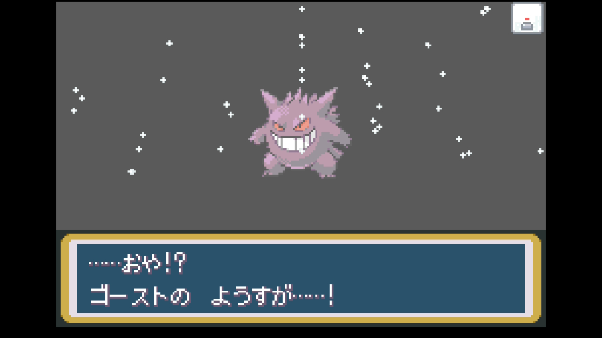
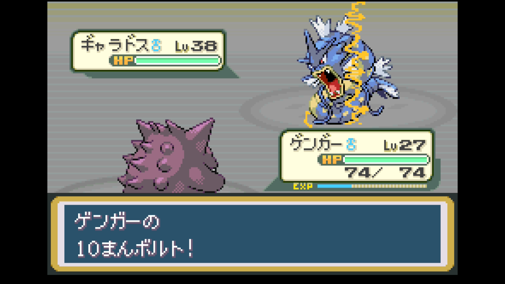
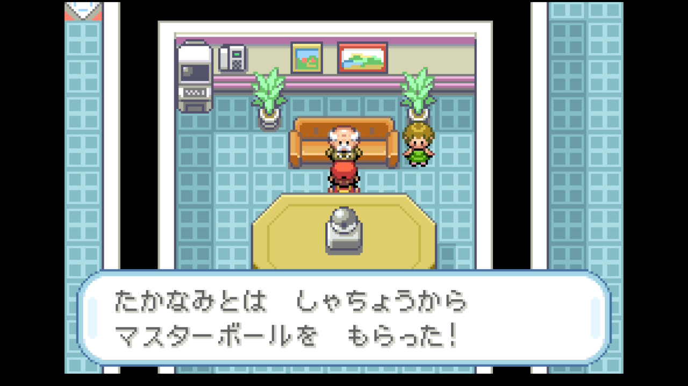
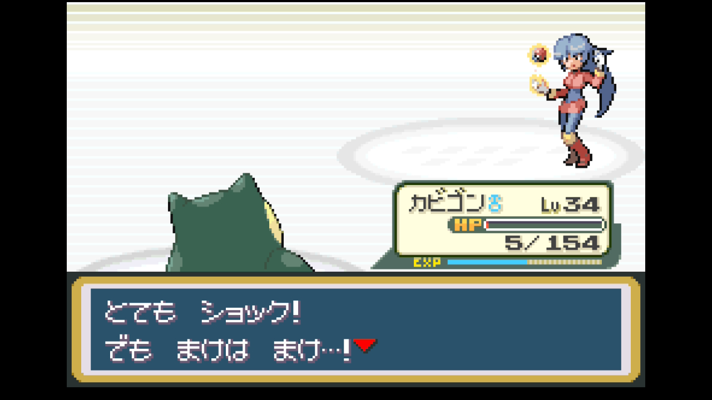
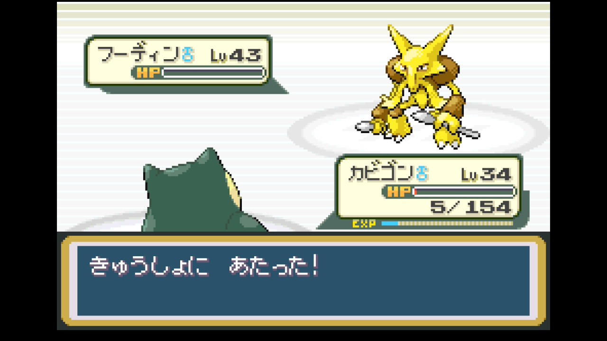

# 第6章 ナツメ（ヤマブキシティ・エスパータイプ）＋シルフカンパニー

> ゴールドバッジ獲得まで。パーティ再編（ニドキング技強化、ゲンガー召喚計画）→ シルフカンパニー突入 → ライバル戦 → サカキ戦 → マスターボール入手 → ヤマブキジム制覇。
>
> 元レポート: [019 パーティ再編〜シルフカンパニー突入](../reports/019_party_rebuild_silph_co.md) / [020 ゲンガー降臨〜シルフカンパニー制圧](../reports/020_silph_co_boss.md) / [021 ナツメ撃破](../reports/021_yamabuki_gym.md)

## このページの内容

- 準備しておくこと
- 攻略概要 / 攻略のコツ
- 攻略ルート（9ステップ）
- 主要トレーナー戦（シルフカンパニー〜ナツメ）
- このエリアで仲間になるポケモン（ゲンガー、ラプラス）
- 入手アイテム（マスターボール含む）
- ジム攻略 — ナツメ戦
- 本プレイのパーティ推移
- 次の章へ

## 準備しておくこと（前章までに）

- **バッジ5個**取得済み（〜ピンクバッジ）
- 主力ポケモン Lv34以上
- **ひでんマシン03 なみのり / ひでんマシン04 かいりき**入手済み
- **わざマシン29 サイコキネシス**入手済み（前章ヤマブキ寄り道、ナッシーに装備）
- 推奨ポケモン: ナッシー（サイコキネシス）、ニドキング（できれば技強化済み）、カビゴン、ブースター、ゴース→ゴースト進化済み
- 推奨アイテム: なんでもなおし複数、いいキズぐすり大量、げんきのかけら（シルフカンパニー長丁場対策）

## 攻略概要

- **対象ジム**: ヤマブキシティジム（ゴールドバッジ）
- **ジムリーダー**: ナツメ（エスパータイプ）
- **エリア範囲**: タマムシ買い出し → ヤマブキシティ → シルフカンパニー1〜11F → ヤマブキジム
- **推奨レベル目安**: 主力 Lv34〜46
- **対応レポート**: レポート 021

## 攻略のコツ

- **ゴースを Lv25 でゴーストに進化させると、シャドーパンチ（ゴースト一致・必中・威力60）が手に入りナツメ戦の主力になる**。通信交換できる環境がある場合はゲンガー（とくこう130・すばやさ110）まで進化させると本章のMVP級。通信交換できない場合はゴーストのまま運用してもジム戦に十分対応可
- **ナツメ戦は「ゴースト技」「あく技」「むし技」が刺さる**。ゲンガーのシャドーパンチ／あくタイプ「かみつく」／ブースターの「かえんほうしゃ」で全タイプ対応可
- **ゲンガー / ゴーストはゴースト/どく複合**。エスパー技は「どく」に2倍効くため、**エスパー相手の壁に過信しない**（バリヤードのサイケこうせんで2倍ダメージ）
- **シルフカンパニー攻略にはカードキー必須**。5F〜7F辺りで入手、無いと多くの扉が開かない
- **シルフカンパニーのライバル戦が事実上のフルバトル**: ピジョット → フーディン → フシギバナ → ギャラドス → ガーディの5匹
- **ヤマブキシティのエスパーおやじから前章で わざマシン29 サイコキネシス**を取っておく（ナッシーに装備）
- **ナツメのフーディン Lv43 が最大の壁**。あく技でも一撃では落とせず、サイコキネシスで返り討ちにされる可能性。カビゴン控えで耐久戦も視野

## 攻略ルート

1. **タマムシ準備** — デパート2Fで わざマシン28 あなをほる購入（ニドキング用）、ゴーストを通信交換でゲンガー化（通信交換できない場合はゴーストのままで進める）
   - **ニドキング技強化**: にどげり → かわらわり、どくばり → でんげきは（わざマシン34）、てだすけ → あなをほる
   - **ナッシー強化**: やどりぎのタネ → ギガドレイン（わざマシン19、エリカ報酬）
2. **ゲームコーナーで わざマシン24 10まんボルト**（4000枚 = 80,000円）→ ゲンガーに装備

   

3. **シルフカンパニー1〜11F**
   - 入口で居眠りロケット団員、そのまま侵入可能
   - 序盤フロアでコイル・レアコイル多数 → ニドキングのあなをほる（4倍）で粉砕
   - **カードキー（5F付近）**を入手し、扉を全解錠
   - **仮眠室**で全回復可
   - ロケット団員はマタドガス・ベトベトン多めで、ナッシーのサイコキネシス、ニドキングのあなをほるが活躍
4. **ライバル・シゲキ戦**: ピジョット Lv37 → フーディン Lv35 → フシギバナ Lv40 → ギャラドス Lv38 → ガーディ
   - ギャラドスは**ゲンガーの10まんボルトで4倍**で一撃

   

5. **サカキ戦**（社長室）: ニドリーノ → ガルーラ Lv35 → サイホーン → ニドクイン Lv41
   - ガルーラのメガトンパンチに注意、サイホーンはなみのりで4倍
6. **シルフ社長を救出 → マスターボール入手**

   

7. **シルフ社員から ラプラス Lv25 をプレゼント**（ボックス送り推奨）
8. **ヤマブキジム挑戦** — ワープパネル迷路、エスパー使いトレーナー連戦
9. **ナツメ撃破 → ゴールドバッジ**

   

## 主要トレーナー戦

| トレーナー | 場所 | 手持ち | 元レポート |
|-----------|------|-------|-----------|
| ロケット団員（コイル系・スリープ系等） | シルフカンパニー各階 | コイル / レアコイル / ラッタ / ズバット / スリープ / ワンリキー / ゴルバット / ゴーリキー / カラカラ / マタドガス | [019](../reports/019_party_rebuild_silph_co.md) |
| ジャグラー テリー | シルフカンパニー 4F | ユンゲラー / バリヤード | [019](../reports/019_party_rebuild_silph_co.md) |
| けんきゅういん しゅういち | シルフカンパニー | マルマイン（じばく注意） | [019](../reports/019_party_rebuild_silph_co.md) |
| けんきゅういん すぐる | シルフカンパニー | ビリリダマ | [019](../reports/019_party_rebuild_silph_co.md) |
| **ライバル・シゲキ** | シルフカンパニー社長室前 | ピジョット Lv37 → フーディン Lv35 → フシギバナ Lv40（御三家別変動）→ ギャラドス Lv38 → ガーディ | [020](../reports/020_silph_co_boss.md) |
| **サカキ**（社長室） | シルフカンパニー社長室 | ニドリーノ / ガルーラ Lv35 / サイホーン / ニドクイン Lv41 | [020](../reports/020_silph_co_boss.md) |
| サイキッカー イサミ他 | ヤマブキジム | ヤドラン / ユンゲラー等エスパー系 | [021](../reports/021_yamabuki_gym.md) |
| **ジムリーダー ナツメ** | ヤマブキジム | ユンゲラー Lv38 / バリヤード♀ Lv37 / モルフォン♀ Lv38 / フーディン♂ Lv43 | [021](../reports/021_yamabuki_gym.md) |

## このエリアで仲間になるポケモン

| ポケモン | 出現場所 | 推奨度 |
|---------|---------|---------------|
| **ゴース → ゴースト → ゲンガー** | 前章ポケモンタワー（Lv25進化、通信交換でゲンガー） | **採用**。本章のMVP（ゴースト止まりでも十分戦力） |
| **ラプラス** | シルフカンパニー社員プレゼント | ボックス保管（しろいきり / のしかかり / あやしいひかり / ほろびのうた） |
| イーブイ系（既出） | — | — |

## 入手アイテム

### タマムシ準備

- **わざマシン28 あなをほる**（デパート2F、再購入可、ニドキング用）
- **わざマシン24 10まんボルト**（ゲームコーナー、コイン4000枚、ゲンガー用）

### シルフカンパニー

- **カードキー** — 全フロア解錠
- **マスターボール** — サカキ撃破後、社長から（100%捕獲、伝説用に温存推奨）
- **わざマシン01 きあいパンチ / わざマシン08 ビルドアップ / わざマシン41 いちゃもん**
- **ラプラス**（社員からプレゼント）
- **わざマシン73 でんじは**（女性NPC）— 捕獲補助・ピカチュウ等に習得検討
- すごいキズぐすり、なんでもなおし、げんきのかたまり、あなぬけのヒモ、タウリン、マックスアップ、キトサン、リゾチウム、ブロムヘキシン、インドメタシン、ふしぎなアメ、ハイパーボール、きんのたま

### ヤマブキシティ

- **なんでもなおし×10**（ジム前ショップ、ナツメ戦準備）
- **モノマネむすめの家**（イベントスポット、ピカチュウぬいぐるみ）
- ※前章で取り忘れていた場合: **わざマシン29 サイコキネシス**（民家のエスパーおやじ）

### ヤマブキジム撃破報酬

- **ゴールドバッジ** — Lv90までの交換ポケモンが言うことを聞く
- **わざマシン04 めいそう** — 温存

## ジム攻略 — ナツメ戦

### リーダーの手持ち

| ポケモン | Lv | 主要技 | 弱点 |
|---------|----|--------|------|
| ユンゲラー | 38 | サイケこうせん / リフレクター / でんじは / かなしばり | ゴースト・あく・むし |
| バリヤード♀ | 37 | サイケこうせん / バリアー / リフレクター / ひかりのかべ | ゴースト・あく・むし |
| モルフォン♀ | 38 | サイケこうせん / どくのこな / ねむりごな / かぜおこし | ほのお・ひこう・エスパー・いわ |
| フーディン♂（エース） | 43 | サイコキネシス / リフレクター / かなしばり / じこさいせい | ゴースト・あく・むし |

### 推奨戦術

**最有効タイプ**: ゴースト・あく・むし。次点でほのお（モルフォン2倍）

| 御三家選択 | 推奨戦術 |
|-----------|---------|
| **ゼニガメ系** | ゼニガメ系列が Lv13 〜で習得する**かみつく（あく）**がフーディンに2倍。ゲンガー（or ゴースト）と組み合わせて主軸に |
| **フシギダネ系** | フシギバナのくさ・どく技は通らない。**ゲンガー（or ゴースト）のシャドーパンチ**主軸＋ブースターのかえんほうしゃ（モルフォン）で対応 |
| **ヒトカゲ系** | リザードンのつばさでうつ（ひこう→エスパー等倍）は決め手にならない。**ゲンガー主軸**＋リザードンの**かみつく**（覚えるなら）で支援 |

**共通の戦術**:

- **ゲンガー（前章で通信交換、または Lv25でゴースト止まり）のシャドーパンチ**がメインアタッカー
- **ブースター（前章入手）のかえんほうしゃ**でモルフォン（むし2倍）対応
- **ゲンガー / ゴーストをバリヤードに出すのはNG**: 「どく」部分にエスパーが2倍 → サイケこうせんが2倍ダメージ
- フーディンは特殊耐久が高い。リフレクター展開後は物理が通らないので、特殊技で攻める

### 本プレイのバトル記録（ゼニガメ選択）

- **採用パーティ**: ゲンガー Lv35 / カメックス Lv46 / ブースター / カビゴン
- **戦況**:
  - ユンゲラー → ゲンガーのシャドーパンチ一撃
  - バリヤード → ゲンガーで仕掛けるが、サイケこうせんで被弾大 → カメックスのかみつくに切り替え
  - モルフォン → ブースターのかえんほうしゃで撃破
  - フーディン → カメックスのかみつくで挑むが、サイコキネシスで戦闘不能 → カビゴンに交代 → **かいりきが急所** で逆転撃破

  

→ 詳細: [レポート 021](../reports/021_yamabuki_gym.md)

## 本プレイのパーティ推移（ゼニガメ選択時の参考例）

| ポケモン | Lv | タイプ | 技構成 | 持ち物 |
|---------|----|--------|--------|--------|
| カメックス♂ | 46 | みず | なみのり / みずのはどう / かみつく / あまごい | くろいメガネ |
| ゲンガー♂ | 35 | ゴースト/どく | ナイトヘッド / あやしいひかり / シャドーパンチ / 10まんボルト | - |
| カビゴン♂ | 34 | ノーマル | おんがえし / あくび / ねむる / かいりき | カゴのみ |
| ニドキング♂ | 39 | どく/じめん | かわらわり / でんげきは / つのでつく / あなをほる | - |
| ナッシー♀ | 35 | くさ/エスパー | リフレクター / ギガドレイン / サイコキネシス / タマゴばくだん | - |
| ブースター♂ | 34 | ほのお | かえんほうしゃ / かみつく / あなをほる / でんこうせっか | - |

進化トピック: ゴース → ゴースト（Lv25でシャドーパンチ習得）→ 通信交換でゲンガー

## 次の章へ

### 達成チェックリスト

- [ ] **ゴールドバッジ**獲得（バッジ6個目）
- [ ] 主力ポケモン Lv44〜46
- [ ] **マスターボール**入手（伝説ポケモン用に温存推奨）
- [ ] **カードキー**入手
- [ ] **わざマシン04 めいそう**入手
- [ ] **わざマシン01 きあいパンチ / 08 ビルドアップ / 41 いちゃもん**入手
- [ ] **ラプラス**入手（シルフ社員プレゼント）
- [ ] 推奨: ゴーストor通信交換でゲンガー、わざマシン24 10まんボルト購入

### 次の目的地

セキチク → 19・20番水道（なみのり）→ グレンじま → ふたごじま

---

[← 前のチャート 第5章 キョウ](05_kyou_sekichiku.md) | [📘 チャート一覧](README.md) | [次のチャート → 第7章 カツラ（グレン・ほのお）](07_katsura_guren.md)
