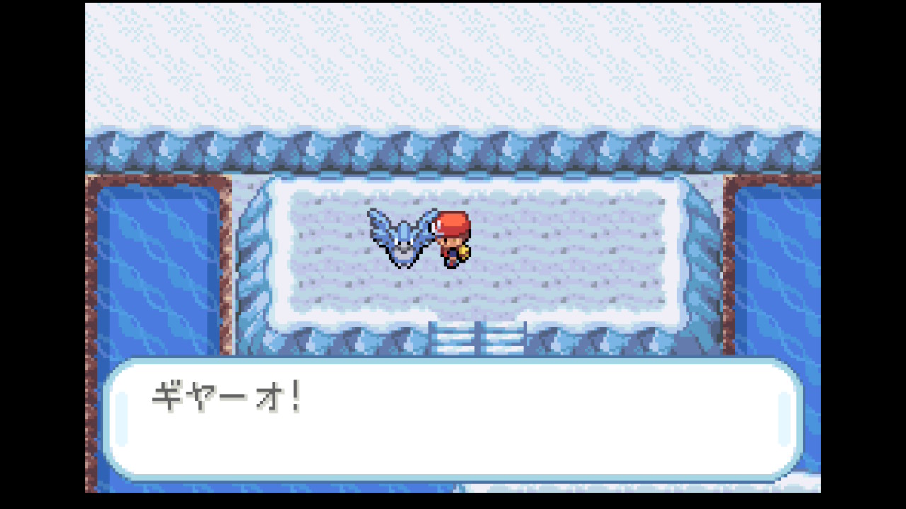
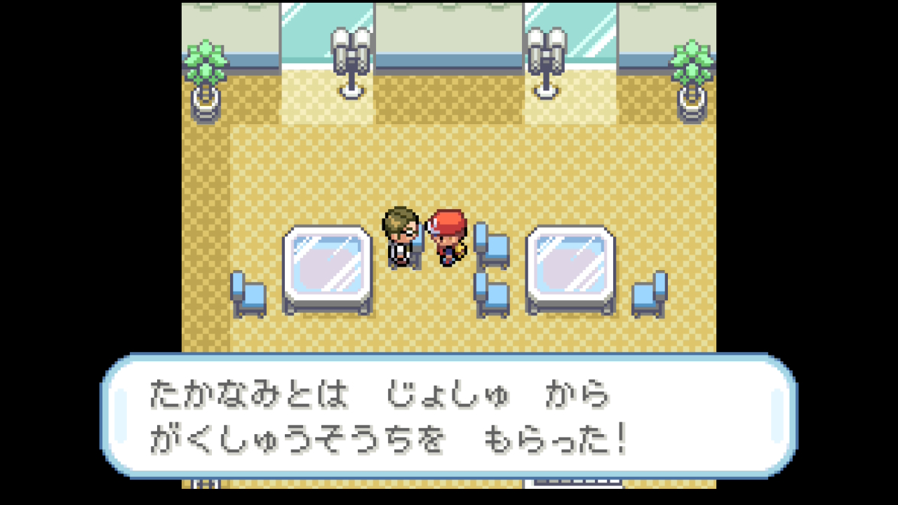
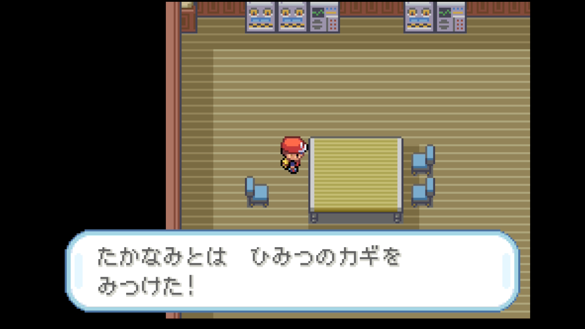
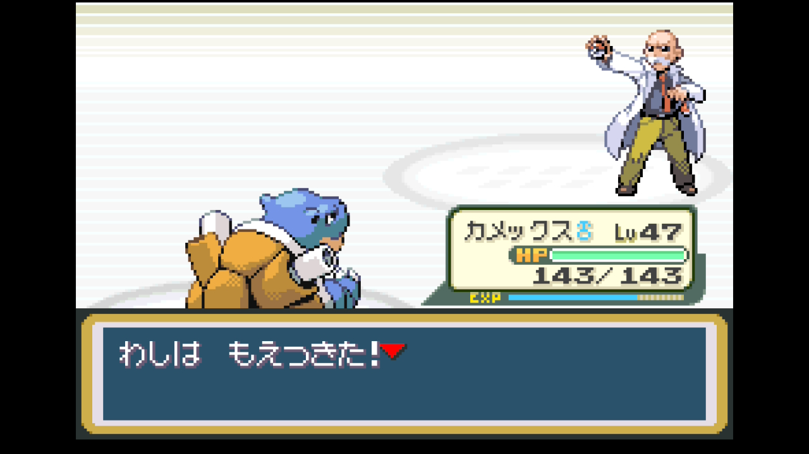

# 第7章 カツラ（グレンじま・ほのおタイプ）

> ヒートバッジ獲得まで。19・20番水道航海 → ふたごじま（フリーザー捕獲未遂）→ グレンじま到着 → ポケモンやかた探索（ひみつのカギ入手）→ カツラジム制覇。
>
> 元レポート: [022 19・20番水道〜グレンタウン](../reports/022_route19_20_guren.md) / [023 ポケモンやかた〜カツラ](../reports/023_guren_gym_pokemon_mansion.md)

## このページの内容

- 準備しておくこと
- 攻略概要 / 攻略のコツ
- 攻略ルート（10ステップ、フリーザー捕獲含む）
- 主要トレーナー戦（水道〜ポケモンやかた〜カツラ）
- このエリアで仲間になるポケモン（フリーザー、ロコン他）
- 入手アイテム（ふぶき、化石復元など）
- ジム攻略 — カツラ戦
- 本プレイのパーティ推移
- 次の章へ

## 準備しておくこと（前章までに）

- **バッジ6個**取得済み（〜ゴールドバッジ）
- 主力ポケモン Lv36以上
- **マスターボール**入手済み（伝説ポケモン用に温存推奨、フリーザー戦では使わない）
- **ハイパーボール大量購入**（フリーザー捕獲挑戦用、20個以上）
- 推奨ポケモン: みずタイプ主力、ナッシー、ニドキング、カビゴン、ゲンガー or ゴースト
- 推奨アイテム: こおりなおし、すごいキズぐすり、げんきのかけら

## 攻略概要

- **対象ジム**: グレンタウンジム（ヒートバッジ）
- **ジムリーダー**: カツラ（ほのおタイプ）
- **エリア範囲**: セキチク → 19・20番水道 → ふたごじま → グレンじま → ポケモンやかた → グレンジム
- **推奨レベル目安**: 主力 Lv36〜47
- **対応レポート**: レポート 023

## 攻略のコツ

- **カツラ戦はみずタイプ高火力技で完封できる**。ほのお → みず2倍弱点、ゼニガメ系列ならカツラのほのおを半減で受けられて特に安全。ニドキングのじしんも有効
- **グレンジムに入るには「ひみつのカギ」が必要**。ポケモンやかた地下を探索して入手。やかた内はトレーナー＋野生ポケモンエンカウントが多くて時間がかかる
- **ふたごじまでフリーザー Lv50 と遭遇できる**。ハイパーボール最低20個＋ねむり付与役（カビゴンのあくび等）でフリーザーを眠らせ、HP削り役で赤HPまで削る体制で挑む。捕獲率は最低クラスなのでセーブ＆ロード前提
- **ポケモンやかた地下で わざマシン14 ふぶき入手**。みずタイプ主力に習得させると、こおり技でくさ・ひこう・じめん・ドラゴンを広範囲カバー
- **20番水道のドククラゲはみず/どく。「ギガドレイン」は等倍に相殺される**ので、ナッシーはサイコキネシスで攻める
- **オーキド助手から図鑑50種で「がくしゅうそうち」**（セキチクシティ東ゲート2階）。低レベル枠の育成に必須

## 攻略ルート

1. **セキチクからなみのり要員（みずタイプ主力）で出航 → 19番水道**
   - メノクラゲ捕獲（図鑑用）
   - ダブルバトル「うみきょうだいのマナとコウ」
2. **ふたごじま洞窟探索**
   - ヤドン・ヤドラン・ゴルバット・パウワウ捕獲（図鑑大量回収）
   - みずのいし、おおきなしんじゅ、こおりなおし、げんきのかけら、ハイパーボール
   - **岩で水流せきとめる仕掛け**を解いた先に **フリーザー Lv50** 出現

   

3. **20番水道 → グレンじま到着**
4. **セキチクで「がくしゅうそうち」回収**（東ゲート2階）→ カビゴンに装備

   

5. **グレンじまショップでハイパーボール大量購入**（フリーザーリベンジ準備＋念のため）
6. **ポケモンやかた攻略**（ひみつのスイッチパズル）
   - 1F〜B1Fをスイッチ操作で進む
   - **野生捕獲祭り**: ラッタ、ベトベター、**ロコン**（リーフグリーン限定）、ベトベトン、メタモン
   - **ステータスアップアイテム多数**: タウリン、キトサン、リゾチウム、ブロムヘキシン、マックスアップ、インドメタシン
   - **わざマシン14 ふぶき**（みずタイプ主力に装備）
   - **わざマシン22 ソーラービーム**（温存）
   - **NPC交換**: コンパン↔モンジャラ「じゃじゃお」
   - フジ博士の日記でミュウツー誕生の記録を確認
   - **ひみつのカギ**入手

   

7. **ポケモン研究所で化石復元**（前章で入手したかいのカセキ → オムナイト、こうらのカセキ → カブト）
8. **カツラジム挑戦** — クイズ正解で戦闘回避可、不正解で戦闘 → 育成のため全戦推奨
9. **カツラ撃破 → ヒートバッジ＋わざマシン38 だいもんじ**

   

10. **マサキ来訪** — 1の島勧誘イベント（殿堂入り後 or 拒否で後回し可）

## 主要トレーナー戦

| トレーナー | 場所 | 手持ち | 元レポート |
|-----------|------|-------|-----------|
| かいぱんやろう ハルキ | 19番水道 | ヒトデマン Lv29 | [022](../reports/022_route19_20_guren.md) |
| うみきょうだい マナ＆コウ | 19番水道 | トサキント♂ Lv30 / アズマオウ♂ Lv30（ダブルバトル） | [022](../reports/022_route19_20_guren.md) |
| トレーナー多数 | 19・20番水道 | ヒトデマン / ドククラゲ Lv27（みず/どく） / パルシェン♂ Lv31 / シードラ / ニョロモ Lv27 | [022](../reports/022_route19_20_guren.md) |
| **野生フリーザー Lv50** | ふたごじま深部 | フリーザー Lv50（ハイパーボール大量必要） | [022](../reports/022_route19_20_guren.md) |
| どろぼうトレーナー | ポケモンやかた | ヒトカゲ Lv34（進化させていない個体） | [023](../reports/023_guren_gym_pokemon_mansion.md) |
| トレーナー多数 | ポケモンやかた | ベトベター系・マルマイン等 | [023](../reports/023_guren_gym_pokemon_mansion.md) |
| ジムトレーナー（クイズ正解で回避可） | カツラジム | キュウコン / ロコン等ほのお系 | [023](../reports/023_guren_gym_pokemon_mansion.md) |
| **ジムリーダー カツラ** | カツラジム最深 | ロコン Lv38 / ギャロップ Lv40 / キュウコン Lv38 / ウインディ Lv42 | [023](../reports/023_guren_gym_pokemon_mansion.md) |

## このエリアで仲間になるポケモン

| ポケモン | 出現場所 | 推奨度 |
|---------|---------|---------------|
| メノクラゲ | 19番水道（なみのり） | 図鑑用、ボックス |
| ヤドン・ヤドラン | ふたごじま | 図鑑用 / ヤドラン↔ベロリンガ「なめぞう」交換 |
| ゴルバット | ふたごじま | 図鑑用 |
| パウワウ | ふたごじま | 図鑑用 |
| **フリーザー Lv50** | ふたごじま深部 | 本プレイは捕獲リセット（後の章でリベンジ） |
| ラッタ・ベトベター・ベトベトン | ポケモンやかた | 図鑑用 |
| **ロコン**（リーフグリーン限定） | ポケモンやかた | **必ず捕獲**（図鑑） |
| メタモン | ポケモンやかた | 図鑑用 |
| **オムナイト**（化石復元） | ポケモン研究所 | 図鑑用 |
| **モンジャラ「じゃじゃお」** | やかたNPC交換（コンパン↔） | 図鑑用 |

## 入手アイテム

### 19・20番水道

- 道中の拾いアイテム少数

### ふたごじま

- **みずのいし**（後で進化用）
- **おおきなしんじゅ**（売却7500円）
- こおりなおし、げんきのかけら、ハイパーボール

### セキチク東ゲート（前章補完）

- **がくしゅうそうち**（図鑑50種、カビゴン装備）

### グレンじま

- **ハイパーボール×10**（ショップ購入、フリーザー用）

### ポケモンやかた

- **ひみつのカギ**（ジム解錠キー）
- **わざマシン14 ふぶき**（みずタイプ主力用）
- **わざマシン22 ソーラービーム**（温存）
- ステータスアップ系: タウリン、キトサン、リゾチウム、ブロムヘキシン、マックスアップ、インドメタシン
- まんたんのくすり、かいふくのくすり

### ポケモン研究所

- 化石ポケモン復元（オムナイト or カブト）

### カツラ撃破報酬

- **ヒートバッジ** — Lv100までの交換ポケモンが言うことを聞く
- **わざマシン38 だいもんじ**（ほのお威力120、温存）

## ジム攻略 — カツラ戦

### リーダーの手持ち

| ポケモン | Lv | 主要技 | 弱点 |
|---------|----|--------|------|
| ロコン | 38 | かえんほうしゃ / にほんばれ / かなしばり | みず・じめん・いわ |
| ギャロップ | 40 | かえんほうしゃ / おうふくビンタ / ふみつけ | みず・じめん・いわ |
| キュウコン | 38 | かえんほうしゃ / にほんばれ / さいみんじゅつ | みず・じめん・いわ |
| ウインディ（エース） | 42 | かえんほうしゃ / かみつく / おんねん | みず・じめん・いわ |

### 推奨戦術

**最有効タイプ**: みず（タイプ一致＋2倍）。次点でじめん・いわ

| 御三家選択 | 推奨戦術 |
|-----------|---------|
| **ゼニガメ系** | **なみのり**でほぼ4枚抜きできる最も楽な相性。ゼニガメ系列はほのおを半減で受けられる |
| **フシギダネ系** | くさ技は半減で不利。**ニドキング（じしん）**主軸＋他のみずタイプ（捕獲したパウワウ・メノクラゲなど）を補助に |
| **ヒトカゲ系** | ほのお技ミラーで等倍勝負になり危険。**ニドキング（じしん）**＋他のみず・いわタイプを主軸に |

**共通の戦術**:

- カツラは回復薬を使わないので、HP高火力で押し切れば簡単
- ニドキング（じしん）、サイホーン（いわなだれ）、リフレクターでもばつぐん代替可
- くさタイプ・むしタイプ・こおり耐久薄い枠は前に出さない

### 本プレイのバトル記録（ゼニガメ選択）

- **採用パーティ**: カメックス Lv47（ふぶき習得済み）
- **戦術**: なみのり4連発
- **結果**: なみのり4発で4枚抜き、控えのニドキング・ナッシーは出番なしの圧勝
- レベル差＋4倍弱点で1ターンキル連発

→ 詳細: [レポート 023](../reports/023_guren_gym_pokemon_mansion.md)

## 本プレイのパーティ推移（ゼニガメ選択時の参考例）

| ポケモン | Lv | タイプ | 技構成 | 持ち物 |
|---------|----|--------|--------|--------|
| カメックス♂ | 47 | みず | なみのり / ふぶき / かみつく / あまごい | くろいメガネ |
| ゲンガー♂ | 37 | ゴースト/どく | ナイトヘッド / あやしいひかり / シャドーパンチ / 10まんボルト | - |
| カビゴン♂ | 35 | ノーマル | おんがえし / ねごと / ねむる / かいりき | がくしゅうそうち |
| ニドキング♂ | 46 | どく/じめん | かわらわり / でんげきは / メガホーン / あなをほる | - |
| ナッシー♀ | 36 | くさ/エスパー | リフレクター / ギガドレイン / サイコキネシス / タマゴばくだん | - |
| カモネギ♂（じんすけ） | 22 | ノーマル/ひこう | いあいぎり / そらをとぶ | - |

進化トピック: ニドキング Lv43 でメガホーン習得、カメックス みずのはどう→ふぶき入れ替え、カビゴン あくび→ねごと

## 次の章へ

### 達成チェックリスト

- [ ] **ヒートバッジ**獲得（バッジ7個目）
- [ ] 主力ポケモン Lv45〜47
- [ ] **ひみつのカギ**入手（ジム解錠用、使用済み）
- [ ] **わざマシン14 ふぶき**入手（みずタイプ主力に装備推奨）
- [ ] **わざマシン22 ソーラービーム / 38 だいもんじ**入手
- [ ] 化石復元（オムナイト or カブト）
- [ ] 推奨: ロコン（リーフグリーン限定）、ステータスアップ系道具を回収

### 次の目的地

トキワシティ → トキワジム（最終ジム・サカキ）→ チャンピオンロード

---

[← 前のチャート 第6章 ナツメ＋シルフカンパニー](06_natsume_yamabuki.md) | [📘 チャート一覧](README.md) | [次のチャート → 第8章 サカキ（トキワ・じめん）](08_sakaki_tokiwa.md)
