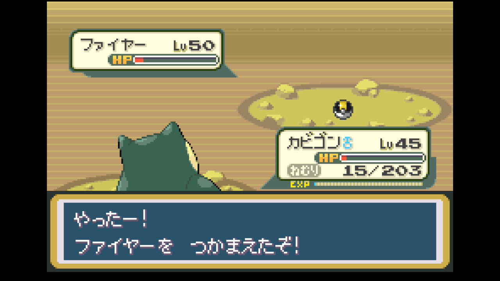
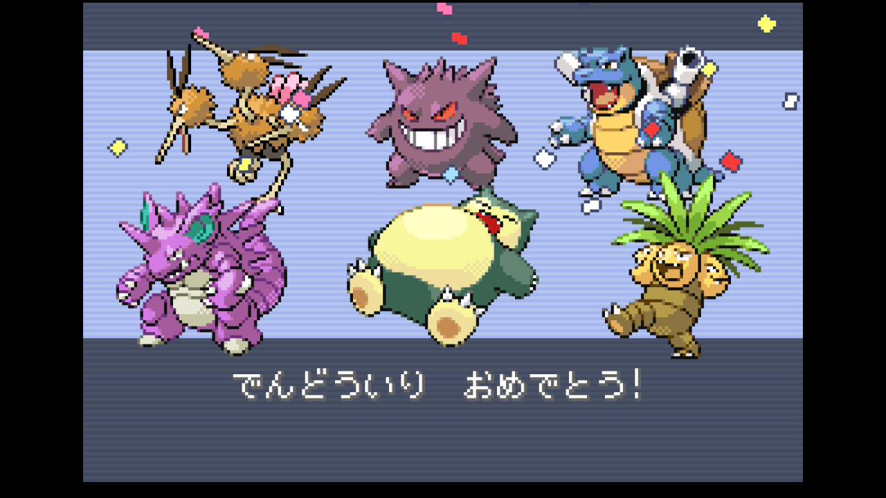
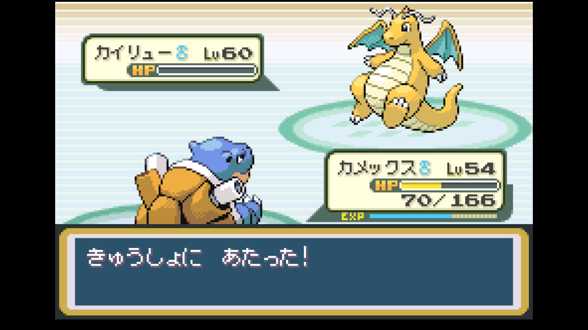

# 第9章 四天王・チャンピオン（セキエイこうげん）

> 殿堂入り達成まで。カントー全8バッジ取得後、22番道路 → チャンピオンロード → 四天王（カンナ・シバ・キクコ・ワタル）→ ライバル・シゲキとの最終決戦。
>
> 元レポート: [026 チャンピオンロード突破](../reports/026_champion_road.md) / [027 四天王準備〜ファイヤー発見](../reports/027_mt_ember.md) / [028 ファイヤー捕獲〜四天王初挑戦](../reports/028_moltres_e4_challenge.md) / [029 四天王リベンジ〜殿堂入り](../reports/029_e4_champion_dendo_iri.md)

## このページの内容

- 準備しておくこと
- 攻略概要 / 攻略のコツ
- 攻略ルート（22番道路〜セキエイこうげん〜四天王〜チャンピオン）
- 主要トレーナー戦（チャンピオンロードのエリート多数）
- このエリアで仲間になるポケモン（ファイヤー）
- 入手アイテム
- 四天王・チャンピオン戦詳細（**カンナ／シバ／キクコ／ワタル／ライバル** の手持ちと推奨戦術）
- 本プレイの殿堂入り時パーティ
- 殿堂入り達成チェックリスト
- 殿堂入り後

## 準備しておくこと（前章までに）

- **カントー全8バッジ**取得済み
- 主力ポケモン Lv50以上、控え全員 Lv48以上推奨
- **ひでんマシン全種**装備済み（いあいぎり / そらをとぶ / なみのり / かいりき / フラッシュ / いわくだき）
- **マスターボール**温存中（伝説枠用）
- **わざマシン26 じしん**装備（ニドキング等）
- 御三家最終進化＋専用技習得済み
- **回復アイテム大量**: まんたんのくすり×3〜5、かいふくのくすり×3、いいキズぐすり×10、げんきのかたまり×2、なんでもなおし×3、各種状態異常治療
- 推奨任意: ファイヤー捕獲（ナナシマともしびやま）、わざマシン13 れいとうビーム購入（ゲームコーナー、ワタル対策）

## 攻略概要

- **対象**: 四天王（カンナ・シバ・キクコ・ワタル）+ チャンピオン（ライバル）
- **エリア範囲**: トキワジム後 → 22番道路 → チャンピオンロード → セキエイこうげん → ポケモンリーグ
- **推奨レベル目安**: 主力 Lv50〜55
- **対応レポート**: レポート 029（殿堂入り達成）

## 攻略のコツ

- **四天王戦は5連戦・途中で買い物・ボックス入れ替え不可**。事前にパーティ・回復アイテム・道具を完璧に整える
- **準備推奨レベル**: エースは Lv55 前後、控え全員 Lv50 以上。本プレイ初挑戦は Lv40〜46 で挑みシバで全滅 → Lv50〜54 まで上げ直してリベンジ成功
- **回復アイテム**: まんたんのくすり / かいふくのくすり ×3〜5、いいキズぐすり ×10、げんきのかたまり ×2、なんでもなおし ×3、状態異常治療各種
- **ナナシマ「ともしびやま」でファイヤー Lv50 を捕獲できる**。ハイパーボール 20個以上＋カビゴン（ほのお・ひこう半減〜等倍）で受ける態勢推奨。ナッシー（ほのお4倍弱点）は出さない
- **カンナのラプラスは特性「ちょすい」**。みず技は無効＋HP回復になる。10まんボルト・電気特殊で攻める
- **キクコのゲンガーは特性「ふゆう」**。じしん・あなをほる無効。エスパー特殊（サイコキネシス）か、ゴースト技で攻める
- **ワタル戦のカイリュー（ドラゴン/ひこう）は氷4倍弱点**。みずタイプ主力のふぶき（わざマシン14）等を四天王戦序盤で温存しておくと一撃で抜ける
- **チャンピオンのパーティは選んだ御三家で変動**: ゼニガメ選択時はみず弱点重視、フシギダネ選択時はくさ弱点重視、ヒトカゲ選択時はほのお弱点重視で組まれる傾向

## 攻略ルート

1. **22番道路** — ライバル戦（フルパーティ対決）
   - ピジョット → フーディン → 御三家最終進化（プレイヤーの御三家弱点を突く相手）→ ガーディ → サイホーン → ギャラドス
   - **ライバルの御三家**: プレイヤーがゼニガメ選択ならフシギバナ／フシギダネ選択ならリザードン／ヒトカゲ選択ならカメックスを使ってくる
2. **チャンピオンロード**（要・いあいぎり / かいりき / なみのり / いわくだき）
   - エリートトレーナー戦多数（ほのお・みず・草パーティに偏った構成）
   - **ふしぎなアメ多数**（拾い得）
   - わざマシン: わざマシン02 ドラゴンクロー / わざマシン37 すなあらし / わざマシン07 あられ / わざマシン50 オーバーヒート
   - エフェクトガード、げんきのかたまり、なんでもなおし
   - 出口手前にすてみタックル教え人
3. **23番道路 → セキエイこうげん**
   - **ショップで状態異常回復系・ハイパーボール大量購入**
4. **任意イベント: ナナシマ「ともしびやま」でファイヤー捕獲**
   - 1の島ほてりのみち → ともしびおんせんで **ひでんマシン06 いわくだき** 入手
   - ともしびやま山頂で **ファイヤー Lv50** 出現
   - **作戦**: ニドキングのかわらわりで赤HPまで削る → カビゴン（ほのお半減）で耐えながらハイパーボール連投

   

5. **ゲームコーナーで わざマシン13 れいとうビーム購入**（4000枚） → カビゴン or 対応枠に習得（ワタル対策）
6. **四天王挑戦**: 5連戦、途中休憩・買い物不可
7. **チャンピオン戦**（ライバル・シゲキ）→ 殿堂入り

   

## 主要トレーナー戦

四天王・チャンピオンの詳細は本章「四天王・チャンピオン戦詳細」セクション参照。ここでは22番道路・チャンピオンロードの主要トレーナー戦をまとめる。

| トレーナー | 場所 | 手持ち | 元レポート |
|-----------|------|-------|-----------|
| **ライバル・シゲキ**（最終戦前） | 22番道路 | ピジョット → フーディン → 御三家最終進化（御三家別変動）→ ガーディ → サイホーン → ギャラドス | [026](../reports/026_champion_road.md) |
| エリートトレーナー（ほのお寄り） | チャンピオンロード | ペルシアン Lv42 / ポニータ / ロコン / ギャロップ / キュウコン / リザードン | [026](../reports/026_champion_road.md) |
| エリートトレーナー アサオ | チャンピオンロード | フシギソウ → リザードン | [026](../reports/026_champion_road.md) |
| エリートトレーナー（みず系） | チャンピオンロード | ジュゴン → ペルシアン → ラッキー（耐久） | [026](../reports/026_champion_road.md) |
| 単発トレーナー（みず・水系） | チャンピオンロード | ゴルダック / ラプラス / ベロリンガ | [026](../reports/026_champion_road.md) |
| エリートトレーナー（みずパ） | チャンピオンロード | キングラー → ニョロゾ → ドククラゲ → シードラ → カメックス（全員みず） | [026](../reports/026_champion_road.md) |
| エリートトレーナー（雑多） | チャンピオンロード | スリーパー / バリヤード / ナッシー / パルシェン / サンドパン / マルマイン | [026](../reports/026_champion_road.md) |
| エリートトレーナー（ウインディ） | チャンピオンロード | ウインディ（とっしん自滅あり） | [026](../reports/026_champion_road.md) |
| エリートトレーナー（草パ） | チャンピオンロード | マダツボミ → ウツドン → パラス → パラセクト（しびれごな・ねむりごな・キノコのほうし注意） | [026](../reports/026_champion_road.md) |
| エリートカップル（ダブル） | チャンピオンロード | ニドキング ＋ ニドクイン（じしん全体攻撃注意） | [026](../reports/026_champion_road.md) |
| カラテおう タダシ | チャンピオンロード | かくとう系（「最後の試練」発言担当） | [026](../reports/026_champion_road.md) |
| 格闘兄弟 カズ＆サチ | ほてりのみち（1の島） | オコリザル / ゴーリキー | [027](../reports/027_mt_ember.md) |
| ポケモンレンジャー ショウタ | ともしびやま | スターミー等 | [027](../reports/027_mt_ember.md) |
| **野生ファイヤー Lv50** | ともしびやま | ファイヤー Lv50（ハイパーボール大量必要、かえんほうしゃ＋ほのおのうず） | [028](../reports/028_moltres_e4_challenge.md) |
| **四天王 カンナ** | ポケモンリーグ | （詳細は「カンナ（こおりタイプ）」セクション参照） | [029](../reports/029_e4_champion_dendo_iri.md) |
| **四天王 シバ** | ポケモンリーグ | （詳細は「シバ（かくとうタイプ）」セクション参照） | [029](../reports/029_e4_champion_dendo_iri.md) |
| **四天王 キクコ** | ポケモンリーグ | （詳細は「キクコ（ゴーストタイプ）」セクション参照） | [029](../reports/029_e4_champion_dendo_iri.md) |
| **四天王 ワタル** | ポケモンリーグ | （詳細は「ワタル（ドラゴンタイプ）」セクション参照） | [029](../reports/029_e4_champion_dendo_iri.md) |
| **チャンピオン・ライバル** | チャンピオンの間 | （詳細は「チャンピオン・ライバル」セクション参照） | [029](../reports/029_e4_champion_dendo_iri.md) |

## このエリアで仲間になるポケモン

| ポケモン | 出現場所 | 推奨度 |
|---------|---------|---------|
| **ファイヤー Lv50** | ともしびやま | 採用推奨（ほのお/ひこう特殊アタッカー、四天王予備にも） |
| ガラガラ・サンドパン・パラセクト | チャンピオンロード | 図鑑用 |
| オニドリル | 22番道路 | 図鑑用、ひでん要員候補 |
| ブーバー・ギャロップ | チャンピオンロード | 図鑑用 |
| マルマイン・ライチュウ | チャンピオンロード | エリート手持ちで遭遇 |

## 入手アイテム

### 22番道路 / チャンピオンロード

- **ふしぎなアメ**（複数）
- **わざマシン02 ドラゴンクロー**
- **わざマシン37 すなあらし / わざマシン07 あられ / わざマシン50 オーバーヒート**
- **エフェクトガード**（能力ダウン防止）
- なんでもなおし、げんきのかたまり、ラムのみ
- クリティカッターのわざマシン
- 出口手前のおじさん: **すてみタックル**伝授

### ナナシマ・ともしびやま

- **ひでんマシン06 いわくだき**（ともしびおんせん、岩くり抜きじいさん）
- ハイパーボール（ともしびやま中）

### セキエイこうげんショップ

- どくけし／まひなおし／こおりなおし／ねむけざまし／ミックスオレ各 ×10 推奨
- ハイパーボール大量

### タマムシゲームコーナー（必要に応じ追加）

- **わざマシン13 れいとうビーム**（4000枚、ワタル対策）

### 殿堂入り後（次章への布石）

- 殿堂入りでナナシマ4〜7の島が解放
- 各地で再戦・伝説ポケモン捕獲チャンス

## 四天王・チャンピオン戦詳細

### カンナ（こおりタイプ）

| ポケモン | Lv | 主要技 | 弱点 | 注意点 |
|---------|----|--------|------|--------|
| ジュゴン | 52 | なみのり / オーロラビーム / つのドリル / うたう | でんき・くさ・かくとう・いわ | みず技持ち、地面でも安全ではない |
| パルシェン | 51 | オーロラビーム / じこあんじ / よこどり / まもる | でんき・かくとう・くさ・いわ | 物理耐久高 |
| ヤドラン | 54 | なみのり / サイケこうせん / さいみんじゅつ / いやなおと | くさ・でんき・あく・むし・ゴースト | エスパー複合 |
| ルージュラ | 53 | あくのはどう / さいみんじゅつ / メロメロ / こおりのつぶて | ほのお・むし・はがね・いわ・ゴースト・あく | メロメロ注意（性別逆で) |
| **ラプラス**（エース） | 56 | ふぶき / なみのり / うたう / こおりのキバ | でんき・くさ・かくとう・いわ | **特性「ちょすい」でみず無効** |

**推奨戦術**:

- 全員でんき技2倍弱点。**でんき特殊（ゲンガー10まんボルト / ニドキング10まんボルト）が最有力**
- ラプラスにはみず技禁止
- ヤドランにはあく/ゴースト技

### シバ（かくとうタイプ）

| ポケモン | Lv | 主要技 | 弱点 |
|---------|----|--------|------|
| イワーク | 53 | じしん / きしかいせい / どくどく / じわれ | みず（4倍）・くさ（4倍）・こおり・はがね・かくとう |
| ゴーリキー | 55 | クロスチョップ / じしん / がんせきふうじ / みやぶる | エスパー・ひこう |
| カイリキー | 57 | クロスチョップ / がんせきふうじ / じしん / みやぶる | エスパー・ひこう |
| イワーク | 56 | じしん / きしかいせい / がんせきふうじ / どくどく | みず4倍 |
| **エビワラー**（エース） | 58 | スカイアッパー / ほのおのパンチ / かみなりパンチ / れいとうパンチ | ひこう・エスパー |

**推奨戦術**:

- イワーク2匹はみずタイプ高火力技（なみのり等）で4倍ワンパン
- かくとう勢にはゴースト（かくとう無効）/ エスパー（ナッシー等）/ ひこう（ドードリオ等）で対応
- ノーマルタイプ（カビゴン等）は出さない

### キクコ（ゴーストタイプ）

| ポケモン | Lv | 主要技 | 弱点 |
|---------|----|--------|------|
| ゲンガー | 56 | サイコキネシス / 10まんボルト / にらみつける / どろあそび | エスパー・あく・ゴースト・じめん（特性ふゆうで無効） |
| ゴルバット | 56 | あくのはどう / きゅうけつ / つばさでうつ / ちょうおんぱ | でんき・こおり・いわ・エスパー（じめん無効） |
| ゴースト | 55 | シャドーボール / さいみんじゅつ / うらみ / のろい | エスパー・あく・ゴースト |
| アーボック | 58 | じしん / かみつく / ヘドロこうげき / みやぶる | エスパー・じめん |
| **ゲンガー**（エース） | 60 | サイコキネシス / 10まんボルト / どくどく / さいみんじゅつ | エスパー・あく・ゴースト |

**推奨戦術**:

- **ゲンガー2匹は特性「ふゆう」でじめん技無効**。サイコキネシス（ナッシー）かあく技で攻める
- ゴルバット・ゴースト・アーボックはエスパー特殊で一掃可能
- ナッシーのサイコキネシスがMVP

### ワタル（ドラゴンタイプ）

| ポケモン | Lv | 主要技 | 弱点 |
|---------|----|--------|------|
| ギャラドス | 58 | ハイドロポンプ / りゅうのいかり / かみなり / りゅうのまい | でんき（4倍）・いわ |
| プテラ | 56 | はかいこうせん / いわなだれ / つばさでうつ / じしん | みず・でんき・こおり・はがね・いわ |
| ハクリュー | 56 | れいとうビーム / りゅうのいぶき / りゅうのいかり / かみなり | こおり・ドラゴン |
| ハクリュー | 56 | れいとうビーム / りゅうのいぶき / かみなり / みやぶる | こおり・ドラゴン |
| **カイリュー**（エース） | 60 | はかいこうせん / りゅうのいかり / がまん / にらみつける | こおり（4倍）・ドラゴン |

**推奨戦術**:

- ギャラドスはゲンガーの10まんボルトで4倍ワンパン
- ハクリュー・カイリューは**こおり技で4倍**。みずタイプ主力のふぶき or カビゴン系のれいとうビーム（わざマシン13）を温存
- プテラにはみず or 電気

### チャンピオン・ライバル

ライバルのパーティはプレイヤーが選んだ御三家で1匹だけ変動します（プレイヤーの御三家弱点持ちが入る）。固定枠5匹は共通です。

#### 共通の固定枠

| ポケモン | Lv | 主要技 | 弱点 |
|---------|----|--------|------|
| ピジョット | 59 | みやぶる / つばさでうつ / でんこうせっか / すなかけ | でんき・こおり・いわ |
| フーディン | 59 | サイコキネシス / リフレクター / かなしばり / じこさいせい | むし・ゴースト・あく |
| サイドン | 61 | じしん / メガホーン / かみつく / ホーンドリル | みず（4倍）・くさ（4倍）・こおり・はがね・かくとう |
| ギャラドス | 61 | ハイドロポンプ / りゅうのいかり / かみつく / りゅうのまい | でんき4倍・いわ |
| **ウインディ**（エース） | 63 | かえんほうしゃ / ロックスター / にほんばれ / すてみタックル | みず・じめん・いわ |

#### 御三家別の変動枠（プレイヤーの選択で1匹追加）

| プレイヤーの御三家 | ライバルの追加枠 | 弱点 |
|-----------------|----------------|------|
| **ゼニガメ系** | フシギバナ Lv61（くさ/どく、ソーラービーム等） | ほのお・こおり・ひこう・エスパー |
| **フシギダネ系** | リザードン Lv61（ほのお/ひこう、かえんほうしゃ等） | みず・でんき・いわ（4倍） |
| **ヒトカゲ系** | カメックス Lv61（みず、なみのり等） | でんき・くさ |

**推奨戦術（共通枠）**:

- ピジョット → でんき or いわ・こおり技で先手
- フーディン → むし技（ニドキングのメガホーン等）/ あく技
- サイドン → みず4倍or くさ4倍。カメックスのなみのり / フシギバナのギガドレイン等
- ギャラドス → でんき4倍。ゲンガー・ピカチュウ系の10まんボルト
- ウインディ → みず or じめん or いわ

**御三家別変動枠の対策**:

- **フシギバナ（ゼニガメ選択時）** → ナッシーのサイコキネシス、ブースターのかえんほうしゃ、ドードリオのつばさでうつ等
- **リザードン（フシギダネ選択時）** → みず・でんき・いわ4倍。みずタイプ主力やピカチュウ系で4倍を狙う
- **カメックス（ヒトカゲ選択時）** → でんき・くさ。ゲンガー・ピカチュウの10まんボルト、ナッシーのギガドレイン等

   

## 本プレイの殿堂入り時パーティ（ゼニガメ選択時の参考例）

| ポケモン | Lv | タイプ | 技構成 | 持ち物 |
|---------|----|--------|--------|--------|
| カメックス♂ | 54 | みず | なみのり / ふぶき / かみつく / ハイドロカノン | くろいメガネ |
| ニドキング♂ | 54 | どく/じめん | かわらわり / 10まんボルト / メガホーン / じしん | - |
| ゲンガー♂ | 52 | ゴースト/どく | みちづれ / あやしいひかり / シャドーボール / 10まんボルト | がくしゅうそうち |
| ナッシー♀ | 50 | くさ/エスパー | リフレクター / ギガドレイン / サイコキネシス / タマゴばくだん | おまもりこばん |
| ドードリオ | 49 | ノーマル/ひこう | ドリルくちばし他 | - |
| カビゴン♂ | 45 | ノーマル | おんがえし / ねごと / ねむる / れいとうビーム | - |

進化トピック: ドードー → ドードリオ（Lv31）、ゲンガー Lv45 でシャドーボール自力習得

## 殿堂入り達成チェックリスト

- [ ] **四天王全員**撃破（カンナ・シバ・キクコ・ワタル）
- [ ] **チャンピオン**撃破
- [ ] **殿堂入り**達成 — エンドロール
- [ ] **ひでんマシン06 いわくだき**入手（任意ルート）
- [ ] **わざマシン13 れいとうビーム / 02 ドラゴンクロー / 37 すなあらし / 07 あられ / 50 オーバーヒート**入手
- [ ] **エフェクトガード**入手
- [ ] **ファイヤー捕獲**（任意、ともしびやま）

## 殿堂入り後

- ナナシマ4〜7の島解放
- ライバル含む各地のトレーナーと再戦可能
- フリーザー（ふたごじま）・サンダー（むじんはつでんしょ）・ミュウツーといった伝説枠への挑戦解禁
- 詳細は元レポート [030 殿堂入り後 — ルビー奪還とジョウト図鑑の旅](../reports/030_sevii_ruby_sapphire.md) / [031 ロケット団倉庫制圧](../reports/031_rocket_warehouse_to_seven_island.md) を参照

---

[← 前のチャート 第8章 サカキ](08_sakaki_tokiwa.md) | [📘 チャート一覧](README.md) | (最終章)
