# 001 - マサラタウン

## 日時
2026-02-28

## 現在地
マサラタウン → 1番道路へ出発

## 攻略ログ

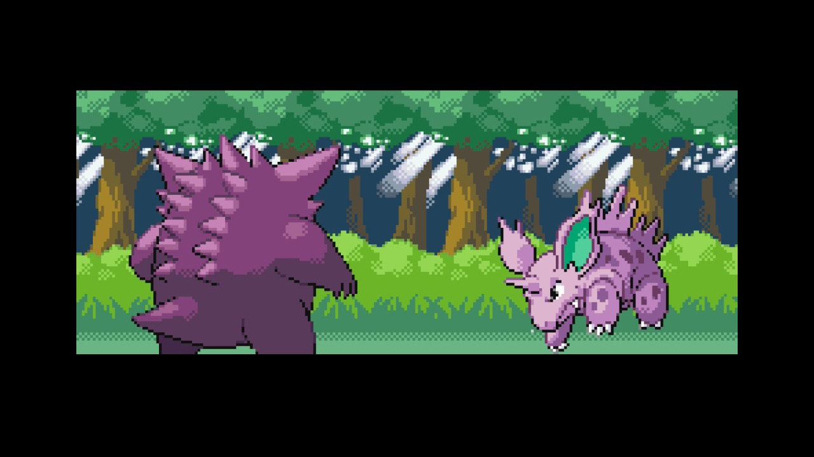
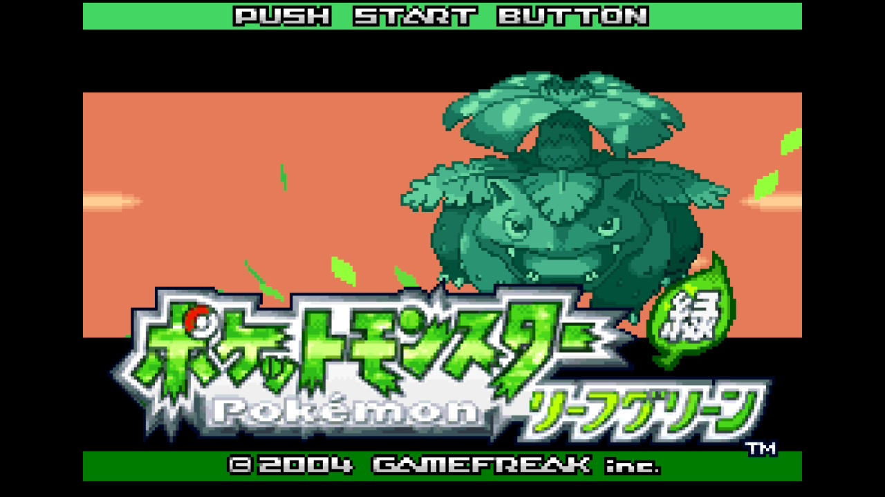
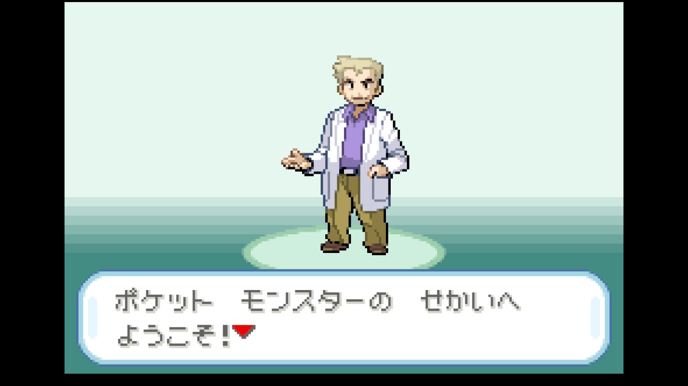

- ゲーム開始！プレイヤー名「たかなみと」、ライバル名「シゲキ」でスタート

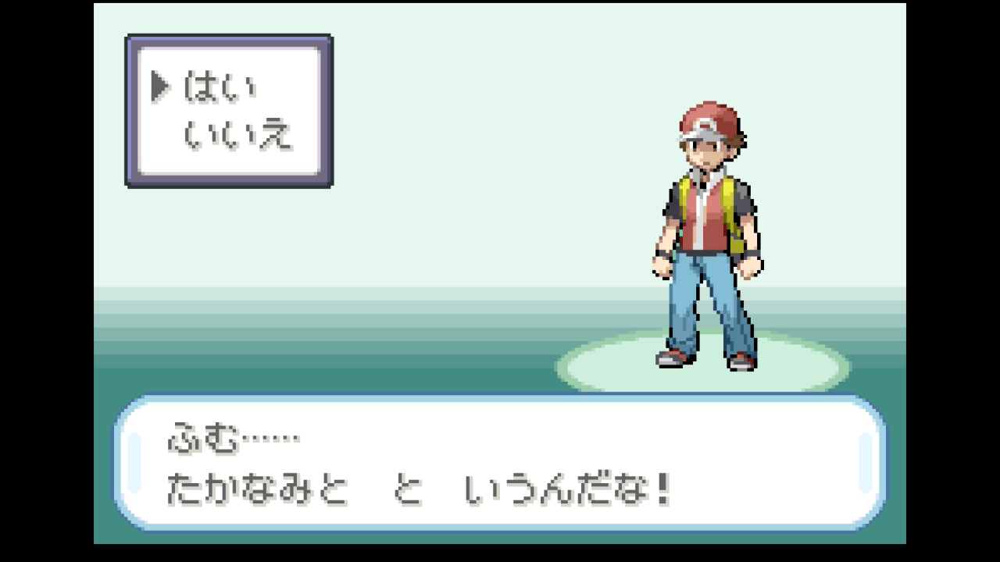
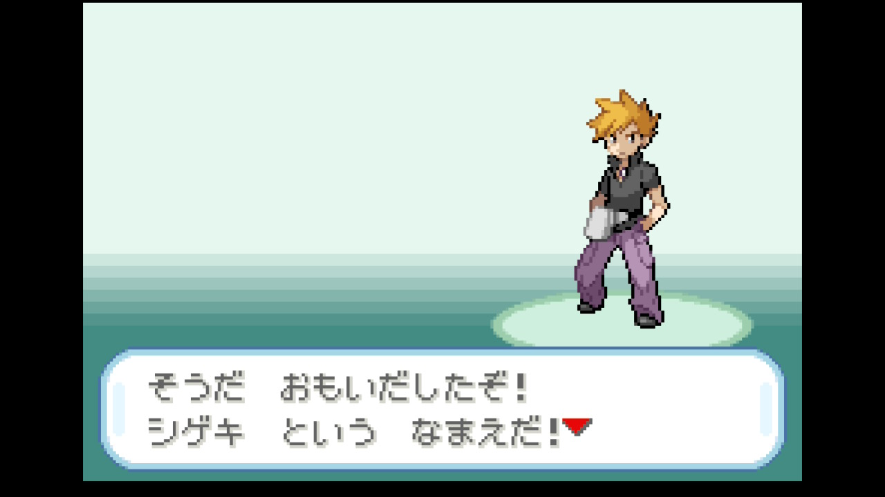

takanamito がライバル名を「シゲキ」に設定。これからこのシゲキとの長い戦いが始まる。

### ゼニガメ選択

- オーキド研究所でゼニガメを選択（フシギダネ・ヒトカゲは見送り）

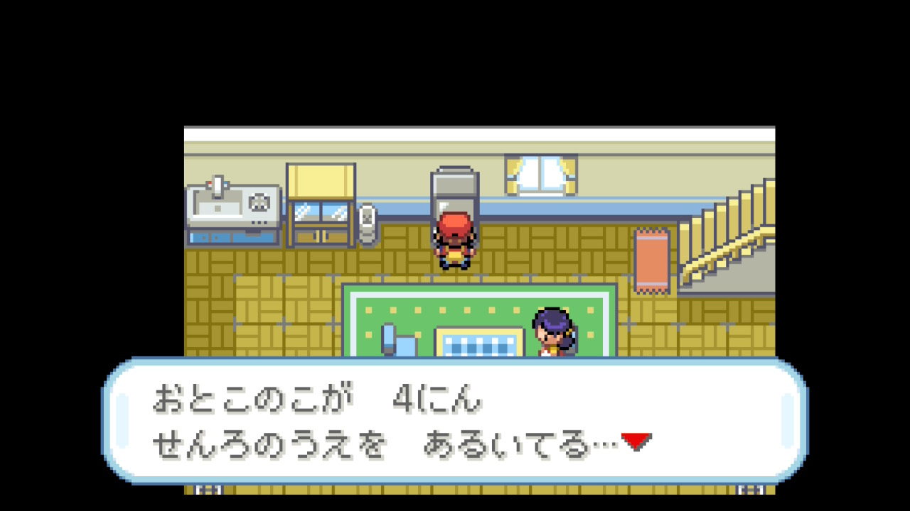
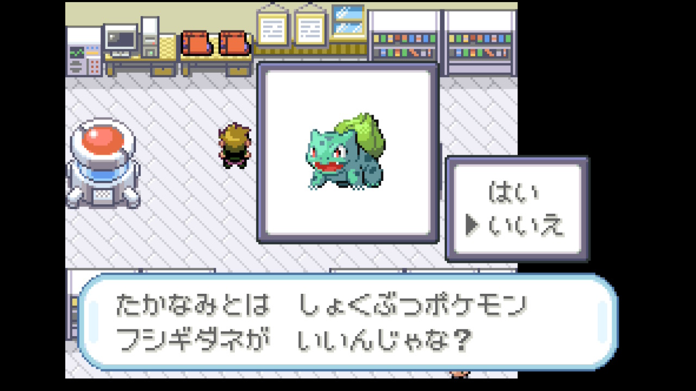
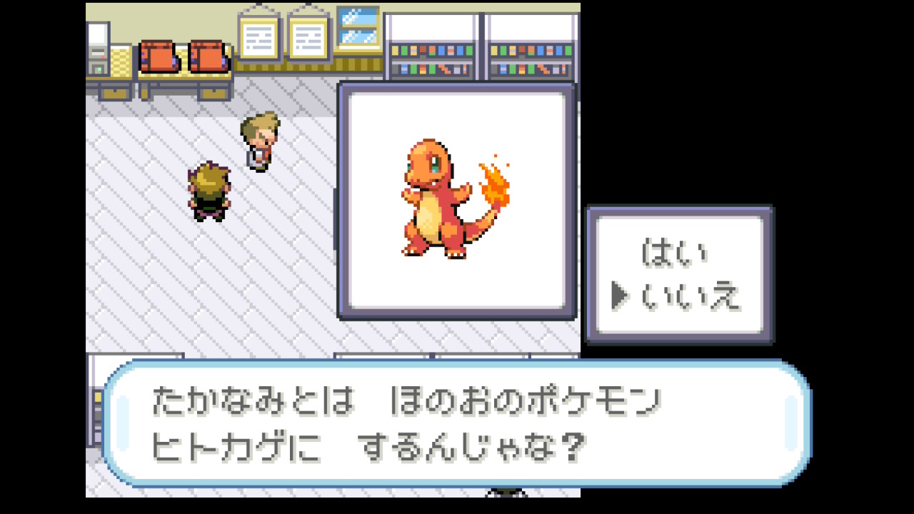

Claude が「ゼニガメでいこう」と即決。最速殿堂入りにはゼニガメの安定感が最適という判断。takanamito もフシギダネ・ヒトカゲを断り、迷いなくゼニガメを選択した。

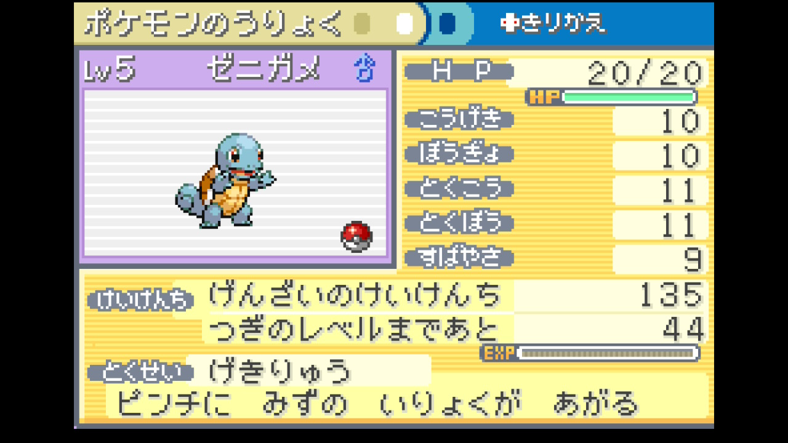
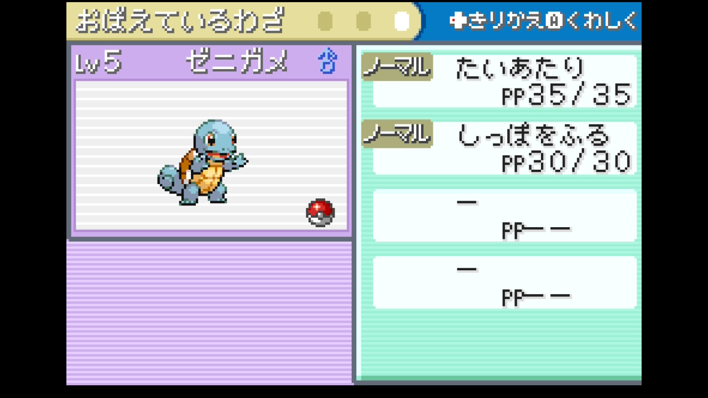

- ポケモンにニックネームはつけない方針

ニックネームをつけるかどうかの相談で、つけない方針に決定。シンプルにいこうという意見が一致した。

- ライバル・シゲキとの初バトル（フシギダネ Lv5）にたいあたり連打で勝利
- ゼニガメ Lv5 → Lv6 に成長

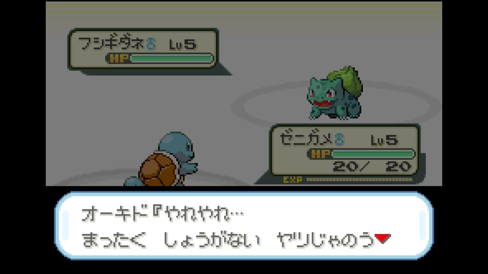
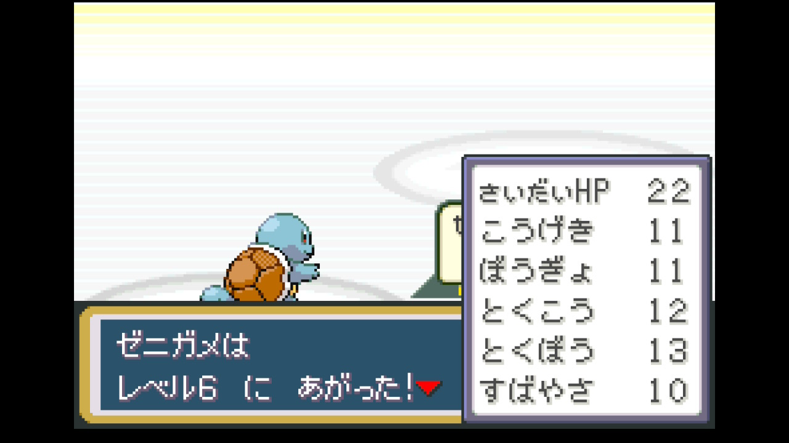

序盤のライバル戦はたいあたり押し切りでOK。タイプ相性よりレベルとゴリ押しが有効。ライバル戦はたいあたり連打で問題なく勝利し、序盤のゴリ押し戦略が機能することを確認できた。幸先の良いスタート。

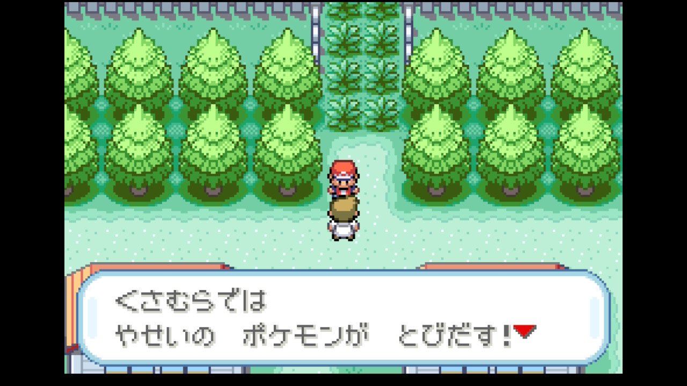
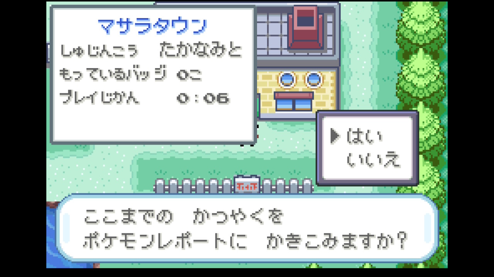

## パーティ編成

| ポケモン | Lv | 技構成 |
|---------|-----|--------|
| ゼニガメ | 6 | たいあたり / しっぽをふる |

## 次の目標

- 1番道路を北に進んでトキワシティへ向かう
- オーキド博士のおとどけものイベントをこなす

## プレイ時間
0:06
