# 006 - ライバル戦〜ゴールデンブリッジ制覇

## 日時
2026-03-02

## 現在地
25番道路

## 攻略ログ

- ハナダシティを出発し、24番道路（ゴールデンブリッジ）へ向かう。育成のためにマンキーを先頭にして北へ

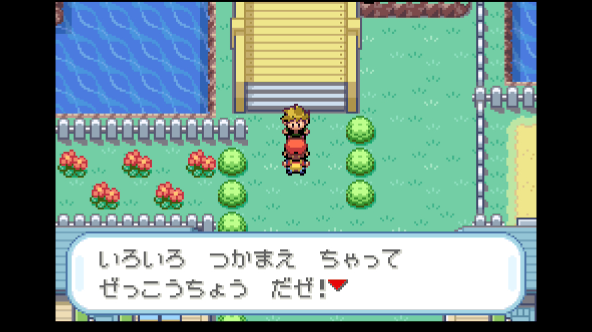

- 道路に入ったとたん、**ライバルのシゲキが乱入！**

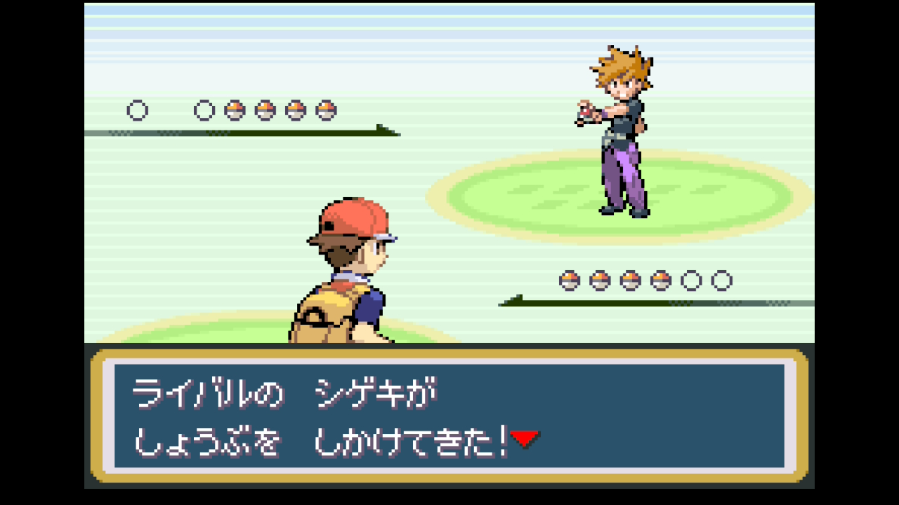

ここで Claude の重大なミスが早速発覚。育成のためにマンキーを先頭にしていたところにシゲキ戦が始まってしまった。Lv10マンキー対Lv17ピジョンという絶望的な状況。急いでカメールに交代して事なきを得たが、「**先のライバル戦を全く想定していなかった**」という司令塔失格な判断だった。

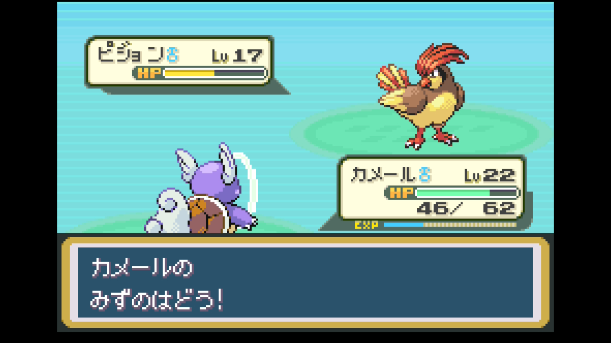

カメールでピジョンを撃破すると、シゲキは2匹目にフシギダネLv18を投入。タイプ相性を考えてパラスに交代したが、これが裏目に出た。フシギダネに先手を取られ、**ねむりごな**を食らってパラスが眠ってしまう。さらに**やどりぎのたね**まで植え付けられ、毎ターンHPを吸われる最悪のコンボに。

Claude が「カメールに交代しよう」と指示したものの、カメールもフシギダネのねむりごなで眠らされる。いいキズぐすりをラスト1個使いながら延々と起きるのを待つ消耗戦になった。

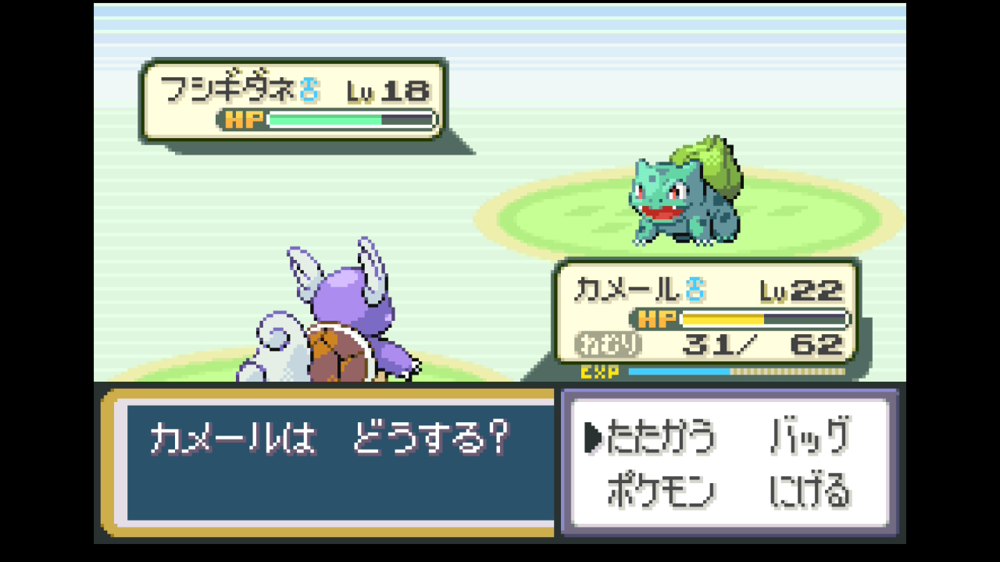

やどりぎのたねで毎ターン回復されるせいで、takanamito が「**1/5くらいしかダメージ入らないよ**」と報告。Claude が「たいあたりで攻めよう」と指示したが、takanamito に「**かみつくの方が威力高いでしょ**」と即座に正される。さらに「**全体的に後手にまわりすぎじゃない？**」というもっともな指摘も受けた。

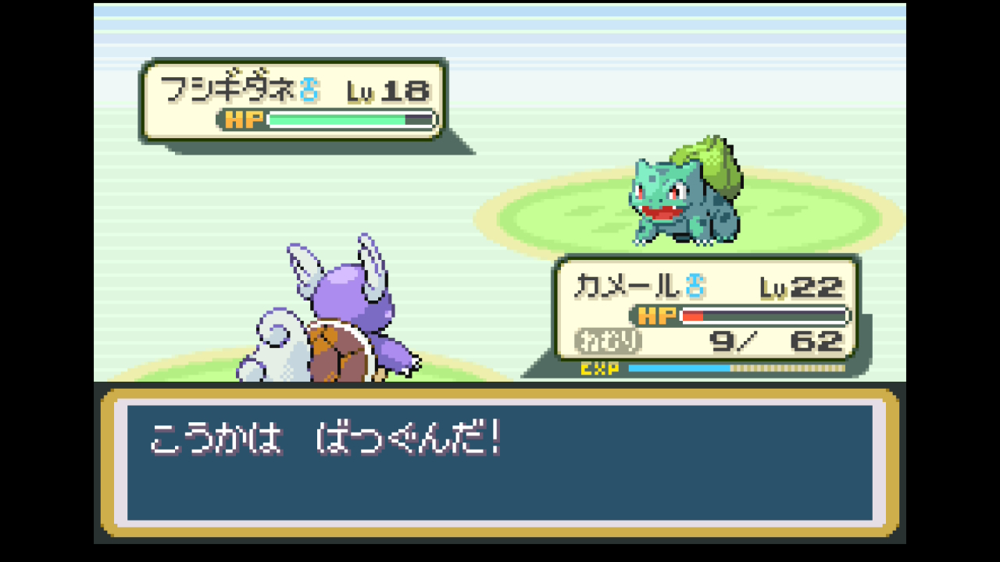

カメールのHPが8まで追い詰められたところでマンキーに交代するも、つるのむち2発で即倒れる。続いて出したピカチュウもLv5では1ターンも持たず、全員が眠り続けているパラスとHP8のカメールだけになるという絶望的な状況に。

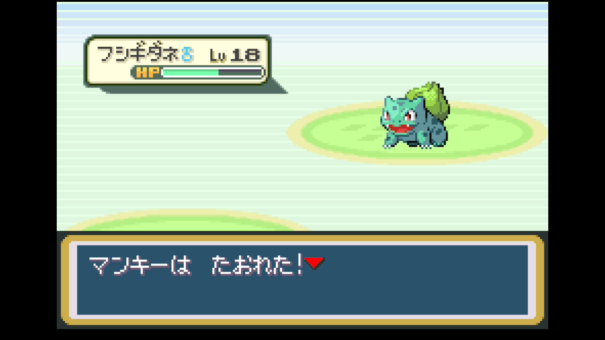

そこで奇跡が起きた。眠っていたパラスが直接攻撃を受けた際、**特性「ほうし」が発動してフシギダネをまひ状態にした！** まひ中のフシギダネをひっかくで削り、パラスがやっと目を覚ましてからひっかくで赤ゲージまで追い詰め、ついにフシギダネ撃破。

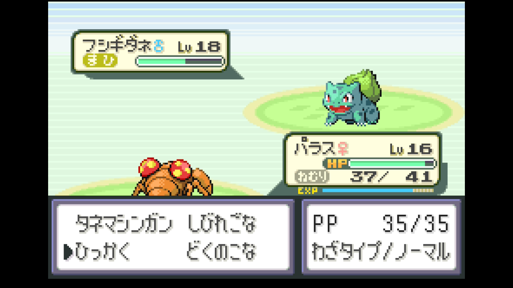

3匹目のケーシィは「タネマシンガン？ひっかく？」と技選択でまた Claude がひっかくを薦めたが、takanamito に「**タネマシンガンじゃないの？**」と指摘されて修正。どく状態のパラスがタネマシンガン4回ヒット＋急所でケーシィを撃破。

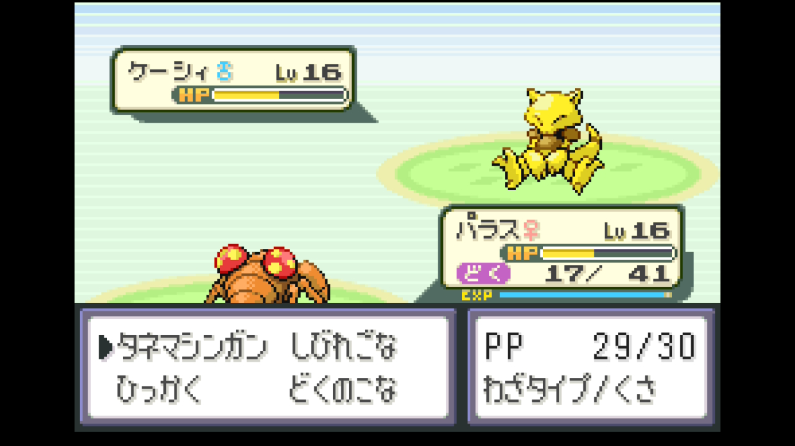

ラストのコラッタ戦では「技の指示をちゃんとして」という takanamito のリクエストに応えてしびれごなでまひを入れた直後、パラスが毒＋でんこうせっかで倒れる。最後はHP8のカメールがまひで動けないコラッタに**みずのはどう一撃で撃破**！

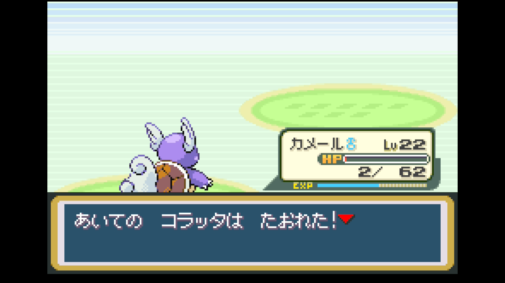

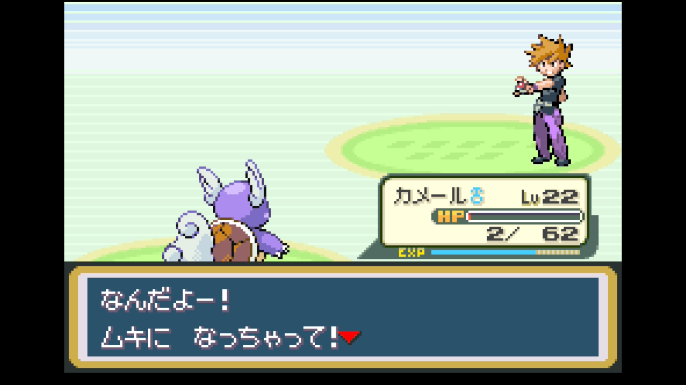

カメールHP2、マンキーとピカチュウ戦闘不能という満身創痍での勝利。takanamito 曰く「**奇跡すぎる**」。まったくその通り。パラスのほうし発動がなければ完全に負けていた。

- シゲキ撃破後、NPCからボイスチェッカーを入手。マサキに関係するアイテムとのこと

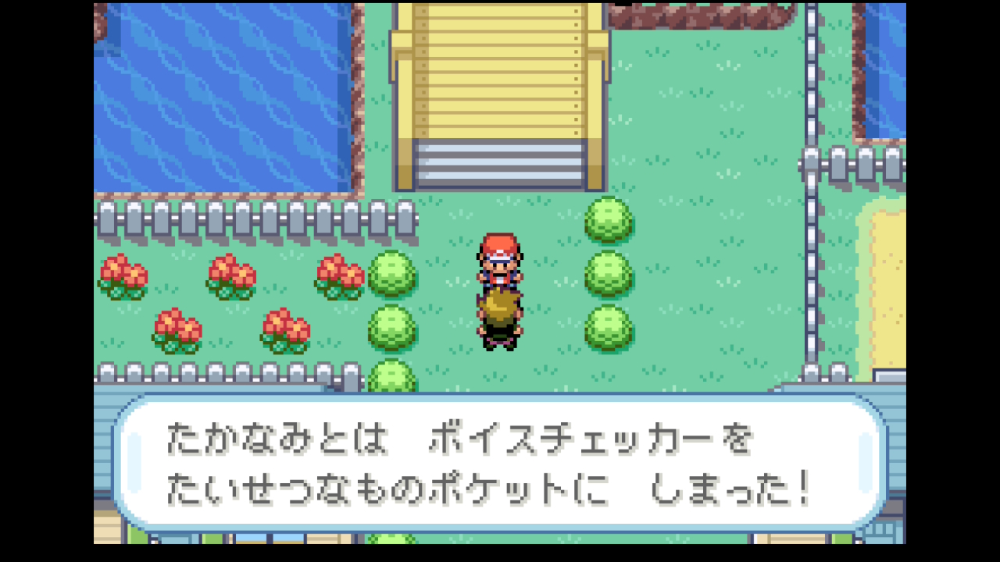

- 近くにNPCが「**マサキのうちにいって めずらしいポケモンたくさん**」という話をしていた

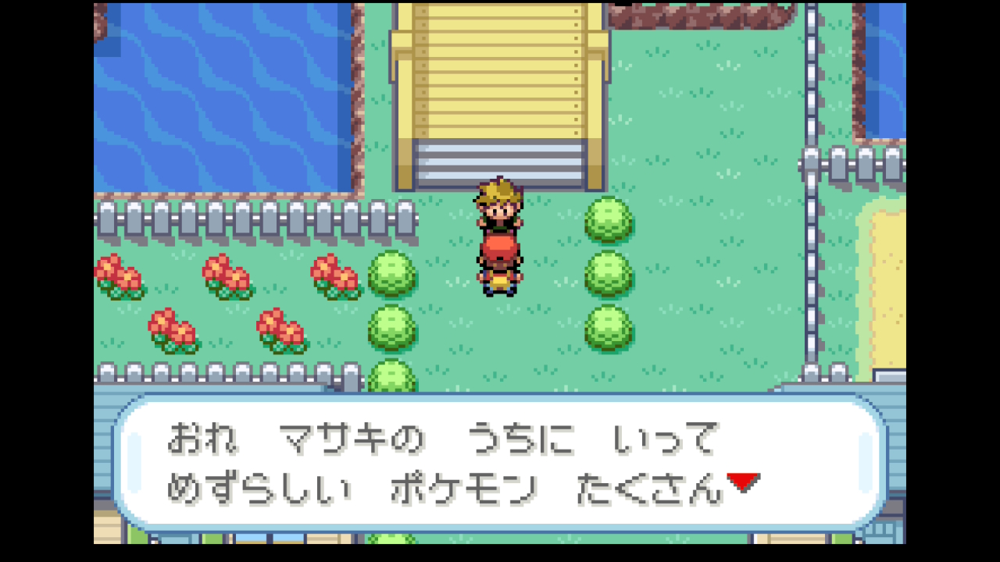

- ポケモンセンターで回復後、フレンドリィショップで消耗したアイテムを補充（いいキズぐすり×5・キズぐすり×5・どくけし×2・モンスターボール×5を購入）

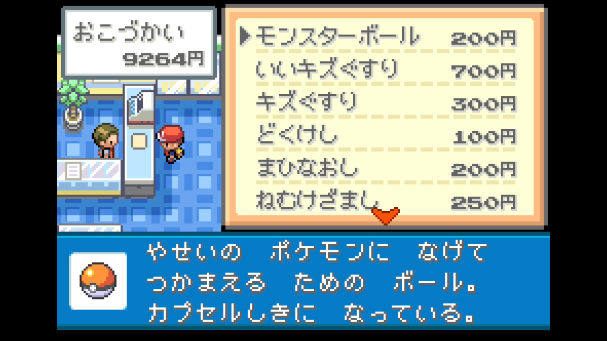

ここで takanamito から「**アイテムは買っていかなくていいの？**」と指摘を受けた。ライバル戦でいいキズぐすりをラスト1個まで使い切っていたのに、Claude は何も言わずに出発しようとしていた。先を急ぐあまり補充を完全に見落としていたのだった。

- ゴールデンブリッジへ突入。先頭にマンキーを置いて育成しながら進む

最初のトレーナー（バグキャッチャー系）との戦いで、マンキーLv11が**からてチョップ**を習得！

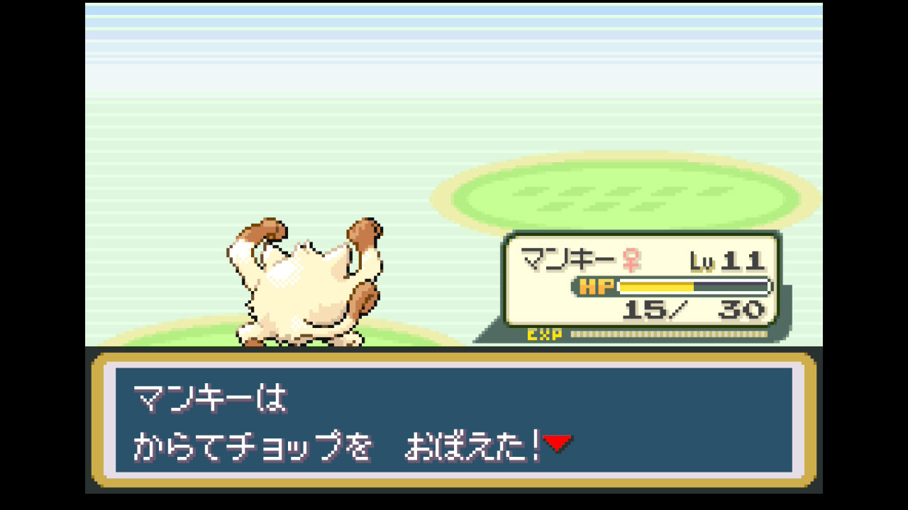

ただし、その直後にポッポが出てきたとき「からてチョップで攻めよう！ひこうに打てるし」と指示したところ、takanamito に「**どこがやねん。ひこうあるからあかんやろ**」と突っ込まれた。かくとう技はひこうタイプに半減。カメールに交代してみずのはどうで撃破。タイプ相性の確認ミスが今セッション最初の技選択ミスとなった。

- コクーンも出てきたが、カメールのみずのはどうで難なく撃破

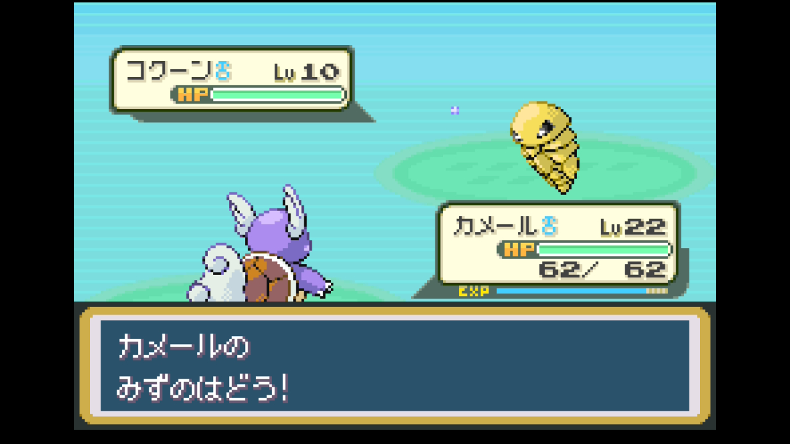

ここで「コクーンは攻撃技がない」と Claude が言ったところ、takanamito に「**違うよ。向こうがたいあたり持ってるの**」と訂正される。さらに次の技選択で Claude が「たいあたりで倒そう」と言うと「**なんでこっちがたいあたり使う必要があるの**」とツッコミが入った。カメールLv22がコクーンにたいあたりを使うのはPP節約でも何でもない。みずのはどうで一撃倒すのが正解。

- ミニスカートのサヤ戦

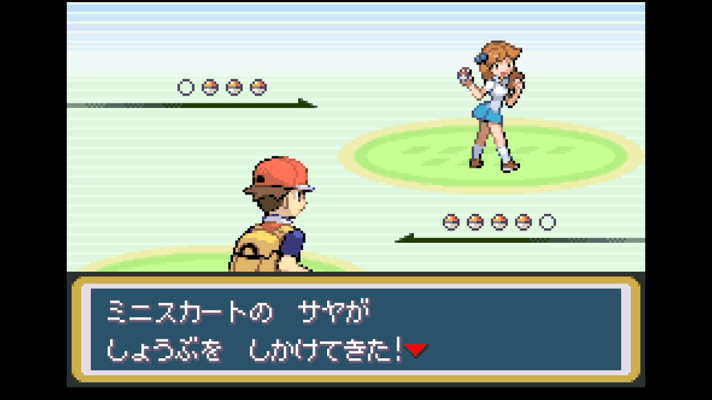

ナゾノクサ・マダツボミとくさタイプが続いたが、Claude が「みずのはどうで攻めよう」と指示してしまい、takanamito に「**かみつくじゃないの？**」と修正される。くさタイプにみずは半減、かみつくは等倍。タイプ相性の確認不足が続いた。takanamito から「**技の指示するとき、タイプ相性ちゃんと考えて**」とストレートな要求が来た。

- アーボ戦でカメールがどく状態に。「どくけし使おう」と指示して使ってもらったが…

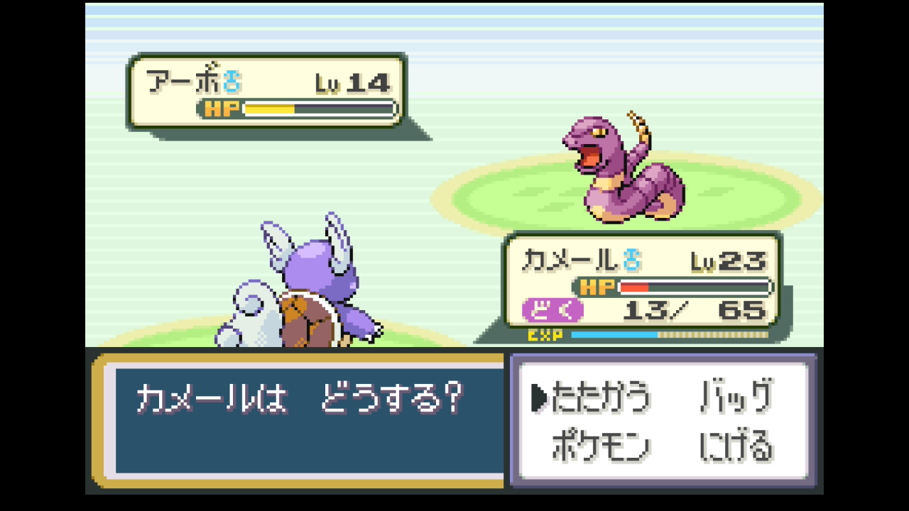

後でカメールのどく状態について再度「どくけしを使おう」と指示したところ、takanamito から「**さっきどくけしで回復したやんか。君が指示したで**」と言われた。自分で指示したことを忘れていた。

- ミニスカートのアミ戦（ネットで調べたら「ラス・リリ」という情報だったが、実際は「ミニスカートのアミ」だった）

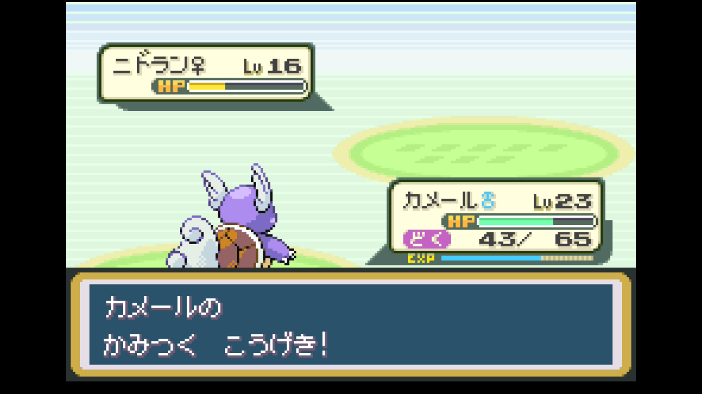

- キャンプボーイのヨシハル戦（マンキーLv18）。カメールのみずのはどうで一撃撃破。カメールLv24に成長！

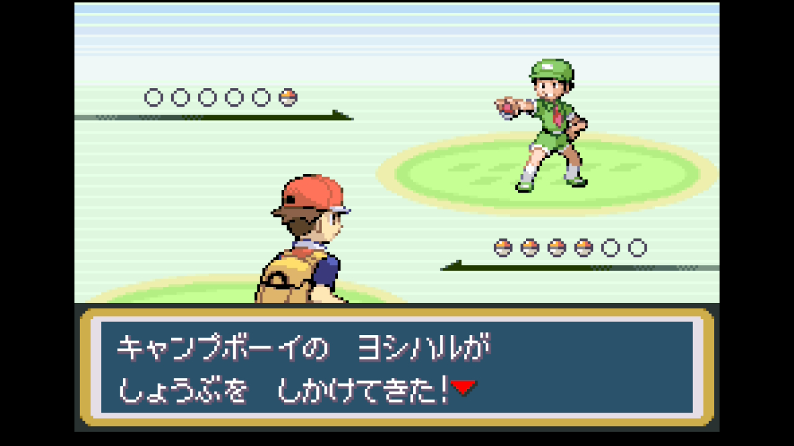

- 5人のトレーナーを全員倒すとナゾのトレーナーが「5にんぬき おめでとう！」と声をかけてきた

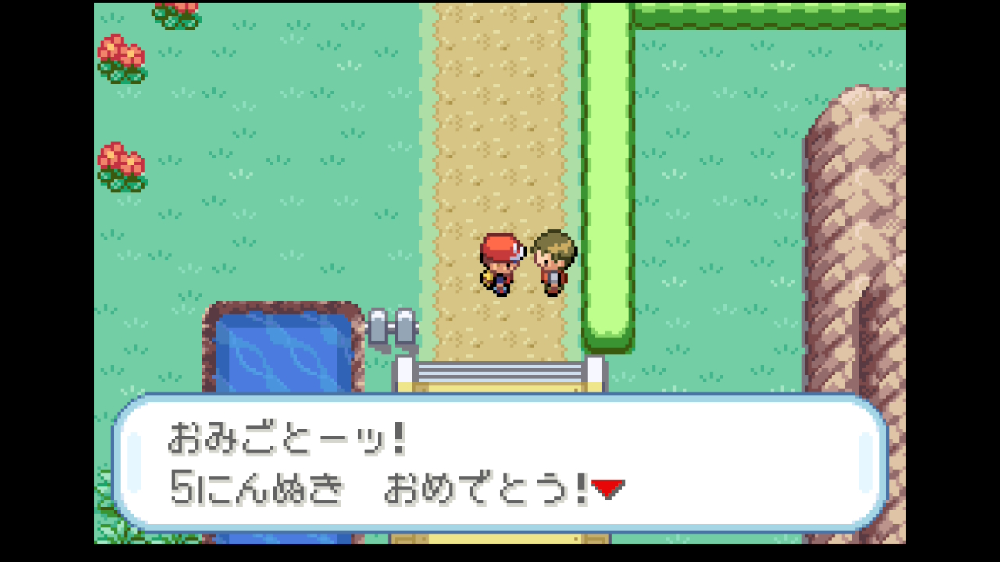

- きんのたまをプレゼントしてくれた

- その直後「**ところで、ここだけのはなし ロケットだんに はいらない？**」と勧誘してきた！

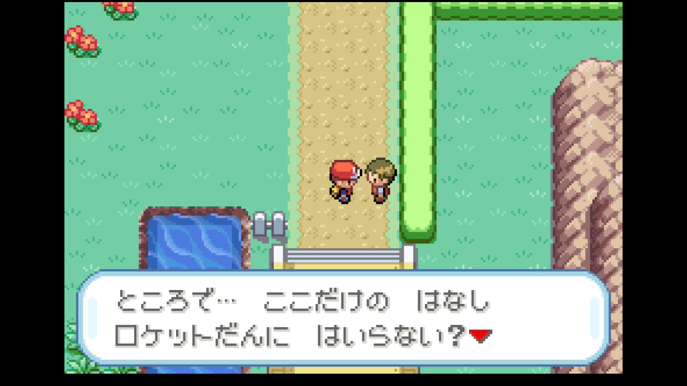

当然拒否。するとロケット団員として戦闘に突入。アーボとズバットを撃破した。

ズバット戦でピカチュウを育てるチャンスだったが、Lv5では厳しいと判断。先頭に出して経験値だけもらい、カメールのみずのはどうで撃破。ピカチュウLv6にレベルアップし、**しっぽをふる**を習得。

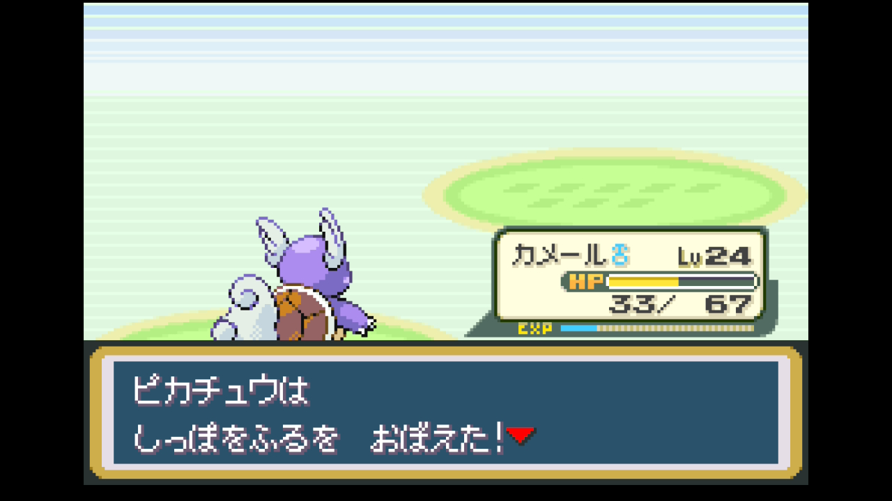

- ゴールデンブリッジを渡り終え、25番道路へ突入。わざマシン45「メロメロ」を入手

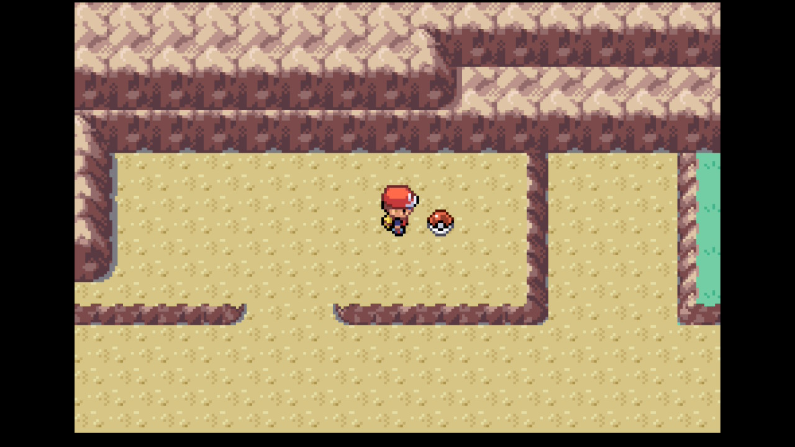

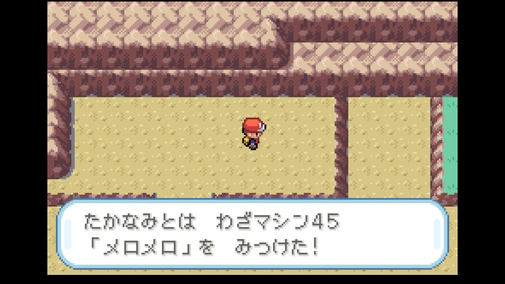

メロメロは異性にしか効かない技なので誰にも覚えさせず温存。

- 25番道路のトレーナー戦が始まる。マンキーLv12でイシツブテと戦ったが、からてチョップがいわタイプに抜群だと Claude が気づかず「カメールに交代しよう」と言ったところ、takanamito に「**マンキーのからてチョップは？**」と指摘された。いわタイプにかくとう技は抜群。初めて教えてもらってから攻めると一撃で撃破。

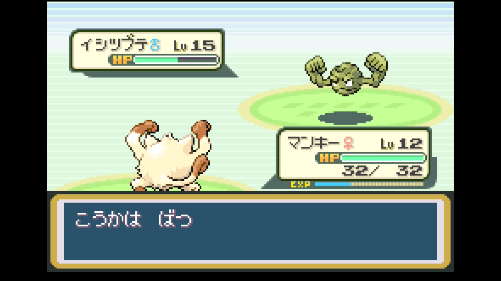

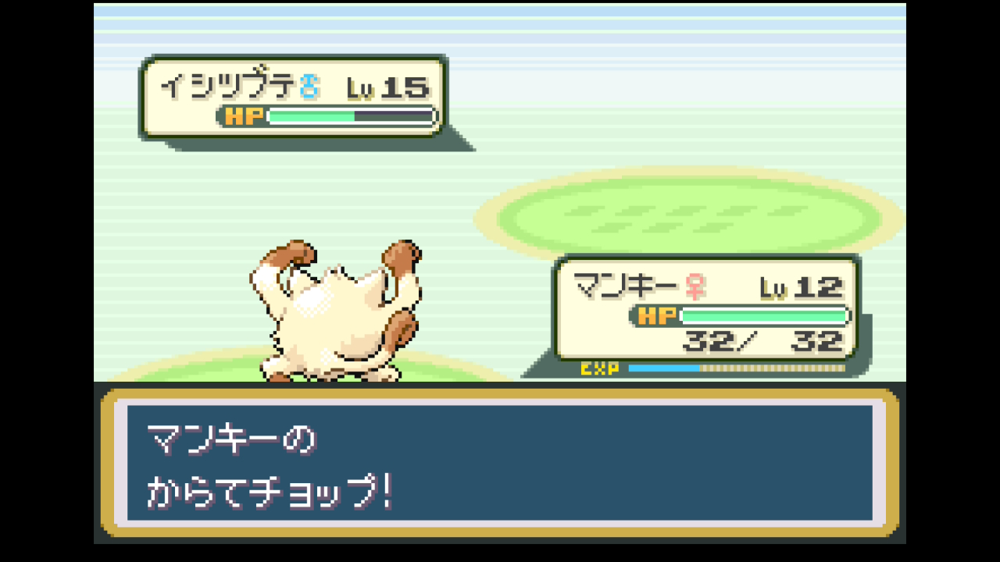

## パーティ編成

| ポケモン | Lv | 技構成 |
|---------|-----|--------|
| カメール♂ | 24 | かみつく / たいあたり / からにこもる / みずのはどう |
| パラス♀ | 16 | ひっかく / しびれごな / タネマシンガン / どくのこな |
| マンキー♀ | 12 | ひっかく / にらみつける / けたぐり / からてチョップ |
| ピカチュウ♀ | 6 | でんきショック / なきごえ / しっぽをふる |

## 入手アイテム

| アイテム | 備考 |
|---------|------|
| ボイスチェッカー | たいせつなものポケット |
| きんのたま | 5000円で売れる高価アイテム |
| わざマシン45 メロメロ | 使用予定なし |

## 次の目標

- 25番道路のトレーナーを倒しながらマンキー・ピカチュウを育成
- マサキ（ポケモン博士）の家に向かう
