# 008 - サントアンヌ号攻略〜クチバジム制覇

## 日時

2026-03-04

## 現在地

クチバシティ（クチバジム制覇後）

## 攻略ログ

- 攻略再開。サントアンヌ号船内は回復NPCで全員回復してからスタート。育成対象をマンキー（Lv16）に定め、先頭に置いて進む。

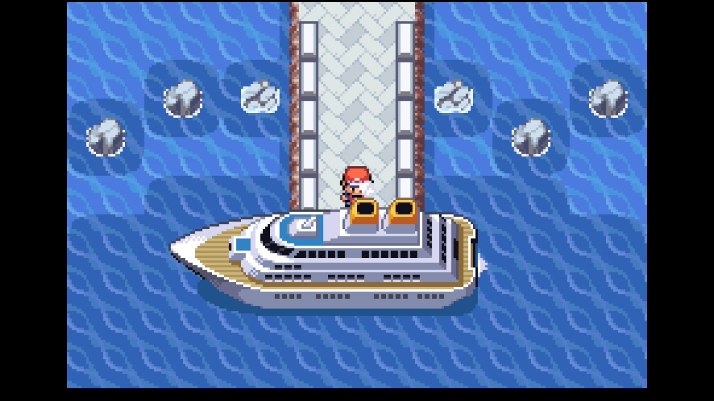

- **つりびとタカフミ**戦（2F）。トサキント×2・メノクラゲ。Claude が「あなをほる（じめん）はみずにばつぐん」と宣言したところ、takanamito から「**等倍っぽいよ**」と報告が。確認するとじめんはみずに等倍だった。**またタイプ相性ミス**。スキル整備直後、最初のバトルでやらかした。あなをほるの実効威力80は変わらず最大火力なので継続したが、ばつぐんを宣言した点が完全に間違いだった。

マンキーがトサキントの「つのでつく」で大ダメージを受け、HP11/29になったため途中でカメールに交代。メノクラゲも含めてカメールで処理。その後パラスを出したところ、メノクラゲのしびれごなで混乱・HP9まで削られ、カメールに再交代して突破。

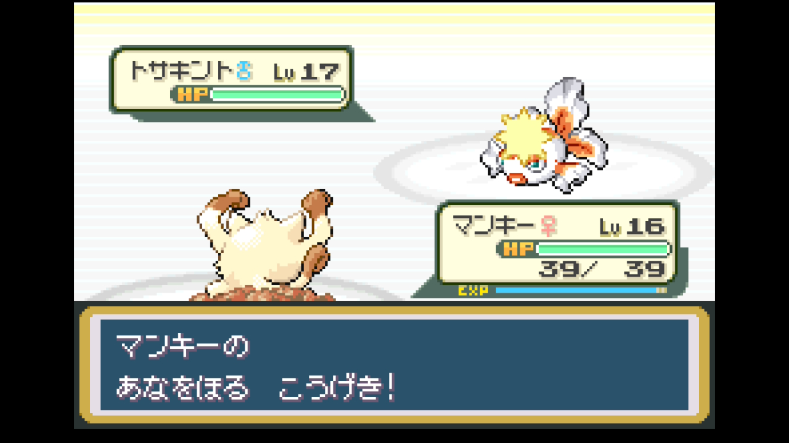

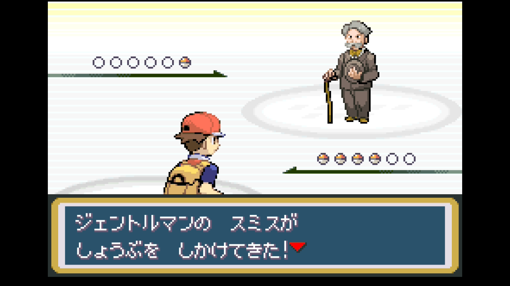

- **ジェントルマン・スミス**戦（2F）。ピカチュウLv23（でんき）。マンキー先頭であなをほるを使ったが、「たたきつけ」を食らってHP残り8。「すばやさで勝てないから次の技でやられそう」という報告が来たため、パラスに交代。くさ/むしタイプはでんきを半減で受けられる利点を活かした判断。でんじはを食らって麻痺したものの、最終的にカメールで突破。

- **ミニスカート・ユカ**戦（2F）。コラッタLv18（ノーマル）・ピカチュウLv18（でんき）。コラッタはカメールのみずのはどうで、ピカチュウはマンキーのあなをほる（ばつぐん）で一撃。カメールが**Lv28**にレベルアップ！

- **ジェントルマン・パーカー**戦（2F）。ガーディLv17・ポニータLv17（ほのお）。カメールのみずのはどうがほのおにばつぐんで、2体とも一撃撃破。

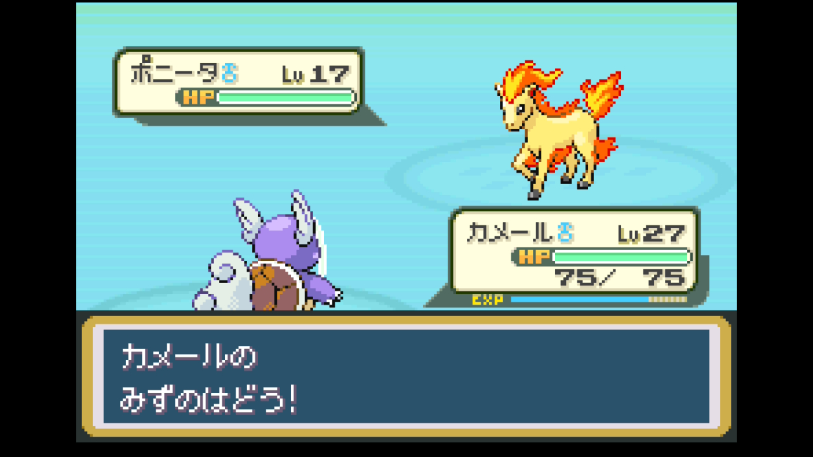

- 2F終了後、1Fに戻って回復NPCで全員全快。残りの1Fトレーナーも消化する流れになった。

- **ミニスカート・カヤ**戦（1F）。ポッポLv18（ノーマル/ひこう）・ニドラン♀Lv18（どく）。ポッポはじめんがこうかなし・かくとうが半減なのでカメールに交代。ニドラン♀はマンキーに戻してあなをほる（じめん→どくばつぐん）で撃破。タイプを考慮した交代が決まり、takanamito から「**ナイス指示**」をもらった。珍しい。

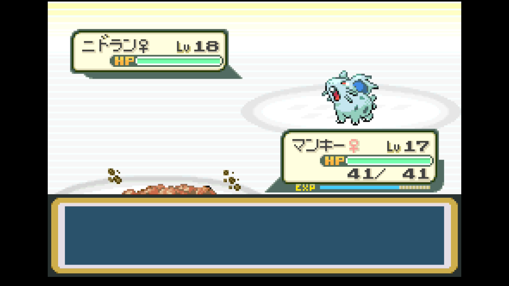

- **たんぱんこぞう・マサノブ**戦（1F）。ニドラン♂Lv21（どく）。レベル差5でやや緊張感があったが、マンキーのあなをほる2ターンで撃破。どくのとげで毒を受け、HP5/41まで削られた。

- ここで**わざマシン31（かわらわり）**を発見・入手。かわらわりはかくとうタイプ威力75で、マンキーのからてチョップ（威力50）より大幅に強い。からてチョップを忘れさせてかわらわりと入れ替えた。

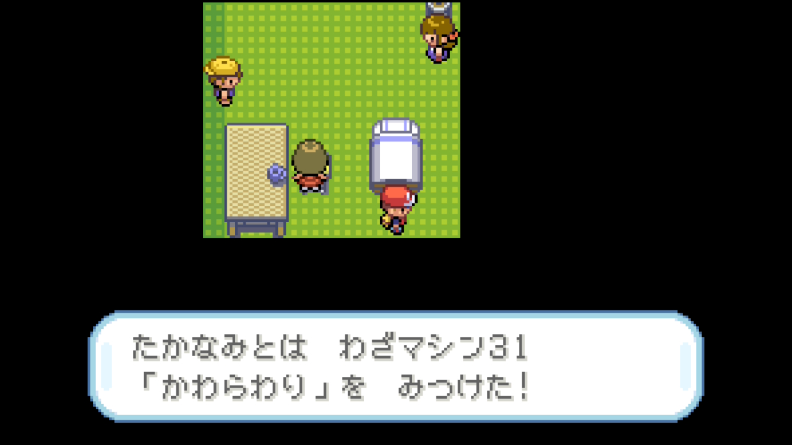

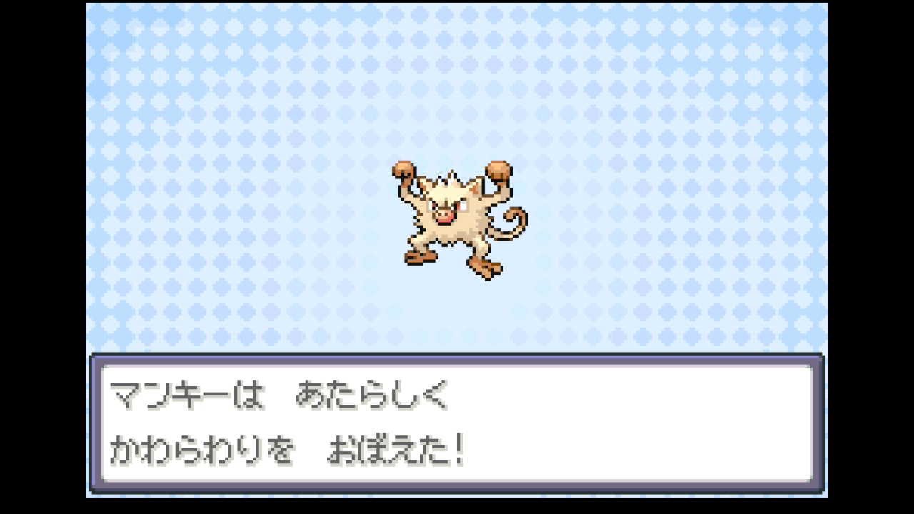

**マンキーの最終技構成: みだれひっかき / けたぐり / かわらわり / あなをほる**

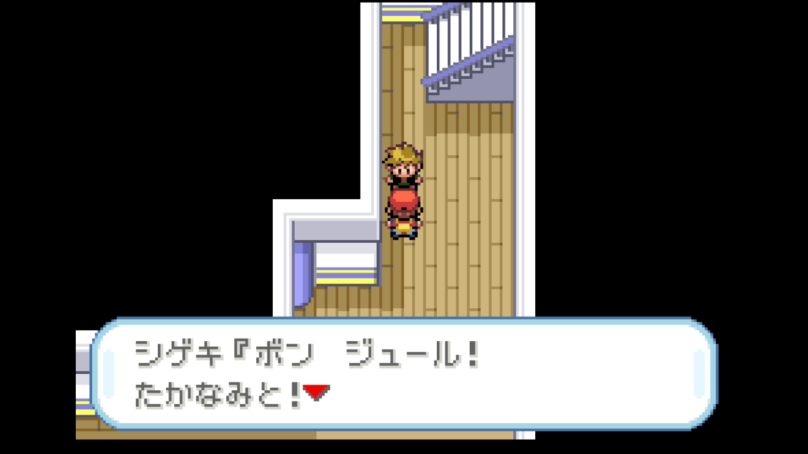

- いよいよ**ライバル・シゲキ**戦。全員全快で挑む。

ピジョン→フシギソウ→ラッタ→ユンゲラーの順。カメールが主戦力として奮闘。

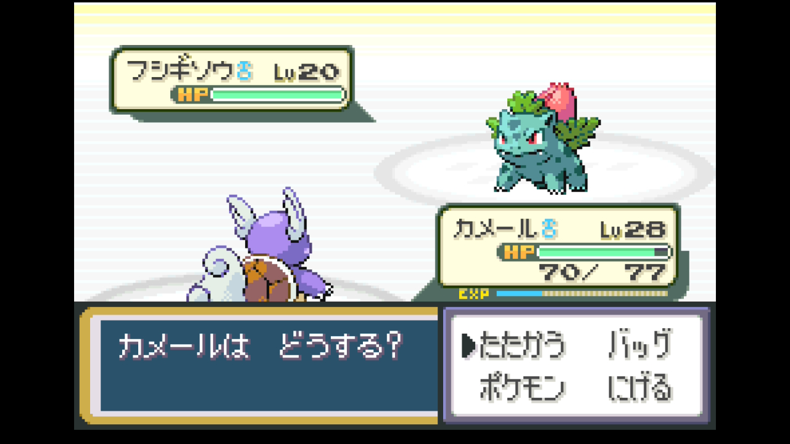

フシギソウはみずのはどうがくさに半減なのでかみつく（等倍）で対処。ユンゲラーにはかみつく（あく→エスパーにばつぐん！実効120）が炸裂するはずが……混乱を食らってHP16/77まで削られる危機的状況に。いいキズぐすりで回復し、かみつくを打ち続けて辛くも勝利。「すばやさで後攻だけどギリ耐えて勝った」という綱渡り。

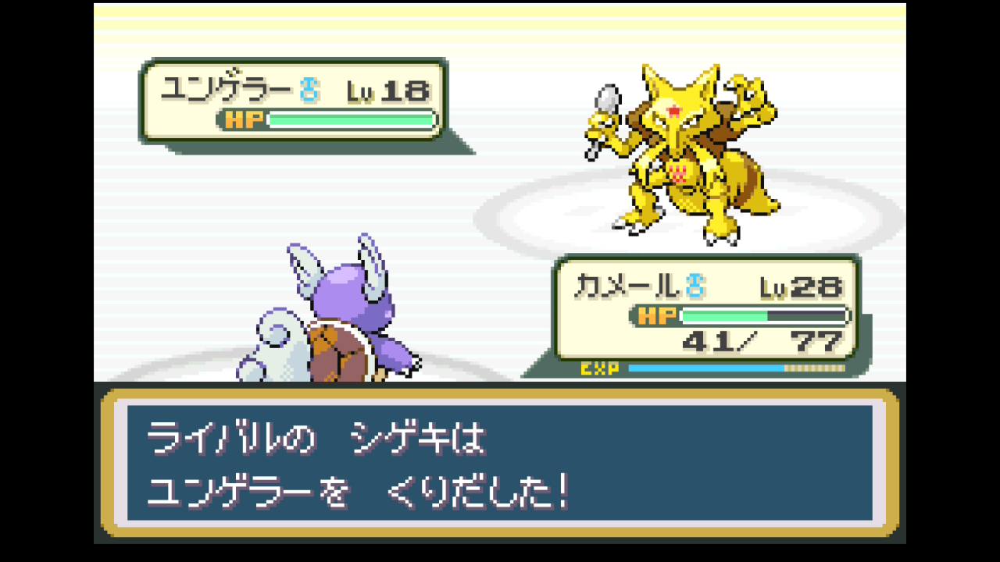

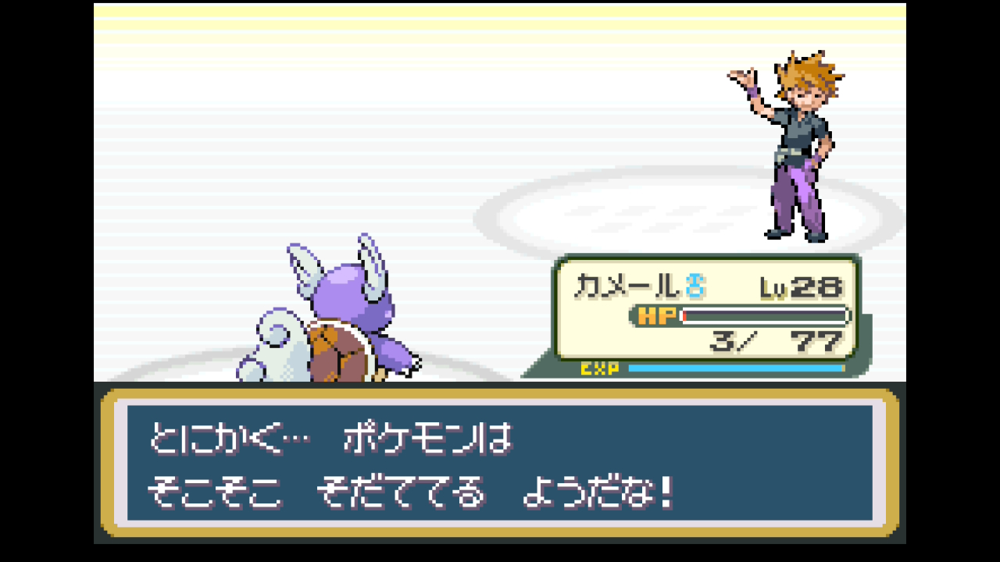

- **船長室へ**。船長が船酔いでぐあいわるそうな顔をしているのを発見。背中をさすると感謝され、**ひでんマシン01（いあいぎり）**を入手！

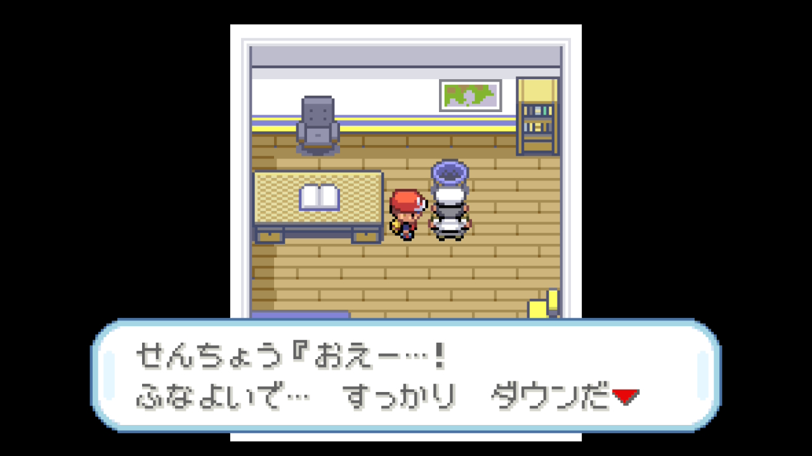

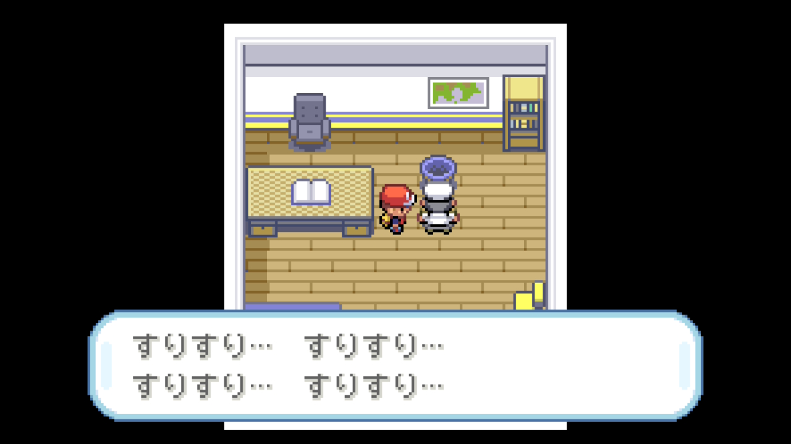

- 地下1階の攻略を開始。みずタイプが多いのでパラスの育成チャンスと判断して先頭に。

**ふなのり・ヒデフミ**戦。タッツー・シェルダー・メノクラゲ。序盤のタッツー・シェルダーはパラスのタネマシンガンで撃破。途中でパラスが**Lv19**にレベルアップ！きゅうけつを覚えようとしたが、威力20と弱いため不採用。今の技構成を維持。

メノクラゲに対してClaude が「タネマシンガンで攻めよう」と指示を出したが、タネマシンガンのダメージがほとんど入らないという報告が。よく考えるとメノクラゲはみず/どくの複合タイプで、くさ→みず（ばつぐん×2）とくさ→どく（半減×0.5）が相殺されて等倍になる。**スキル整備したのに同日中に同じ種類のミスを繰り返した**。takanamito は「**全然ダメージ入らん**」と一言。パラスが瀕死になったためマンキーに交代、あなをほる（じめん→どくばつぐん）で倒した。

- 回復後、地下1階の残りトレーナーを掃討。**ふなのりサンジ**戦では、トレーナー名を見た takanamito が「**ふなのりのサンジ！！あのサンジ？**」と反応。ワンピースのサンジと同名で盛り上がった。しかし**カツのワンリキーにきゅうしょの一撃**を食らってポケモンが沈黙。「**あー、きゅうしょで死んだ**」の一言でバトルが締め括られた。その後カメールに交代してシェルダーを撃破し、地下1階完攻。

- B1Fの全トレーナーを掃討してサントアンヌ号から下船。船が静かに出港していく。

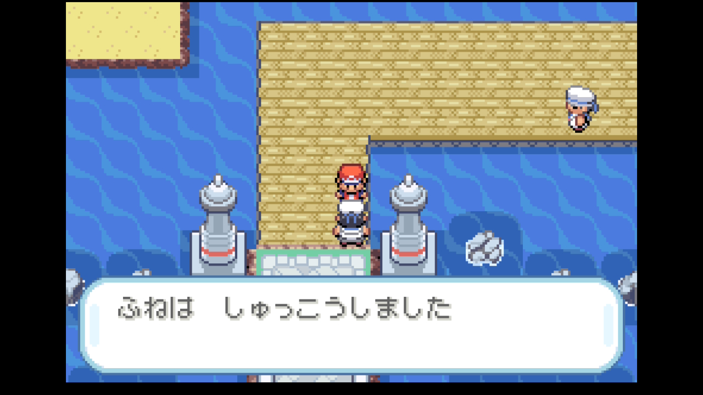

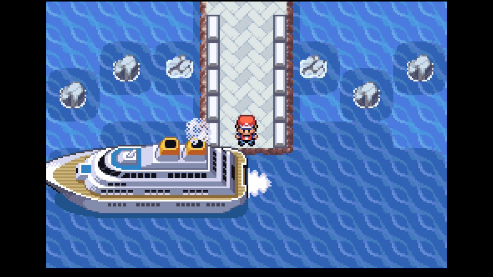

- クチバシティのポケモンセンターで全員全快。次の目標はクチバジム（でんきタイプ）なので、**マンキーのあなをほる（じめん→でんきばつぐん）**が切り札になると確認。マンキーはLv16とまだ低く、育成が必要と判断。

- **6番道路でマンキーの育成**。「6番道路ってどこ」という takanamito の質問に答えてルートを案内。道中でニャースが出現したが捕獲はせず、ひたすらバトルでマンキーを鍛えた。**マンキーがLv19**に、**ピカチュウもLv9**に成長。

- **クチバジム到着**。いあいぎりで木を切り進入できるジムなので、まず「いあいぎりを誰に覚えさせるか」が課題に。Claude がピカチュウに教えようとしたが、「**ピカチュウはいあいぎりおぼえられない**」と takanamito に報告され玉砕。カメールを試みるも「**あかんがな**」と撃沈。最終的に**パラスが習得できる**ことが判明し、ひっかくを忘れさせてパラスにいあいぎりを習得させた。

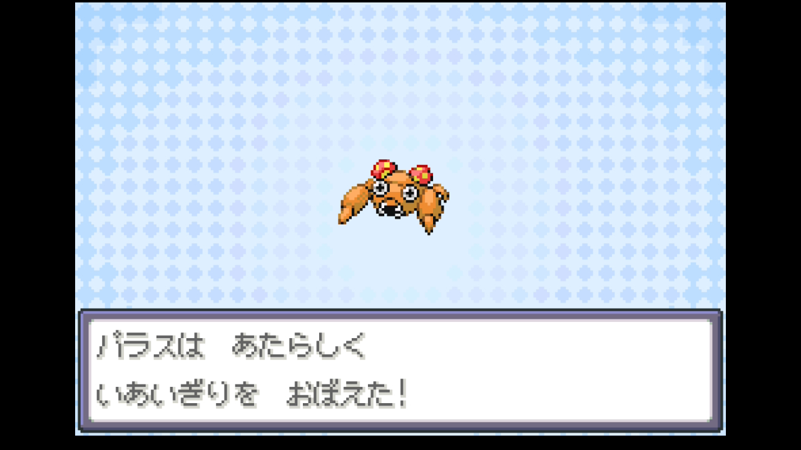

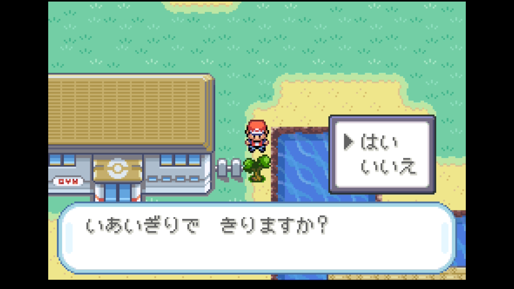

- ジム内のトレーナー戦を開始。**フミオのビリリダマ**戦で**でんじはでまひ**を食らったが勝利。マンキーが**Lv20**にレベルアップ。ただし**まひなおしが尽きていた**ことが発覚し、一度ポケモンセンターへ戻って回復。

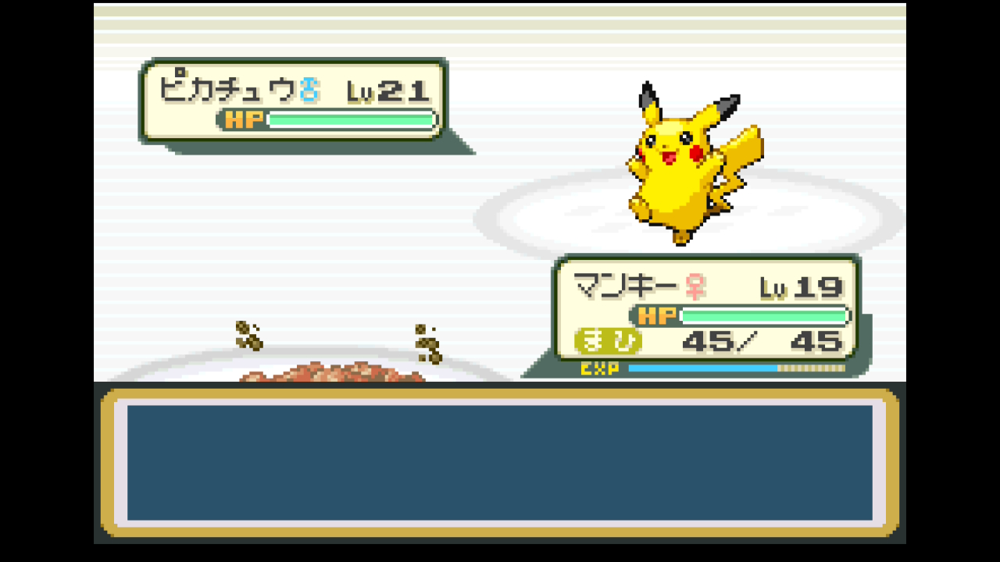

- 次のトレーナー戦で再び**スパークでまひ**を食らいHP9まで追い詰められる。続く**コイル**戦でパラスの**いあいぎり（ノーマル→はがね）がいまひとつ**で苦戦したが、いいキズぐすりを使いながら撃破。

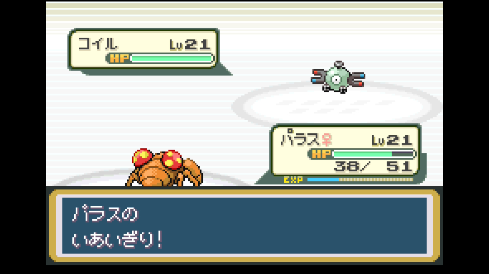

- 全トレーナーを倒す前に買い物を済ませた: まひなおし×5、いいキズぐすり×4、どくけし×2。

- **ジムのなぞとき（ゴミ箱パズル）**。クチバジムの名物、並んだゴミ箱の中に隠されたスイッチを2つ見つけて扉を開けるパズル。「ガサゴソ…！なかはゴミばっかり！」を何度も繰り返しながら探索し、クリア。

ちなみにパズル攻略中、ファイアレッドをプレイ中の奥さんから突然「**タマムシシティのゲームコーナーのスロット、どこが一番当たりやすい？**」と質問が飛んできた。Claude が「台によって当たり確率が変わる仕様がある。何台か打ってみて当たりが出た台に集中するといい」とアドバイスしたところ、奥さんから「**やってみます**」と返事。夫婦でポケモンしながら Claude に攻略を聞くという、なかなかシュールな光景だった。

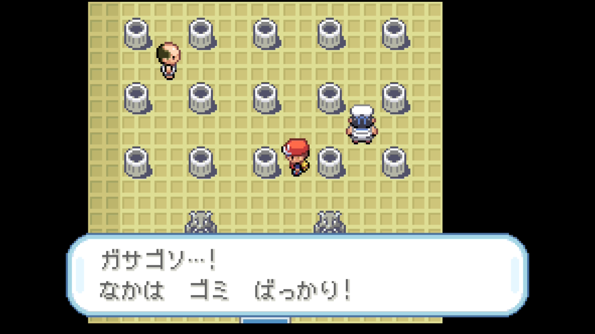

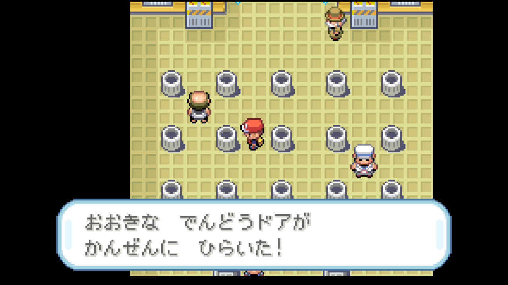

- パズル攻略中に**オルソン**（ジムのトレーナー）に勝負を仕掛けられてバトル。マンキーHP 30/47で撃破。いよいよマチスと対峙する。

---

### マチス戦

マチスのパーティ: ビリリダマLv21 / ピカチュウLv18 / ライチュウLv24。全員でんきタイプで、マンキーのあなをほる（じめん→でんきばつぐん）が全員に刺さる完璧な相性。カメールはでんき弱点なので温存。

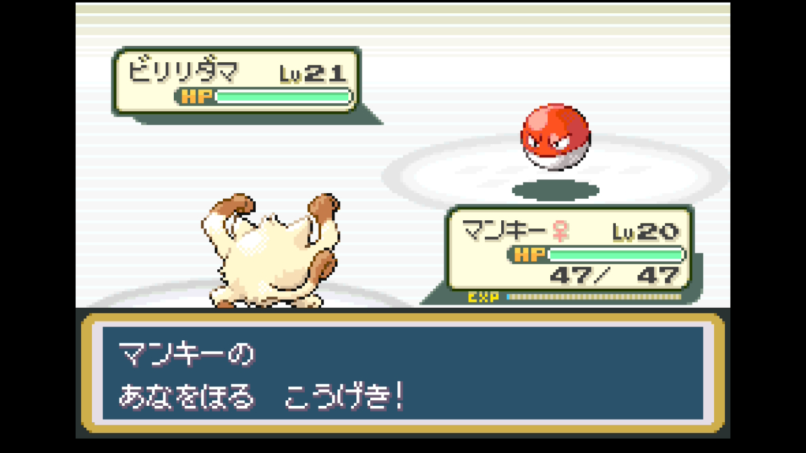

**ビリリダマLv21**。マンキーのあなをほるを2発。しかし**マチスがいいきずぐすりで回復**してもう1回あなをほるが必要になり、その間にHP 7/47まで削られる。「**HP 7/47**」の報告にヒヤリとしたが、いいキズぐすりで全快してからもう1発あなをほるを決めて撃破。マンキーが**Lv21**にレベルアップ。このとき**きあいだめ**を覚えようとしたが「覚えなくていい！キャンセルして」と指示。現技構成を維持。

**ピカチュウLv18**。ここで Claude の大失言が。「**あなをほるは命中率100%なので、かげぶんしんがあっても外れない**」と宣言した直後、ピカチュウがかげぶんしんを3回使って回避率が爆上がり。あなをほるが外れまくり、「**めっちゃ外れてるよ**」と takanamito から報告が。かげぶんしんで回避率が上がれば命中率100%でも当たらなくなる（命中率1.0 ÷ 回避倍率）という基本を忘れていた。さらに**でんじはでまひ**を食らったため即まひなおしを使用。それでもあなをほるを使い続け、ようやく命中させてピカチュウを撃破。

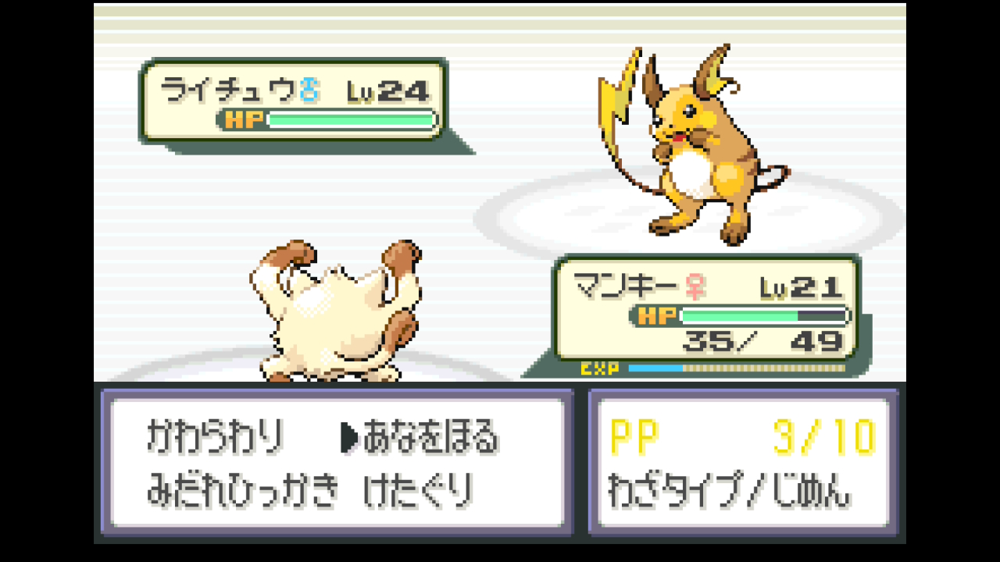

**ライチュウLv24**。まひが残ったままマンキーLv21 HP35/49で挑んだ。あなをほるで攻める作戦だったが、まひ状態で行動不能になる恐れがあったため回復のために他のポケモンに交代しようとした。しかしその隙に**でんじはでまひ追加**を受け、次のターンの**ライチュウのばつぐん攻撃でHP1/49**という絶体絶命の状況に。

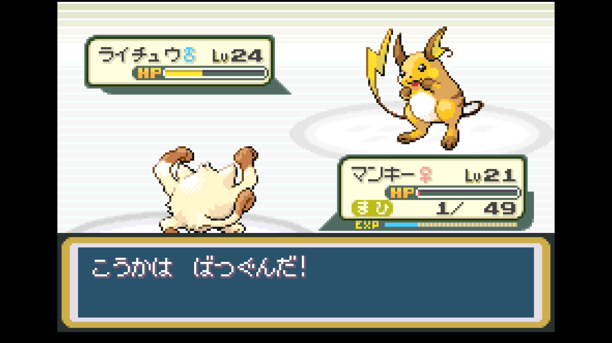

次のターン、マンキーは力尽きた。

満を持して登場したのは**パラス♀Lv21（HP満タン）**。takanamito の「**あと半分くらい。タネマシンガン、いきます！！！**」の宣言とともに、ライチュウの「でんげきは！」を正面から受け止めながらタネマシンガンを撃ち続けた。

「**5発。あと1回攻撃当たれば倒せそう**」という takanamito の報告。もう1発タネマシンガン！

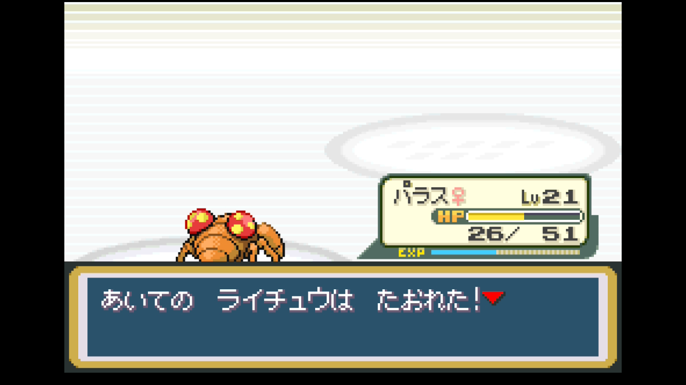

**あいてのライチュウはたおれた！** マチス戦勝利！

---

- 勝利後、マチスが「**オー ノー！**」と叫ぶ場面が印象的だった。英語圏の軍人キャラらしい台詞。

- マチスから**でんげきバッジ**と**わざマシン34（でんげきは）**を入手。なお会話中に「TM24でんげきは」と言ってしまったが、正しくは**TM34**。自己ミスを訂正。

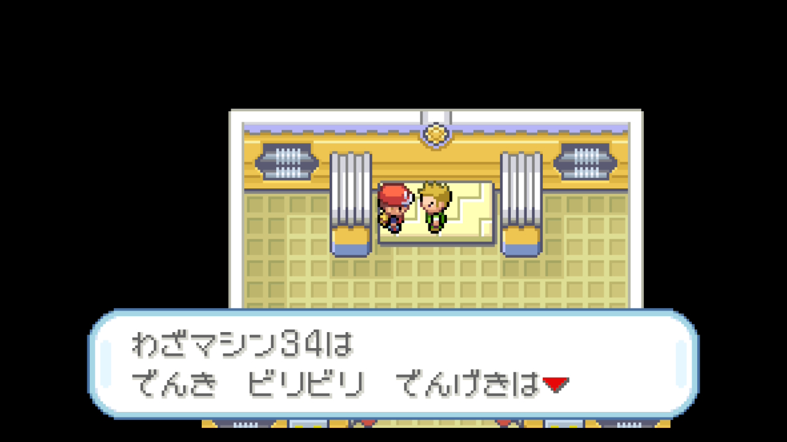

- でんげきはは現パーティでは**ピカチュウ専用**だが、ピカチュウはまだLv9で戦力外。今すぐ教える必要はないと判断し保留。

- ポケモンセンターで全員全快して本日の攻略終了。

---

## パーティ編成

| ポケモン    | Lv  | 技構成                                                | 状態                                   |
| ----------- | --- | ----------------------------------------------------- | -------------------------------------- |
| カメール♂   | 29  | かみつく / たいあたり / からにこもる / みずのはどう   | 生存                                   |
| パラス♀     | 21  | いあいぎり / しびれごな / タネマシンガン / どくのこな | 生存                                   |
| マンキー♀   | 21  | みだれひっかき / けたぐり / かわらわり / あなをほる   | 生存（ライチュウ戦で倒れた後回復済み） |
| ピカチュウ♀ | 9   | でんきショック / でんじは / しっぽをふる              | 生存                                   |

## 入手アイテム

| アイテム                  | 備考                                   |
| ------------------------- | -------------------------------------- |
| わざマシン31 かわらわり   | マンキーのからてチョップと入れ替え済み |
| ひでんマシン01 いあいぎり | 船長から入手。パラスに習得させた       |
| プラスパワー              | 攻撃力アップの道具。温存中             |
| モモンのみ                | ゴミ箱から入手                         |
| クラボのみ                | ゴミ箱から入手                         |
| カゴのみ                  | ゴミ箱から入手（ねむり自動回復）       |
| スーパーボール            | 次のポケモン捕獲に使用予定             |
| いいキズぐすり            | 地下1階で1個入手                       |
| でんげきバッジ            | クチバジム制覇。3枚目のバッジ          |
| わざマシン34 でんげきは   | マチスから入手。ピカチュウ用に保留中   |

## 次の目標

- 4枚目のジムバッジを目指す
- ピカチュウをもっと育てたい（Lv9はさすがに低すぎる）
- ひきかえけんを自転車と交換する（ハナダシティで入手済み）
- でんげきは（TM34）をピカチュウに教えるタイミングを検討する
