# 010 - 9番道路〜イワヤマトンネル突入

## 日時

2026-03-21

## 現在地

10番道路ポケモンセンター（イワヤマトンネル攻略中、回復に一時帰還）

## 攻略ログ

- ハナダシティから冒険再開。出発前に自転車をゲット！ひきかえけんをクチバシティのポケモン大好きクラブ会長からもらっていたので、ハナダシティの自転車屋で交換。これで移動が快適になる。育て屋に預けてるニドラン♂の歩数稼ぎにもなる。

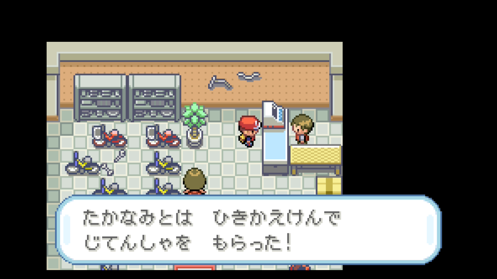

- 9番道路に出る前に `/prep` で準備チェック。前回までの反省を活かして、今回はちゃんと出発前に確認した。どくけし×3を購入。あなぬけのヒモの購入を指示しようとしたら、takanamito が「**ディグダがあなをほる覚えてるから要らんやん**」と却下。たしかに。司令塔より的確な判断シリーズ、まだまだ続く。

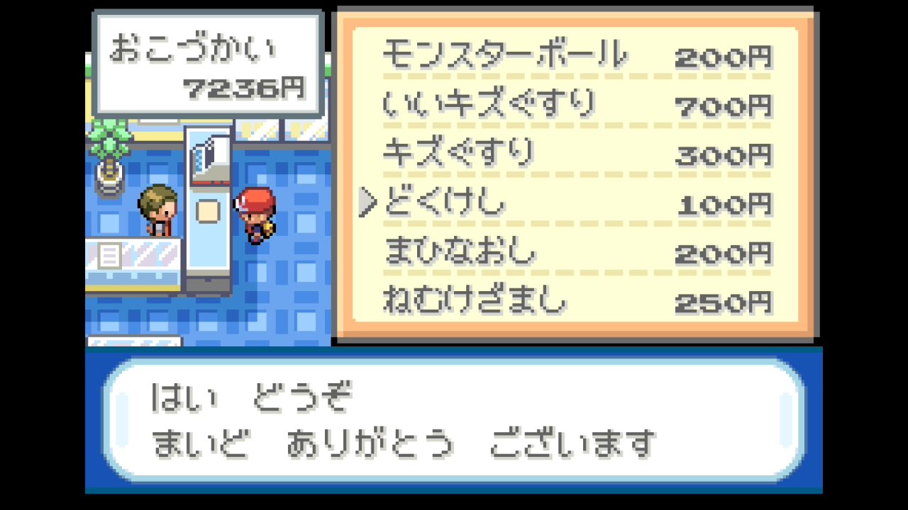

---

### 9番道路 トレーナーラッシュ

- 先頭はピカチュウ（Lv9）。育成最優先の方針でスタート。

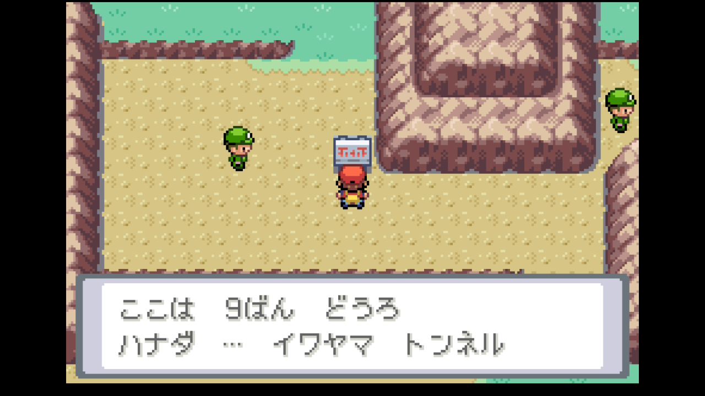

- **ピクニックガールのエミカ**と対戦。ナゾノクサ→マダツボミ→ナゾノクサの3連くさ/どくタイプ。でんきショックはくさに半減なのでカメールに交代し、かみつくで対処。しかしここで**ねむりごなを2回食らう**という地獄のような展開。1回目はねむけざましで対処できたが、2回目はもうねむけざましが無い。ナゾノクサ相手に5ターンも眠り続け、takanamito が「**3ターン以内に起きる確率は？**」と聞いてきた。Claude が「約43%」と答えると「半分以下かよ」と渋い顔。結局5ターン目でようやく起きてかみつくで仕留めた。

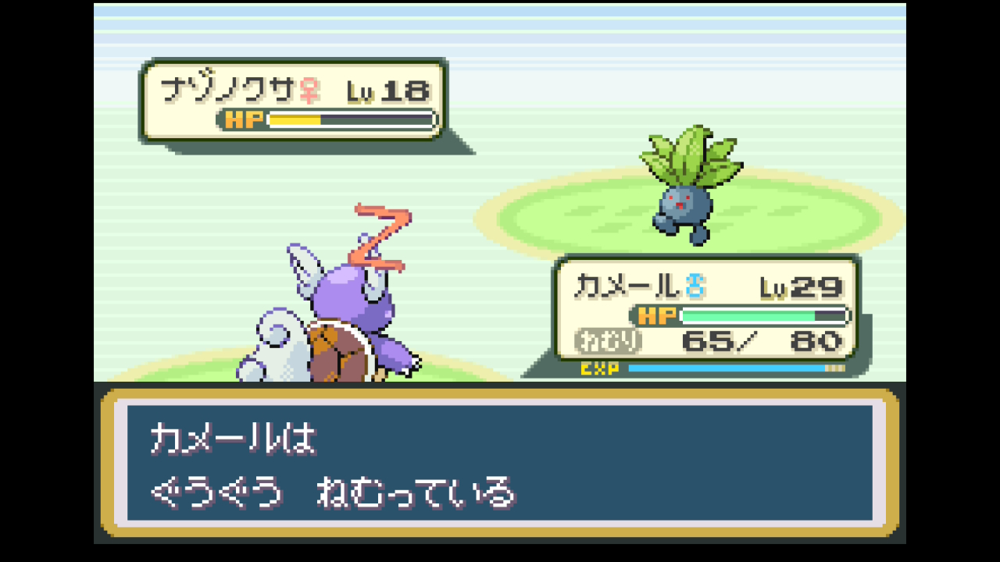

- **山男の鳴男**はワンリキーLv20。ピカチュウ先頭からディグダに交代してあなをほる……のつもりが、ここでディグダが**マグニチュード**を選択。結果は**マグニチュード9**！威力150のタイプ一致ボーナス付きで実効威力225。ワンリキーは一撃で吹き飛んだ。引きが強い。

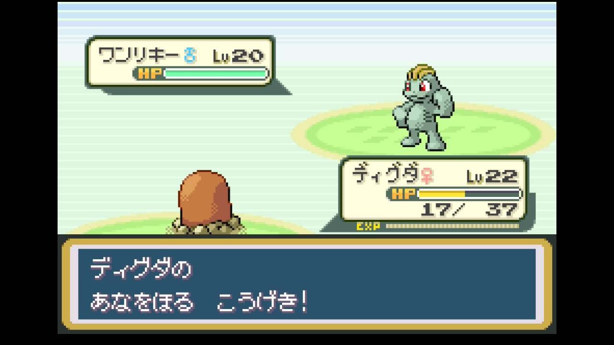

- **キャンプボーイのマサシ**はガーディLv21（ほのお）とヒトカゲ。ガーディ戦ではピカチュウ先頭→カメールに交代を指示したが、ガーディの**ほえる**でディグダが強制的に引きずり出される。結果的にディグダのあなをほるがほのおに抜群で一撃。ヒトカゲもディグダのあなをほるで片付けた。takanamito が「**あなをほるは？**」と聞いてきたので、1ターン目に潜って2ターン目に攻撃する技だと説明。「**1ターン潜ってる間は攻撃を回避できる**」のが強い。

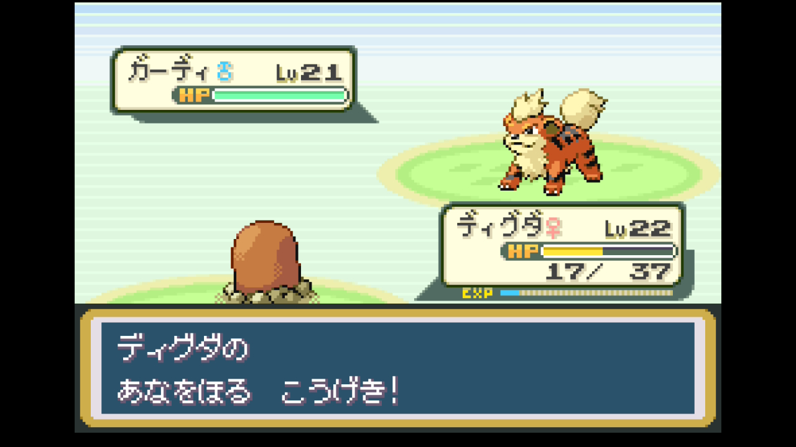

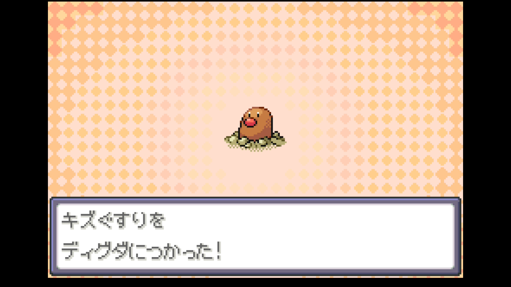

- ピカチュウがLv12になり、**でんこうせっか**を習得するタイミングが来た。takanamito が「**電光石火覚えたい**」と報告。Claude は技スロットが3つだと思い込んでいたが、takanamito が「**もう4つ埋まってるよ。でんきショック、なきごえ、しっぽをふる、でんじは**」と訂正。またしても司令塔がパーティの技構成を把握していなかった。なきごえを忘れてでんこうせっか（ノーマル、威力40、先制技）を習得。攻撃技が2つになって戦いやすくなった。

- **虫取り少年の陽一**はスピアー×2（むし/どく）。カメールのみずのはどうで対処。1匹目のスピアーにみずのはどうで混乱を付与するラッキーもあった。

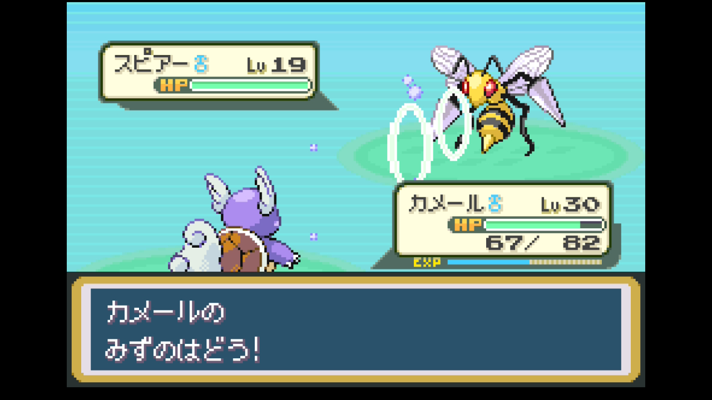

- **虫取り少年のひろみち**はキャタピーLv20、ビードル、コンパン。全てカメールのみずのはどうで処理。カメールがレベルアップ時に**まもる**を覚えたいと出たが、ストーリー攻略では使い道が少ないので覚えさせなかった。

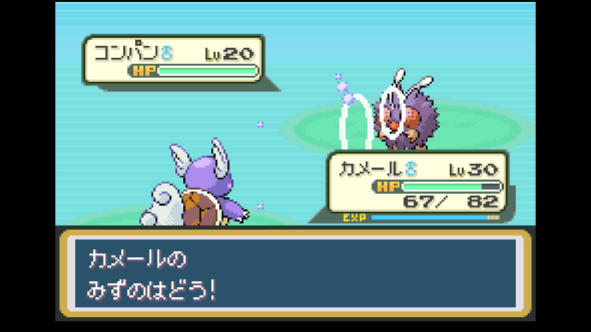

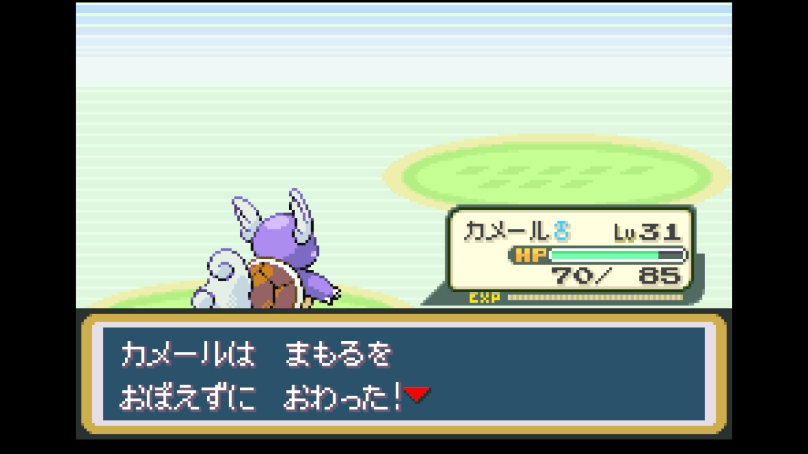

- わざマシン40（**つばめがえし**）を拾った。ひこうタイプ・威力60・必中の優秀な技だが、パーティにひこうタイプ一致で使えるポケモンがいないので温存。

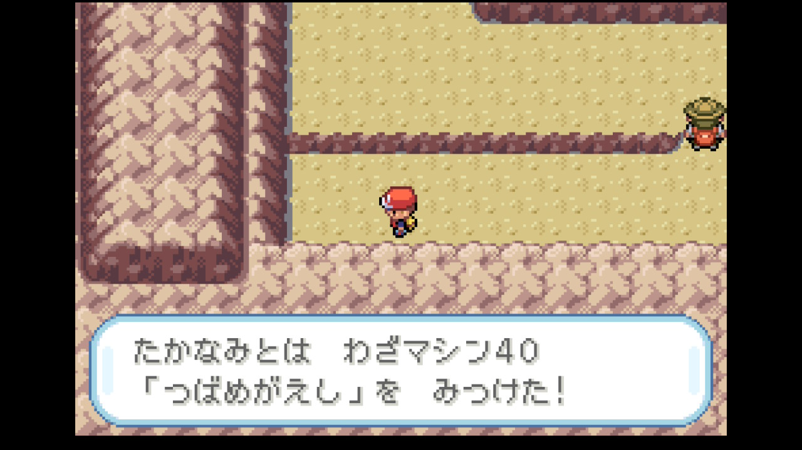

- **キャンプボーイのノリヒロ**でまさかの事態。1匹目のコラッタLv10はピカチュウのでんきショックで余裕だったが、2匹目のコラッタLv19が**ひっさつまえば**を一撃ヒット。**ピカチュウ戦闘不能！** Lv12のピカチュウにはLv19のコラッタは荷が重かった。マンキーに交代してかわらわり（かくとうがノーマルに抜群）で仕返し。続くサンドはカメールのみずのはどうで、アーボもそのまま処理。

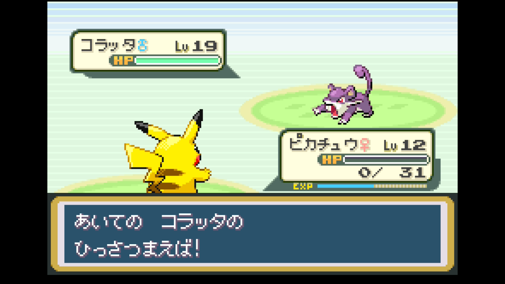

- **やまおとこのハルノブ**はイシツブテ×2とワンリキー。イシツブテにはマンキーのかわらわり（かくとうがいわに抜群）が一撃で刺さり気持ちいい。ワンリキー戦ではワンリキーが**きあいだめ**を使ったが、マンキーのあなをほるで1ターン潜って急所アップ後の攻撃を華麗に回避。そのまま撃破。マンキーLv22に成長。

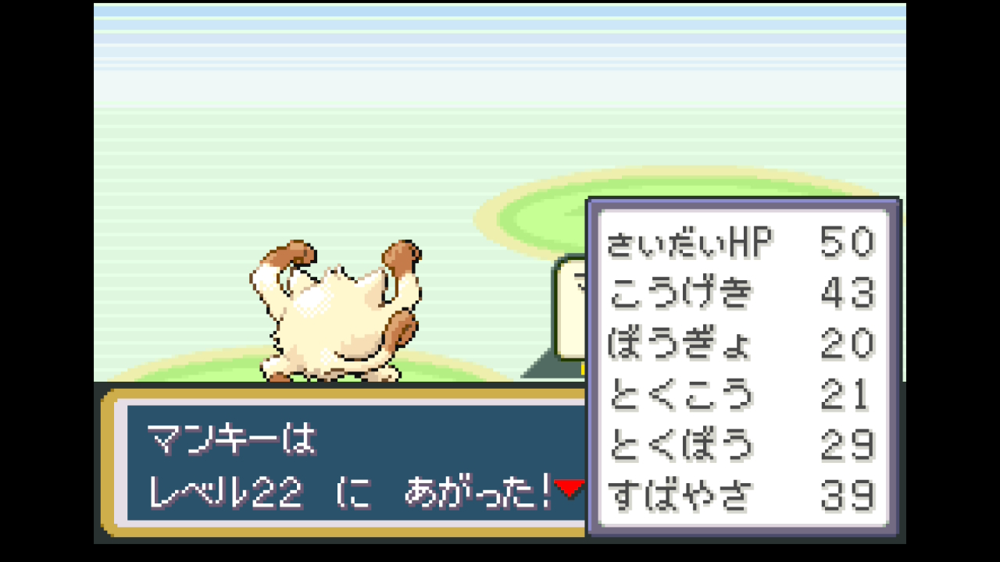

- **ピクニックガールのさちえ**はニャースLv23（ノーマル）。マンキーのかわらわりで抜群。

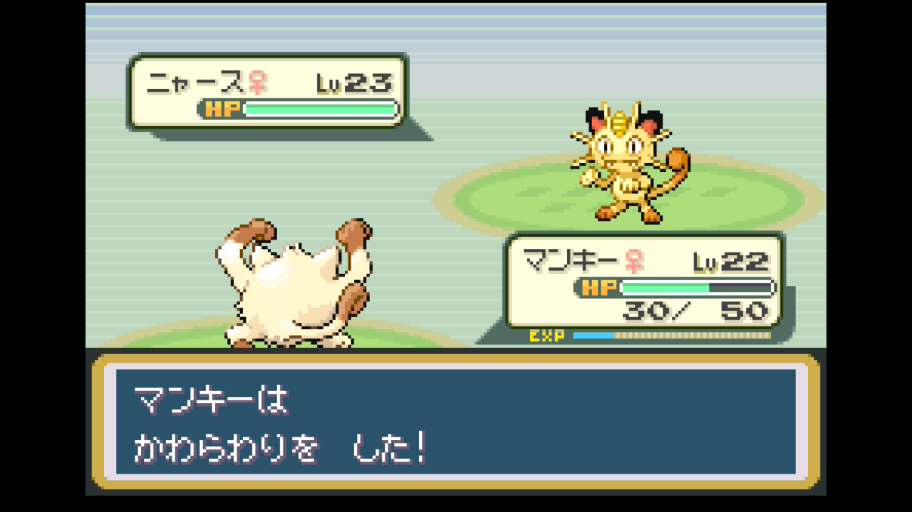

---

### 10番道路〜イワヤマトンネル突入

- 9番道路を抜け、**10番道路のポケモンセンター**に到着！ピカチュウを含め全員回復。

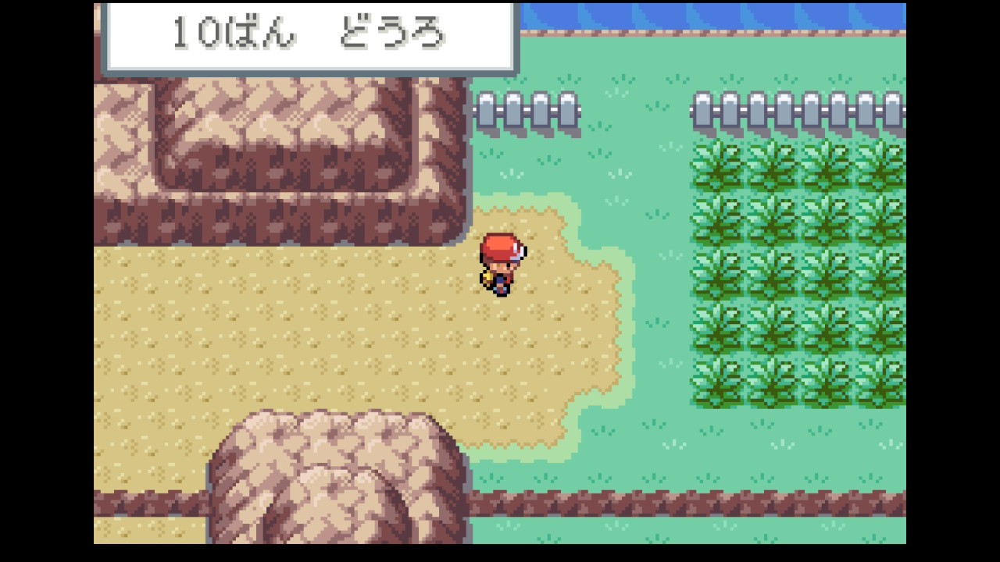

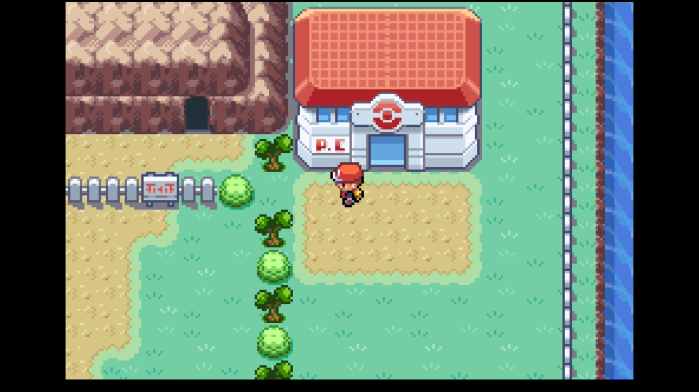

- オーキド博士の助手に会うと「**ポケモン図鑑が20種類あつまっていたら**」と条件を提示される。確認すると……**12種類**。また足りない。前回のフラッシュ（10種類条件）に続き、今回も図鑑不足。ただし今回は必須アイテムではないので、無理に集めず先に進む判断をした。

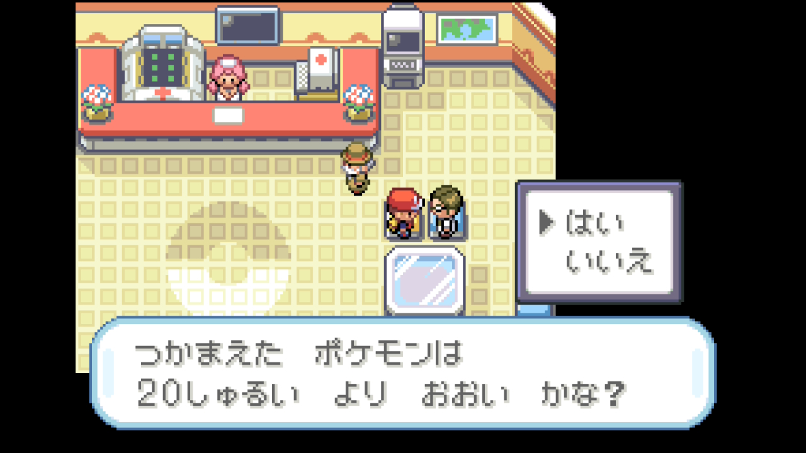

- ポケモンセンター内でシオンタウンの幽霊ポケモンの噂を聞いた。先に何かありそうな予感。

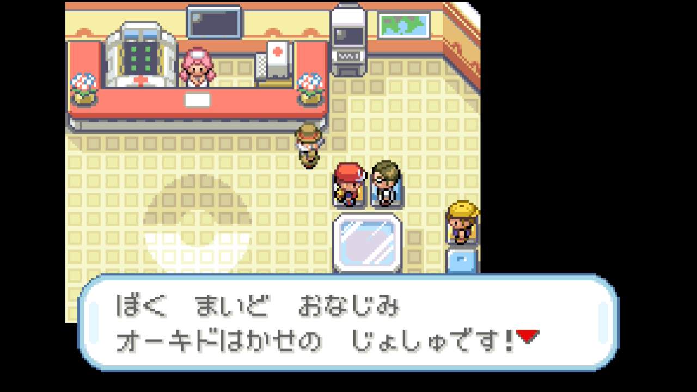

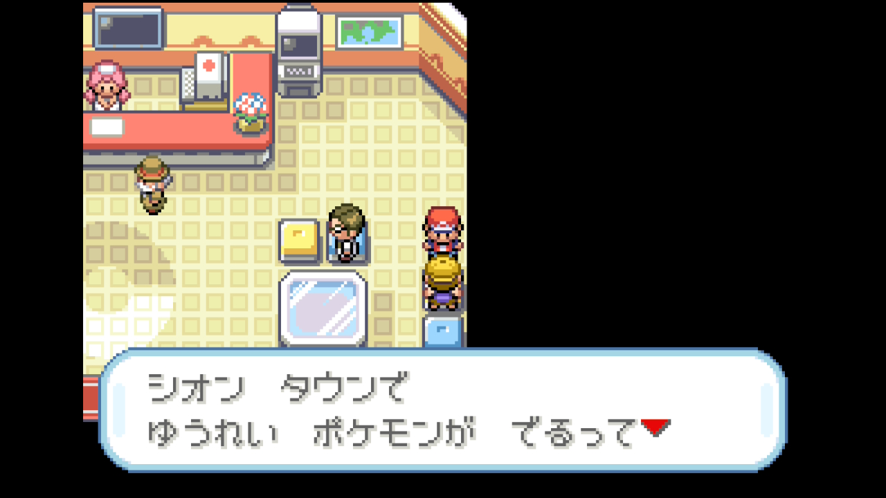

- 奥さんが「**もっとポケモン集めたら？また同じようなチャンスあるから**」とアドバイス。前回の反省を踏まえた的確な助言。Claude も「イワヤマトンネルで新しいポケモンに出会ったら積極的に捕まえよう」という方針に。進みながら自然に図鑑を増やす作戦で行くことにした。

- **イワヤマトンネル突入！** まずパラスのフラッシュで洞窟内を明るくする。先頭はピカチュウで育成継続。

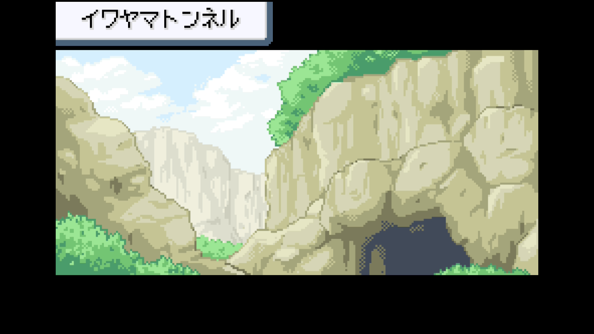

- **ピクニックガールのちかこ**と対戦。ピカチュウLv13（でんき）→ディグダに交代してあなをほるで抜群。続くピッピ（ノーマル）でClaude が**またミス**。ディグダのまま「あなをほるで押し切ろう」と指示したが、takanamito が「**マンキーのかわらわりじゃなくて？**」と突っ込み。ピッピはノーマルタイプだからかくとうが抜群なのに、Claude はタイプ相性を完全に忘れていた。takanamito が「**タイプ相性わすれたん？**」と呆れ気味。さらにピッピの**うたう**でディグダが眠らされ、Claude は「起きるまで待とう」と指示。takanamito が「**マンキーに交代やろ**」と即座に修正。交代すれば眠りも関係なくなる。司令塔、この日2度目の判断ミスをtakanamitoに正される。

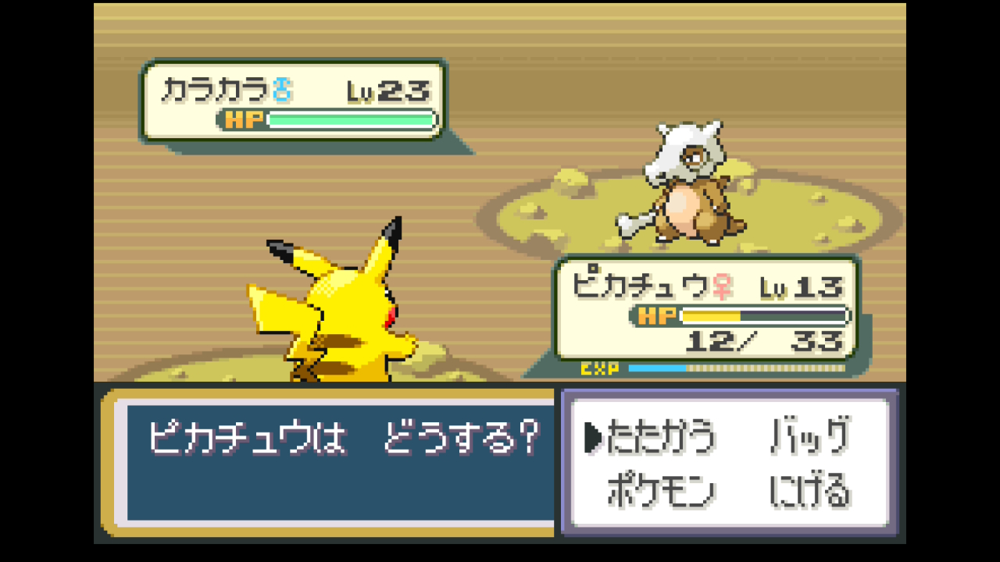

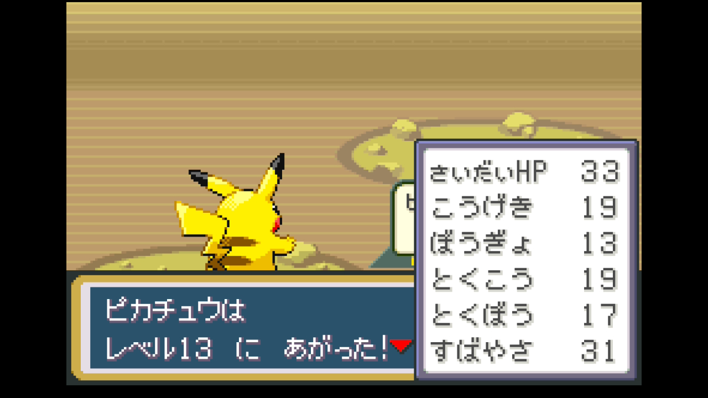

- トレーナー戦の後、洞窟内でヤドン（みず/エスパー）と遭遇。カメールのかみつく（あくタイプがエスパーに抜群）で撃破。

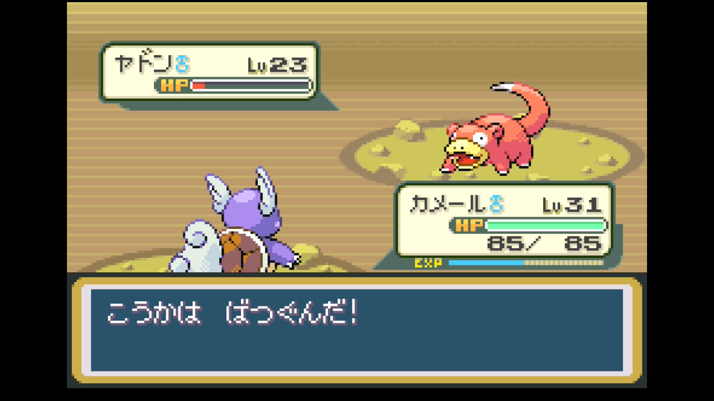

### ズバット捕獲

- 洞窟内で**野生のズバットLv15**に遭遇。図鑑埋めのため捕獲を決断。モンスターボールの残数（12個＋スーパーボール1個）を確認し、無事捕獲成功！

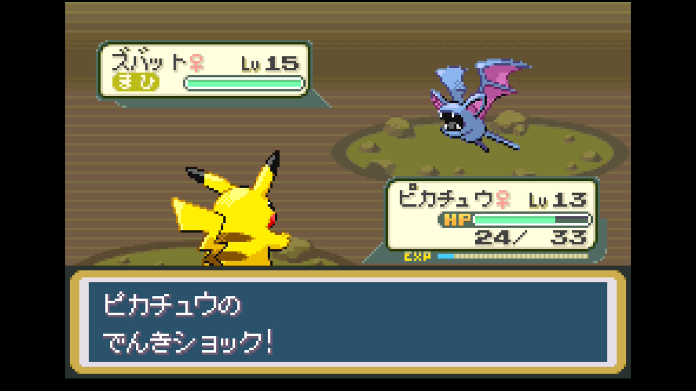

- 野生のイシツブテにも遭遇。図鑑埋めのために捕まえたいが、カメールだとレベル差があり一撃で倒してしまう。takanamito が「**つかまえるにはカメールはレベル差がありすぎ**」と報告。Claude は最初「**倒しちゃおう**」と指示したが、takanamito が「**ずかん増えへんやんか**」と一喝。そうだった、図鑑埋め方針だった。パラスに交代してしびれごなで麻痺→ボール直投げに切り替え。

- 洞窟内でむしよけスプレーを拾った。

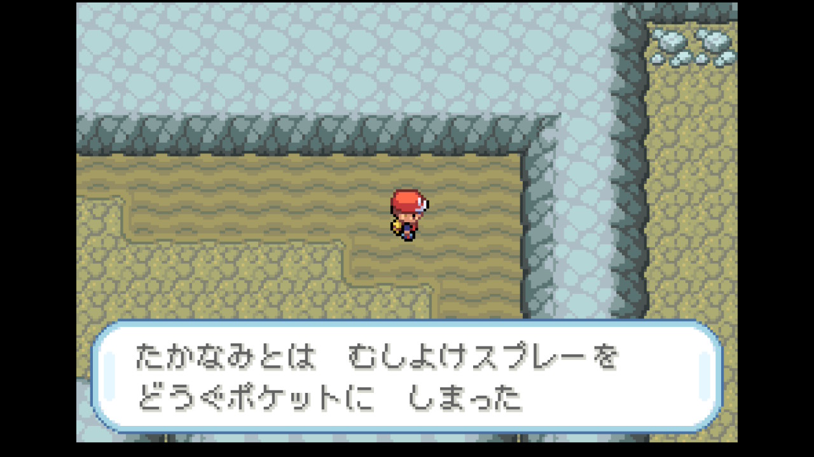

- ピカチュウLv14に成長。パラスもLv23に到達。カメールもLv31に。

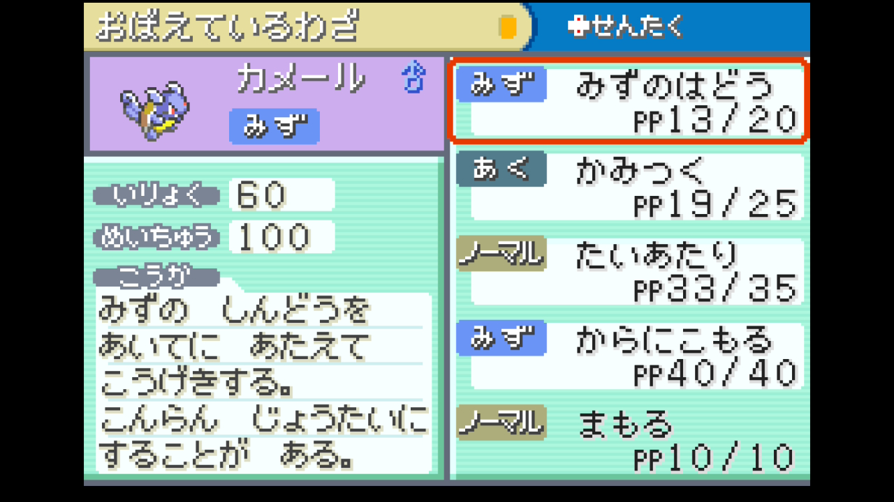

- 洞窟内でイシツブテの色が気になる。「**イシツブテが緑すぎる**」。リーフグリーンの画面は全体的に緑がかって見えるのでそのせいだろう。色違いではない。

- HPが減ってきたのでいったん10番道路のポケモンセンターに戻って回復。イワヤマトンネル攻略は次回に持ち越し。

---

## パーティ編成

| ポケモン    | Lv  | 技構成                                                  | 状態 |
| ----------- | --- | ------------------------------------------------------- | ---- |
| カメール♂   | 31  | みずのはどう / かみつく / たいあたり / からにこもる     | 生存 |
| パラス♀     | 23  | いあいぎり / しびれごな / タネマシンガン / フラッシュ   | 生存 |
| マンキー♀   | 22  | みだれひっかき / けたぐり / かわらわり / あなをほる     | 生存 |
| ピカチュウ♀ | 14  | でんきショック / でんこうせっか / しっぽをふる / でんじは | 生存 |
| ディグダ♀   | 22  | なきごえ / マグニチュード / あなをほる / みだれひっかき | 生存 |

※ニドラン♂は育て屋に預け中

## 入手アイテム

| アイテム                  | 備考                                     |
| ------------------------- | ---------------------------------------- |
| じてんしゃ                | ハナダシティでひきかえけんと交換         |
| わざマシン40 つばめがえし | ひこうタイプ一致のポケモンがいないため温存 |
| むしよけスプレー          | イワヤマトンネル内で拾得                 |

## 次の目標

- イワヤマトンネルを抜けてシオンタウンへ
- ピカチュウの育成を継続（Lv14→Lv20を目指す）
- 洞窟内で新しいポケモンを見つけたら図鑑埋めのため捕獲する
- 4枚目のジムバッジを目指す
