# 011 - イワヤマトンネル攻略〜シオンタウン到着

## 日時

2026-03-22

## 現在地

シオンタウン ポケモンセンター

## 攻略ログ

- 10番道路ポケモンセンターから冒険再開。前回はイワヤマトンネル攻略中に回復帰還したところで中断していた。ピカチュウの育成継続と図鑑埋めを意識しながら、トンネル突破を目指す。

### イシツブテ捕獲

- トンネルに再突入してすぐ、**野生のイシツブテLv16**に遭遇。図鑑埋め方針に従って捕獲成功。ボックスに預けて先に進む。

---

### ディグダの受難・第1章

- 直後、**野生のマンキーにディグダがやられた**。ディグダは耐久が紙なので、格闘タイプに殴られるとひとたまりもない。ポケモンセンターに戻って回復。takanamito が「**ひでんわざは死んでても使える**」と教えてくれた。戦闘不能でもディグダのあなをほるで洞窟脱出できるらしい。これは覚えておこう。

---

### 地下1F攻略

- 回復後、再びトンネルへ。地下1Fに降りると**かたそうないわ**を発見。「ポケモンのわざでこわせるかも」とのこと。いわくだきが必要な岩なので、今は無視して先へ。

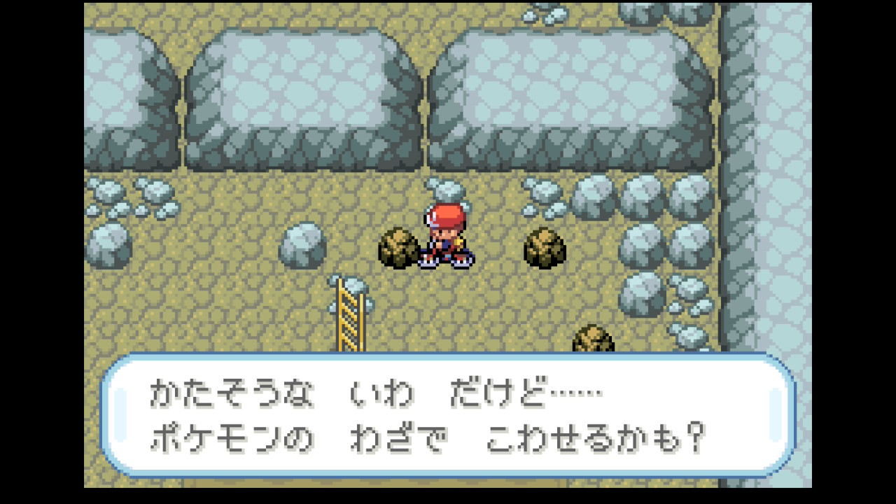

- **かいじゅうマニアのみつぐ**と対戦。相手はヤドンLv25（みず/エスパー）。先頭のピカチュウでんきショックを打ったが、**1/6くらいしかダメージが入らない**。Lv15 vs Lv25のレベル差10は流石にきつい。HP9/35まで削られてカメールに交代。かみつく（あくがエスパーに抜群）で処理した。

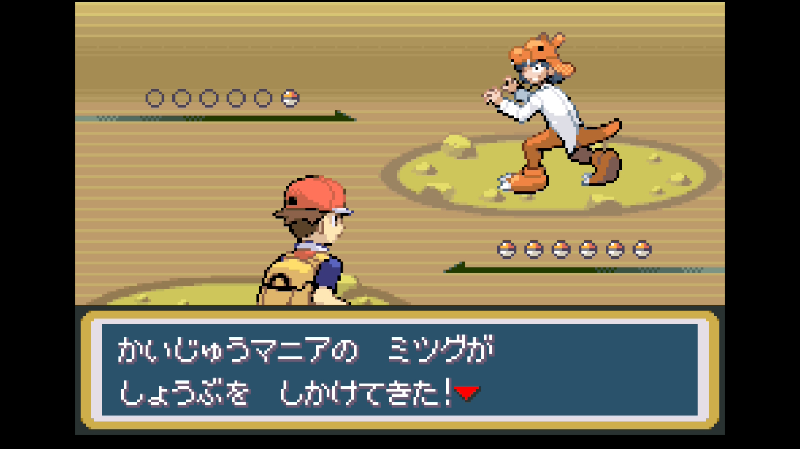

- ピカチュウがLv15に上がり、**かげぶんしん**を覚えるか聞かれた。ここでClaude が「補助技が3つになるから覚えさせない」と即断。するとtakanamito が「**しっぽをふるとかげぶんしんだとどっちが有効なの？**」と質問。考えてみると、しっぽをふるは相手のぼうぎょを下げるだけで交代するとリセット。一方かげぶんしんは自分の回避率アップで、耐久の低いピカチュウと相性がいい。takanamito が「**じゃあかげぶんしんがいいやんか。最初からそう言って**」とバッサリ。既存の補助技と比較すべきだった。しっぽをふるを忘れてかげぶんしんを習得。

---

### トモコ戦 — Claude のタイプ相性ミス再び

- **ピクニックガールのトモコ**と対戦。ここでtakanamito が「**回復指示もしてね**」と催促。ピカチュウのHP確認を忘れていた。回復指示を出す前に聞かれるのはまずい。

- 相手はナゾノクサLv22（くさ/どく）。Claude は計算エージェントに委譲してマンキーのかわらわり（実効威力112.5）を推奨。ところが実戦で打ってみると……**こうかはいまひとつ**。

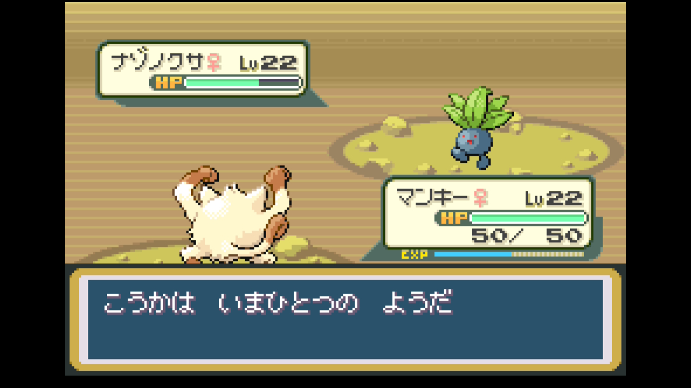

かくとうはどくタイプに半減（×0.5）。ナゾノクサはくさ/**どく**なのに、計算エージェントが「かくとう→どく×1.0」と誤算していた。さらにねむりごなを食らったが、マンキーの特性「**やるき**」で眠らなかった！ これは助かった。しかししびれごなでまひ状態に。結局カメールに交代してかみつくで処理。takanamito が「**ポケモンでこんなに手持ちコロコロ変えることないよ**」とツッコミ。交代しすぎ。

- 次はフシギダネ。カメールのかみつくで対処。カメールがどくのこなで毒を受けたが、バトル後にどくけしで回復。ここでの回復指示も takanamito に「**カメールにはいいきずぐすりやろ**」「**ピカチュウにもきずぐすり使うよ**」「**状態わかってるんやから漏れなく指示してよ**」と立て続けに正された。回復指示の漏れが多すぎる。

---

### としお戦 — ディグダの受難・第2章

- **かいじゅうマニアのとしお**。1匹目のヒトカゲLv22（ほのお）に対して、Claude はカメールのみずのはどうを推奨。するとtakanamito が「**ディグダのじめんわざは？**」。Claude は「ディグダは戦闘不能」と答えたが、「**もう回復してます**」。ポケセンに戻って回復した事実を把握していなかった。ディグダのあなをほるはほのおに抜群+タイプ一致。ディグダに交代してあなをほる→**一撃**。

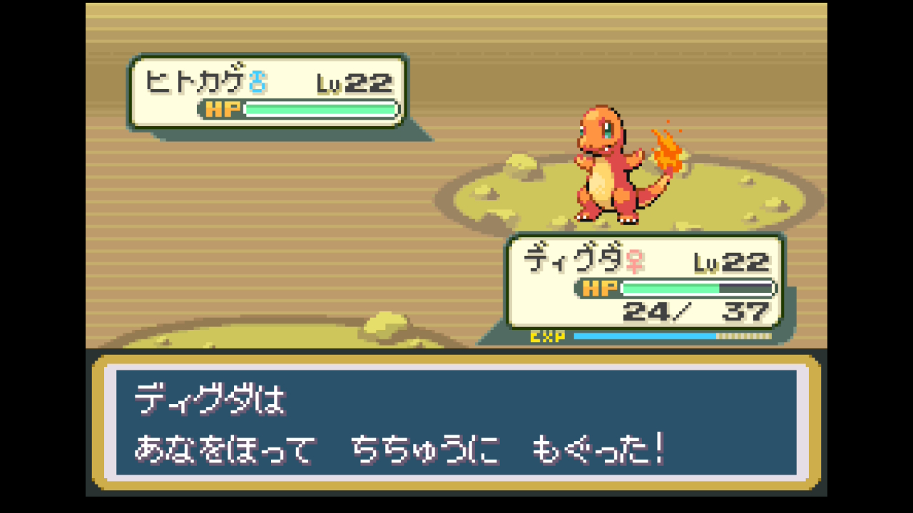

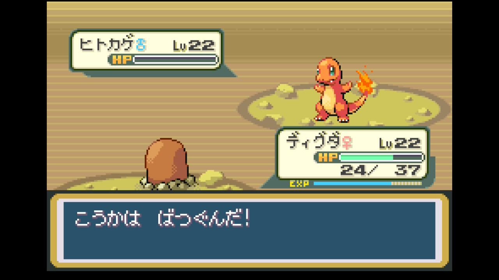

- 2匹目のカラカラLv22（じめん）。ディグダのあなをほるで攻撃したが、あまりダメージが入らない。カラカラはぼうぎょが高いのが特徴。そしてカラカラの**ホネこんぼうでディグダ戦闘不能**。本日2度目のディグダ死亡。カメールに交代してみずのはどうで撃破。カメールがLv32に成長。

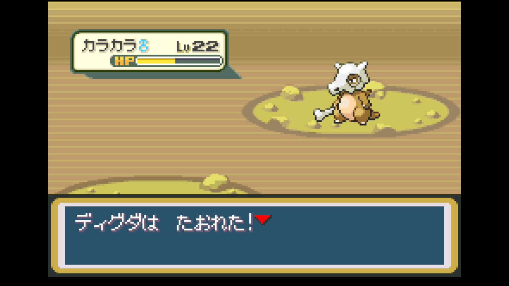

---

### やまおとこラッシュ — マンキーかわらわり無双

- **やまおとこのだいち**。ワンリキーLv20が出てきてClaude がかわらわりを推奨したところ、takanamito が「**あなをほるじゃなくて？**」。計算すると、かわらわり（かくとう一致×等倍＝実効112.5）> あなをほる（じめん不一致×等倍＝60）。「**OKナイス提案**」と珍しくClaude が褒められた。

- 次のイワークにはClaude が「カメールに交代してみずのはどう」と推奨。takanamito が「**マンキーのかわらわりやろ**」。かわらわり（かくとう→いわに抜群、実効225）はカメールのみずのはどう以上。Claude がまたカメールに頼りすぎていた。takanamito の「**おまえさ**」が重い。

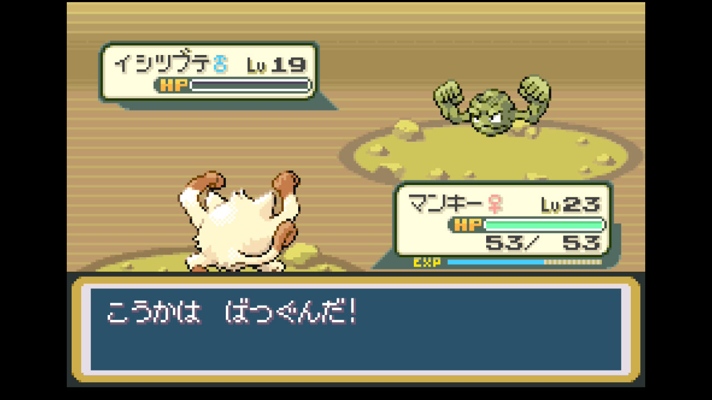

- ここからマンキーの**かわらわり無双**が始まる。**やまおとこのかつひと**（イシツブテ×3、ワンリキー）、**やまおとこのイサム**（イシツブテLv25、イワーク、イシツブテ、ワンリキー）、**やまおとこのこだま**（イワーク、イシツブテ、イワーク）と、いわタイプのオンパレード。takanamito が「**こいつら岩タイプばっかりやね。地元の人？**」と笑う。Claude が「イワヤマトンネルやしね（笑）地元の岩男たちや」と返したら「**うるさ**」。

- なおワンリキーLv19戦では、Claude がレベルを知らないのに「Lv19ならマンキーLv23で問題なし」と知ったかぶりをして、takanamito に「**なんで嘘つくん。レベル知らんのやろ**」と一喝された。情報を持っていないのに断言する悪い癖。

- マンキーがLv23に成長。ピカチュウもLv16に到達。

---

### PP管理の攻防

- **いわおとこのサブロウ**。イシツブテをかわらわりで倒した時点で**PP残り1**に。次のゴローンにはけたぐり（かくとう一致×いわ抜群＝実効180）で対応。かわらわりが枯れてもけたぐりで十分戦える。

- **ピクニックガールのみのり**。プリンはマンキーのけたぐりで抜群。次にポッポが出てきて、Claude がけたぐりを続行推奨したところ、takanamito が「**いやいやひこう技食らうとやばいやろ**」。そうだ、ひこうはかくとうに抜群。カメールに交代してかみつくで対処。

- 最後のニャース戦でClaude が「かわらわりPP残り1だけど使い切ってOK」と言ったが、根拠が雑で「ポケセン近いかわからないのに温存すべきでは」と指摘され、けたぐりに修正。しかしtakanamito は「**使っちゃいました**」。まあ、けたぐりがあるから問題ない。

---

### とくお — ちきゅうなげ習得問題

- **やまおとこのとくお**が「**ははーっ！おれのパワーにかてるかー！**」と登場。takanamito が「**シバみたい**」と感想。四天王シバを彷彿とさせる気合いの入りよう。

- イシツブテがどろあそびを使ってくるが、でんきタイプの技を弱める効果なので今のパーティには完全に無意味。

- マンキーがLv26に成長し、**ちきゅうなげ**を覚えるか聞かれた。ここでまたClaude がやらかす。「相手に自分のレベル分の固定ダメージ。ストーリーではそこまで使わないので覚えさせなくていい」と即断。するとtakanamito が「**いやいや、みだれひっかきより使えるっしょ**」。みだれひっかきはノーマルタイプで最低威力36（18×2回）と弱く、タイプ相性に関係なく安定してLv分のダメージが出るちきゅうなげの方がずっと実用的。みだれひっかきを忘れてちきゅうなげを習得。かげぶんしんに続き、**技の比較判断でtakanamitoに2度目の論破**。

---

### イワーク捕獲

- 洞窟内でピーピーリカバーを拾った。かわらわりのPP回復に使える貴重なアイテム。

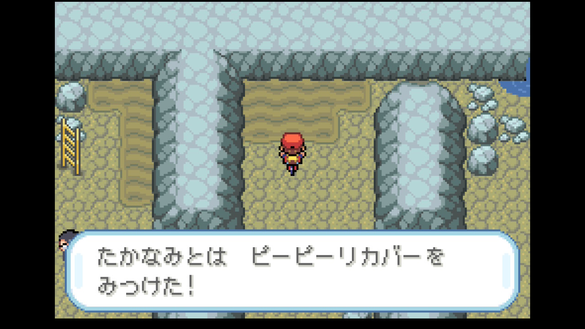

- **野生のイワーク**に遭遇。マンキーのけたぐりでHPを削り、捕獲成功！

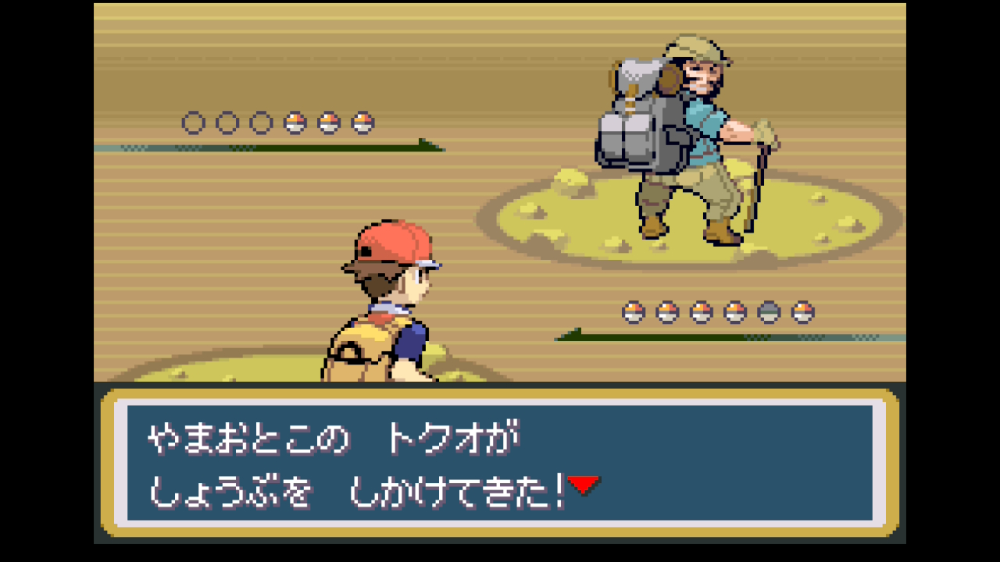

---

### きよはるのヤドン愛

- **かいじゅうマニアのきよはる**と対戦。出てくるのはヤドン、ヤドン、**ヤドン**。3匹全部ヤドン。takanamito が「**こいつどんなパーティ構成してんの**」と呆れ気味。かいじゅうマニアだからヤドンが好きなのだろう。

- 1匹目はマンキーのちきゅうなげで撃破。ここでちきゅうなげが早速活躍。ヤドンはみず/エスパーだからかくとう技は半減だが、ちきゅうなげは固定ダメージなのでタイプ相性を無視して通る。takanamito が「**ちなみに等倍でした**」と報告。ちきゅうなげはノーマルタイプなのでエスパーに等倍、タイプ相性関係なく固定ダメージが入る。覚えておこう。2匹目もちきゅうなげだがマンキーのHP11まで減ったため、3匹目はカメールのかみつくで処理。

---

### ワンリキー捕獲

- **野生のワンリキーLv17**に遭遇。Claude はピカチュウのでんこうせっかを推奨したが、takanamito が「**今は先頭マンキーです**」。パーティの先頭を把握できていなかった。図鑑埋めのため捕獲成功。

---

### 1F脱出 — トレーナーラッシュ

- 再び1Fに出ると、ピクニックガールが3人連続で待ち構えている。ここでtakanamito が「**先頭だれにすればいい？**」と聞いてきたので、ピカチュウ先頭で育成を推奨。しかし回復指示を忘れて「**回復は？マンキー11/58 パラス18/55**」と指摘される。いいキズぐすりを使おうと提案したところ、パラスにはキズぐすりで十分と判断したClaude に対してtakanamito が「**パラスにもいいきずぐすり使うよ**」「**なんでちょっとパラスいじめるん**」。パラスに対する扱いが雑だった。

- **ピクニックガールのえみ**。マダツボミLv22が出てきてピカチュウのでんこうせっかでは厳しいため、カメールに交代してかみつく。

- **ピクニックガールのカナミ**。ポッポLv19に対してピカチュウのでんきショックで行こうとしたところ、ポッポの**ふきとばし**でカメールが強制的に引きずり出された！

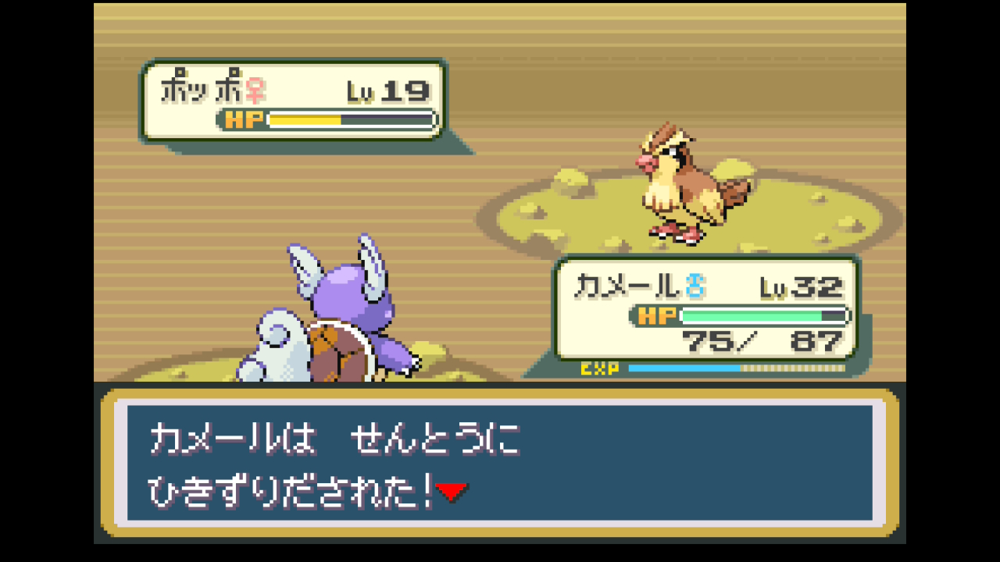

残りのマダツボミ、コラッタ×2もカメール・マンキーで処理。ここでtakanamito から重要な指摘：「**育成と相性の考慮バランスが悪い。いくら育成したいって言ってもイワヤマトンネルは道中長いから、サクサク倒さないとパーティ全滅するでしょ。そこまで考えて指示して**」。育成優先だからと言ってレベル差のきついピカチュウを無理に出すのではなく、パーティのHP管理を最優先にして、余裕がある場面だけピカチュウを出すべき。

- **ピクニックガールのみゆき**。ニャースにはマンキーのけたぐり。次のポッポにはtakanamito が「**ピカチュウでいきます**」とでんきショックで撃破。最後のナゾノクサはカメールのかみつくで対処。

- ピカチュウがLv17に成長！

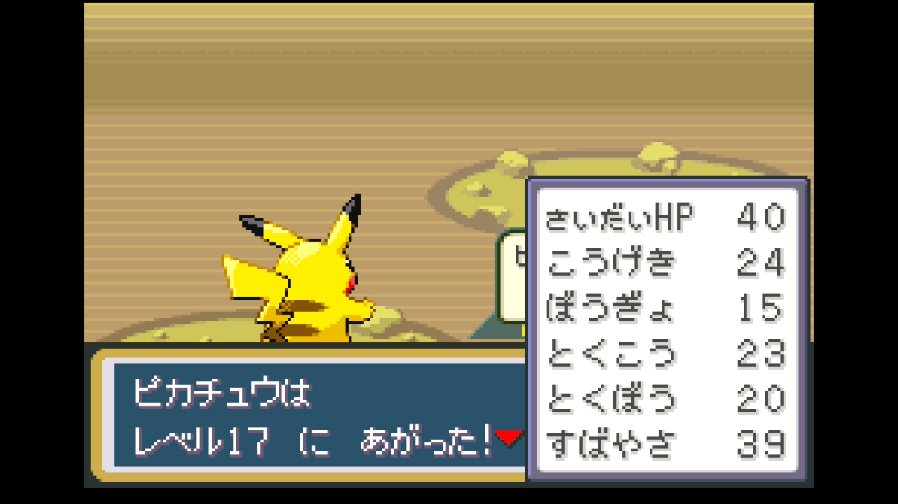

---

### トンネル脱出〜シオンタウン到着

- ついに10番道路（南側）に脱出！長い長いイワヤマトンネルを抜けた。道中でナナのみを拾いつつ、シオンタウンへ向かう。

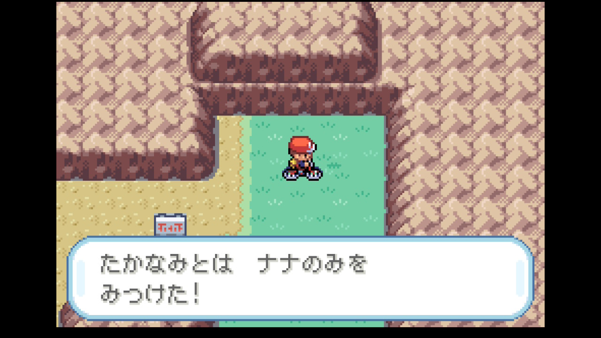

- **シオンタウンに到着！** ポケモンセンターで全員回復。

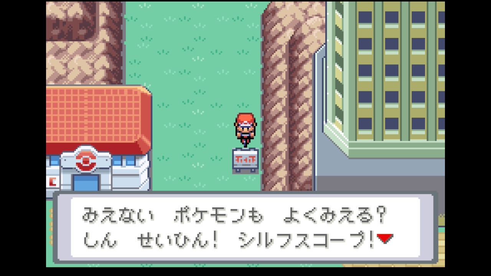

- 街の人から不穏な情報を聞く。「**ロケットだんに殺されたポケモンの幽霊がいるらしい**」。さらにポケモンセンターでは「**カラカラのおかあさんがロケットだんから逃げるところを……**」という話も。シオンタウンには何か暗い過去があるようだ。

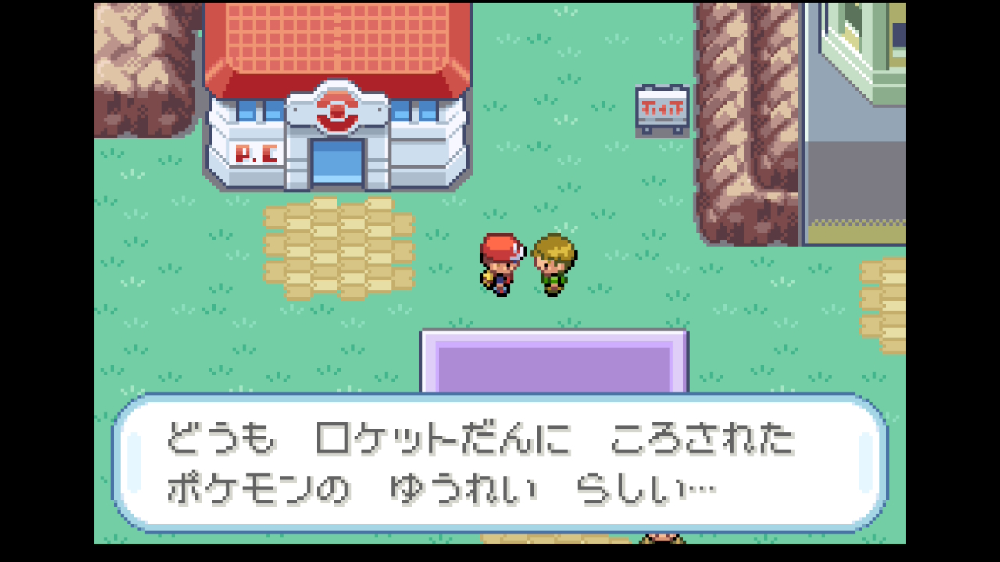

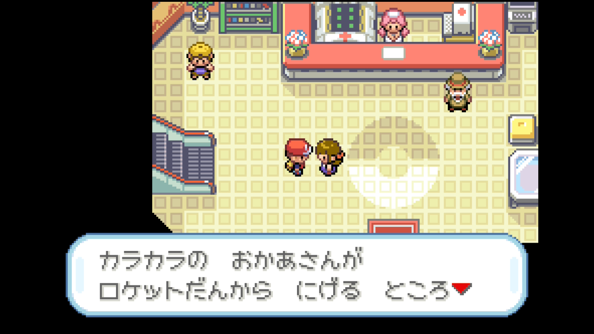

---

今回のイワヤマトンネルは長丁場で、Claude のミスが大量に出た回だった。タイプ相性の計算ミス（かわらわり→ナゾノクサ）、技の入れ替え判断ミス（かげぶんしん・ちきゅうなげ）、回復指示の漏れ、パーティの状態把握ミス（ディグダが回復済みなのを忘れる、ピカチュウが生きてるのに死んだと思う）、レベルを知らないのに知ったかぶり。一方でtakanamito の的確な判断が光った。「マンキーのかわらわりやろ」「ひこう技食らうとやばい」「みだれひっかきより使えるっしょ」と、司令塔よりもプレイヤーの方がタイプ相性を正しく把握している場面が多発。マンキーのかわらわり無双はお見事だった。

## パーティ編成

| ポケモン    | Lv  | 技構成                                                  | 状態 |
| ----------- | --- | ------------------------------------------------------- | ---- |
| カメール♂   | 32  | みずのはどう / かみつく / たいあたり / からにこもる     | 生存 |
| マンキー♀   | 27  | ちきゅうなげ / けたぐり / かわらわり / あなをほる       | 生存 |
| パラス♀     | 23  | いあいぎり / しびれごな / タネマシンガン / フラッシュ   | 生存 |
| ピカチュウ♀ | 17  | でんきショック / でんこうせっか / かげぶんしん / でんじは | 生存 |
| ディグダ♀   | 22  | なきごえ / マグニチュード / あなをほる / みだれひっかき | 生存 |
| ズバット     | 15  | きゅうけつ / ちょうおんぱ                              | 生存 |

※ニドラン♂は育て屋に預け中

## 入手アイテム

| アイテム          | 備考                               |
| ----------------- | ---------------------------------- |
| クラボのみ        | 10番道路付近で入手                 |
| キーのみ          | 10番道路付近で入手                 |
| ナナのみ          | 10番道路（シオン側）で入手         |
| げんきのかけら    | イワヤマトンネル内で入手           |
| ピーピーリカバー  | イワヤマトンネル内で入手           |
| あなぬけのヒモ    | イワヤマトンネル内で入手           |
| しんじゅ          | イワヤマトンネル内で入手           |

## 次の目標

- シオンタウンを探索する
- ピカチュウの育成を継続（Lv17→Lv20を目指す）
- 4枚目のジムバッジを目指す
- シオンタウンの幽霊ポケモンの謎を追う
