# 012 - ポケモンタワー攻略〜タマムシシティ到着

## 日時

2026-03-23

## 現在地

タマムシシティ ポケモンセンター

## 攻略ログ

- シオンタウンのポケモンセンターから冒険再開。前回イワヤマトンネルを抜けて到着したばかりなので、まずは街の探索から。

### シオンタウン探索

- せいめいはんだんしの家を発見。ポケモンのニックネームを変更できる場所だが、特に変更の必要なし。

- カラカラと一緒に暮らしている住人を訪問。ロケット団への怒りを語っていた。ポケモンセンターで聞いた「**カラカラのおかあさんが逃げるところを殺された**」という話と繋がる。カラカラが「**きゃるぐぅーっ**」と鳴いている姿が痛々しい。

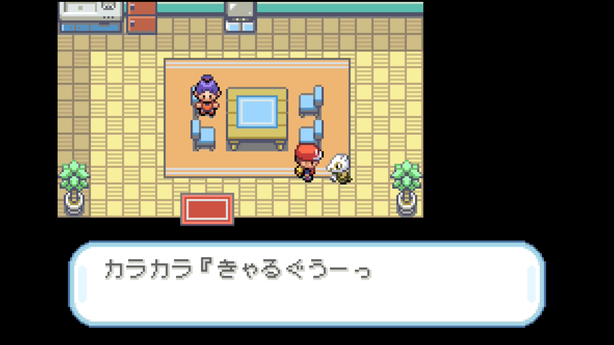

- フジ老人という人物がいなくなっているらしい。街の人が心配している。

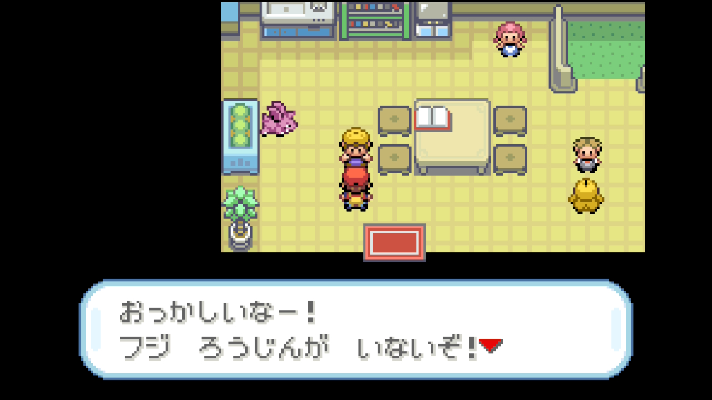

---

### ポケモンタワー突入 — ライバル戦

- ポケモンタワーに足を踏み入れると、2Fでライバルが待ち構えていた。「**おまえのポケモンしんだのか？**」と開口一番の煽り。カメール先頭で迎え撃つ。

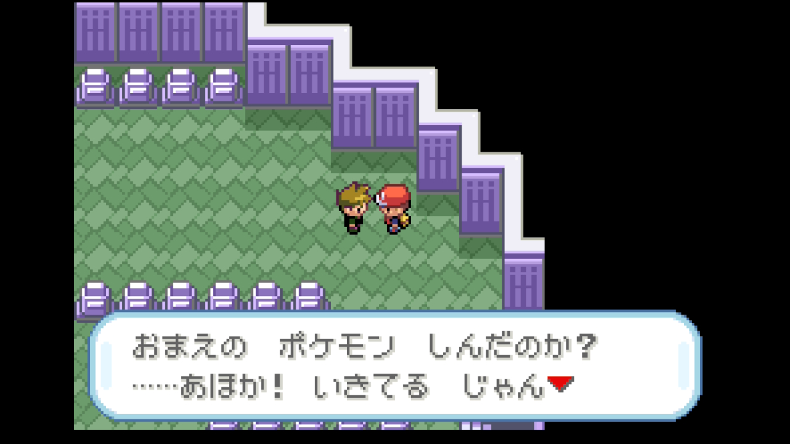

#### vs ピジョンLv25

カメールのかみつくで一撃。カメールがLv33に成長。順調な滑り出し。

#### vs フシギソウLv25 — ねむりごなの悪夢

カメールのかみつくで攻撃するも、フシギソウの攻撃が痛い。するとフシギソウが**ねむりごな**を使用。カメールが眠ってしまった。マンキーに交代してちきゅうなげを打とうとしたが、takanamito から「**ねむった**」の報告。マンキーも眠った！……と思ったら、「**いやマンキーはいまだしたばっかり**」。ごめん、交代直後だった。

カメールが眠ったまま攻撃を受け続けてHP38/90まで削られた。Claude が「マンキーに交代してちきゅうなげ」と指示。takanamito が「**いいきずぐすりは？**」と聞いてきたので、Claude が「眠り中は使えない」と答えたら「**え、つかえるっしょ**」。使える。回復アイテムは状態に関係なく使える。基本的な仕様を間違えた。しかもtakanamito が「**カメールやろ**」と突っ込む。マンキーに使おうとしていたが、眠ってるカメールに回復する方が先だろう。

カメールは3ターン経過しても目覚めず、ユンゲラーの**スプーンまげ**を2回食らって瀕死に。

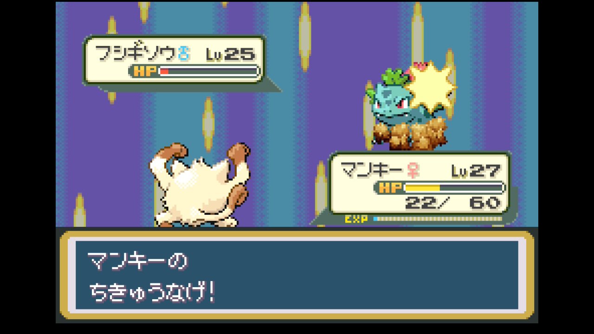

#### vs ユンゲラーLv20 — カメール沈没

ユンゲラーにはカメールのかみつく（あく→エスパーにばつぐん）が有効だが、カメールは眠ったまま一方的に殴られ続けて**戦闘不能**。マンキーに交代してちきゅうなげで処理した。

#### vs ギャラドスLv23 — あばれるの猛威

ここからが地獄だった。ギャラドスはみず/ひこう。Claude がピカチュウのでんきショック（4倍ばつぐん）を推奨して交代。しかしピカチュウLv17に対してギャラドスの**あばれるが一撃死**。レベル差がありすぎた。

次にズバットを出してちょうおんぱで混乱させようとしたが、これも**あばれるで一撃死**。

ディグダに交代。ここでディグダが**あなをほるで地中に潜って回避**！あばれるは2〜3ターン使い続けた後に混乱するので、地中で時間を稼ぐ作戦。あなをほるの攻撃はじめんタイプだがギャラドスのひこうタイプで**こうかなし**。ダメージは与えられないが、回避手段として機能した。

そしてついに**ギャラドスが混乱！** しかしディグダも次のあばれるで**戦闘不能**。

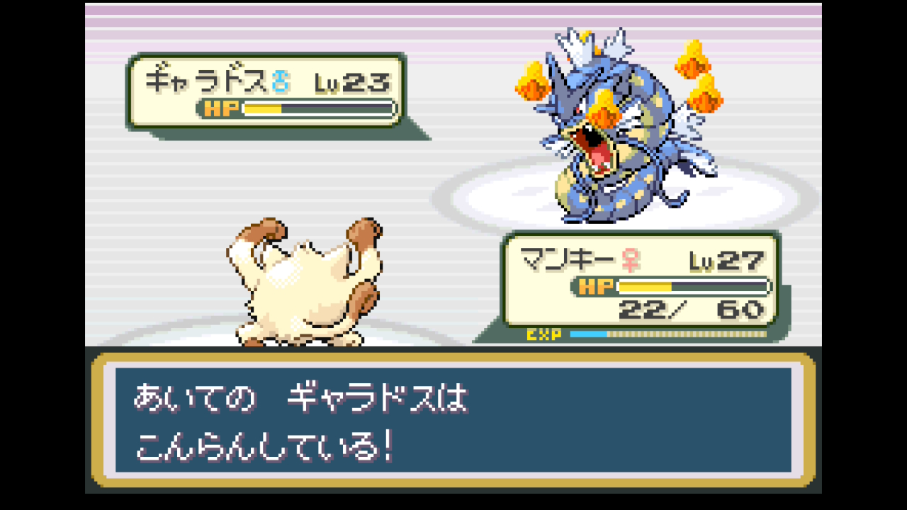

残るマンキー（HP22/60）を投入。takanamito が「**かわらわりとかは？**」と聞いてきたので確認。かわらわり（かくとう一致×1.5、ひこうにいまひとつ×0.5）= 実効威力56 > ちきゅうなげ（固定27）。かわらわりの方が強い。混乱中のギャラドスを削り続けたが、ここでマンキーも**あばれるで戦闘不能**。

あばれるだけで**ピカチュウ・ズバット・ディグダ・マンキーの4匹が壊滅**。恐ろしい技だ。

#### vs ガーディLv22 — カメールの意地

残ったカメール（瀕死寸前）とパラスでギャラドスを何とか倒し、最後のガーディに対してカメールのみずのはどうが**一撃**。

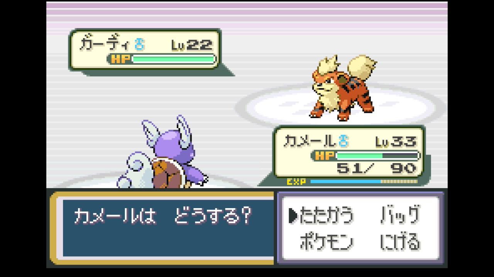

ライバルを撃破！しかし4匹戦闘不能という大被害。あばれるの火力を完全に見誤っていた。ピカチュウをギャラドスに出す判断が最悪だった。Lv17をLv23の暴れ馬に差し出すのは無謀すぎた。

---

### ズバット引退

- ポケモンセンターで回復後、パーティ編成を見直す。takanamito から「**パーティってズバット入れっぱなしでいいの？**」と質問。

- ズバットはLv15で圧倒的に弱く、きゅうけつ・ちょうおんぱだけでは戦力にならない。ゴルバットに進化してもLv22が必要で、最終進化のクロバットはなつき進化で手間がかかる。**ズバットをボックスに預けて5匹体制**で進むことに。

---

### ポケモンタワー探索 — きとうしラッシュ

- ポケモンタワーの上層を探索。各フロアにきとうしが待ち構えている。相手はほぼ全員**ゴース**（ゴースト/どく）。カメールのかみつく（あく→ゴーストにばつぐん×2.0）が刺さりまくる。

- ここでtakanamito が「**カメール以外に育てるやついない？相性いいやつで**」と質問。Claude は自信満々に「**ディグダが最適！じめん技がどくタイプにばつぐん**」と回答。実効威力240と計算まで出した。するとtakanamito が一言「**ふゆうでじめん技無効**」。

ゴース系は特性「ふゆう」を持っているため、じめんタイプの技は一切通らない。相性表だけ見て特性を完全に忘れていた。結局カメールのかみつくで全部倒すしかない。takanamito が「**ピカチュウは？**」と提案してくれたが、でんきショックは等倍でLv17では効率が悪く断念。

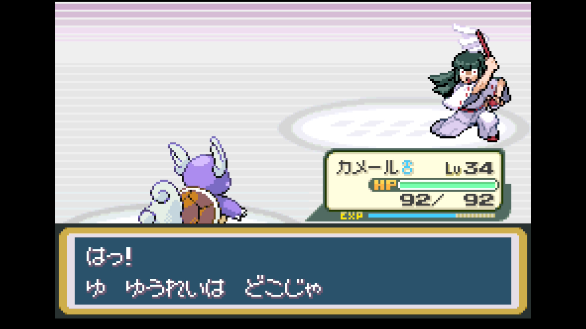

#### 野生のゆうれい

- 探索中に**野生のゆうれい**が出現。「**だめだ！ゆうれいポケモンのしょうたいがわからない！**」。シルフスコープがないと正体を見破れず、捕獲も攻撃もできない。逃げるしかない。

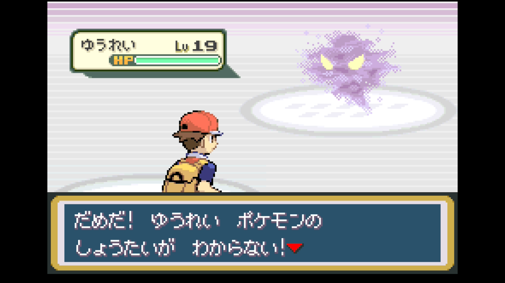

- 「**シルフスコープさえあればみやぶれるかもしれないが**」というNPCの情報を得た。シルフスコープの入手が今後の課題。

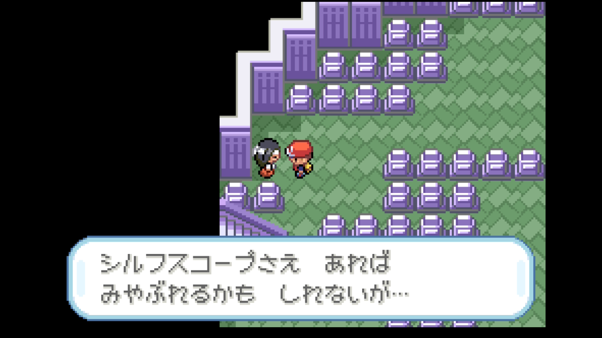

#### せいなる場所で全回復

- タワーの中層で**せいなるいのりにまもられた結界**に入り、パーティ全回復。助かった。**きよめのおふだ**も入手。takanamito が「**もたせたほうがいい？**」と聞くので、先頭ポケモンに持たせると野生ポケモンの出現率が下がる効果だと説明。カメールに持たせた。

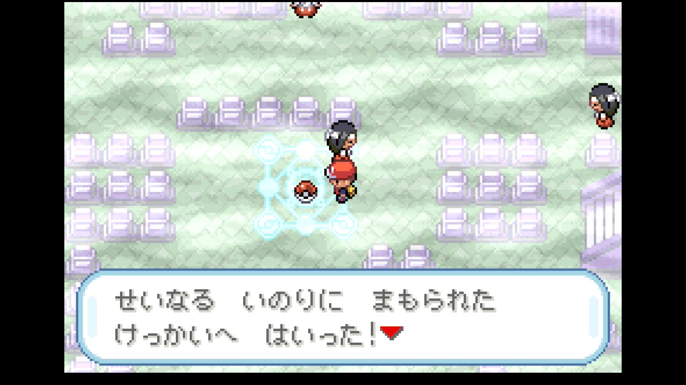

#### アイテム回収

- ポケモンタワー内で**ふしぎなあめ**、**きんのたま**、**ピーピーエイダー**、**スーパーボール**、**ヨクアタール**を回収。ふしぎなあめは貴重品なので大事に取っておく。

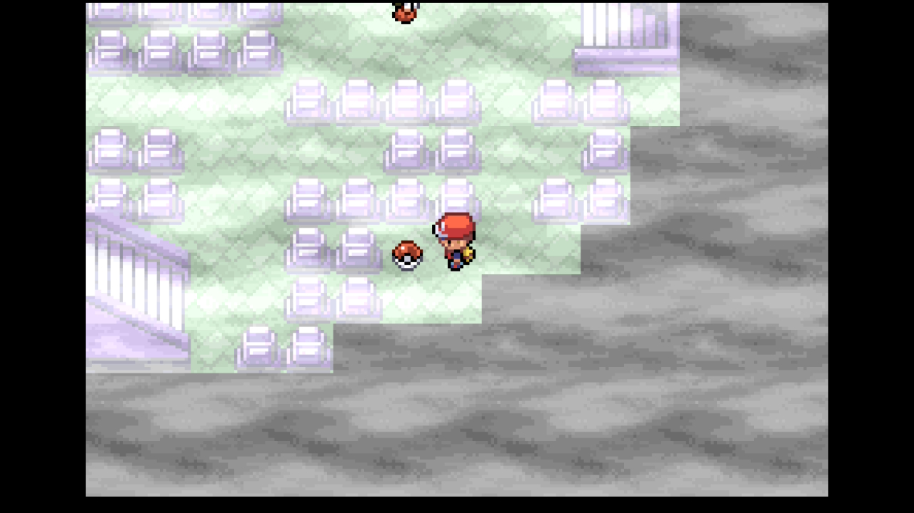

#### タチサレ

- 最上階手前で「**タチサレ……ココカラタチサレ……**」と警告が出て、先に進めない。シルフスコープがないとこの先は攻略不可。ディグダのあなをほるでタワーを脱出した。

---

### カメックス進化

- 8番道路のトレーナー戦中、りかけいのおとこのベトベター戦で「**おや、カメールのようすが……**」。カメールが**カメックスに進化**！

takanamito が「**まだおとなになるなよ**」と一言。進化拒否するのかと思いきや「**うるさ。カメックスにしました**」。ツンデレか。

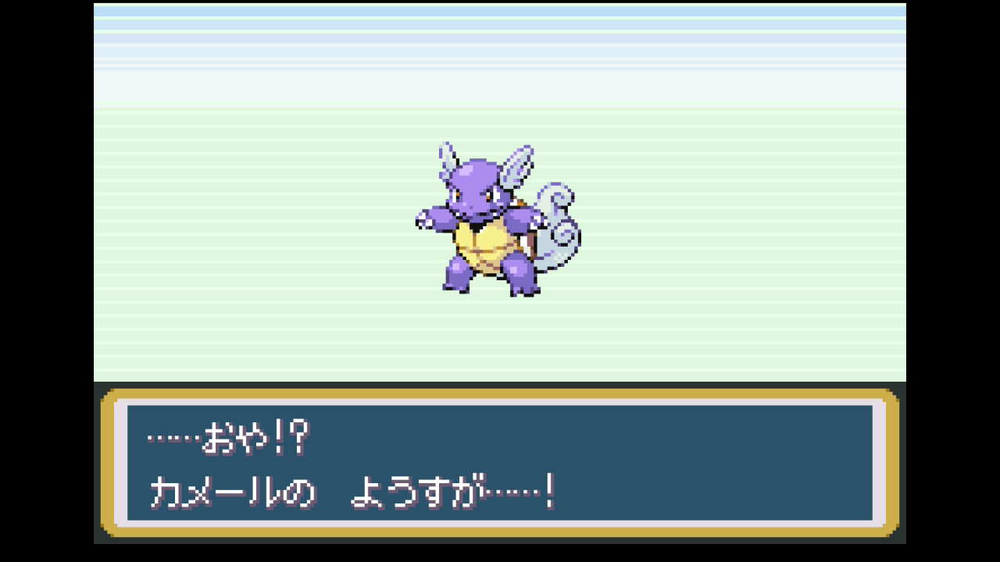

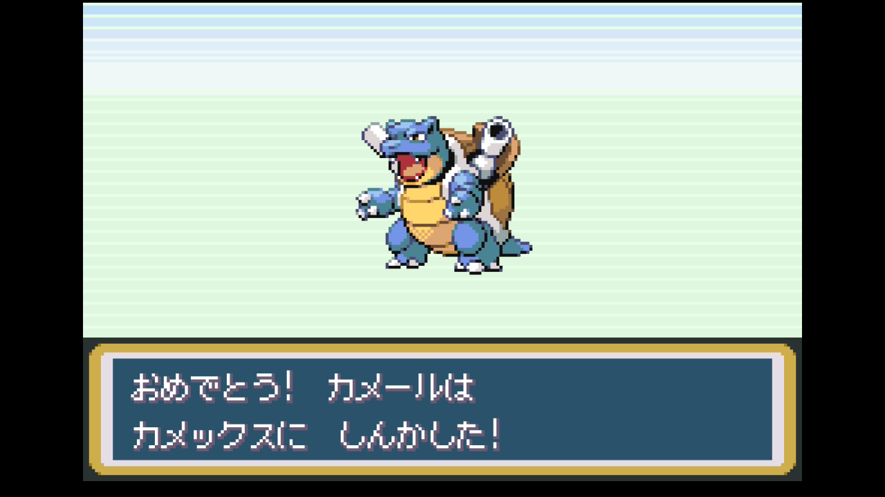

---

### 8番道路 — Claudeのタイプ相性ミス連発

- ポケモンタワーを一時撤退し、西のタマムシシティを目指す。8番道路でトレーナー連戦。

#### ギャンブラーのソウキ

- **ギャンブラーのソウキ**が登場。和風のおじいちゃんギャンブラー。takanamito が「**すごい和風のギャンブラー**」と感想。

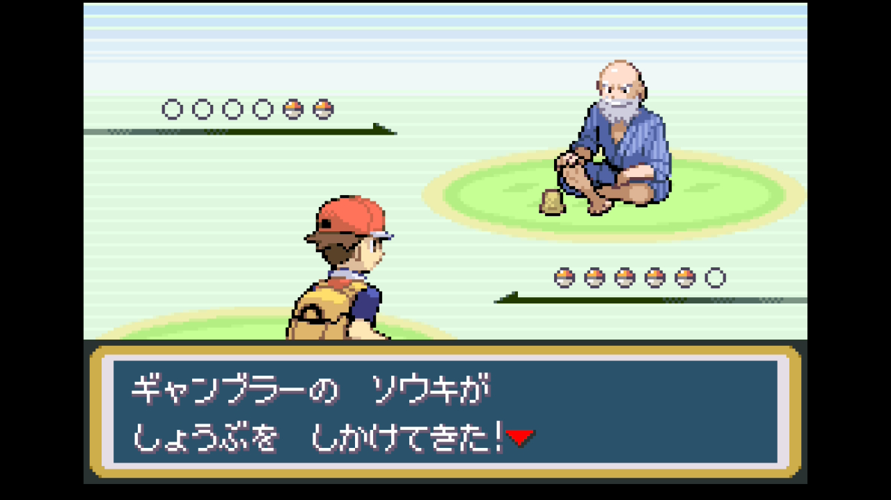

- ガーディとロコンが出てきた。Claude がピカチュウ先頭で「ほのおはピカチュウの弱点」と言ったところ、takanamito が「**弱点じゃないよ**」。でんきタイプの弱点はじめんだけ。ほのおは等倍。基本の基本を間違えた。

- ディグダに交代してあなをほる（じめん→ほのおにばつぐん）で一撃処理。takanamito が「**ディグダでもいけたわ**」と最初から分かっていた。Claude が最適解を見逃していた。

#### りかけいのおとこ — 3連続タイプ相性ミス

- **りかけいのおとこのみつお**。ベトベター→ベトベトン→コイルの3匹。

- ベトベトン戦でディグダがマグニチュードを打ったところ、Claude が「**マグニチュードはちいさくなるを使ったポケモンにダメージ2倍**」と豆知識を披露。takanamito が「**2倍の仕様なんてないやろ**」と一蹴。確証のない情報を断言する悪い癖がまた出た。結局ベトベトンの**ヘドロばくだんでディグダ戦闘不能**。

- 次のビリリダマ戦。Claude が「カメックスのみずのはどうで」と推奨したら、takanamito が「**逆や**」。カメックスはみずタイプでビリリダマのでんき技に弱い。パラスに交代（でんき技いまひとつ）していあいぎりで対処。

- 続いてコイル（でんき/はがね）が出てきて、パラスのいあいぎりが**いまひとつ**。takanamito が「**はがねあるからマンキーのほうがいいんじゃない**」。かくとう→はがねにばつぐん。最初からマンキーのかわらわりで行くべきだった。Claude の「**おまえ**」に対して、ここはもう言い訳のしようがない。

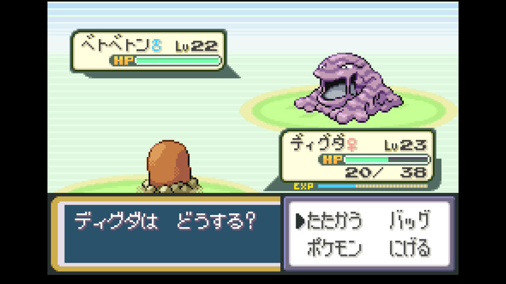

---

### 地下通路〜タマムシシティ到着

- 8番道路の先で「**のどがかわいた**」警備員が通行禁止にしている。正面突破はできない。

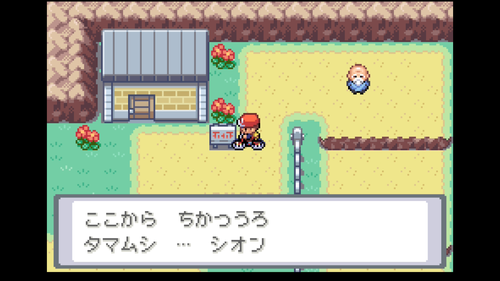

- 地下通路を通ってタマムシシティへ。7番道路に出ると「**いねむりポケモンがいる**」という情報を聞くが、今は関係なさそう。

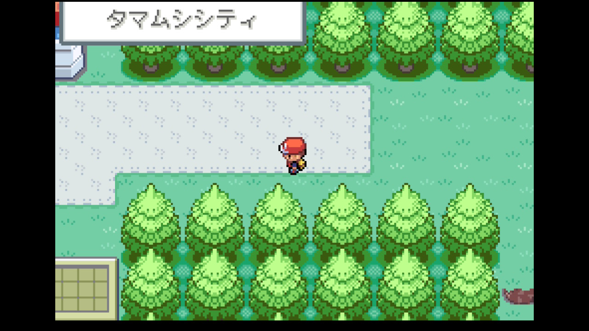

- **タマムシシティに到着！** いきなりロケット団員に絡まれた。「**めのまえをチョロチョロうるせえ！ロケットだんをなめるなよ！**」。この街にもロケット団が関わっているようだ。

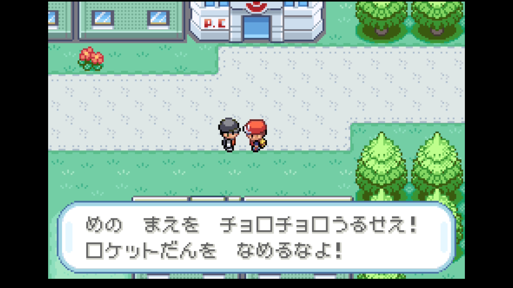

- ポケモンセンターで全員回復。

---

今回はClaude のタイプ相性ミスが過去最多レベルで噴出した回だった。ゴースにじめん技が効くと断言して「ふゆう」を忘れる、ほのおがでんきの弱点と言う、でんきにみずを出す、はがねにいあいぎりを続行する。そのたびにtakanamito が冷静に正してくれた。一方で、ライバル戦のギャラドスあばれる無双は衝撃的だった。4匹が一撃ずつやられていく様子はまさに地獄絵図。ディグダのあなをほる回避→混乱待ちという消極的な作戦でしか生き残れなかった。そしてカメックス進化という大きな節目。「まだおとなになるなよ」→「うるさ」のやりとりが今回のベストシーン。

## パーティ編成

| ポケモン    | Lv  | 技構成                                                  | 状態 |
| ----------- | --- | ------------------------------------------------------- | ---- |
| カメックス♂ | 36  | みずのはどう / かみつく / たいあたり / からにこもる     | 生存 |
| マンキー♀   | 27  | ちきゅうなげ / けたぐり / かわらわり / あなをほる       | 生存 |
| パラス♀     | 23  | いあいぎり / しびれごな / タネマシンガン / フラッシュ   | 生存 |
| ピカチュウ♀ | 17  | でんきショック / でんこうせっか / かげぶんしん / でんじは | 生存 |
| ディグダ♀   | 23  | なきごえ / マグニチュード / あなをほる / みだれひっかき | 生存 |

※ズバットはボックスに預け、ニドラン♂は育て屋に預け中

## 入手アイテム

| アイテム          | 備考                               |
| ----------------- | ---------------------------------- |
| きよめのおふだ    | ポケモンタワー・聖なる結界で入手   |
| ふしぎなあめ      | ポケモンタワー内で入手             |
| きんのたま        | ポケモンタワー内で入手             |
| ピーピーエイダー  | ポケモンタワー内で入手             |
| スーパーボール    | ポケモンタワー内で入手             |
| ヨクアタール      | ポケモンタワー内で入手             |

## 次の目標

- タマムシシティを探索する
- シルフスコープを入手してポケモンタワーに戻る
- ピカチュウの育成を継続（Lv17→Lv20を目指す）
- 4枚目のジムバッジを目指す
