# 017 - キョウ戦に向けた育成＆図鑑40種達成

## 日時

2026-03-28

## 現在地

シオンタウン西（7ばんどうろ付近）

## 攻略ログ

### 育成計画〜Claude の迷走

- サファリゾーンでなみのり・かいりきを入手した後、キョウのジムに向けてレベル上げを開始。Claude が最初に提示した育成目標が**カメックスLv45、カビゴンLv40、ニドキングLv35**と、やたらと高い目標だった。takanamito が「**レベル上げで9ってなくない？設計がおかしい**」とバッサリ

- さらに Claude は「ヤマブキシティのシルフカンパニーを先に攻略するのが一番いい」と提案してしまい、takanamito から「**じゃあなんのためにセキチクシティに来たん**」と突っ込まれる。**なみのりとかいりきを取るためだ**。目的は達成しているのに、自分の提案を覆すのは司令塔失格だ

- レベル上げ場所についても「**なみのりで水上のトレーナーを探そう**」と提案したら、takanamito が「**なみのりしたら水ポケなわけやから、ニドキング相性悪いやん。ちゃんと考えて**」と正論。ニドキングはじめんタイプで水に弱い。水上でレベル上げは最悪の選択肢だった

- 反省して育成目標を下方修正。カメックスLv43、他はLv30-36程度に抑えた

### パーティ入れ替え

- ジム戦ではじんすけ（ひでん要員）を預けるので6匹目を何にするか議論。Claude はピカチュウを推したが、takanamito が「**サファリゾーンで捕まえたやつらは？**」と提案。**タマタマ**がくさ/エスパーでキョウ（どく）にばつぐんを突ける最適候補と判明。さらに「**セキチクシティの次から逆算して決めて**」と言われ、今後のサカキ（じめん）にもくさ技が有効なことから、タマタマ→ナッシー育成を決定

- 育成中のパーティはピカチュウとじんすけを預けて、ブースター（あなをほる習得済み）を復帰させた

- ちなみに Claude は「ニドキングのあなをほるでベトベトンを倒そう」と何度か言っていたが、takanamito に「**ニドキング、あなをほる覚えさせてないけど**」と指摘された。TM28はブースターに使用済み。**またやらかした**

### セキチクシティ東のトレーナー戦

- セキチクシティの東でトレーナーラッシュ。とりつかいが多く、ひこうタイプのポケモンが次々登場

- トレーナーの**プクリン**に遭遇。takanamito が「**トレーナー戦でプクリンきた。めずらしい**」と反応。ノーマルタイプだからオコリザルのクロスチョップでばつぐんだ

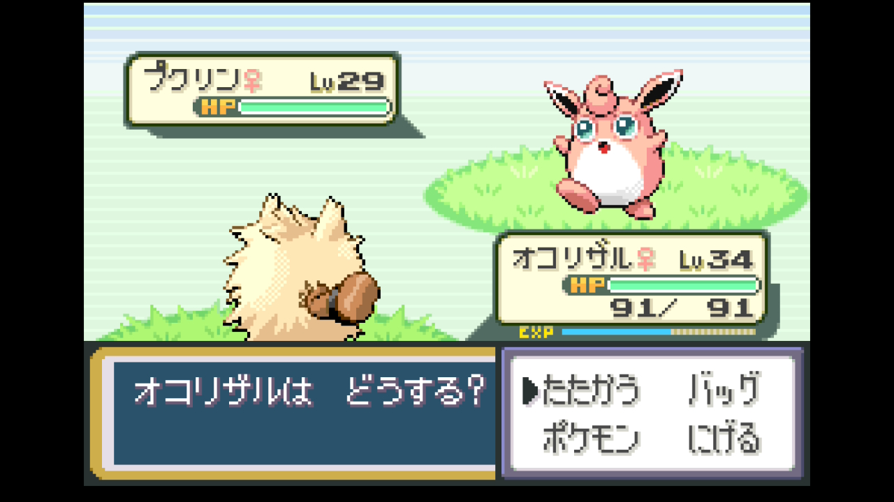

- **ライチュウ**も登場！10まんボルトを撃ってきた。オコリザルがくらう

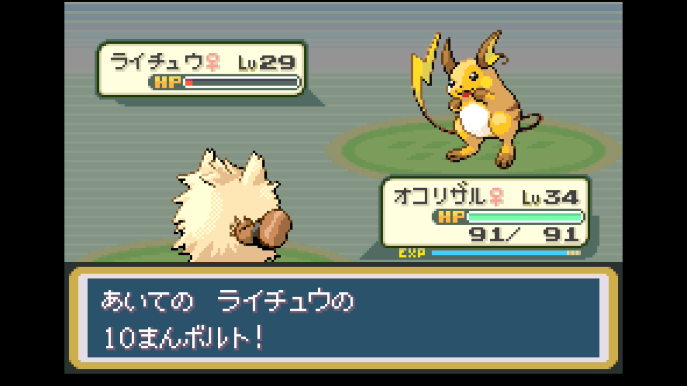

- トレーナーの**ドードリオ**も出てきた。takanamito が「**かっこいい**」と感心。ドードーの進化系で素早さが高い

#### オコリザルLv35〜クロスチョップ習得

- オコリザルがLv35に到達し、**クロスチョップ**を習得！かくとうタイプ・威力100・命中80・急所に当たりやすい大火力技。けたぐりを忘れて覚えさせた。かわらわり（威力75・命中100の安定枠）との使い分けができるようになった

### かくとうきょうだいのてつとちか

- **かくとうきょうだいのてつとちか**とダブルバトル！相手はかくとうタイプ使い。こちらはカビゴンとオコリザルで出撃したが、カビゴンはノーマルタイプだからかくとう技でばつぐんを受ける危険がある。カメックスに交代した

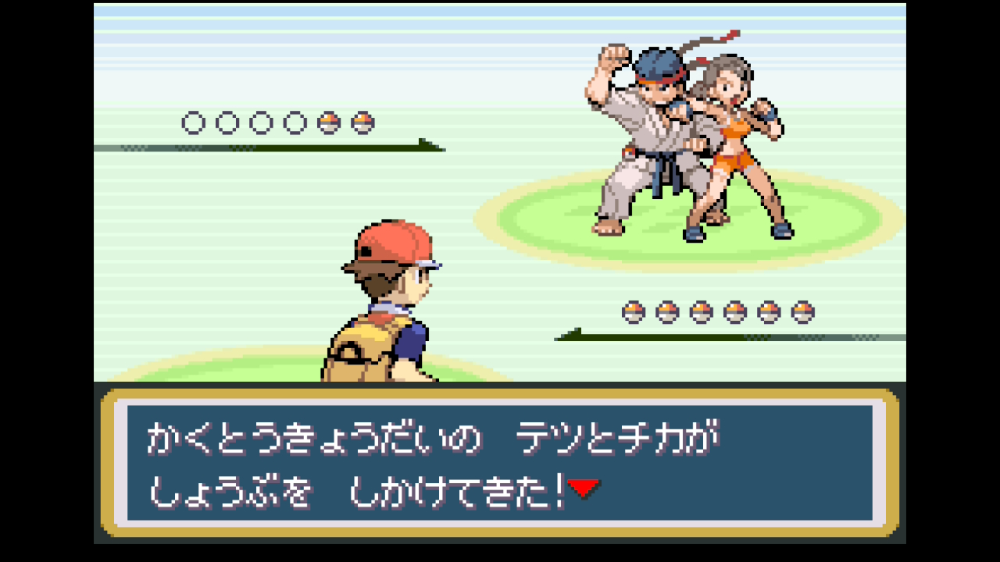
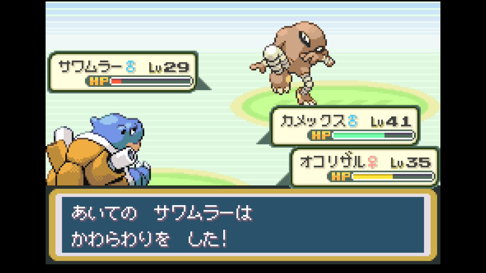

- 道中で**ピッピ**がコスモパワー（ぼうぎょ・とくぼうを同時UP）を積んできた。takanamito が「**ピッピのコスモパワーすご**」と驚き。積まれる前にオコリザルのクロスチョップで処理

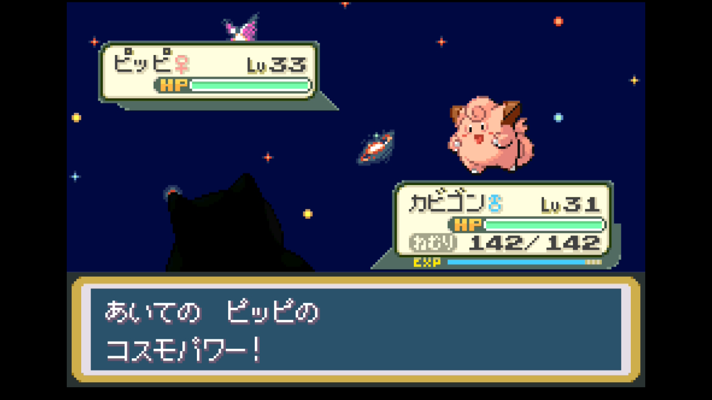

### ふたごちゃんのきりとえな

- **ふたごちゃんのきりとえな**とダブルバトル。相手は**ヒトカゲとゼニガメ**。御三家コンビだ。カビゴンとオコリザルで迎え撃ち、おんがえしとクロスチョップで処理

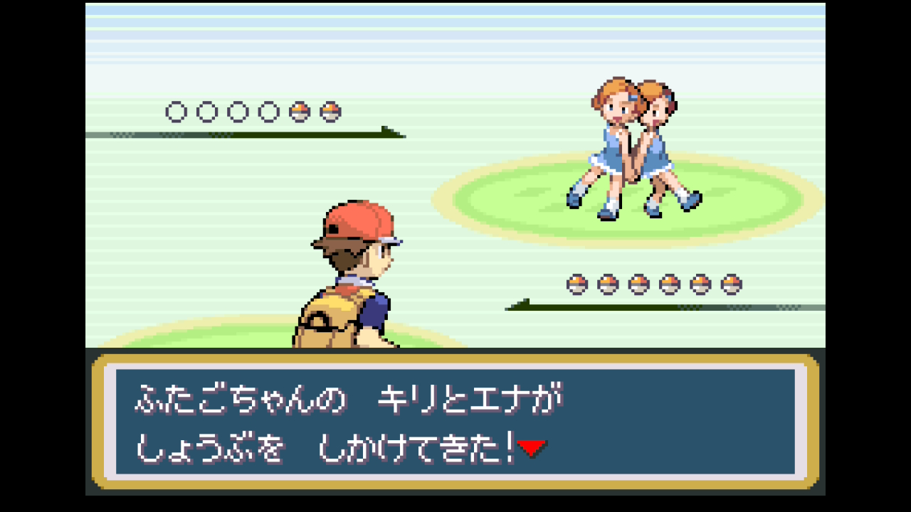

#### カビゴンLv33〜のしかかり見送り

- カビゴンがLv33に到達。**のしかかり**（ノーマル・威力85・30%まひ）を覚えるか聞かれたが、おんがえし（威力最大102）の方が火力が高いので見送り。まひの追加効果は魅力的だが、火力を優先

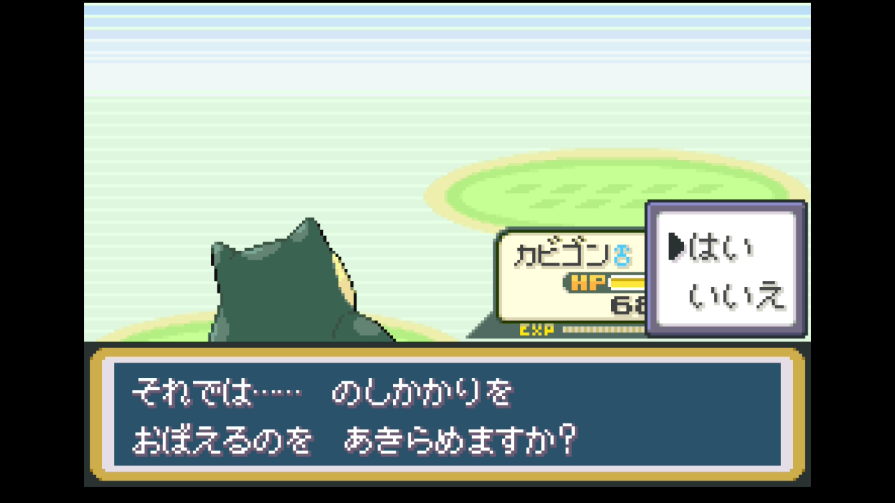

- カビゴンはトレーナーのオニドリルとも戦った。おんがえしが安定火力を発揮

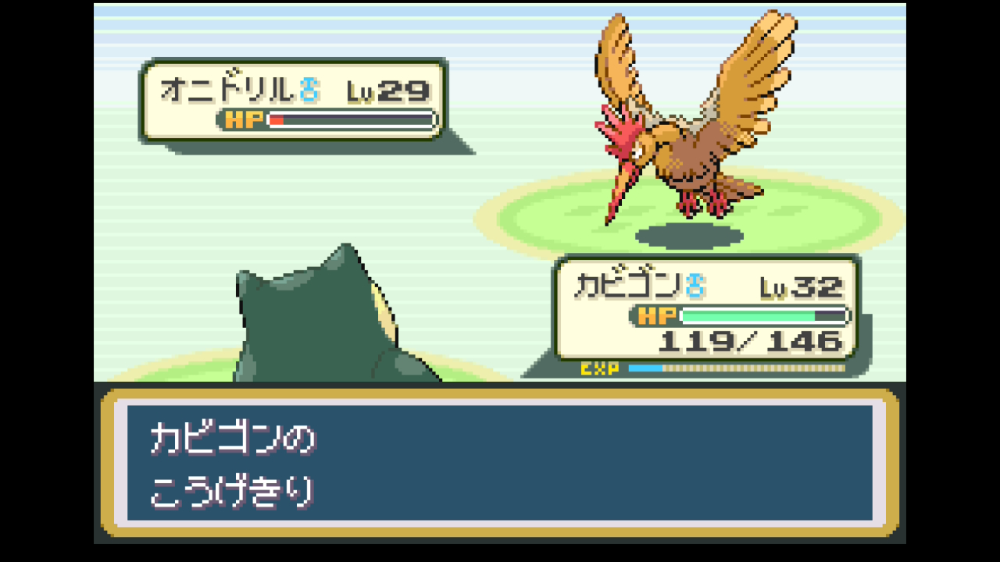

### ニドキングLv30到達

- ニドキングがLv30に到達し、育成目標クリア。Lv24からの+6レベルアップ

### ブースターLv30〜かみつく習得

- ブースターもLv30に到達し、**かみつく**（あくタイプ・威力60・30%ひるみ）を習得。てだすけを忘れて覚えさせた。あくタイプの攻撃でエスパーやゴーストにばつぐんを突ける

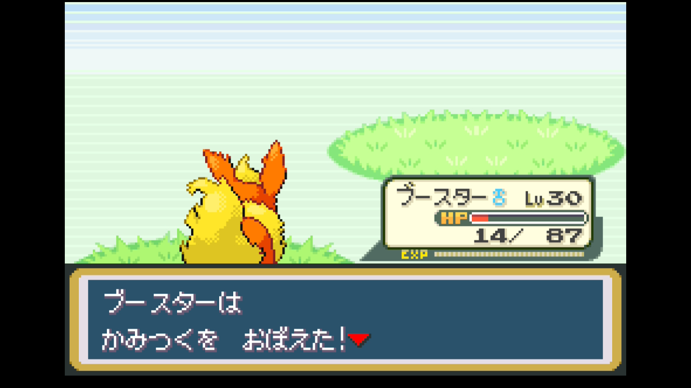

- クラブLv20も捕獲。図鑑37種目

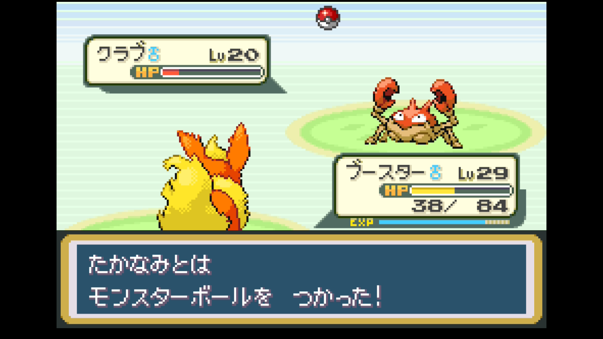
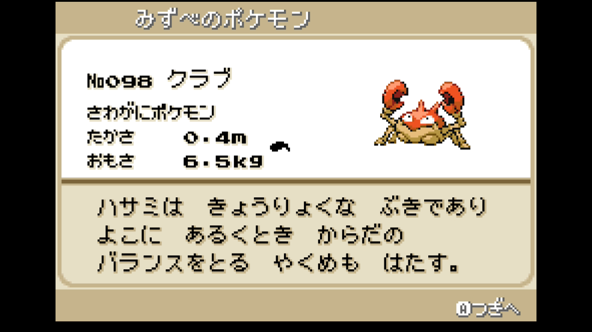

### 資金集め〜かえんほうしゃへの道

- 所持金が61,000円に到達。かえんほうしゃ（TM35）は80,000円相当だから、あと19,000円必要。Claude が「**タウリンとブロムヘキシンを売れば9,800円**」と提案したが、takanamito が「**もったいなくない？**」と却下。確かにステータスUPの貴重アイテムを売るのはもったいない

- 代わりにカバンの中の売却専用アイテムを確認。**しんじゅ×1、きんのたま×2、ほしのすな×1**で合計11,700円。全部売って72,700円に。残り7,300円はトレーナー戦で稼ぐ

### 図鑑40種達成〜おまもりこばんへ

- おまもりこばん（持たせると賞金2倍）の条件が図鑑40種。あと4種を埋めるため、各地を回ってポケモンを捕獲

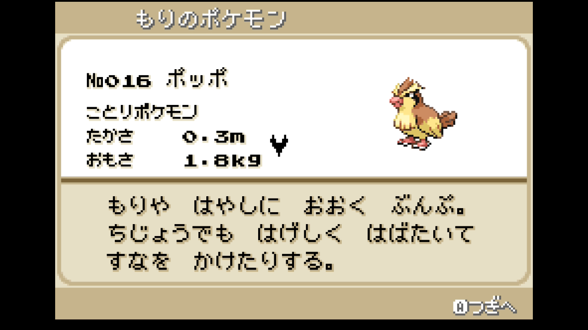
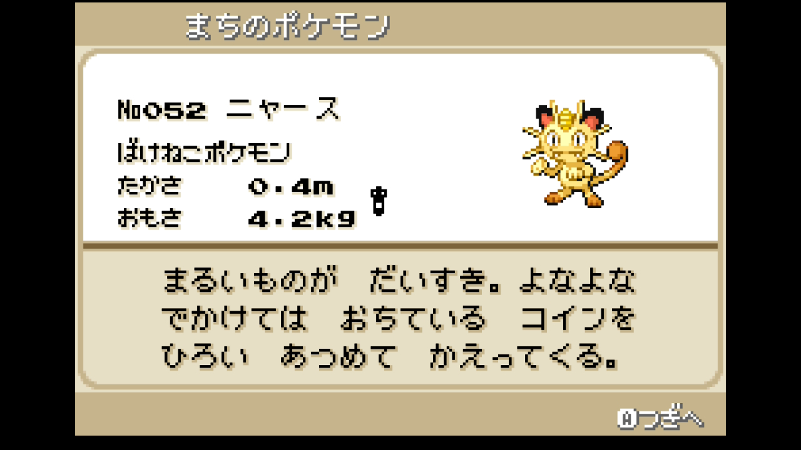
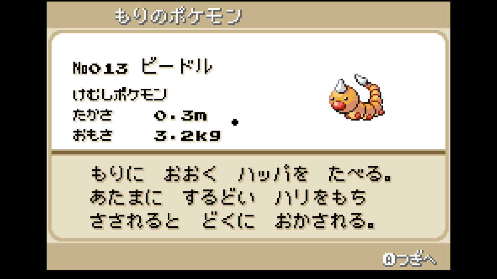

- **クラブ**（37種）→ **ポッポ**（38種）→ **ニャース**（39種）→ **ビードル**（40種）と立て続けに捕獲し、ついに**図鑑40種達成！**

- Claude が「12ばんどうろの助手のところに受け取りに行こう」と案内したら、takanamito が「**どこよそれ**」と困惑。正しくは**セキチクシティの東のゲート**だった。**また場所を間違えた**。これから受け取りに行く

### 道中で拾ったきのみ

- 道中でパイルのみ、チーゴのみ、ヒメリのみ、ラムのみなど各種きのみを拾った

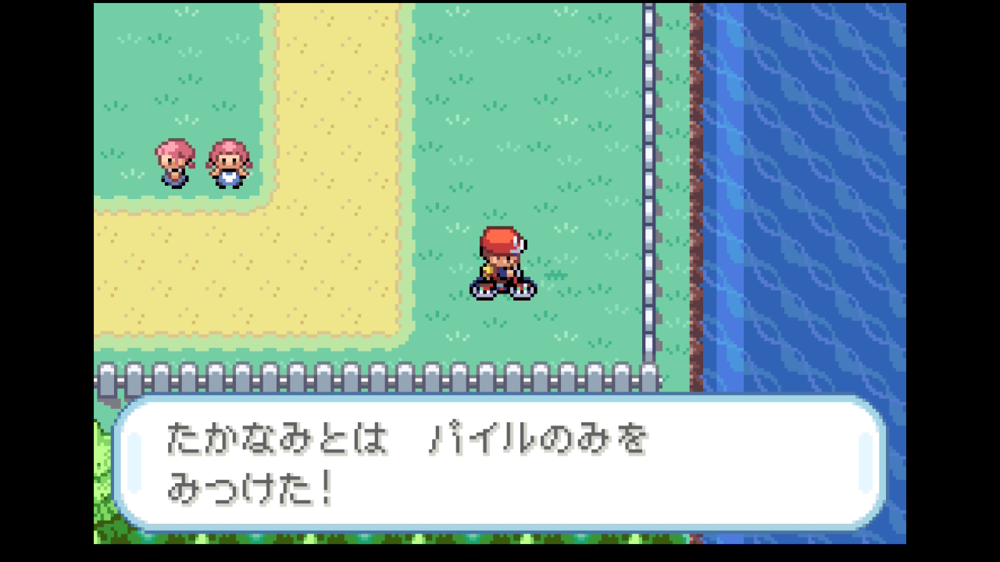

### おまもりこばん入手

- 図鑑40種達成で**おまもりこばん**を入手。Claude は「セキチクシティ東ゲートで受け取れる」と案内したが、takanamito が向かうと「**セキチクシティ東のゲートは50種でがくしゅうそうちがもらえる場所だった**」と判明。正しくは**16ばんどうろのゲート2階**だった。またやらかした

- おまもりこばんを誰に持たせるか議論。takanamito が「**先頭のポケモンに持たせるべきじゃない？**」と提案し、先頭の**オコリザル**に持たせることに

### カメックスLv42〜あまごい習得

- カメックスがLv42に到達し、**あまごい**を習得。5ターン間みず技の威力が1.5倍になる天気技で、なみのりとの相性が良い。ほぼ使わない**たいあたり**（威力35）を忘れて覚えさせた

### かえんほうしゃ入手〜ブースター強化

- タマムシシティのゲームコーナーで**コイン4000枚**を購入（80,000円相当）し、景品交換所で**わざマシン35（かえんほうしゃ）**を入手

- **ブースター**に覚えさせた。**すなかけ**（補助技・ほぼ使わない）を忘れてかえんほうしゃを習得。ほのおタイプ一致・威力95で実効威力142。ブースターの主力技がようやく完成した

### キョウジム挑戦〜全滅

- ジム前にパーティを整備。**タマタマ**（くさ/エスパー・Lv25）をパーティに加え、じんすけをボックスへ。タマタマはねんりき（エスパー技）でキョウのどくタイプにばつぐんを突ける。カビゴンには**カゴのみ**を持たせた（ねむる→即起きコンボ用）

- キョウのジムはジャグラートレーナーが多く、ドードーやスリープ系を使ってきた。takanamito が「**このジム、エスパータイプばっかりやん。ナツメのジムとかぶってんちゃう**」とツッコミ。どくタイプジムなのにトレーナー手持ちはエスパー寄りという不思議な構成だった

- キョウ戦が始まった。1匹目の**ドガース**（どく・ふゆう・Lv37）はカメックスのなみのりで撃破。順調な立ち上がりに見えた

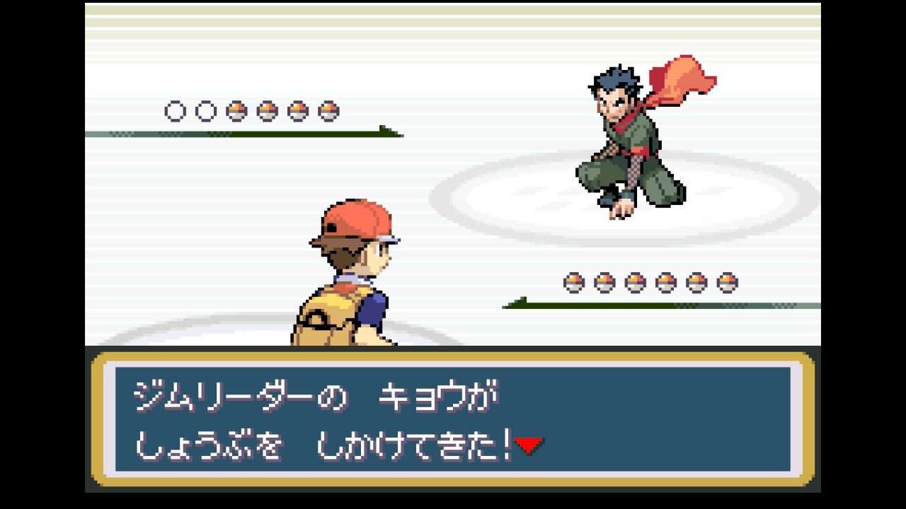

- 2匹目の**ベトベトン**（どく・Lv39）が登場してから地獄が始まった。**ちいさくなる**と**とける**を連発して回避率・防御を爆上げし、さらに**すごいきずぐすり**で回復してくる三重苦。カメックスがどく状態になりHP23まで削られ、オコリザルも道連れになった

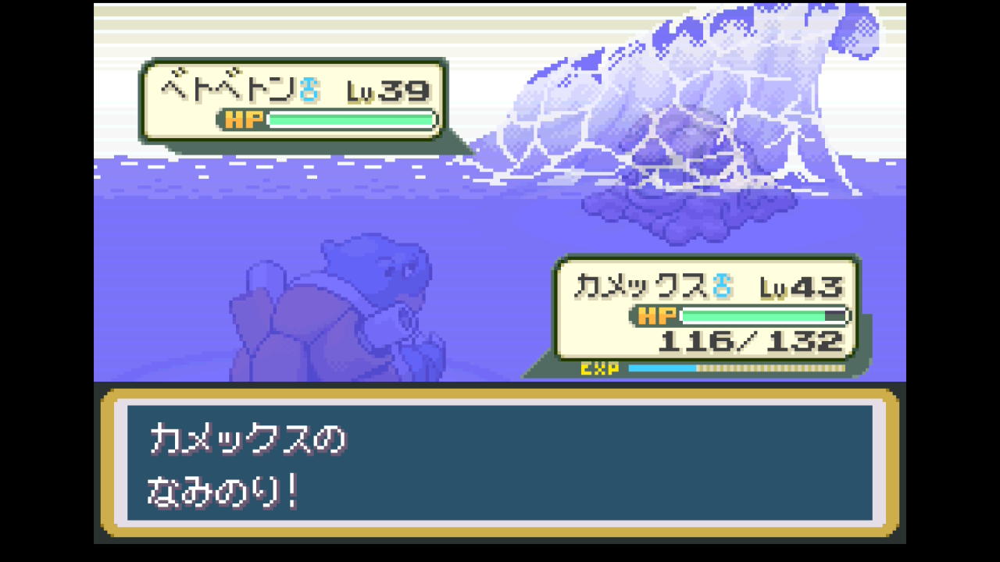
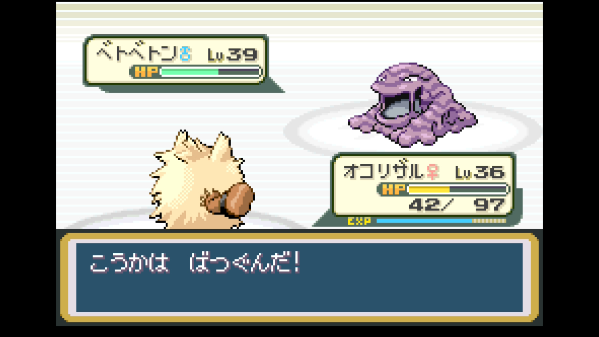

- ブースターの**あなをほる**（じめん技・実効威力160）で挑むも、回避率が高すぎてほとんど当たらない。ブースターも撃沈

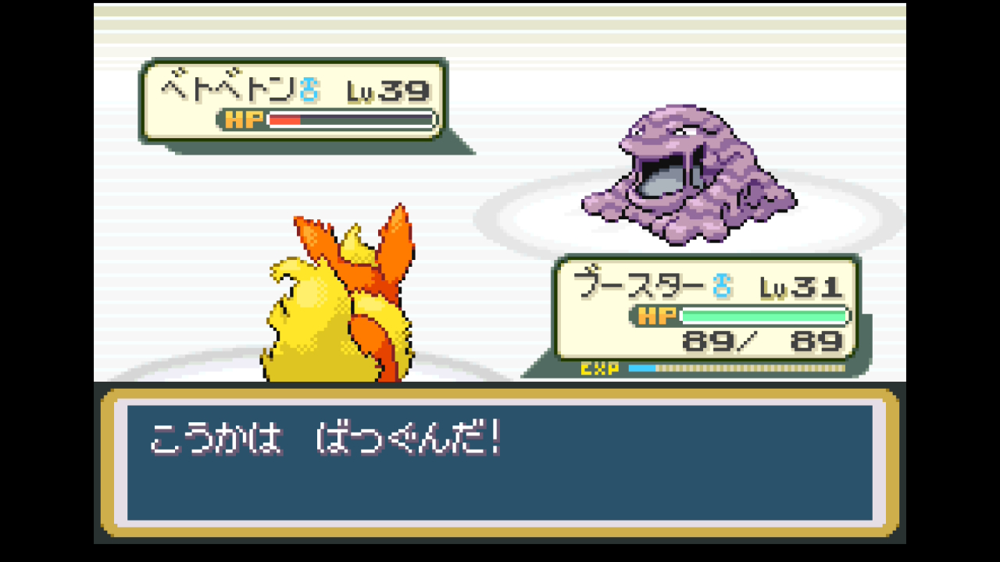
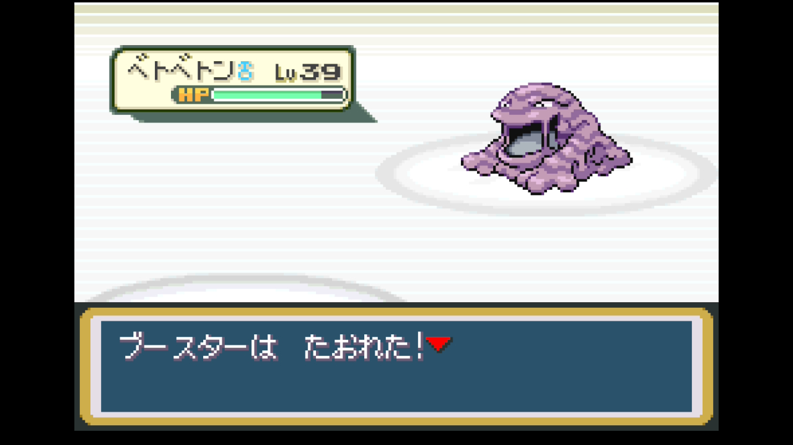

- カビゴンの**あくび**で眠らせることに成功。しかし眠っていても回避率は維持されており、おんがえし（物理技）はとけるの防御上昇でまったくダメージが入らない。takanamito が「**全然ダメージが入らん**」と嘆き、タマタマのやどりぎのタネで削る作戦に切り替えたが「**寝てるのにかわされた**」と外れる始末。カビゴン・タマタマも次々と倒れた

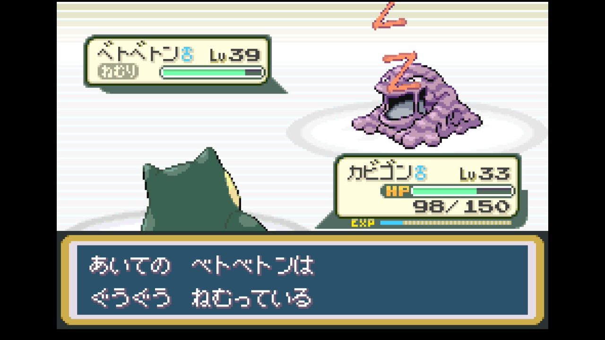
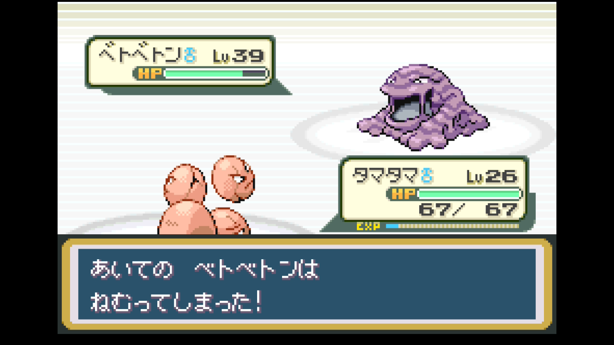

- 最後に残ったニドキング（HP満タン）がベトベトンと対峙。つのでつきを連打してギリギリで撃破に成功した

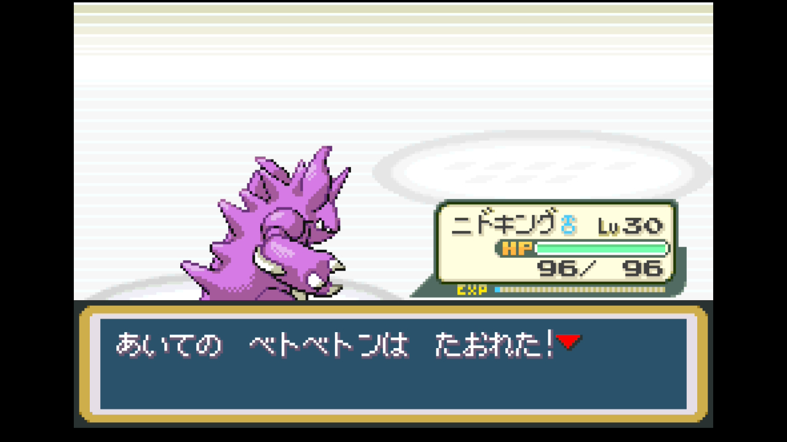

- 3匹目の**ドガース**（Lv37・ふゆう）が登場。ふゆうでじめん技無効のため、つのでつき（ノーマル・等倍）で応戦。しかしほとんどダメージが通らず、HPが危なくなったドガースが**自爆**でニドキングを道連れにした。全員倒れ全滅

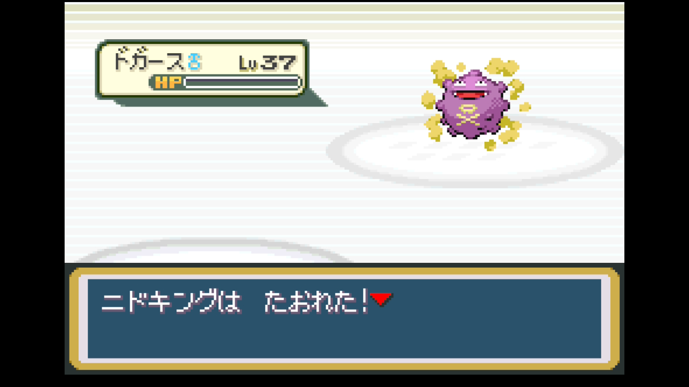
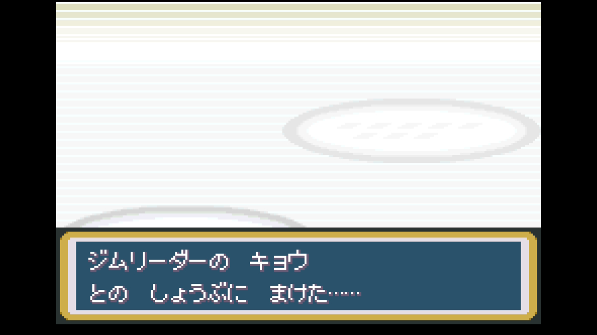
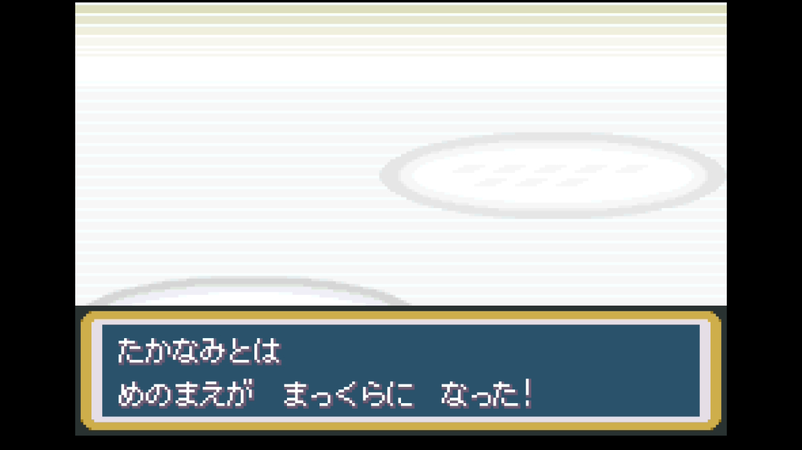
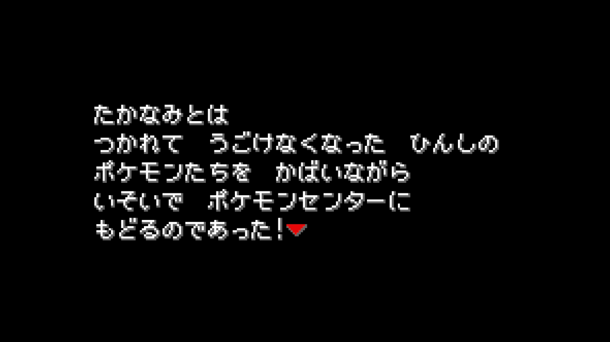

- ポケモンセンターに送還。takanamito は「リセットはしません」と宣言。次回は**ベトベトンが積む前に速攻で倒す**戦術が鍵になる

## パーティ編成

| ポケモン       | Lv  | タイプ         | 技構成                                                    | 持ち物       |
| -------------- | --- | -------------- | --------------------------------------------------------- | ------------ |
| カメックス♂   | 42  | みず           | なみのり / みずのはどう / かみつく / あまごい             | くろいメガネ |
| オコリザル♀   | 35  | かくとう       | ちきゅうなげ / クロスチョップ / かわらわり / あなをほる   | おまもりこばん |
| カビゴン♂     | 33  | ノーマル       | おんがえし / あくび / ねむる / かいりき                   | カゴのみ     |
| ニドキング♂   | 30  | どく/じめん    | にどげり / どくばり / つのでつく / てだすけ               | -            |
| ブースター     | 30  | ほのお         | かえんほうしゃ / かみつく / あなをほる / でんこうせっか   | -            |
| タマタマ       | 25  | くさ/エスパー  | リフレクター / やどりぎ / ねんりき / しびれごな           | -            |

### ボックス預け

| ポケモン     | Lv  | タイプ         | 備考                 |
| ------------ | --- | -------------- | -------------------- |
| じんすけ(カモネギ) | 22 | ノーマル/ひこう | キョウジム用にボックスへ / ながねぎ持ち |
| ピカチュウ♀ | 24  | でんき         | ボックス             |
| パラス♀     | 23  | くさ/むし       | 元ひでん要員         |
| ディグダ♀   | 23  | じめん         | ボックス             |
| ドードー     | -   | ノーマル/ひこう | 役割終了             |

## 入手アイテム

| アイテム           | 入手場所         | 備考                           |
| ------------------ | ---------------- | ------------------------------ |
| パイルのみ         | 道中             | きのみ                         |
| チーゴのみ         | 道中             | きのみ                         |
| ヒメリのみ         | 道中             | きのみ                         |
| ラムのみ           | 道中             | 状態異常回復きのみ             |
| おまもりこばん     | 16ばんどうろゲート2階 | 図鑑40種達成報酬、オコリザルに持たせた |
| わざマシン35（かえんほうしゃ） | タマムシシティゲームコーナー | コイン4000枚で交換、ブースターに習得 |

## 捕獲ポケモン

| ポケモン | Lv  | タイプ         | 捕獲場所           | 備考       |
| -------- | --- | -------------- | ------------------ | ---------- |
| クラブ   | 20  | みず           | セキチクシティ東   | 図鑑37種目 |
| ポッポ   | 18  | ノーマル/ひこう | シオンタウン西     | 図鑑38種目 |
| ニャース | -   | ノーマル       | シオンタウン西     | 図鑑39種目 |
| ビードル | -   | むし/どく       | シオンタウン西     | 図鑑40種目 |

## 次の目標

- キョウのジムにリベンジ（ベトベトン速攻撃破が鍵）
- レベル上げ（全滅したのでパーティ強化）
- カメックスをLv43まで育成（あと+1）
- オコリザルをLv36まで育成（あと+1）
- タマタマをナッシーに進化させる（リーフのいし使用）
- ダウジングマシン回収（50種でがくしゅうそうちも入手可能）
