# 021 - ゲンガー無双＆ヤマブキジム制圧

## 日時

2026-04-02

## 現在地

ヤマブキシティ（ナツメ撃破後）

## 攻略ログ

### ロケット団撤退後のヤマブキシティ

- シルフカンパニーを制圧したことで、ヤマブキシティからロケット団が完全に撤退。NPCたちが「**ばんざーい！**」と歓喜の声を上げている

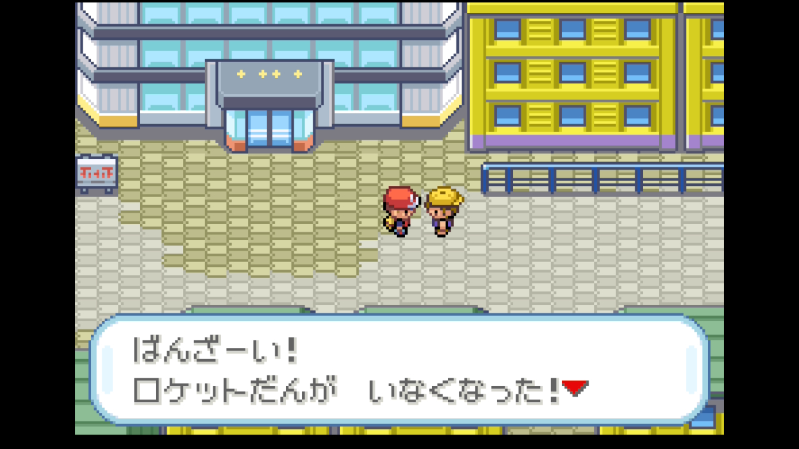

- 「ロケットだんをたったひとりでやっつけた」とNPCに称賛された。シルフカンパニー攻略の功績が街中に広まっているようだ

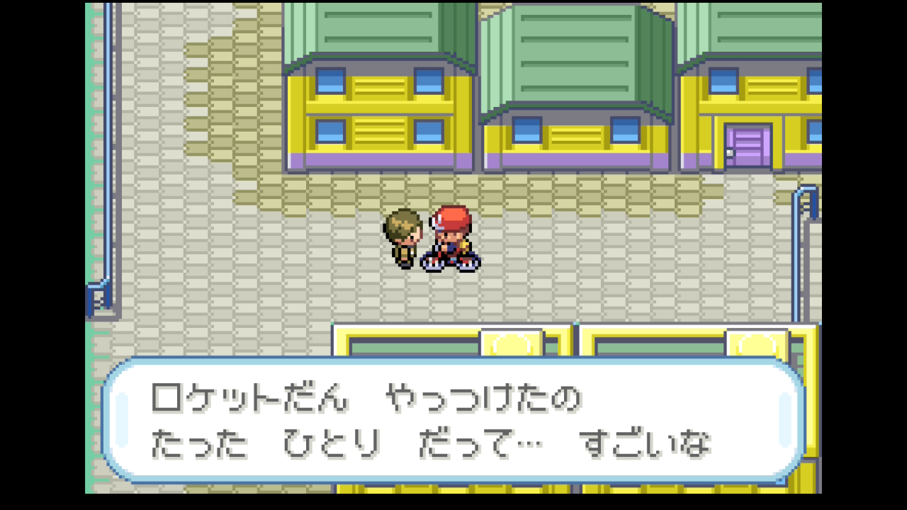

### モノマネむすめの家

- ジムに向かう前にヤマブキシティを散策。モノマネむすめの家を訪問した

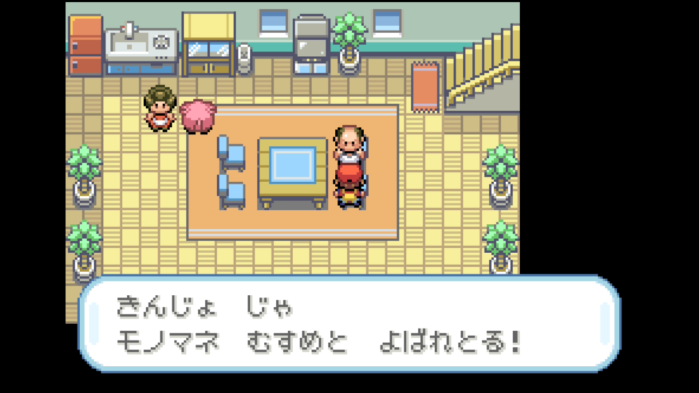

- 部屋にはピカチュウのぬいぐるみが並んでいる。takanamito が「**ドードーがしゃべった。ピカチュウぬいぐるみもある**」と報告。Claude は「演出で特に何もない」とバッサリ切り捨てたが、せっかくの寄り道なので記録に残しておく

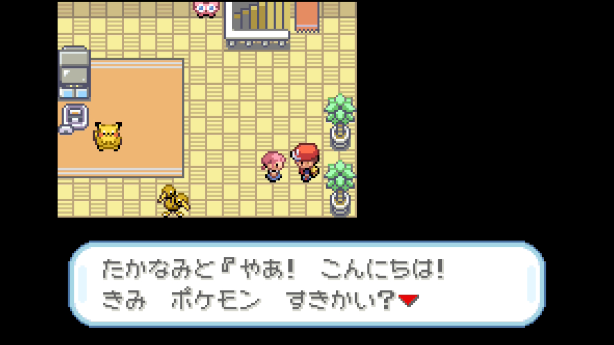

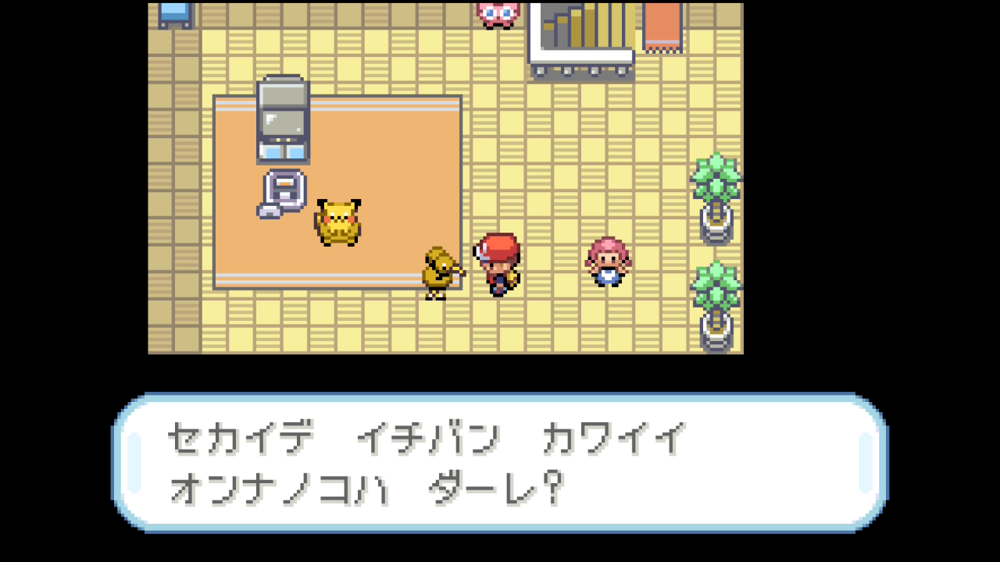

- 「これは珍しいポケモン！？……ぬいぐるみだった」というお茶目なNPCも

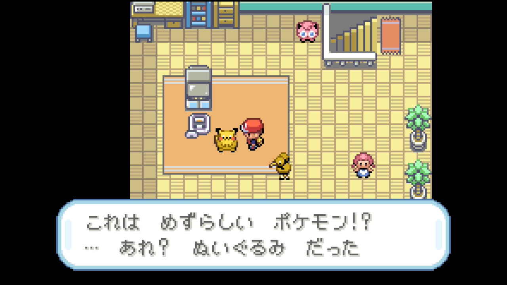

- モノマネむすめがゲームの話をしていて、takanamito が「**マリオがバケツをかぶってるゲームをやってる。なんだっけ**」と質問。Claude は「ワリオランドじゃないかな！」と答えたが、正解かどうかは不明。そもそもバケツをかぶるマリオとは……？

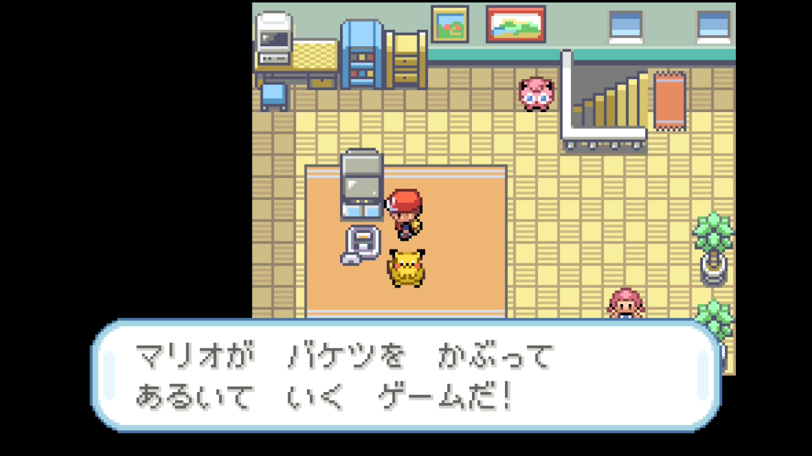

### 準備 — なんでもなおし大量購入＆ゲンガー育成

- ヤマブキシティ到着後、ジムに向かうNPCと遭遇。ピジョットで飛んできたらしい

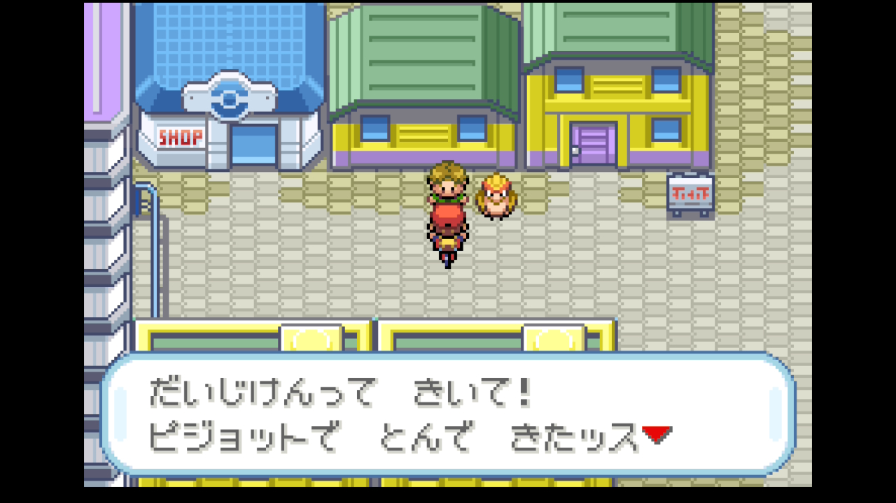

- ジム戦に備えてショップでなんでもなおしを10個まとめ買い。takanamito は最初「まひ、どく、ねむけざまし10個ずつ補充するわ」と言っていたが、最終的に**なんでもなおし10個**に一本化した。合理的だ

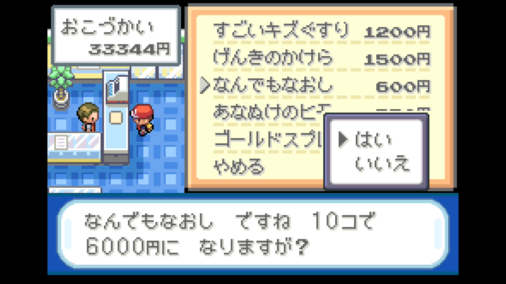

- ゲンガーの育成が必要だった。Lv27のままではナツメに挑めない。ここでClaude は最初「**ナツメのパーティはLv50前後**」と大きく見積もっていたが、takanamito に「**ナツメそんなに高くないでしょ**」と即座にツッコまれた。調べ直すとバリヤードLv37・ユンゲラーLv38・モルフォンLv38・フーディンLv43。Lv50なんてどこにもいない。さらに takanamito から「**ふたごじまに向かう水道でゲンガーのレベル上げするのは？10まんボルトあるし**」という提案もあった。水タイプに10まんボルトが2倍で入るから効率的という着眼点。結局、バトルサーチャーでトレーナー再戦する方式を採用し、ゲンガーをLv27→Lv30まで育てた

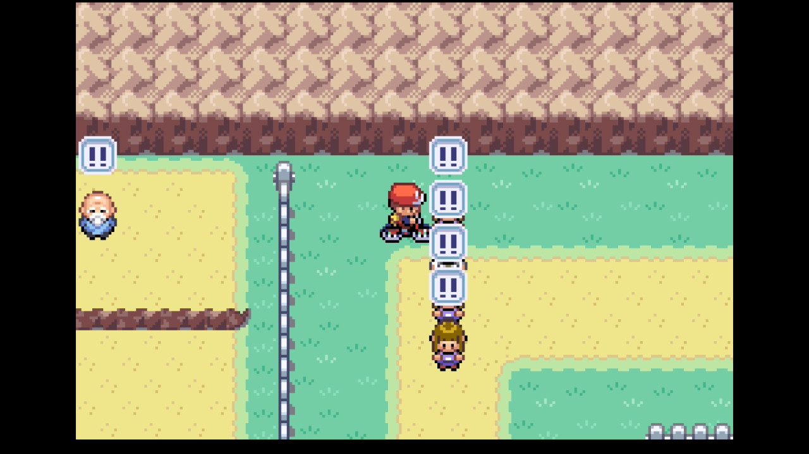

### ヤマブキジム — ワープパネルの迷路

- いよいよヤマブキジムへ

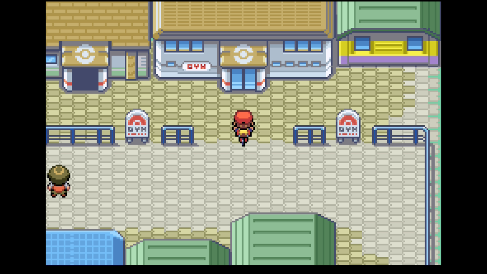

- ジム内はワープパネルだらけの迷路構造。端のパネルを避けながら進む必要がある

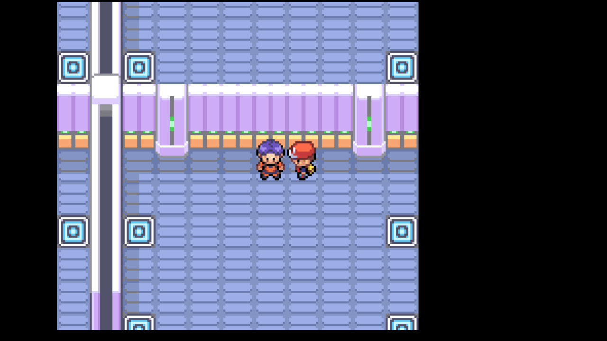

- 最初のトレーナー戦でゲンガーLv30がヤドランLv33にシャドーパンチ。ゴーストタイプがエスパーに**こうかばつぐん**で刺さる！

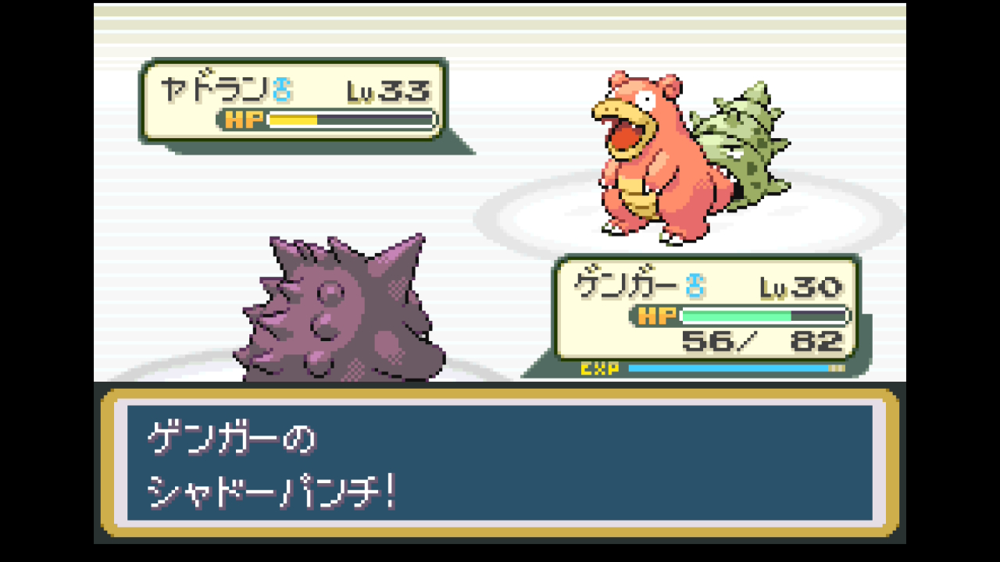

- ここでtakanamito が「**ゲンガー育ててもゴーストはエスパーと相性悪いから意味なくない？**」と疑問をぶつけてきた。初代ポケモン（Gen1）ではプログラムのバグでゴースト技がエスパーに無効だったのだが、リーフグリーン（Gen3）では修正されて**ゴーストはエスパーに2倍**になっている。実際にヤドランに「こうかはばつぐん」が表示されて、takanamito も「**ゴーストはエスパーに相性いいみたい**」と納得した

- Lv31になったところでゲンガーが**ゆめくい**を覚えたいと言ってきた。エスパータイプ・威力100の強力技だが、**ねむり状態の相手にしか使えない**。ゲンガーにはねむらせる技がないのでパス

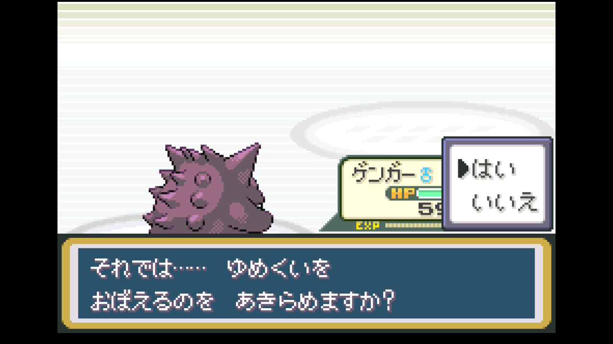

- サイキッカーのイサミが勝負を仕掛けてきた。takanamito が「**サイキッカーかっこいい**」とコメント

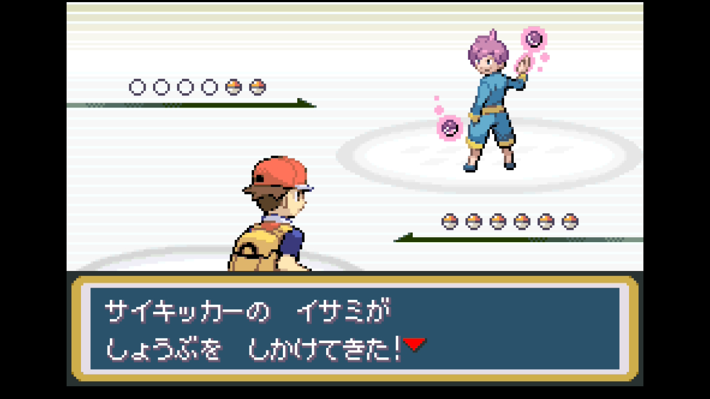

### ナイトヘッドの謎 — 固定ダメージとタイプ相性

- ジムトレーナー戦で面白い発見があった。ゲンガーLv32のシャドーパンチはユンゲラーLv31に「こうかはばつぐんだ！」と表示された

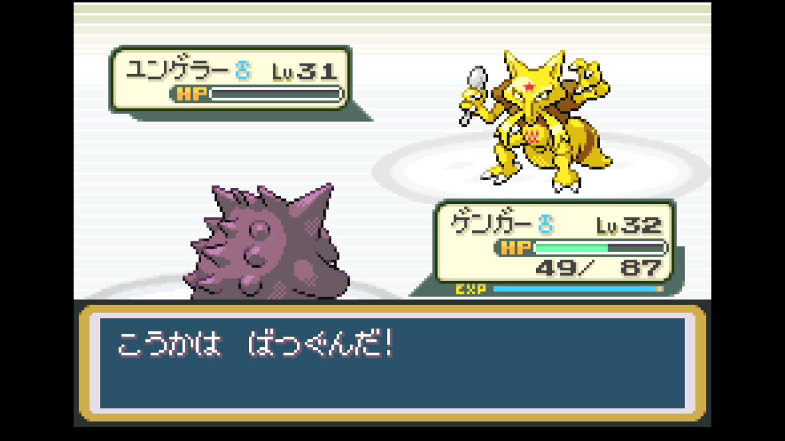

- しかし同じゴーストタイプのナイトヘッドをユンゲラーに使うと、**こうかばつぐんにならない**。takanamito が「**ナイトヘッドはユンゲラーにこうかばつぐんじゃなかった。等倍だった**」と報告。Claude はこの説明で二転三転してしまった。最初は「固定ダメージだから相性を無視する」と正しく説明したのに、次に「間違いだったかも」と撤回し、最終的にまた「固定ダメージだから相性を無視する」に戻った。結論: **ナイトヘッドはタイプ相性を無視する固定ダメージ技**（自分のレベル分のダメージ）。シャドーパンチは通常の技なのでタイプ相性が適用される

- ゲンガーLv33でヤドランLv38に10まんボルト。みず/エスパーのヤドランには電気が2倍で入る

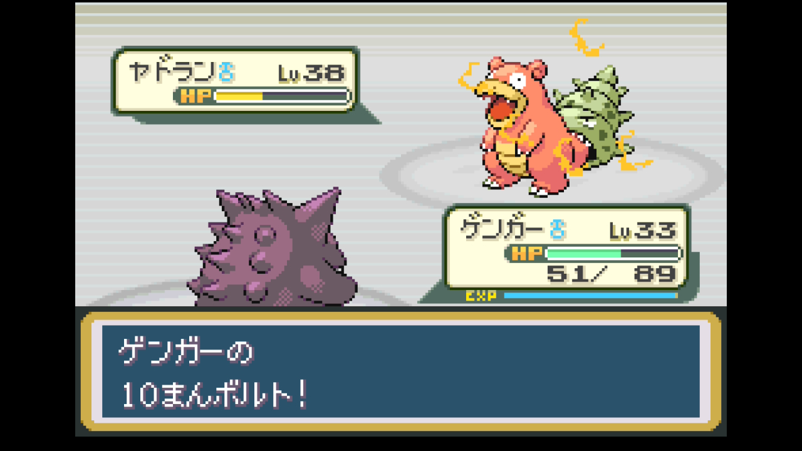

- ジムトレーナーを全員撃破し、ゲンガーのレベルはLv30→Lv35まで急上昇。takanamito が「**ゲンガー無双**」と称えた通り、まさにゴースト使いの独壇場だった。一度ポケセンに戻って回復してからナツメに挑む

### ナツメ戦 — エスパー少女との対決

- ナツメが登場。「**まがっていらい…… わたし エスパーしょうじょ なの**」

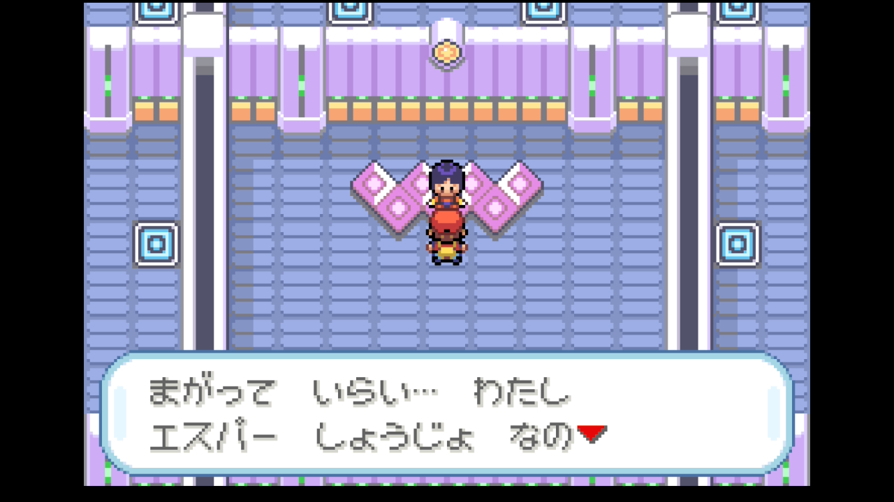

- **1匹目: ユンゲラー（Lv38）**。ゲンガーのシャドーパンチで一撃。ゴースト→エスパーの2倍ダメージが容赦なく刺さった

- **2匹目: バリヤード♀（Lv37）**。ゲンガーの10まんボルトで攻撃。しかしバリヤードのサイケこうせんがゲンガーに**こうかばつぐん**！ takanamito が「**ゲンガーにサイケこうせんがこうかばつぐんだった。どういうこと**」と驚く。ゲンガーはゴースト/**どく**の複合タイプ。エスパーはどくに2倍なので、ゴースト部分が中和されても全体で2倍ダメージを受けてしまう。カメックスに交代してかみつく（あく→エスパー2倍）で撃破した

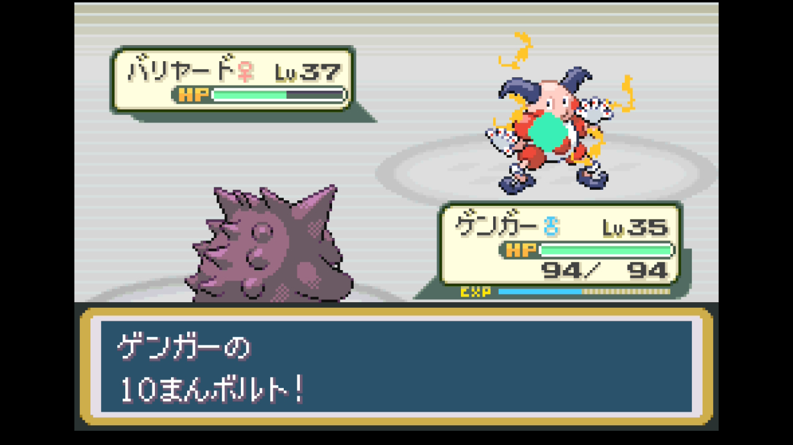

- **3匹目: モルフォン♀（Lv38）**。takanamito が「**ブースターで燃やす？**」と提案。その通り！ブースターのかえんほうしゃが虫タイプに2倍。「**よう燃えた**」との感想

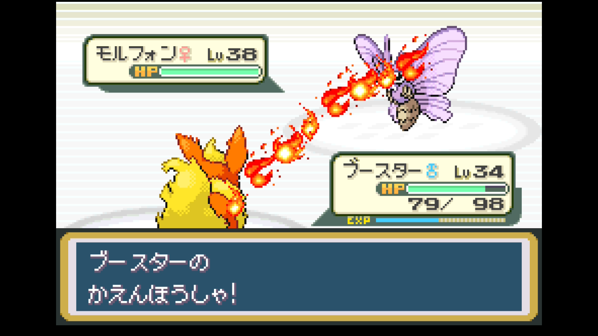

- **4匹目: フーディン♂（Lv43）** — ナツメのエース。ここでClaude が「カメックスのなみのりで押し切ろう」と指示したところ、takanamito に「**かみつくじゃなくて？**」と正された。かみつくはあくタイプでエスパーに2倍、なみのりは等倍。またしても司令塔が技選択を間違えた

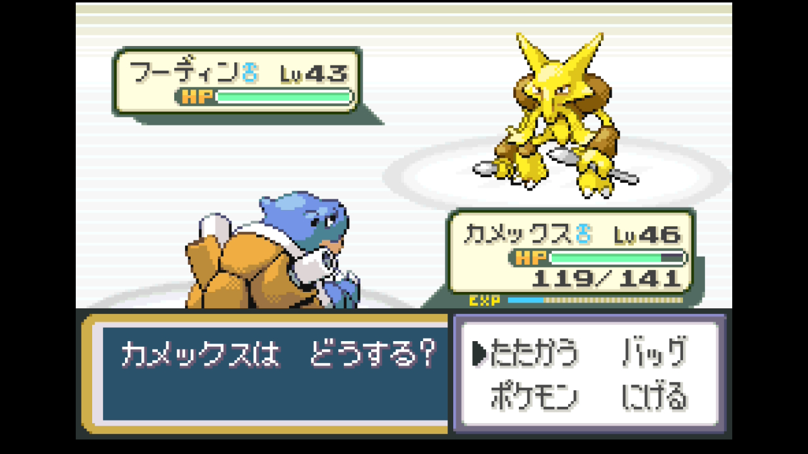

- カメックスがかみつくで攻めるも、フーディンのサイコキネシスが強烈。takanamito が「**うわ、サイコキネシスでカメックス死んだ**」と悲鳴。エースのカメックスがここで倒れるのは痛い

- カビゴンが交代で出場。takanamito が「**カビゴンで受ける間にゲンガー回復させるわ**」と作戦を立てていたが、カビゴンのかいりきが**きゅうしょにあたった**！ HP残り5/154というギリギリの状態からの起死回生。takanamito が「**かいりきで倒せちゃった**」とあっけにとられた

### ナツメ撃破 — ゴールドバッジ獲得

- 「**とても ショック！ でも まけは まけ…！**」。ナツメが敗北を認めた

- わざマシン04（**めいそう**）を入手。とくこう・とくぼうを1段階上げる積み技だが、現パーティでは温存

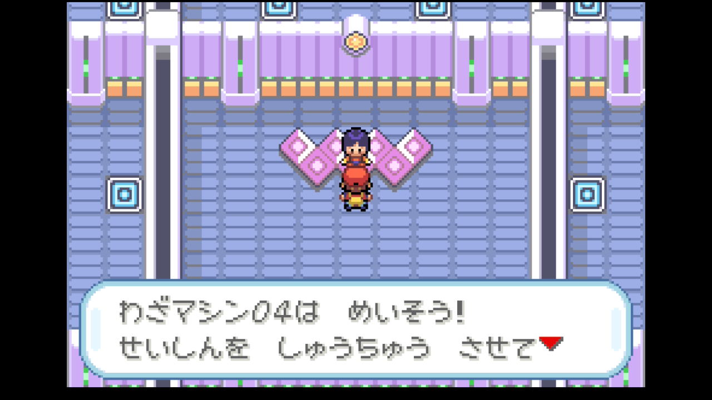

- ヤマブキバッジ（ゴールドバッジ）で**6枚目**。残り2枚で殿堂入り挑戦だ

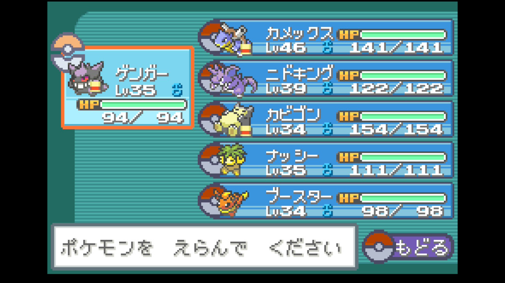

## パーティ編成

| ポケモン       | Lv  | タイプ         | 技構成                                                    | 持ち物       |
| -------------- | --- | -------------- | --------------------------------------------------------- | ------------ |
| カメックス♂   | 46  | みず           | なみのり / みずのはどう / かみつく / あまごい             | くろいメガネ |
| ゲンガー♂     | 35  | ゴースト/どく  | ナイトヘッド / あやしいひかり / シャドーパンチ / 10まんボルト | -          |
| カビゴン♂     | 34  | ノーマル       | おんがえし / あくび / ねむる / かいりき                   | カゴのみ     |
| ニドキング♂   | 39  | どく/じめん    | かわらわり / でんげきは / つのでつく / あなをほる         | -            |
| ナッシー♀     | 35  | くさ/エスパー  | リフレクター / ギガドレイン / サイコキネシス / タマゴばくだん | -          |
| ブースター♂   | 34  | ほのお         | かえんほうしゃ / かみつく / あなをほる / でんこうせっか   | -            |

## 入手アイテム

| アイテム               | 入手場所       | 備考                   |
| ---------------------- | -------------- | ---------------------- |
| なんでもなおし×10      | ヤマブキシティショップ | 購入             |
| TM04（めいそう）       | ナツメ（ジムリーダー） | 温存             |
| ゴールドバッジ         | ヤマブキジム   | 6枚目                  |

## 次の目標

- グレンタウン（ブレイン）挑戦 — ほのおタイプ使い
- セキチクシティから19番・20番水道を経由してグレンタウンへ
- ゲンガーのさらなる育成（水道でのトレーナー戦・野生ポケモン戦で経験値稼ぎ）
