# 031 - ロケット団倉庫制圧 — サファイア奪還と7の島しっぽうけいこく

## 日時

2026-04-25

## 現在地

7の島・しっぽうけいこく（石を動かすギミックを解いた直後）

## 攻略ログ

### 攻略再開 — 5の島ロケット団倉庫へ

前回の続き、6の島てんのあな最深部で「カブトはとぶか」のパスワードを入手したところから再開。「またまたタマタマ」と合わせて2つのパスワードが揃ったので、5の島ロケット団倉庫へ突入する流れ。

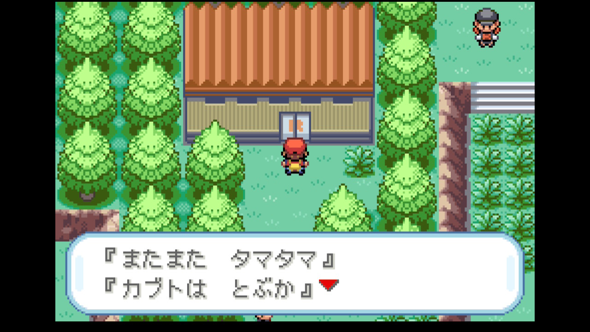

倉庫突入前に prep スキルでチェック。先頭はロケット団のどく系を一掃できる**ニドキング**を据えた。5の島ポケモンセンターで全回復、フレンドリィショップで補給。

### ペルシアン捕獲 — パーティには加えない判断

向かう途中で野生のペルシアンに遭遇。takanamito が「**ペルシアンつかまえた**」と即報告。

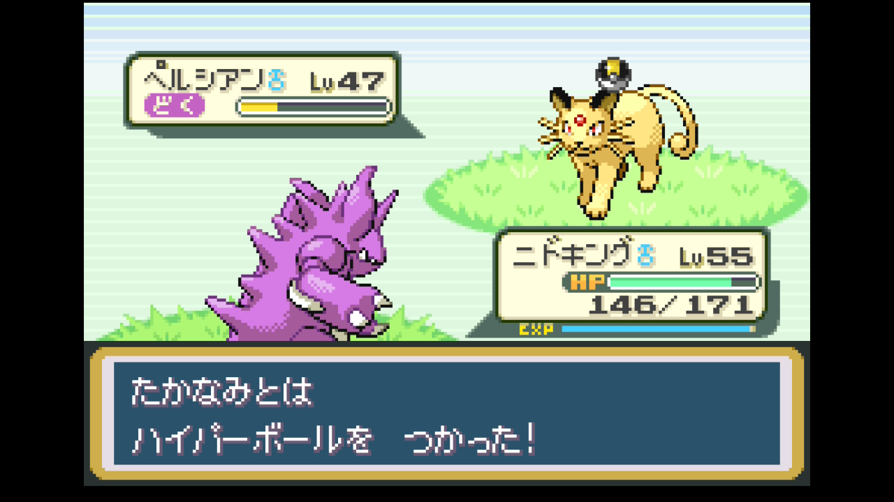

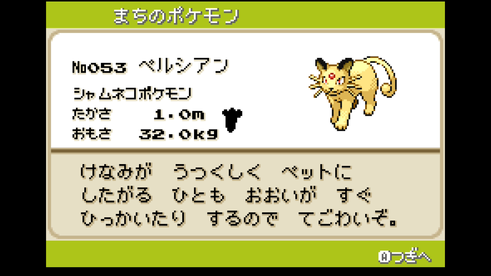

party-builder スキルで判断：ペルシアンはノーマルタイプで、こうげき70の中堅アタッカー。ドードリオ（こうげき110）と完全に役割が被るため**加入は見送ってボックス行き**。図鑑登録は済んだのでミッション完了。

### ロケット団倉庫突入 — 倉庫内のアイテム回収

倉庫の扉でパスワードを2つ入力して突入。

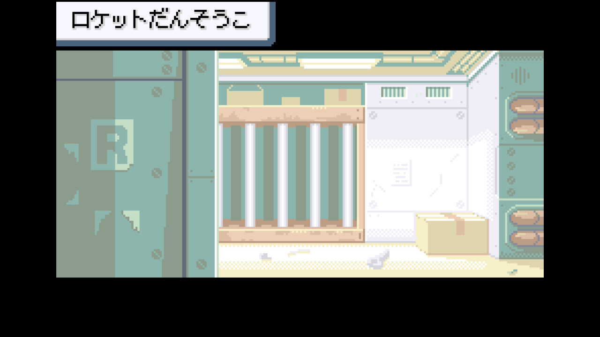

倉庫の中はアイテムの宝庫。**アップグレード**を発見した瞬間、Claude が解説：「ポルゴンに持たせて通信交換すると**ポルゴン2**に進化させられる道具」。妻のファイアレッドとの通信交換で活きる場面が来るかもしれないので温存。

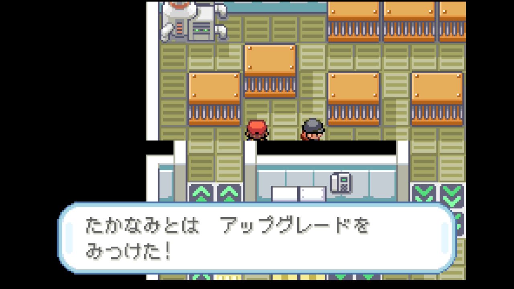

矢印パネルエリアで**しんじゅ**、**おおきなしんじゅ**、**ネットボール**を順次発見。売却用と捕獲用の補充。

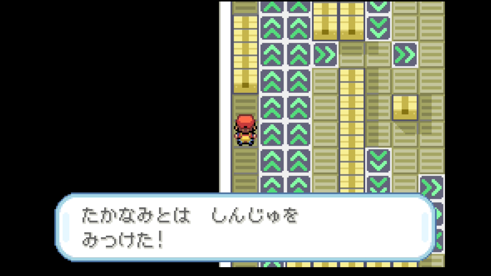

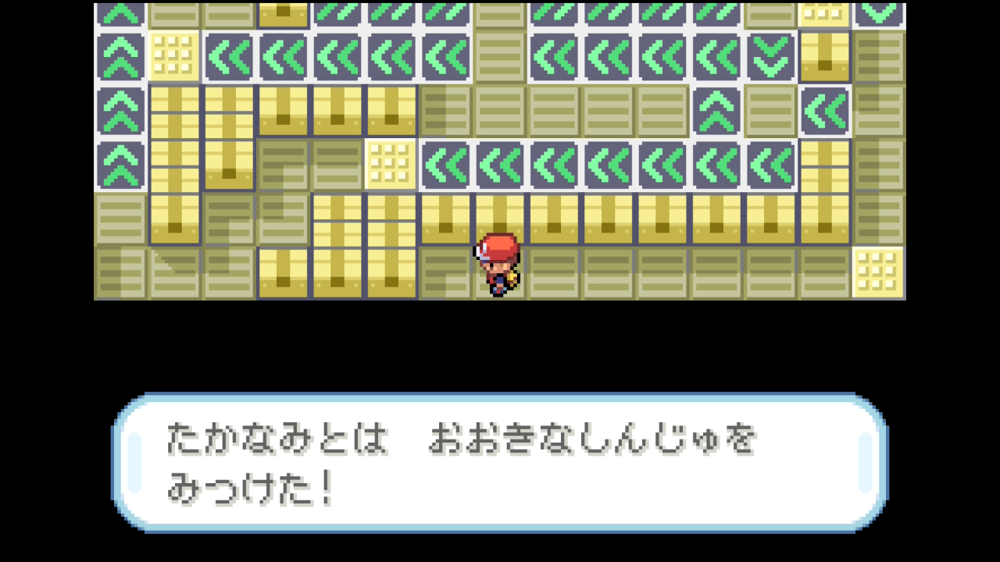

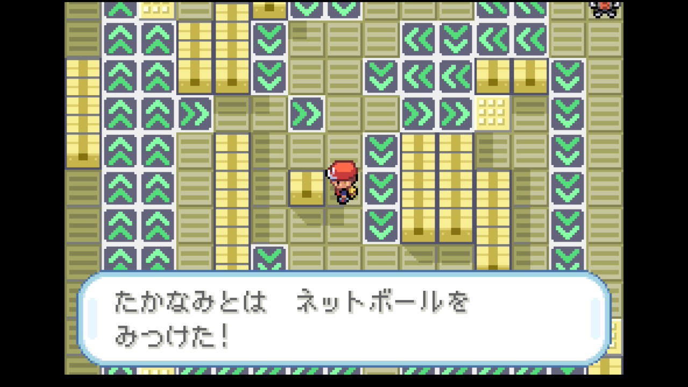

倉庫の電話機を調べると「**でんわだ！かけるのはやめておこう！**」と表示。かけたらどうなるか気になる演出だが、もちろんスルー。

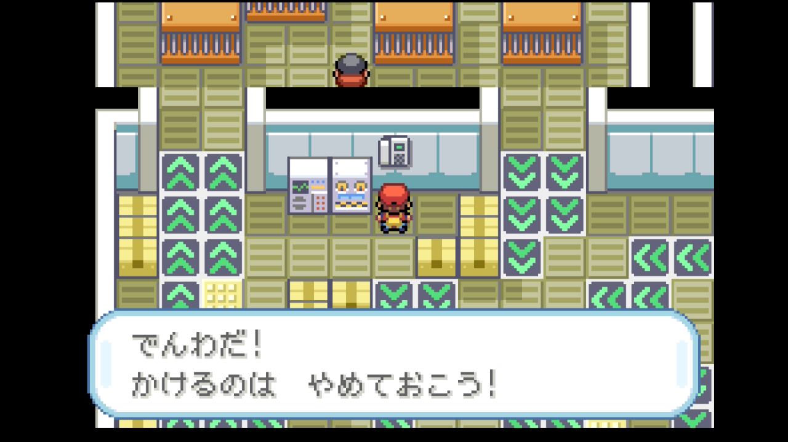

さらに**わざマシン36 ヘドロばくだん**（どく/物理/威力90/命中100/30%毒）を入手。ニドキングかゲンガーで使えるが、現構成は完成しているので一旦温存と決定。

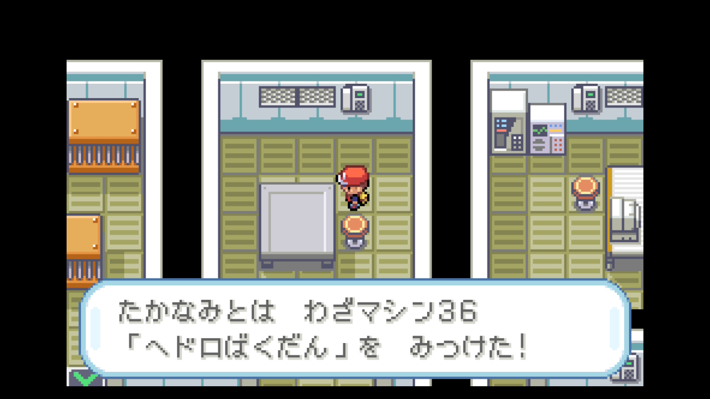

### デルビル戦 — 「ほのおタイプだから」じゃないけど結果オーライ

ロケット団員のデルビル（あく/ほのお）と遭遇。takanamito が「**ほのおタイプのポケモンなのでじしんでいきます**」と判断。

Claude が補足：「あく/ほのおの複合タイプで、じめんはあく単体には等倍。ただし**ほのおに×2**だから結果はばつぐんで正解」。理由は半分だけ正しいが結論は同じ、ということでじしん一撃。

### 幹部戦 — ベトベトン・アーボック・ラフレシア

倉庫の奥でロケット団の幹部が出現。3匹編成で「サカキさまを信じてついてきた」と語る古参の団員。

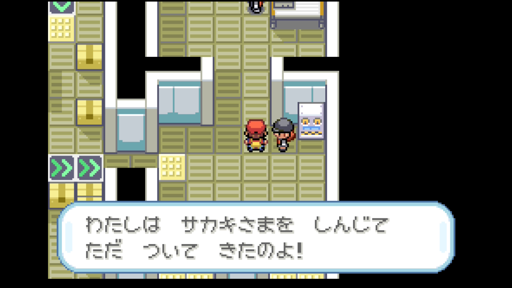

Claude が battle スキルで実効威力を計算：

- **ベトベトン・アーボック（どく単体）** → ニドキングのじしん（実効威力300）一択
- **ラフレシア（くさ/どく）** → ニドキングはくさ技で弱点を突かれる危険あり。ブースターのかえんほうしゃ（実効威力285）に交代推奨

ラフレシアが出てきた瞬間、takanamito が「**ブースターのかえんほうしゃでゴリ押し**」と即決。Claude も同じ判断だったので一致。一撃で焼き尽くした。

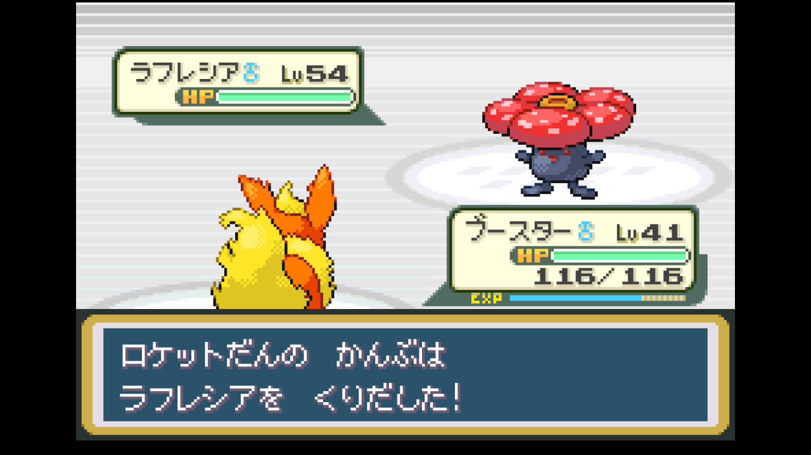

このバトル中にブースターが**Lv42に上昇**。スモッグを覚えそうになったが、現構成（かえんほうしゃ/シャドーボール/かみつく/あなをほる）が固まっているので無視。

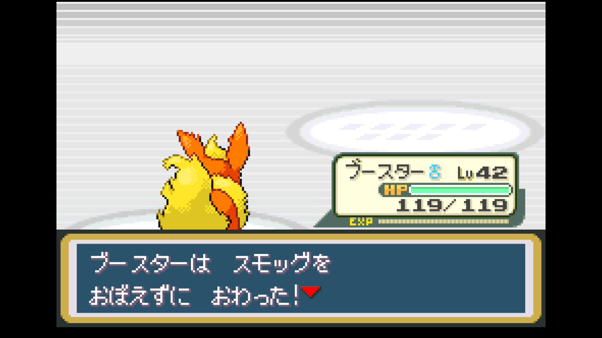

幹部の捨て台詞は「**この先の幹部はさらに強いから一度頭を冷やしてこれば？**」——倉庫内ボスらしいハッタリ。HP はほぼ全快だったのでそのまま続行。

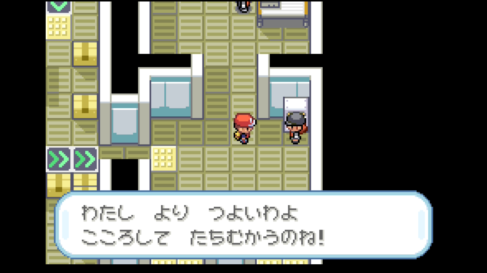

### ヘルガー戦 — デルビルの進化形

次の幹部はヘルガー（あく/ほのお）。デルビルの進化形で同じタイプ複合。

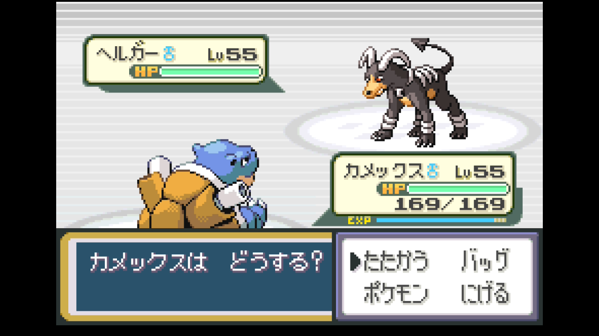

ニドキングのじしん（実効威力300）で一撃……と思ったらカメックスが出ていた場面もあり、なみのりでも問題なし。

### ロケット団のストーリー深掘り

幹部を倒すと、敗北セリフでサカキへの忠誠心が露わに：「**強いと思ったらそれはサカキさまのバッジ！**」。takanamito が「**ストーリー感じるいいセリフ**」と感心。

別のロケット団員は「**ロケット団が解散したのはほんとうだったのか…**」と動揺。takanamito 「**解散したんやね**」と本編の事実をここで再認識。フーシャシティでサカキを倒した後の組織崩壊が、倉庫の連中には伝わっていなかった——その温度差がリアル。

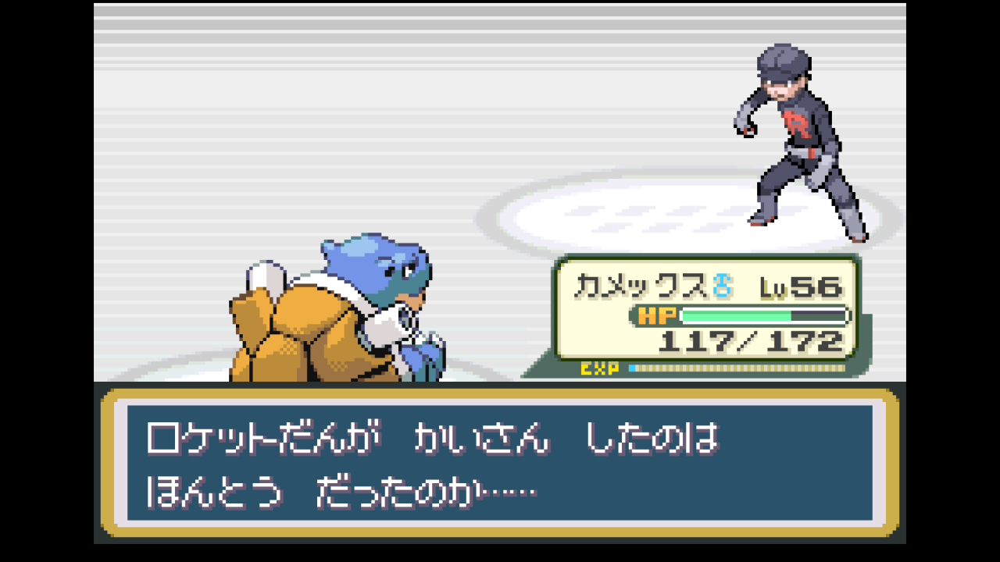

奥の方には**ロケット団復活を宣言する団員**もいて、組織が形を変えて存続しようとしている空気。

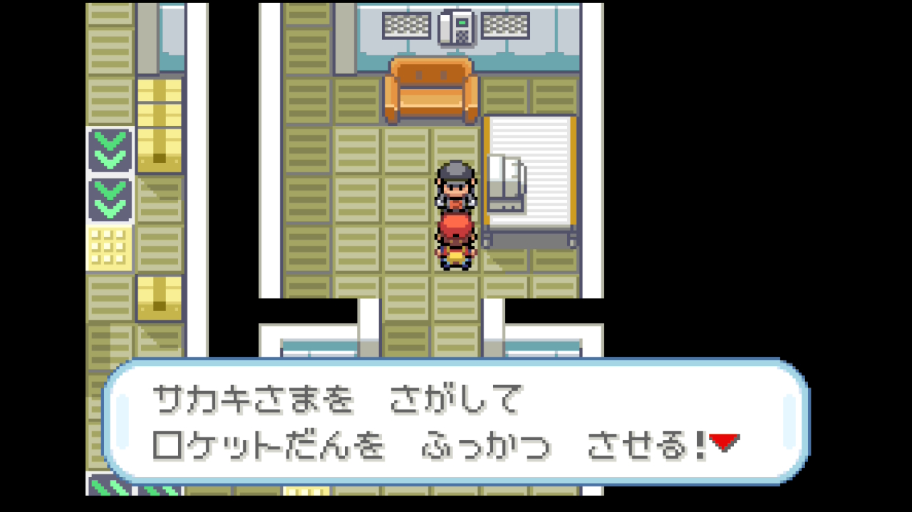

倉庫の核心に近づくと、机の上に**電波でポケモンを進化させる研究**の文書を発見。takanamito 「**パソコンでポケモンを電波で進化させる研究してやがる**」とロケット団の悪事の中核を見破る。ポケモンの意志を無視して強制的に進化させる、いかにもロケット団らしい所業。

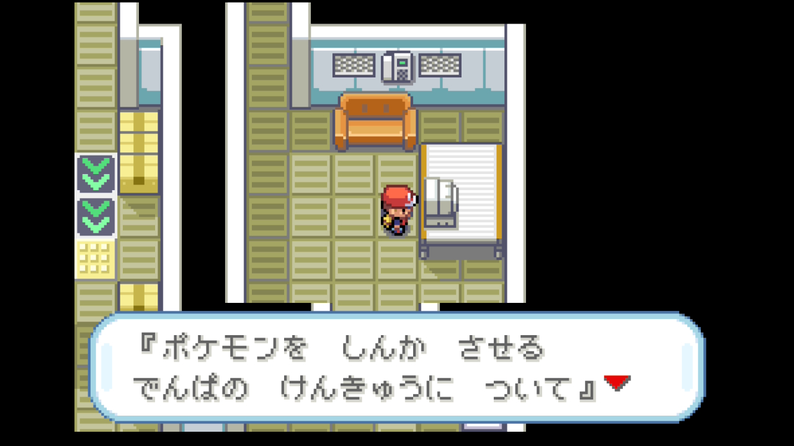

### 科学者スミオ戦 — ポリゴン・コイル・レアコイル

奥の部屋で**研究員スミオ**を発見、サファイアを抱えている。バトルスタート。

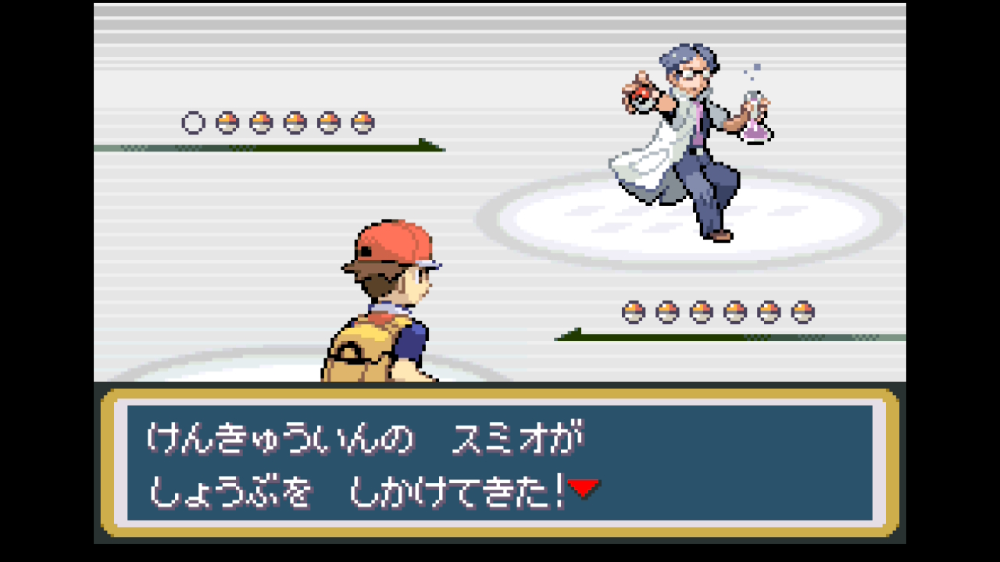

先発はポリゴン（ノーマル）。Claude の計算：

| 技 | 威力 | 一致 | 相性 | 実効威力 |
|---|---|---|---|---|
| じしん | 100 | ×1.5 | ×1.0 | **150** |
| メガホーン | 120 | ×1.0 | ×1.0 | 120 |
| かわらわり | 60 | ×1.0 | ×2.0 | 120 |

ニドキングのじしんで処理。ポリゴンが**どくのトゲをトレース**してきたが、ニドキングはどくタイプなのでどく状態にならず影響なし。

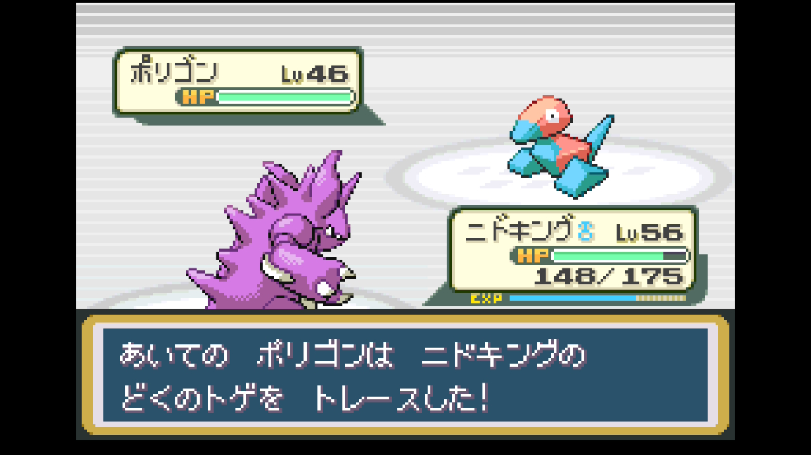

続いて**コイル・レアコイル**（でんき/はがね）。じしんに**4倍弱点**（じめん→でんき×2、じめん→はがね×2）でニドキング無双。「**みんなじしんで一撃**」と takanamito。

### サファイア奪還

スミオを撃破。「もうすこしでサファイアが高く売れるところだったのに」「お前のせいで取引が台無しだ」と捨て台詞を吐く敗北者たち——犯罪組織の残党感がよく出ている。

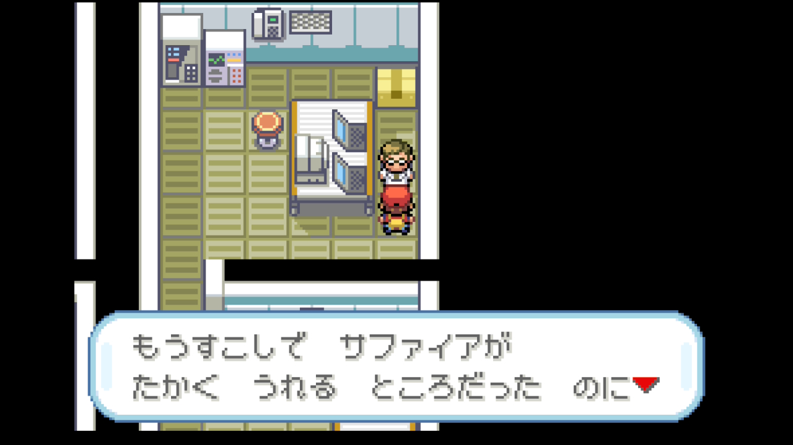

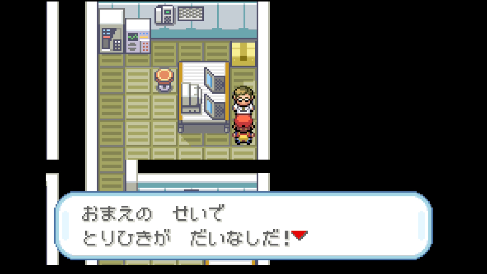

そして**サファイアを入手**。

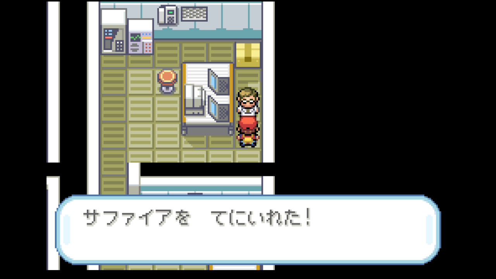

倉庫を出ようとすると周辺NPCに「**なんだよお…はやくあっちいけよ！**」と追い払われる演出。ロケット団残党のささやかな抵抗。

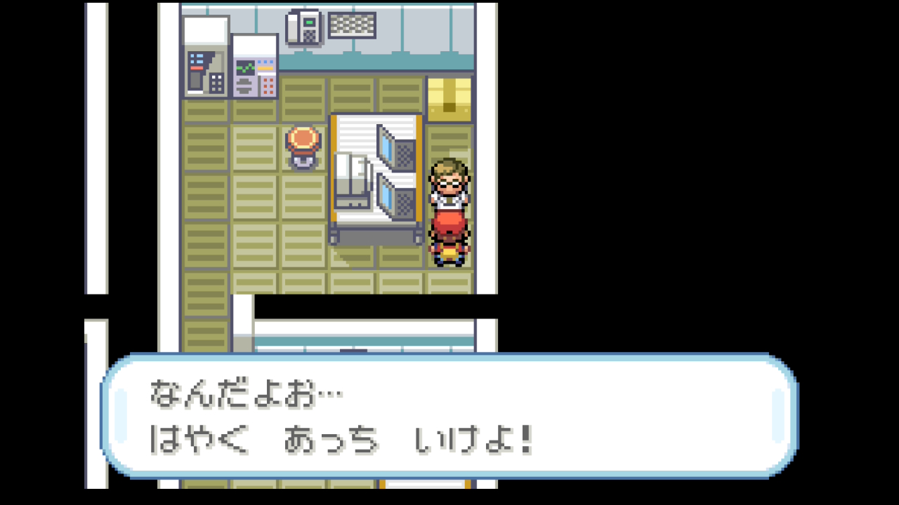

### 1の島セリオへ — ホウエン地方とつながる

1の島に戻ってセリオにサファイアを渡すと、ネットワークマシンが完全起動。

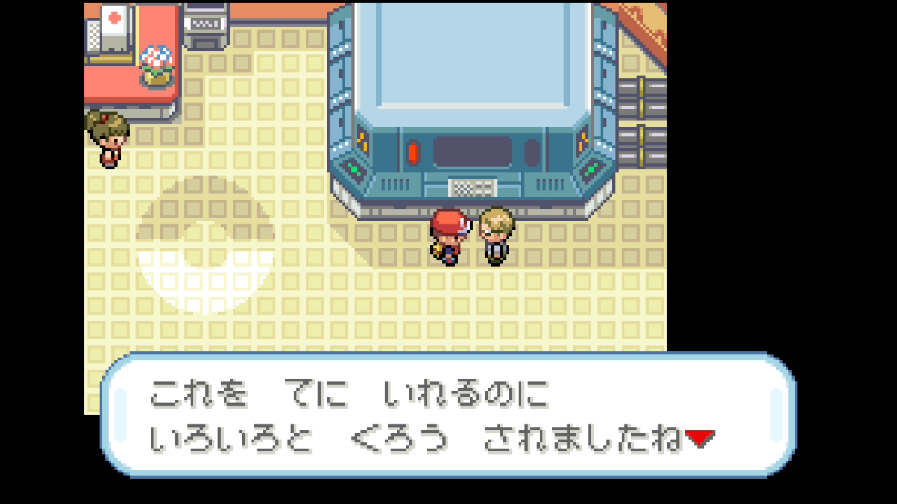

「**やったマユミさんとつながったぞ…！**」とニシキが感激。さらに「**ホウエンちほうのトレーナーとつうしんができるんです！**」と宣言。

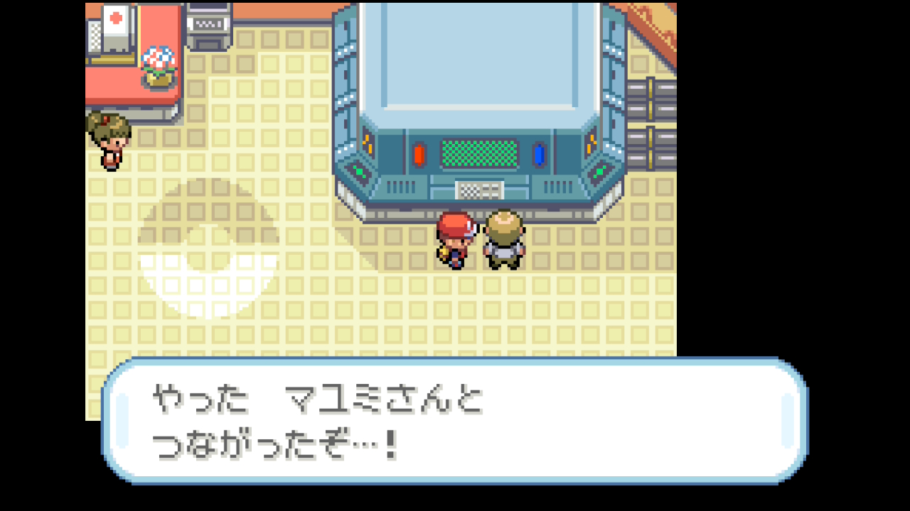

takanamito 「**ホウエン地方？どこそれ**」。Claude が解説：「ポケモンルビー・サファイアの舞台。リーフグリーンとは別の地方で、みずタイプ豊富な南国風エリア」。ゲーム世界が一気に広がった瞬間。

### 7の島へ — 「おわりなく はてしなき もとめじま」

セリオのクエスト完遂後、フリーザー捕獲リベンジは後回しにして、7の島（ナナシマ最後の島）に上陸。

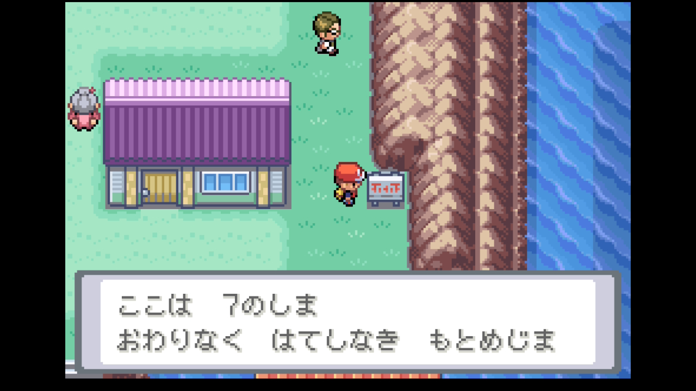

NPC が島の由来を説明：「**7にちでできたしまだという いいつたえから**」。和風ファンタジーの香り。

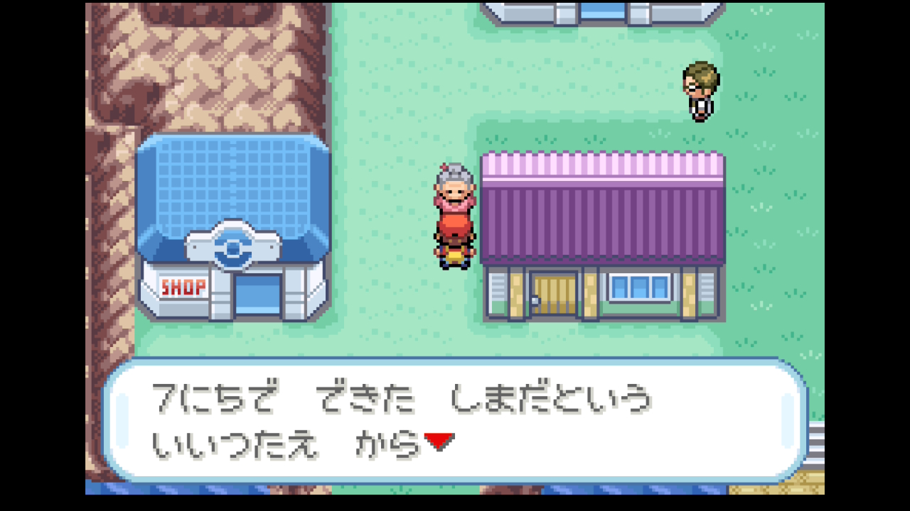

桟橋付近で**つるぎのまい**を教えてくれるNPCを発見。

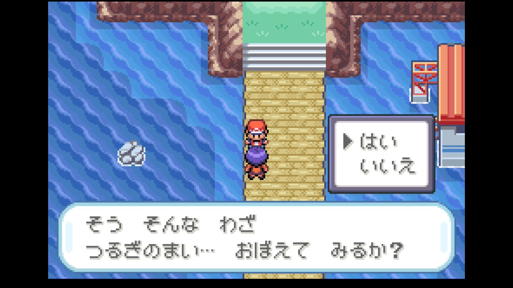

move-manager スキルで判断：

- **ドードリオ**（こうげき110）：トライアタックと入れ替えれば実質デメリットなし。積んだ後のドリルくちばしは強烈
- **ニドキング**（こうげき102）：多彩な物理技持ちだが、現構成を崩すのは惜しい

決定：**今は温存**。殿堂入り後はジョウト図鑑収集が主目的で、つるぎのまいを積む場面がほぼない。

### アロマレディとレンジャー戦

7の島内のトレーナーを順番に処理。

**アロマおねえさんのキレイハナLv50**（くさ/どく）——Claude はニドキングのじしん（実効150）を推奨したが、takanamito は「**ブースターのかえんほうしゃでゴリ押し**」を選択。実効285で正解（こちらの方が威力上）。

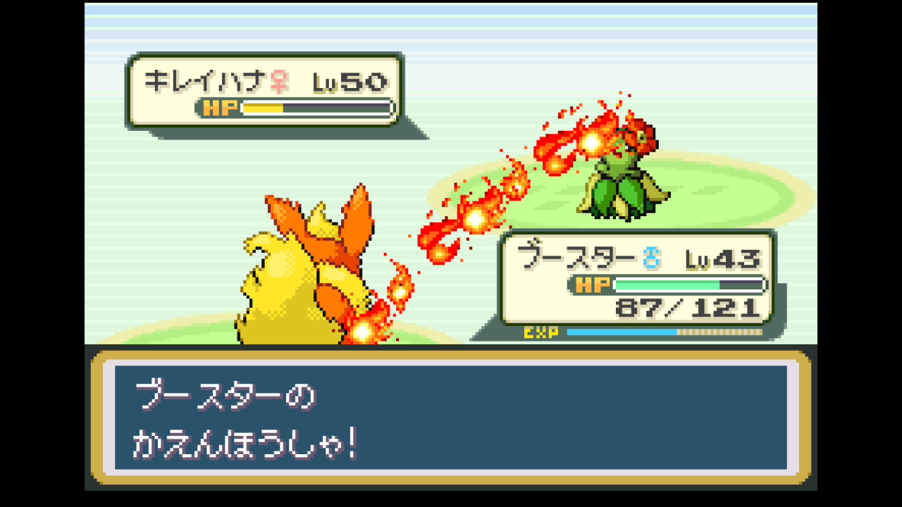

**トレーナーのクヌギダマ**（むし）——ニドキングは10まんボルトで等倍、takanamito が「**むしならドードリオにするわ**」と即交代。ひこうタイプのドードリオに切り替え、ドリルくちばし（実効120）かそらをとぶ（実効210）でクリア。

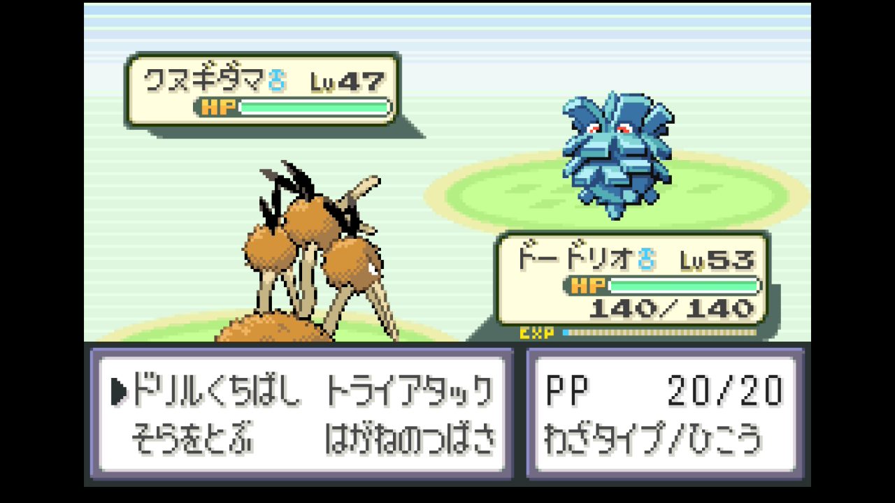

**ポケモンレンジャーのタケル**（ウツドン）——「**かっこいい**」と takanamito が名前で評価。そらをとぶ（実効210）一撃。

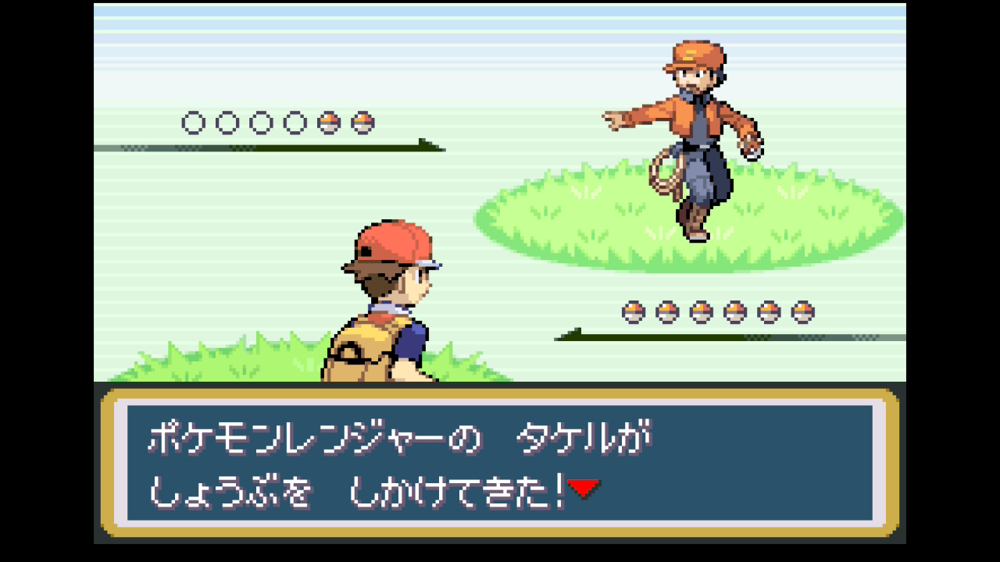

**レンジャーのマドカ**もタケルとセットで登場。

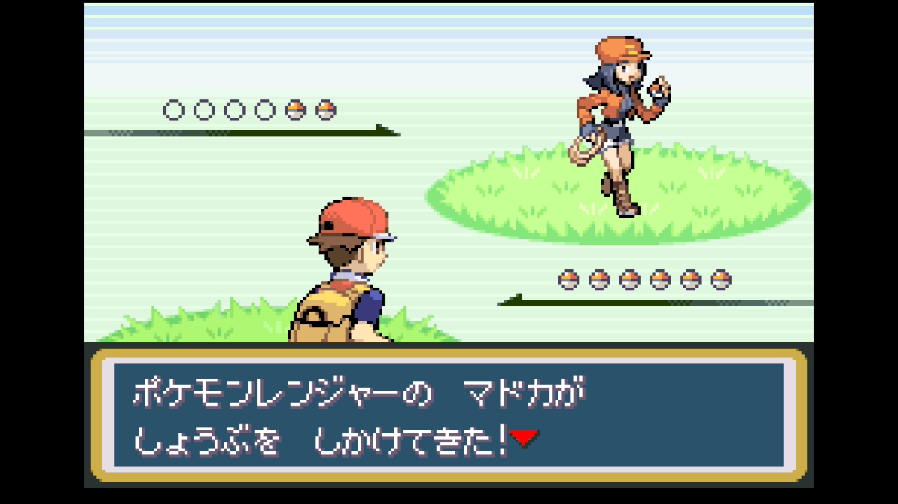

### しっぽうけいこく入口

7の島の南端、**しっぽうけいこく**の入口に到着。崖と海に挟まれた渓谷ダンジョン。

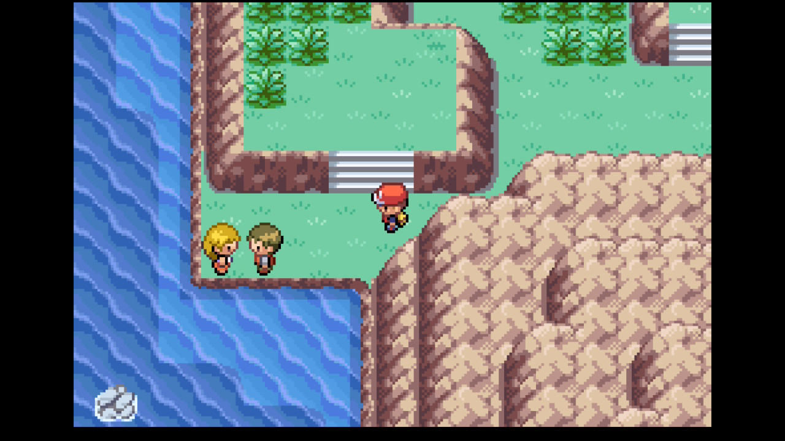

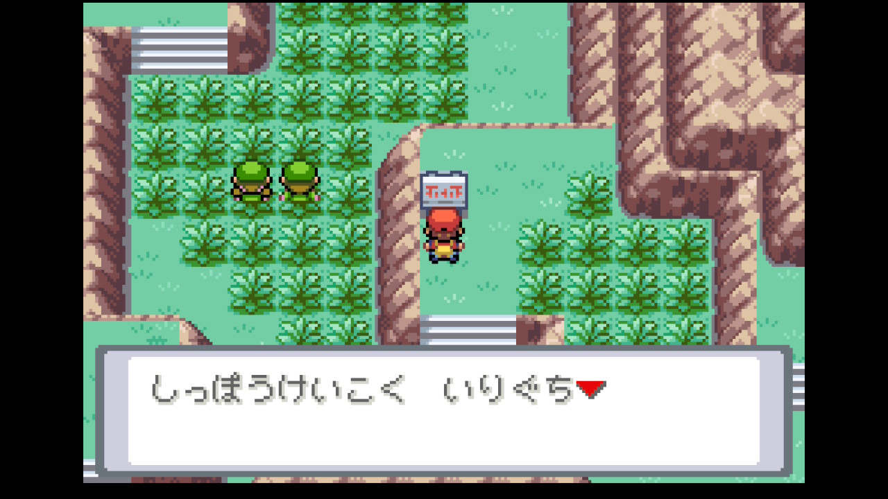

prep でチェック。洞窟系の敵が想定されるためどくけし・まひなおしを補充。先頭はニドキング維持。

### ゴマゾウ捕獲 — ジョウト組

野生のゴマゾウ（じめん）が出現。takanamito 「**やせいのゴマゾウきた。つかまえる**」。

catch スキル発動：

- 状態異常技なし → 削り技重視
- 10まんボルトはじめんに**こうかなし**で使えない
- メガホーン（威力120）・じしん（実効150）は倒しすぎる
- → **かわらわり**（威力60・等倍）が最も安全

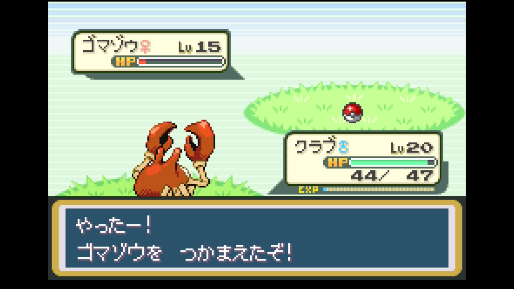

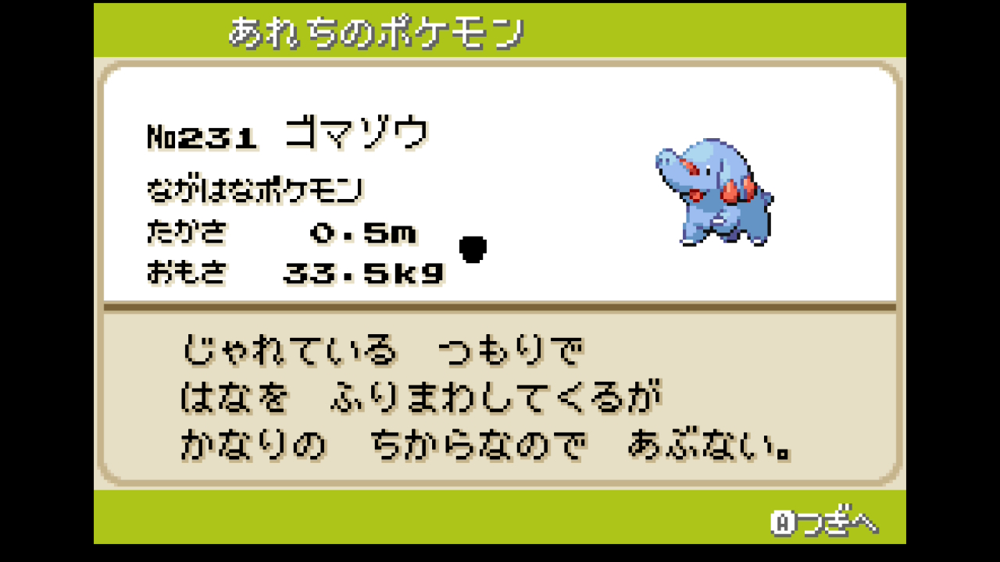

ジョウト図鑑にまた一匹追加。

### エリートカップル ユウとタカ — ダブルバトル

向かい合う男女に話しかけると「**ラブラブカップルのユウとタカ**」とのダブルバトル。コダックとゴルダック（みず）。

ニドキングとドードリオの先頭2体で対応：

- **ニドキング 10まんボルト** → ゴルダック（実効190）
- **ドードリオ ドリルくちばし** → コダック（実効120）

両方でんき弱点なので役割分担で同時に片付けた。

### しっぽうけいこく — 急所事故とアイテム発見

ダブルバトルの中で**ニドキングが急所被弾で戦闘不能**。エリートカップル戦かそれに近いタイミングで「**きゅうしょでニドキングやられた**」と報告。ブースターを出してかえんほうしゃでカバー。

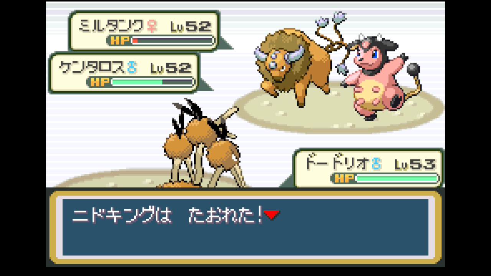

エリートカップル（ノーマルタイプのケンタロス・ミルタンク）戦でも遭遇。Claude が「ニドキングのかわらわりで両方狙える」と推奨したが、急所事故で戦況変動。ブースターのかえんほうしゃ（実効142.5）と、復帰したニドキングのかわらわり（実効120）で巻き返した。

道中で**きんのたま**を発見。売却用の高級品。

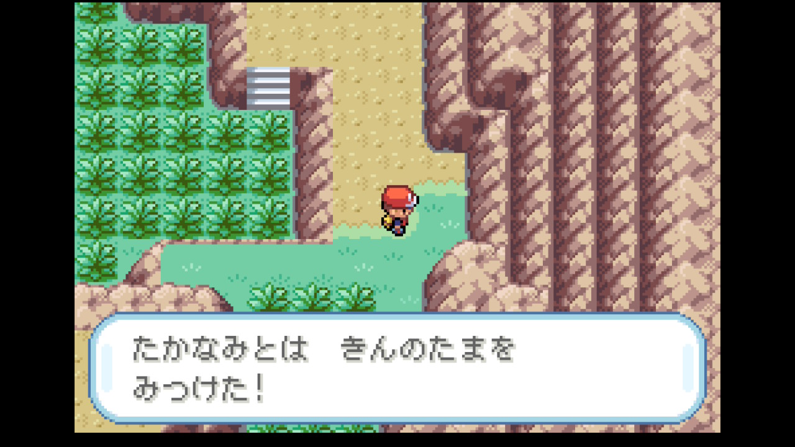

NPC のセリフが面白かった：「**シバもトウキというトレーナーと特訓していたことがあるぞ。**」

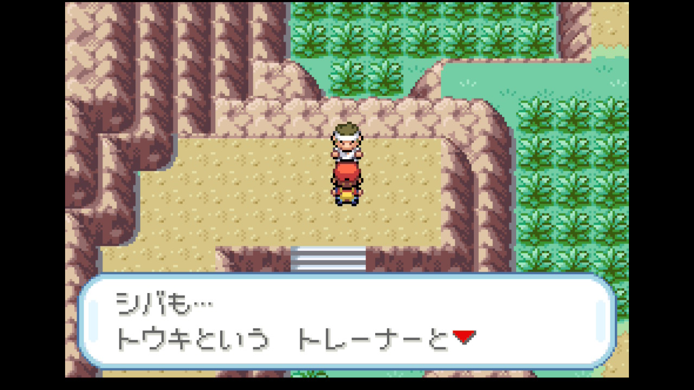

takanamito 「**だれ？**」。Claude が解説：「トウキは**ホウエン地方のかくとうタイプのジムリーダー**。さっきネットワーク繋がったホウエン地方のキャラクター」。地方をまたいだ繋がりがネタとして仕込まれている粋な演出。

### かくとうむすめユリカ — カポエラー

**かくとうむすめユリカ**がカポエラー（かくとう/ひこう）を出してきた。

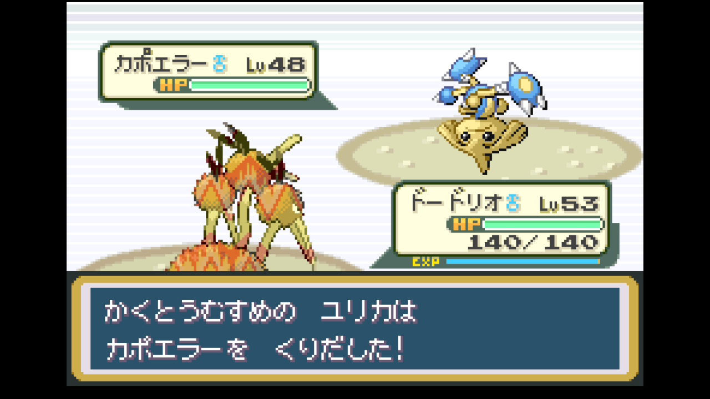

Claude の計算：

- ドードリオ そらをとぶ：実効210
- **ナッシー サイコキネシス：実効270**（エスパー→かくとうばつぐん×STAB）

ナッシー交代でサイコキネシスを推奨。ナッシーが先頭は他のバトルでも続投する流れに。

### おうじゃのしるし入手

倒した先で**おうじゃのしるし**を発見。

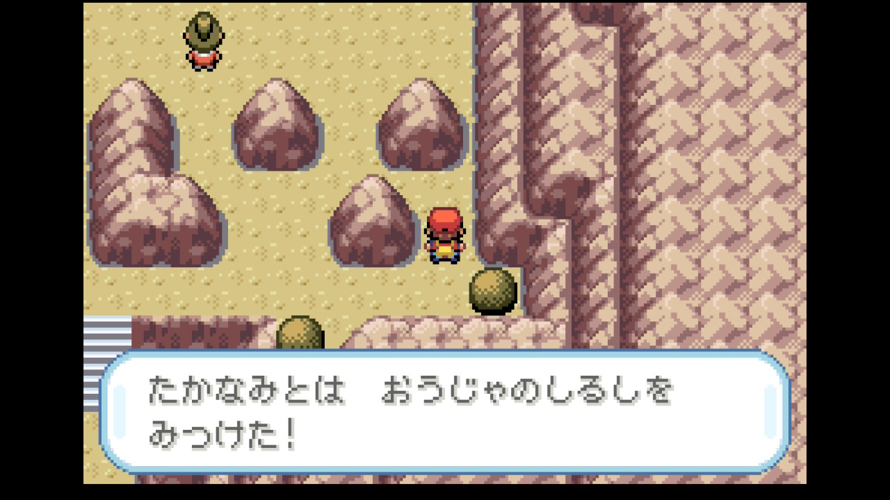

Claude が解説：「ニョロゾに持たせて通信交換すると**ニョロトノ**、スロウブロに持たせると**スロウキング**に進化」。妻のファイアレッドと連動できれば活用できる。温存。

さらに**ピーピーマックス**も発見。

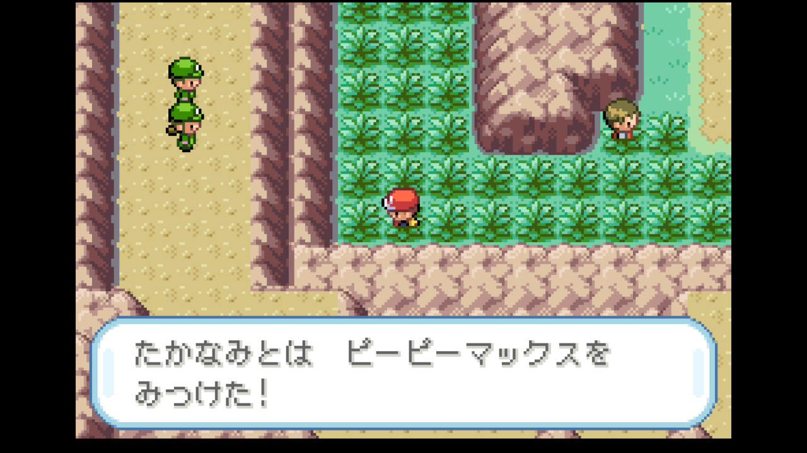

### ブースターがにらみつけるを覚えない（潔さ）

ブースターが Lv50 目前でにらみつけるを覚えそうになり、takanamito 「**Lv50目前でにらみつける覚えるみたい。アホラし**」と一刀両断。Claude も「覚えなくていい。**全部捨てろで**」と即決。攻撃技4つの構成を維持。

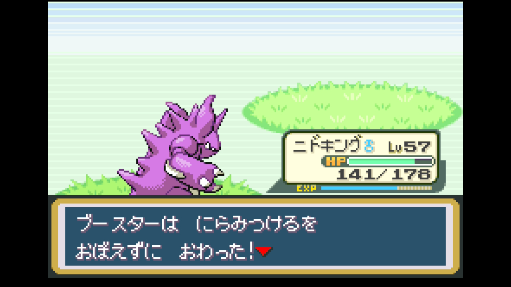

### 5匹もちエリートトレーナー — ナッシー無双

5匹編成のエリートトレーナーと遭遇。先頭ナッシーで一気に処理：

- **サイドン（いわ/じめん）** → ナッシーのギガドレイン（くさ→いわ×2、じめん×2＝**4倍ばつぐん**、STAB×1.5、**実効威力360**）一撃
- **ガルーラ（ノーマル）** → サイコキネシス（実効135）
- **リングマ（ノーマル）** → サイコキネシス（実効135）……と思ったら takanamito が「**ニドキングのかわらわりでいきます**」と判断（かくとう→ノーマルばつぐん、実効120）。それも正解
- **キリンリキ（ノーマル/エスパー）** → サイコキネシスはエスパーにいまひとつなのでタマゴばくだん（実効100）に切り替え

5匹相手にナッシー1匹でほぼ完封。ナッシーがこの局面の主役だった。

### ラッキーダンスのおじさん

「**おどっておどってラッキーダンスのおじさん**」と takanamito が出会ったNPC。話しかけたらラッキーダンスを披露——なんと**HP回復**してくれる隠しサービス。

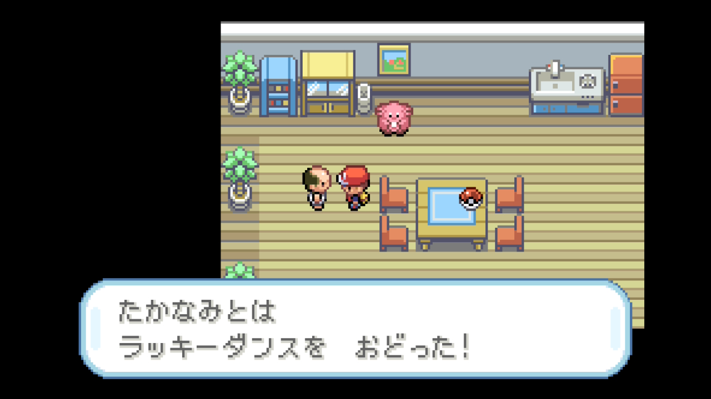

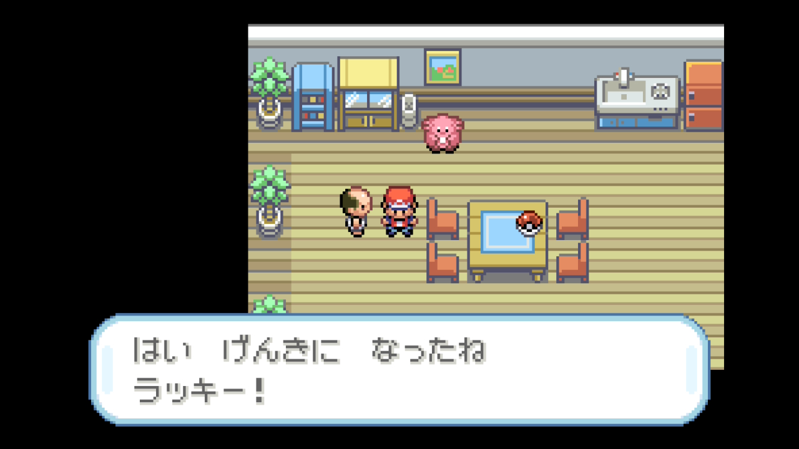

ポケモンセンター不要の便利スポット。

### ラッキーパンチ入手

道中で**ラッキーパンチ**を入手。ラッキーに持たせると急所率が大幅アップする専用アイテム。手持ちにラッキーはいないが、図鑑収集で捕まえる場面が来るかもしれないので保管。

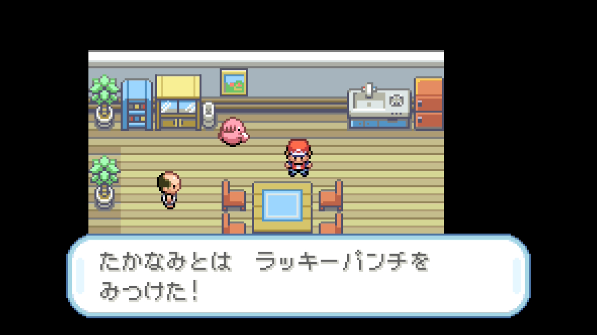

### しっぽうけいこく奥 — 謎の遺跡群

しっぽうけいこくの奥に「**この先 アスカナいせき**」の看板。さらに進むと**アレボカのせきしつ**（謎の石室）が現れた。

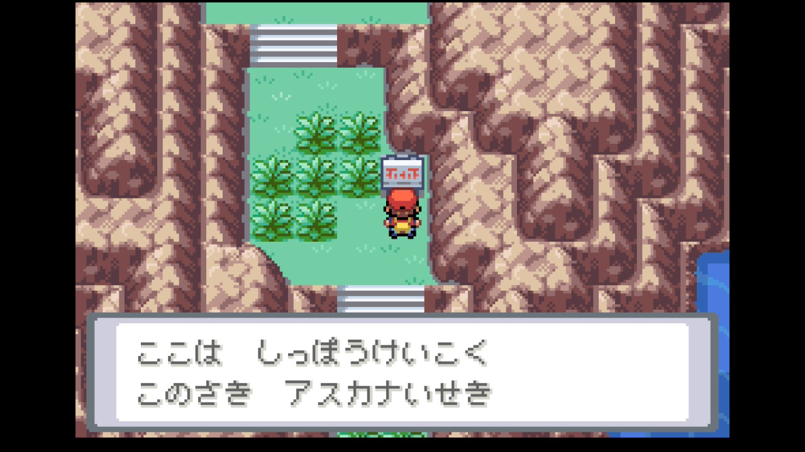

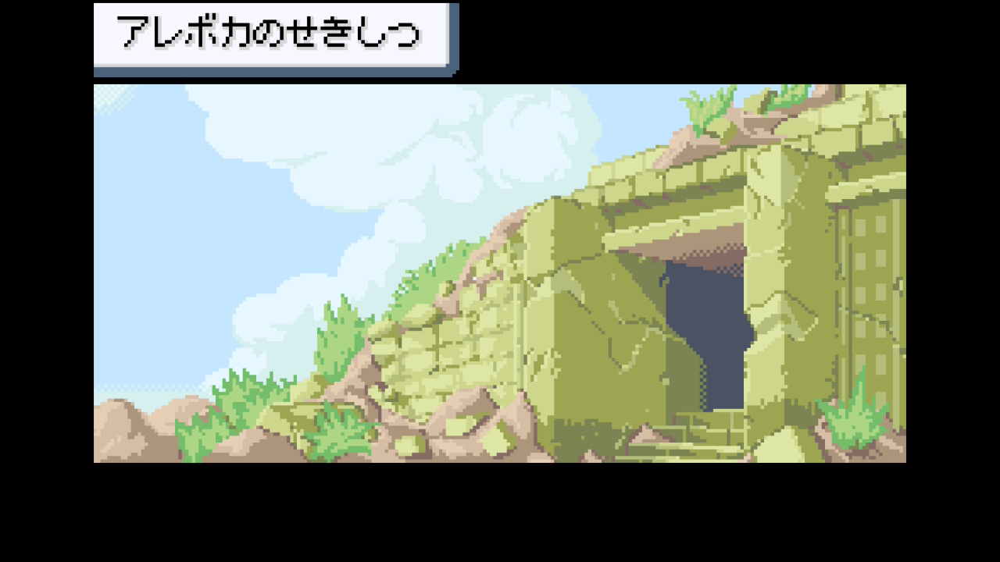

中に入っても**何もない**。NPC が「**なんのために作られた遺跡かわかってないらしい**」と告白。

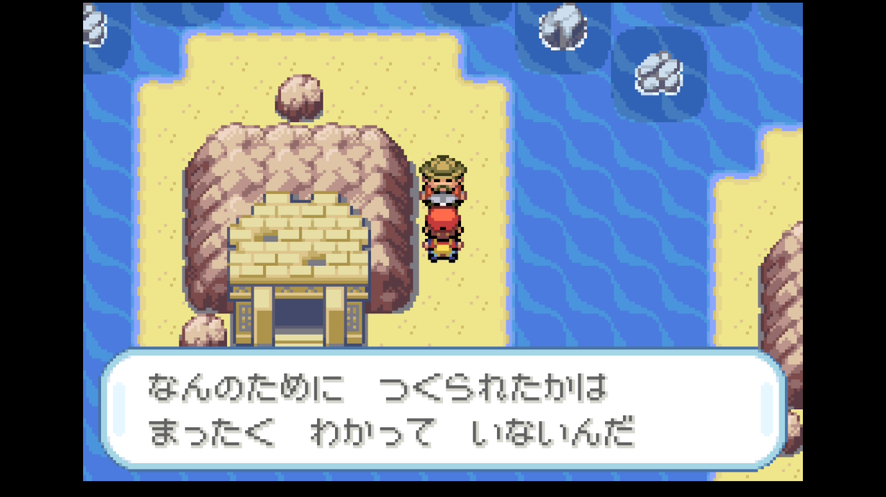

その後**コトーの石室**にも到着するが、こちらも takanamito 「**さっきと同じ。なにもない**」。

しっぽうけいこくにはこの手の石室が点在しており、takanamito 「**もう4~5個石室あったけど全部何も起きない**」とぼやく。何か条件を満たすと変わるエリアと推測されるが、現時点では謎のまま放置。

### えかきのリリコ — ドーブル戦

**えかきのリリコ**がドーブル（ノーマル）を繰り出してきた。ドーブルはジョウト組、絵描きという職業設定がトレーナー名と一致して秀逸。

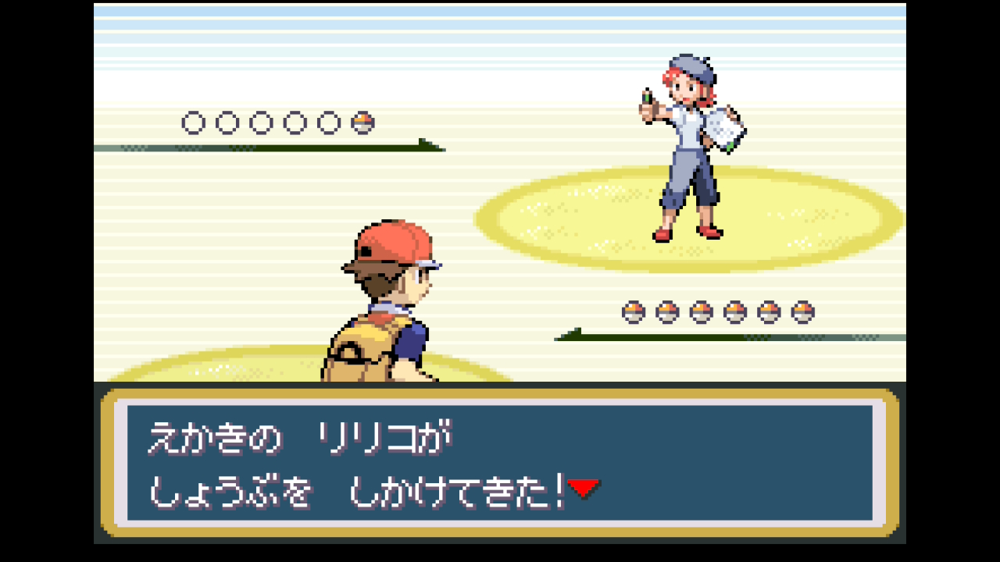

ナッシーのサイコキネシス（実効135）で処理。

その後**ジェントルマンのガラガラ**戦も。ガラガラ（じめん単体）はナッシーのギガドレイン（くさ→じめんばつぐん、STAB、実効180）で一撃。

### 石室のギミックと不思議な響き

渓谷の途中にある洞窟で**石を動かすパズル**を解いた。レポート作成の直前、遺跡内で「**どこか遠くから不思議な響きが聞こえた…**」のメッセージが流れた。

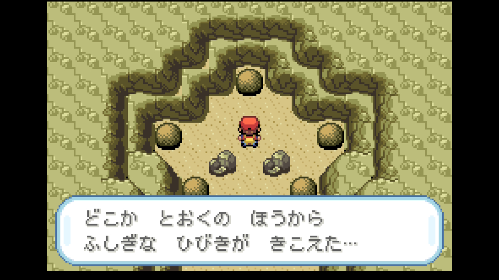

何かが起きそうな予感を残しつつ、今回の攻略はここまで。

---

## パーティ編成

| ポケモン    | Lv  | タイプ          | 技構成                                                        | 持ち物           |
| ----------- | --- | --------------- | ------------------------------------------------------------- | ---------------- |
| カメックス♂ | 55  | みず            | なみのり / ふぶき / かみつく / ハイドロカノン                 | くろいメガネ     |
| ゲンガー♂   | 52  | ゴースト/どく   | みちづれ / あやしいひかり / シャドーボール / 10まんボルト     | がくしゅうそうち |
| ブースター  | 43  | ほのお          | かえんほうしゃ / シャドーボール / かみつく / あなをほる       | -                |
| ドードリオ  | 53  | ノーマル/ひこう | ドリルくちばし / トライアタック / そらをとぶ / はがねのつばさ | -                |
| ニドキング♂ | 57  | どく/じめん     | かわらわり / 10まんボルト / メガホーン / じしん               | たべのこし       |
| ナッシー♀   | 50+ | くさ/エスパー   | リフレクター / ギガドレイン / サイコキネシス / タマゴばくだん | たべのこし       |

## 捕獲ポケモン

| ポケモン   | タイプ       | 場所                       | 備考                                                       |
| ---------- | ------------ | -------------------------- | ---------------------------------------------------------- |
| ペルシアン | ノーマル     | 5の島ロケット団倉庫近辺    | ドードリオと役割被りでボックス行き、図鑑登録のみ           |
| ゴマゾウ   | じめん       | 7の島しっぽうけいこく      | ジョウト新顔、ニドキングのかわらわりで削って捕獲           |

## 入手アイテム

| アイテム                        | 入手場所                | 用途                                       |
| ------------------------------- | ----------------------- | ------------------------------------------ |
| アップグレード                  | 5の島ロケット団倉庫     | ポルゴン→ポルゴン2進化（通信交換）         |
| しんじゅ                        | ロケット団倉庫          | 売却用                                     |
| おおきなしんじゅ                | ロケット団倉庫          | 売却用                                     |
| ネットボール                    | ロケット団倉庫          | むし・みず系の捕獲率UP                     |
| わざマシン36 ヘドロばくだん     | ロケット団倉庫          | 温存（ニドキング・ゲンガー候補）           |
| サファイア                      | スミオ研究員から        | セリオに届けてホウエン地方接続（消費済み） |
| きんのたま                      | しっぽうけいこく        | 売却用（高級品）                           |
| おうじゃのしるし                | しっぽうけいこく        | ニョロゾ→ニョロトノ等の進化用、温存        |
| ピーピーマックス                | しっぽうけいこく        | PP全回復（最大値も上限まで）               |
| ラッキーパンチ                  | 7の島                   | ラッキー専用持ち物（急所率UP）             |

## 次の目標

- しっぽうけいこくの石室の謎解明（点字解読・ギミック）
- 「不思議な響き」の正体を探る
- フリーザー捕獲リベンジ（ふたごじま）
